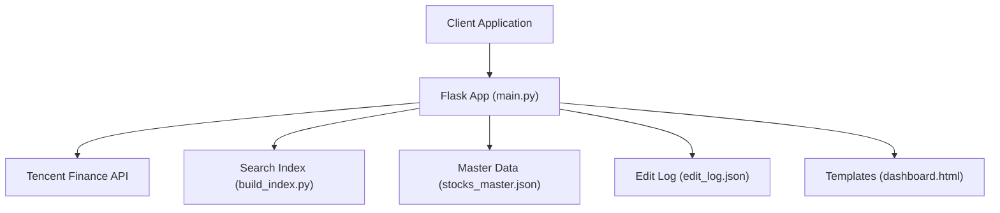
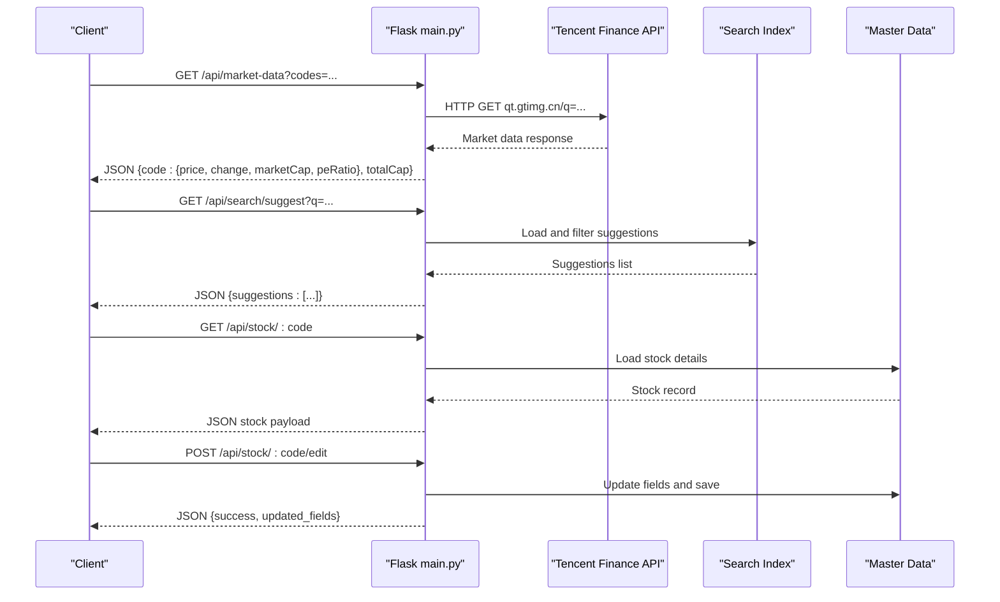
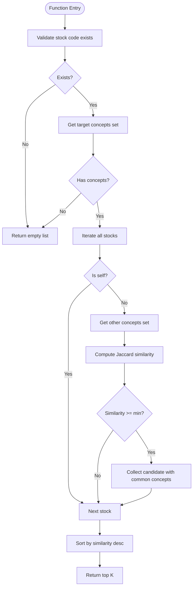
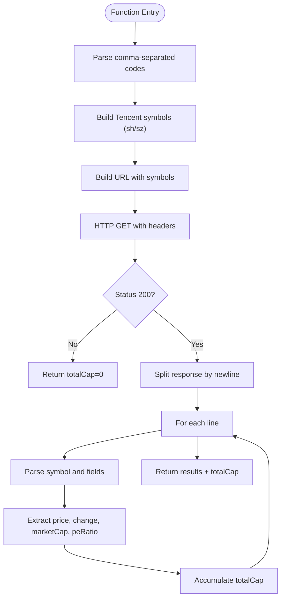
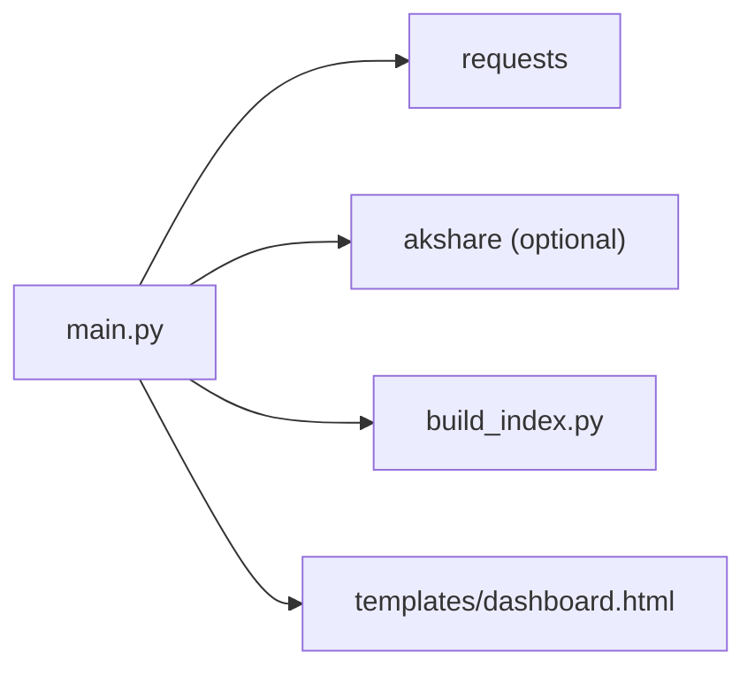

# API Reference

<cite>
**Referenced Files in This Document**
- [main.py](file://main.py)
- [build_index.py](file://build_index.py)
- [README.md](file://README.md)
- [requirements.txt](file://requirements.txt)
- [templates/dashboard.html](file://templates/dashboard.html)
</cite>

## Table of Contents
1. [Introduction](#introduction)
2. [Project Structure](#project-structure)
3. [Core Components](#core-components)
4. [Architecture Overview](#architecture-overview)
5. [Detailed Component Analysis](#detailed-component-analysis)
6. [Dependency Analysis](#dependency-analysis)
7. [Performance Considerations](#performance-considerations)
8. [Troubleshooting Guide](#troubleshooting-guide)
9. [Conclusion](#conclusion)
10. [Appendices](#appendices)

## Introduction
This document provides comprehensive API documentation for the Stock Research Platform RESTful endpoints. It covers HTTP methods, URL patterns, request/response schemas, authentication methods, and usage patterns. It also documents rate limiting, caching strategies, and performance considerations, along with client implementation guidelines and common integration scenarios.

## Project Structure
The platform is a Flask-based web service that exposes REST APIs and serves a React-like SPA frontend. Key API endpoints include:
- Stock management: GET /api/stock/:code, POST /api/stock/:code/edit
- Search: GET /api/search/suggest
- Market data: GET /api/market-data
- Similarity: GET /api/stock/:code/similar
- Article import and merge: POST /api/article/import, POST /api/article/merge-to-master, GET /api/raw-material/list
- Sync and admin: GET /api/sync, GET /api/sync/export, POST /api/sync/email, POST /api/sync/clear

**Diagram sources**
- [main.py:138-1222](file://main.py#L138-L1222)
- [build_index.py:1-271](file://build_index.py#L1-L271)
- [templates/dashboard.html:990-1210](file://templates/dashboard.html#L990-L1210)

**Section sources**
- [main.py:138-1222](file://main.py#L138-L1222)
- [README.md:1-126](file://README.md#L1-L126)

## Core Components
- Flask application entrypoint and routing
- Data loaders for sentiment index and master stock data
- Market data integration via Tencent Finance API
- Similarity computation using Jaccard coefficient
- Article import pipeline and merge workflow
- Edit logging and synchronization endpoints

Key implementation references:
- Routes and handlers: [main.py:138-1222](file://main.py#L138-L1222)
- Market data parsing: [main.py:696-768](file://main.py#L696-L768)
- Similarity algorithm: [main.py:28-71](file://main.py#L28-L71)
- Article import and merge: [main.py:940-1181](file://main.py#L940-L1181)
- Index builder: [build_index.py:1-271](file://build_index.py#L1-L271)

**Section sources**
- [main.py:138-1222](file://main.py#L138-L1222)
- [build_index.py:1-271](file://build_index.py#L1-L271)

## Architecture Overview
The API architecture consists of:
- Frontend SPA (dashboard.html) consuming REST endpoints
- Flask backend serving JSON APIs and rendering templates
- External market data provider (Tencent Finance)
- Local data stores: search index (gzipped JSON), master stock data, edit log

**Diagram sources**
- [main.py:497-499](file://main.py#L497-L499)
- [main.py:480-495](file://main.py#L480-L495)
- [main.py:696-768](file://main.py#L696-L768)
- [templates/dashboard.html:1185-1210](file://templates/dashboard.html#L1185-L1210)

## Detailed Component Analysis

### Authentication and Authorization
- No authentication or authorization is enforced by the Flask application.
- All endpoints are public; clients should not assume protected access.
- For production deployments, consider adding API keys, OAuth, or IP allowlisting.

**Section sources**
- [main.py:138-1222](file://main.py#L138-L1222)

### Rate Limiting
- No built-in rate limiting is implemented in the Flask app.
- External rate limits apply to the market data provider (Tencent Finance).
- Clients should implement client-side throttling and exponential backoff when polling endpoints.

**Section sources**
- [main.py:696-768](file://main.py#L696-L768)

### Caching Strategies
- Market data endpoint caches parsed results in memory for the request lifecycle.
- Search index is prebuilt and stored as a gzipped JSON file; rebuild via the index builder script.
- No HTTP caching headers are set; clients should implement conditional requests and caching where appropriate.

**Section sources**
- [main.py:696-768](file://main.py#L696-L768)
- [build_index.py:222-234](file://build_index.py#L222-L234)

### Endpoint Catalog

#### GET /api/stock/:code
- Purpose: Retrieve detailed stock information by code.
- Path parameters:
  - code: string (required)
- Query parameters: none
- Request body: none
- Responses:
  - 200 OK: JSON object containing stock metadata and fields
  - 404 Not Found: JSON object with error message
- Example response fields:
  - code, name, board, mention_count, concepts, industries, products, core_business, industry_position, chain, partners, articles (limited), detail_texts (limited)
- Notes:
  - Articles are truncated to a small number for performance.
  - Industry data may be supplemented from master data.

**Section sources**
- [main.py:480-495](file://main.py#L480-L495)

#### POST /api/stock/:code/edit
- Purpose: Update editable fields for a given stock and optionally update the latest article.
- Path parameters:
  - code: string (required)
- Request body (JSON):
  - Fields: core_business, products, industry_position, chain, partners
  - Article fields: accidents, insights, target_valuation
- Responses:
  - 200 OK: JSON object with success flag and updated fields
  - 400 Bad Request: JSON object with error message
  - 404 Not Found: JSON object with error message
- Behavior:
  - Updates stock fields in memory and persists to master data file.
  - Logs edits to edit log file and triggers index rebuild.

**Section sources**
- [main.py:431-478](file://main.py#L431-L478)

#### PUT /api/stock/:code/accident
- Purpose: Update the accident (catalyst) field for a stock.
- Path parameters:
  - code: string (required)
- Request body (JSON):
  - accident: string
- Responses:
  - 200 OK: JSON object with success flag
  - 404 Not Found: JSON object with error message

**Section sources**
- [main.py:525-547](file://main.py#L525-L547)

#### PUT /api/stock/:code/insights
- Purpose: Update the insights field for a stock.
- Path parameters:
  - code: string (required)
- Request body (JSON):
  - insights: string
- Responses:
  - 200 OK: JSON object with success flag
  - 404 Not Found: JSON object with error message

**Section sources**
- [main.py:549-571](file://main.py#L549-L571)

#### GET /api/search/suggest
- Purpose: Provide search suggestions based on partial stock name matches.
- Query parameters:
  - q: string (minimum length 2)
- Responses:
  - 200 OK: JSON object with suggestions array
- Example response fields:
  - suggestions: array of objects with code, name, mention_count

**Section sources**
- [main.py:497-504](file://main.py#L497-L504)
- [templates/dashboard.html:1185-1210](file://templates/dashboard.html#L1185-L1210)

#### GET /api/market-data
- Purpose: Fetch real-time market data for a comma-separated list of stock codes.
- Query parameters:
  - codes: string (comma-separated list of stock codes)
- Responses:
  - 200 OK: JSON object with per-code fields and totalCap
  - 200 OK with error: JSON object with totalCap and error message
- Response fields:
  - code: { price, change, marketCap, peRatio }
  - totalCap: number (sum of market caps)
- Notes:
  - Uses Tencent Finance API with referer and user-agent headers.
  - Parses response lines and extracts fields by index.

**Section sources**
- [main.py:696-768](file://main.py#L696-L768)
- [templates/dashboard.html:1014-1075](file://templates/dashboard.html#L1014-L1075)

#### GET /api/stock/:code/similar
- Purpose: Compute and return similar stocks based on concept overlap using Jaccard similarity.
- Path parameters:
  - code: string (required)
- Query parameters:
  - top: integer (default 10)
  - min_sim: number (default 0.1)
- Responses:
  - 200 OK: JSON object with similar array and count
- Similarity fields:
  - code, name, similarity, common_concepts, common_count, mention_count, concepts

**Section sources**
- [main.py:687-694](file://main.py#L687-L694)
- [main.py:28-71](file://main.py#L28-L71)

#### POST /api/article/import
- Purpose: Import a WeChat article and extract mentioned stocks.
- Request body (JSON):
  - url: string (WeChat article URL)
- Responses:
  - 200 OK: JSON object with success flag, article_title, stocks, unmatched_names, counts
  - 400 Bad Request: JSON object with error message
  - 500 Internal Server Error: JSON object with error message
- Behavior:
  - Validates URL scheme, fetches HTML, extracts stock names, matches to codes, saves raw material JSON.

**Section sources**
- [main.py:940-1054](file://main.py#L940-L1054)

#### POST /api/article/merge-to-master
- Purpose: Merge extracted stocks from raw materials into master data and rebuild index.
- Request body (JSON):
  - filepath: string (optional; specific file path)
- Responses:
  - 200 OK: JSON object with success flag, merged_count, skipped_count, merged_stocks
  - 400 Bad Request: JSON object with error message
  - 500 Internal Server Error: JSON object with error message
- Behavior:
  - Loads master data, merges new stocks, updates articles, saves master data, triggers index rebuild.

**Section sources**
- [main.py:1056-1181](file://main.py#L1056-L1181)

#### GET /api/raw-material/list
- Purpose: List raw material files generated by article import.
- Responses:
  - 200 OK: JSON object with success flag, files array, total
  - 500 Internal Server Error: JSON object with error message

**Section sources**
- [main.py:1184-1215](file://main.py#L1184-L1215)

#### GET /api/sync
- Purpose: Export all edit logs.
- Responses:
  - 200 OK: JSON object with success flag, count, edits

**Section sources**
- [main.py:612-619](file://main.py#L612-L619)

#### GET /api/sync/export
- Purpose: Download a JSON export of edit logs.
- Responses:
  - 200 OK: JSON file attachment
  - 404 Not Found: JSON object with error message

**Section sources**
- [main.py:621-638](file://main.py#L621-L638)

#### POST /api/sync/email
- Purpose: Generate an email draft with edit logs.
- Request body (JSON):
  - email: string (recipient email)
- Responses:
  - 200 OK: JSON object with success flag, message, content
  - 404 Not Found: JSON object with error message

**Section sources**
- [main.py:640-677](file://main.py#L640-L677)

#### POST /api/sync/clear
- Purpose: Clear all edit logs.
- Responses:
  - 200 OK: JSON object with success flag, message

**Section sources**
- [main.py:679-685](file://main.py#L679-L685)

### Data Models

#### Stock Record
- Fields: code, name, board, industry, concepts, products, core_business, industry_position, chain, partners, mention_count, articles, detail_texts
- Notes:
  - Industry may be supplemented from master data.
  - Articles include title, date, source, and arrays of insights, key metrics, etc.

#### Market Data Item
- Fields: price, change, marketCap, peRatio
- totalCap: aggregated market cap across requested codes

#### Similarity Result Item
- Fields: code, name, similarity, common_concepts, common_count, mention_count, concepts

#### Edit Log Entry
- Fields: timestamp, code, name, fields, changes

**Section sources**
- [main.py:480-495](file://main.py#L480-L495)
- [main.py:696-768](file://main.py#L696-L768)
- [main.py:687-694](file://main.py#L687-L694)
- [main.py:514-523](file://main.py#L514-L523)

### Processing Logic

#### Similarity Algorithm (Jaccard)

**Diagram sources**
- [main.py:37-71](file://main.py#L37-L71)

#### Market Data Parsing

**Diagram sources**
- [main.py:696-768](file://main.py#L696-L768)

## Dependency Analysis
- External dependencies:
  - requests: HTTP client for market data and article import
  - akshare: optional financial data library (lazy import)
- Internal dependencies:
  - build_index.py: generates search index from master data and sentiment mentions
  - templates/dashboard.html: consumes market-data and search-suggest endpoints

**Diagram sources**
- [requirements.txt:1-5](file://requirements.txt#L1-L5)
- [main.py:13-18](file://main.py#L13-L18)
- [build_index.py:6-9](file://build_index.py#L6-L9)

**Section sources**
- [requirements.txt:1-5](file://requirements.txt#L1-L5)
- [main.py:13-18](file://main.py#L13-L18)
- [build_index.py:6-9](file://build_index.py#L6-L9)

## Performance Considerations
- Market data endpoint:
  - Single HTTP request per batch; consider batching codes to reduce overhead.
  - Response parsing is linear in number of returned lines.
- Similarity endpoint:
  - O(N) over number of stocks; consider precomputing concept sets or using approximate nearest neighbors for large datasets.
- Search suggest:
  - Linear scan over stocks; consider indexing by name prefix for large datasets.
- File I/O:
  - Master data and edit log writes occur synchronously; consider asynchronous writes for high-frequency updates.
- Frontend:
  - Market data polling interval is 60 seconds; adjust based on latency and bandwidth.

[No sources needed since this section provides general guidance]

## Troubleshooting Guide
- Market data returns zeros:
  - Verify codes format (sh/sz prefixes derived from code).
  - Check external API availability and network connectivity.
- “Stock does not exist” errors:
  - Ensure the stock code exists in the loaded search index and master data.
  - Confirm the index was rebuilt after data changes.
- Edit endpoints fail:
  - Check write permissions for master data and edit log files.
  - Verify JSON formatting and required fields.
- Search suggestions empty:
  - Ensure query length is at least 2 characters.
  - Confirm search index is present and up to date.

**Section sources**
- [main.py:480-495](file://main.py#L480-L495)
- [main.py:696-768](file://main.py#L696-L768)
- [main.py:431-478](file://main.py#L431-L478)
- [build_index.py:222-234](file://build_index.py#L222-L234)

## Conclusion
The Stock Research Platform provides a focused set of REST APIs for stock research, market data retrieval, similarity computation, and content ingestion. While the current implementation lacks authentication and rate limiting, it offers a clear extension surface for production hardening. Clients should implement their own throttling, caching, and retry policies, and consider adding authentication and monitoring.

[No sources needed since this section summarizes without analyzing specific files]

## Appendices

### Client Implementation Guidelines
- Use GET /api/market-data to batch fetch prices and aggregate totalCap.
- Poll GET /api/search/suggest for live search UX.
- Use POST /api/stock/:code/edit to update fields; handle 404 gracefully.
- For article ingestion, POST /api/article/import then POST /api/article/merge-to-master.
- Monitor edit logs via GET /api/sync and export via GET /api/sync/export.

**Section sources**
- [templates/dashboard.html:1014-1075](file://templates/dashboard.html#L1014-L1075)
- [main.py:497-504](file://main.py#L497-L504)
- [main.py:431-478](file://main.py#L431-L478)
- [main.py:940-1054](file://main.py#L940-L1054)
- [main.py:1056-1181](file://main.py#L1056-L1181)
- [main.py:612-619](file://main.py#L612-L619)
- [main.py:621-638](file://main.py#L621-L638)

### Common Integration Scenarios
- Real-time dashboard:
  - Periodically call GET /api/market-data with a curated list of codes.
  - Render price, change, and market cap; compute totalCap client-side.
- Research assistant:
  - Use GET /api/stock/:code to fetch details.
  - Use GET /api/stock/:code/similar to discover related stocks.
- Content ingestion pipeline:
  - POST /api/article/import to extract mentions.
  - POST /api/article/merge-to-master to persist changes.
  - GET /api/sync/export to back up edit logs.

**Section sources**
- [main.py:696-768](file://main.py#L696-L768)
- [main.py:480-495](file://main.py#L480-L495)
- [main.py:687-694](file://main.py#L687-L694)
- [main.py:940-1054](file://main.py#L940-L1054)
- [main.py:1056-1181](file://main.py#L1056-L1181)
- [main.py:621-638](file://main.py#L621-L638)