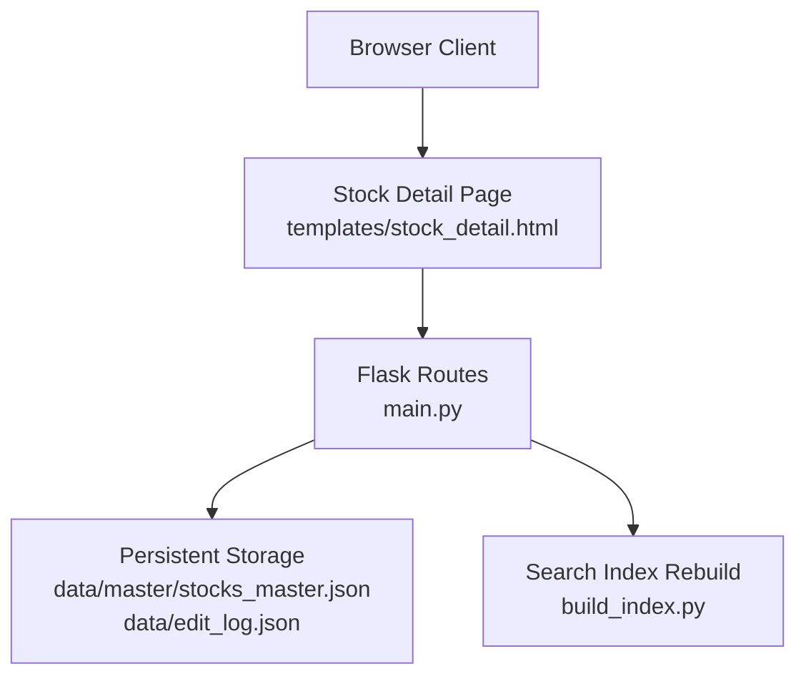
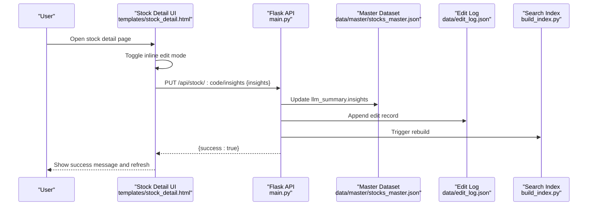
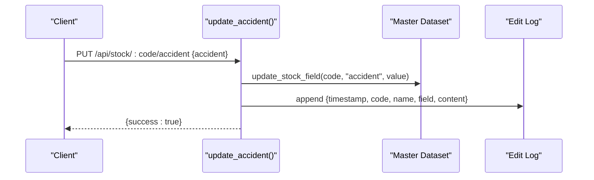
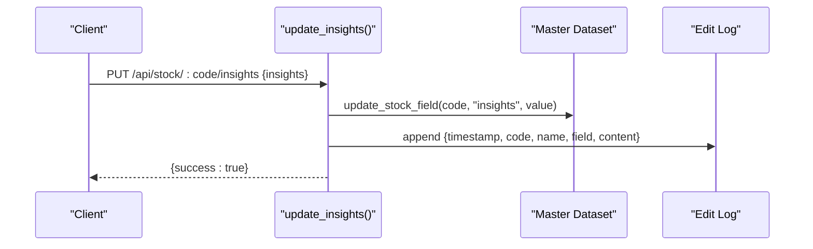
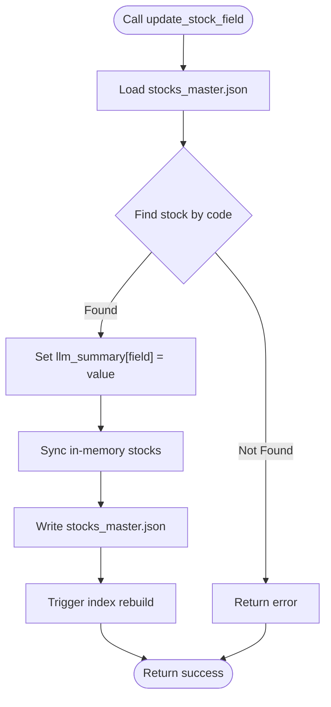
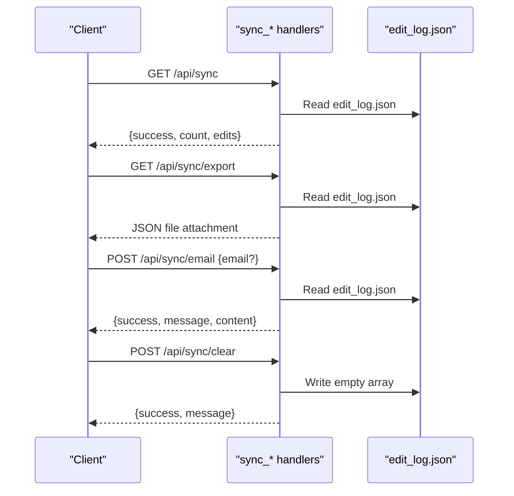
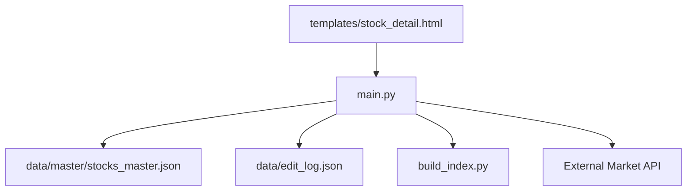

# Community Editing API

<cite>
**Referenced Files in This Document**
- [main.py](file://main.py)
- [stock_detail.html](file://templates/stock_detail.html)
- [SYNC_FEATURE.md](file://SYNC_FEATURE.md)
- [INSIGHTS_EDIT_FEATURE.md](file://INSIGHTS_EDIT_FEATURE.md)
</cite>

## Table of Contents
1. [Introduction](#introduction)
2. [Project Structure](#project-structure)
3. [Core Components](#core-components)
4. [Architecture Overview](#architecture-overview)
5. [Detailed Component Analysis](#detailed-component-analysis)
6. [Dependency Analysis](#dependency-analysis)
7. [Performance Considerations](#performance-considerations)
8. [Troubleshooting Guide](#troubleshooting-guide)
9. [Conclusion](#conclusion)

## Introduction
This document provides comprehensive API documentation for community collaboration and editing features focused on stock research data. It covers:
- PUT endpoints for updating specific stock fields: `/api/stock/:code/accident` and `/api/stock/:code/insights`
- Synchronization and export endpoints: `/api/sync`, `/api/sync/export`, `/api/sync/email`, and `/api/sync/clear`
- Request/response schemas, edit logging mechanisms, data persistence strategies, and conflict resolution approaches
- Examples of collaborative editing workflows, edit history tracking, and team coordination patterns

## Project Structure
The editing and synchronization features are implemented in a single-file Flask application with HTML templates for the frontend. Key locations:
- Backend routes and handlers: [main.py](file://main.py)
- Stock detail page with inline editing UI: [stock_detail.html](file://templates/stock_detail.html)
- Feature documentation and usage scenarios: [SYNC_FEATURE.md](file://SYNC_FEATURE.md), [INSIGHTS_EDIT_FEATURE.md](file://INSIGHTS_EDIT_FEATURE.md)

**Diagram sources**
- [main.py](file://main.py)
- [stock_detail.html](file://templates/stock_detail.html)

**Section sources**
- [main.py](file://main.py)
- [stock_detail.html](file://templates/stock_detail.html)

## Core Components
- PUT /api/stock/:code/accident
  - Purpose: Update the accident (catalyst/risk event) field for a given stock code
  - Request body: JSON object containing the new accident content
  - Response: Success indicator and server-side message
- PUT /api/stock/:code/insights
  - Purpose: Update the insights (investment highlights) field for a given stock code
  - Request body: JSON object containing the new insights content
  - Response: Success indicator and server-side message
- Synchronization endpoints
  - GET /api/sync: Retrieve all edit logs
  - GET /api/sync/export: Download a JSON export of edit logs
  - POST /api/sync/email: Generate a draft email content with edit summaries
  - POST /api/sync/clear: Clear the edit log collection

**Section sources**
- [main.py](file://main.py)
- [SYNC_FEATURE.md](file://SYNC_FEATURE.md)

## Architecture Overview
The editing workflow integrates frontend UI with backend APIs and persistent storage. The frontend renders an inline editor on the stock detail page, collects user edits, and sends structured requests to the backend. The backend validates the stock code, updates the master dataset, logs the edit, and triggers index rebuilding.

**Diagram sources**
- [main.py](file://main.py)
- [stock_detail.html](file://templates/stock_detail.html)

**Section sources**
- [main.py](file://main.py)
- [stock_detail.html](file://templates/stock_detail.html)

## Detailed Component Analysis

### PUT /api/stock/:code/accident
- Method: PUT
- Path: `/api/stock/:code/accident`
- Description: Updates the accident (catalyst/risk event) field for the specified stock code
- Request body schema:
  - accident: string (required)
- Response schema:
  - success: boolean
  - message: string (optional)
  - error: string (optional)
- Behavior:
  - Validates stock existence
  - Calls shared update function to modify master dataset
  - Appends an edit log entry with timestamp, stock code/name, field, and content preview
  - Saves edit log to disk
- Notes:
  - Content preview in logs is truncated to avoid excessive file sizes
  - Edit log is separate from persisted data; clearing logs does not affect saved datasets

**Diagram sources**
- [main.py](file://main.py)

**Section sources**
- [main.py](file://main.py)

### PUT /api/stock/:code/insights
- Method: PUT
- Path: `/api/stock/:code/insights`
- Description: Updates the insights (investment highlights) field for the specified stock code
- Request body schema:
  - insights: string (required)
- Response schema:
  - success: boolean
  - message: string (optional)
  - error: string (optional)
- Behavior:
  - Validates stock existence
  - Calls shared update function to modify master dataset
  - Appends an edit log entry with timestamp, stock code/name, field, and content preview
  - Saves edit log to disk
- Notes:
  - Content preview in logs is truncated to avoid excessive file sizes
  - Edit log is separate from persisted data; clearing logs does not affect saved datasets

**Diagram sources**
- [main.py](file://main.py)

**Section sources**
- [main.py](file://main.py)

### Shared Update Functionality
- Function: update_stock_field(code, field, value)
- Behavior:
  - Loads master dataset from disk
  - Locates the stock entry by code and sets llm_summary[field] = value
  - Synchronizes in-memory stocks dictionary
  - Writes updated master dataset back to disk
  - Triggers search index rebuild via external script invocation

**Diagram sources**
- [main.py](file://main.py)

**Section sources**
- [main.py](file://main.py)

### Synchronization and Export Endpoints

#### GET /api/sync
- Purpose: Retrieve all edit logs
- Response schema:
  - success: boolean
  - count: number
  - edits: array of edit records

#### GET /api/sync/export
- Purpose: Download a JSON export of edit logs
- Response: Binary attachment (.json)
- Export payload schema:
  - export_time: string (ISO timestamp)
  - total_edits: number
  - edits: array of edit records

#### POST /api/sync/email
- Purpose: Generate a draft email content summarizing edit logs
- Request body schema:
  - email: string (optional)
- Response schema:
  - success: boolean
  - message: string
  - content: string (generated email draft)

#### POST /api/sync/clear
- Purpose: Clear the edit log collection
- Response schema:
  - success: boolean
  - message: string

**Diagram sources**
- [main.py](file://main.py)

**Section sources**
- [main.py](file://main.py)
- [SYNC_FEATURE.md](file://SYNC_FEATURE.md)

## Dependency Analysis
- Frontend-to-backend dependencies:
  - Inline editing UI in stock_detail.html invokes `/api/stock/:code/edit` for batch updates and `/api/stock/:code/insights` for insights-only updates
  - Synchronization panel uses `/api/sync`, `/api/sync/export`, `/api/sync/email`, and `/api/sync/clear`
- Backend dependencies:
  - Persistent storage: `data/master/stocks_master.json` (master dataset), `data/edit_log.json` (edit logs)
  - Search index rebuild triggered after edits via external process invocation
- External integrations:
  - Market data retrieval via third-party API
  - Article import and merge pipeline for ingestion workflows

**Diagram sources**
- [main.py](file://main.py)
- [stock_detail.html](file://templates/stock_detail.html)

**Section sources**
- [main.py](file://main.py)
- [stock_detail.html](file://templates/stock_detail.html)

## Performance Considerations
- Edit logging overhead: Each edit appends to a JSON array; frequent edits increase file size and IO cost
- Index rebuild cost: Triggering index rebuild after each edit may be expensive; consider batching edits or deferring rebuilds
- File I/O: Frequent reads/writes to master dataset and edit log can impact throughput under high concurrency
- Recommendations:
  - Batch multiple edits per stock before persisting
  - Defer index rebuild until a quiet period or explicit request
  - Add rate limiting and concurrency controls
  - Consider using a database-backed storage for better scalability

## Troubleshooting Guide
- Stock not found errors:
  - Symptom: 404 responses when editing non-existent codes
  - Resolution: Verify stock code validity and presence in master dataset
- Empty or missing edit logs:
  - Symptom: Export returns error or empty content
  - Resolution: Ensure edits were made; confirm edit log file exists and is readable
- Index rebuild failures:
  - Symptom: Search results not reflecting recent edits
  - Resolution: Check external process invocation permissions and script availability
- CORS and deployment:
  - Symptom: Cross-origin errors in hosted environments
  - Resolution: Configure proper CORS headers and deployment proxy settings

**Section sources**
- [main.py](file://main.py)
- [SYNC_FEATURE.md](file://SYNC_FEATURE.md)

## Conclusion
The community editing and synchronization features provide a practical foundation for collaborative stock research data curation. The PUT endpoints enable targeted updates to critical fields, while the synchronization suite supports auditability, backup, and team coordination. For production use, consider enhancing with authentication, versioning, conflict resolution, and improved persistence strategies to support higher concurrency and reliability.