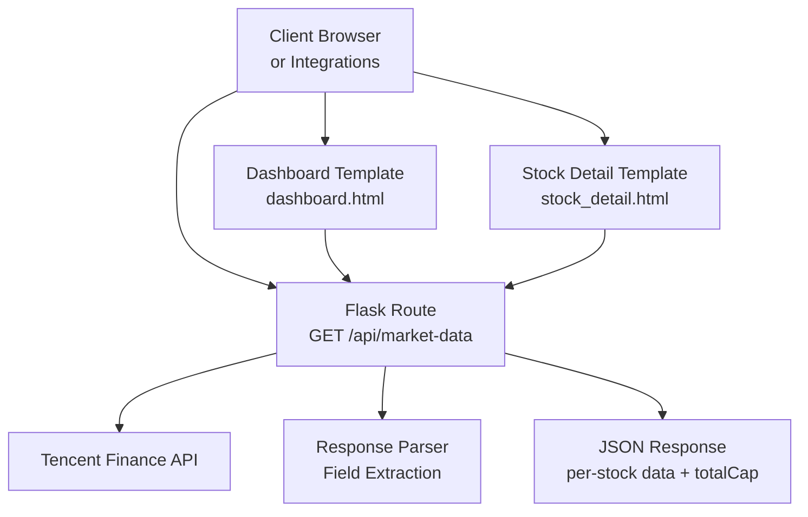
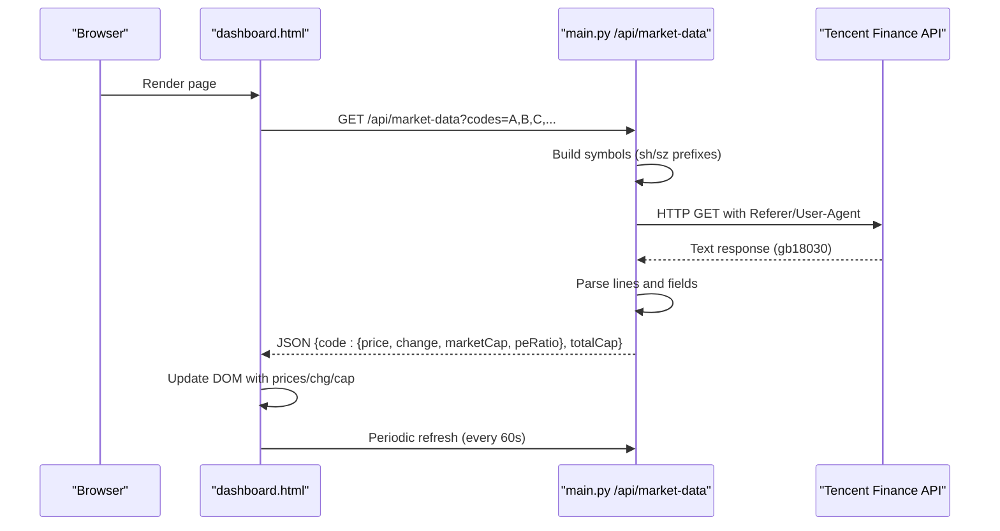
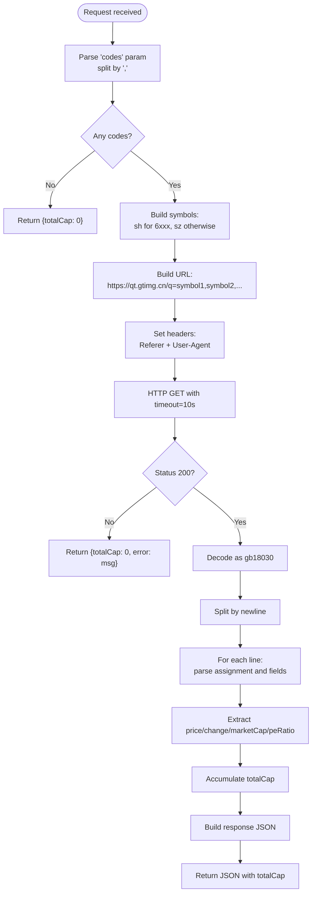
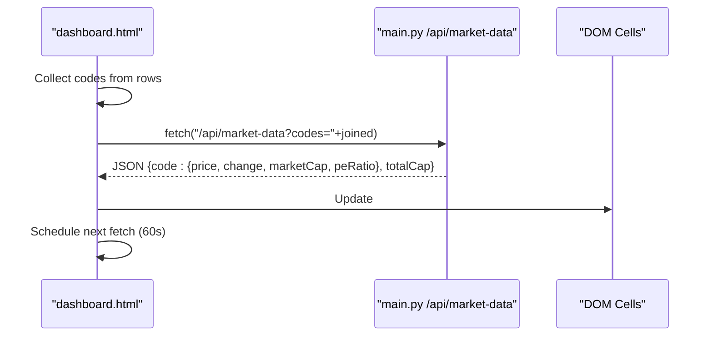
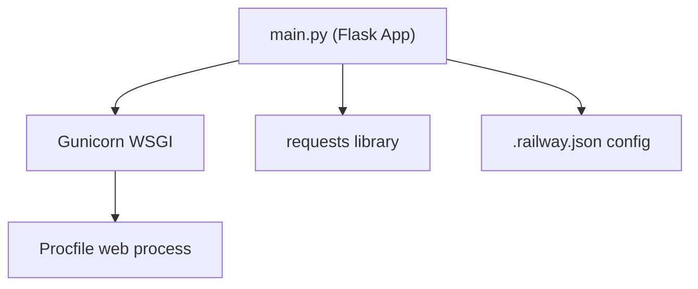

# Market Data API

<cite>
**Referenced Files in This Document**
- [main.py](file://main.py)
- [dashboard.html](file://templates/dashboard.html)
- [stock_detail.html](file://templates/stock_detail.html)
- [HOMEPAGE_FINAL_FIX.md](file://HOMEPAGE_FINAL_FIX.md)
- [HOMEPAGE_FIXES_COMPLETE.md](file://HOMEPAGE_FIXES_COMPLETE.md)
- [HOMEPAGE_FIX_SUMMARY.md](file://HOMEPAGE_FIX_SUMMARY.md)
- [requirements.txt](file://requirements.txt)
- [Procfile](file://Procfile)
- [.railway.json](file://.railway.json)
</cite>

## Table of Contents
1. [Introduction](#introduction)
2. [Project Structure](#project-structure)
3. [Core Components](#core-components)
4. [Architecture Overview](#architecture-overview)
5. [Detailed Component Analysis](#detailed-component-analysis)
6. [Dependency Analysis](#dependency-analysis)
7. [Performance Considerations](#performance-considerations)
8. [Troubleshooting Guide](#troubleshooting-guide)
9. [Conclusion](#conclusion)

## Introduction
This document provides comprehensive API documentation for the real-time market data integration focused on the GET /api/market-data endpoint. The endpoint fetches live stock quotes from the Tencent Finance API and returns standardized fields for price, change percentage, market capitalization, and P/E ratio. It supports batch requests via a comma-separated codes parameter and includes robust error handling, timeout configurations, and data parsing logic suitable for real-time market monitoring applications.

## Project Structure
The market data API is implemented in the Flask application and consumed by frontend templates for dashboard and stock detail pages. The deployment configuration uses Gunicorn and Railway.

**Diagram sources**
- [main.py:696-768](file://main.py#L696-L768)
- [dashboard.html:1180-1242](file://templates/dashboard.html#L1180-L1242)
- [stock_detail.html:1230-1260](file://templates/stock_detail.html#L1230-L1260)

**Section sources**
- [main.py:696-768](file://main.py#L696-L768)
- [dashboard.html:1180-1242](file://templates/dashboard.html#L1180-L1242)
- [stock_detail.html:1230-1260](file://templates/stock_detail.html#L1230-L1260)
- [Procfile:1-2](file://Procfile#L1-L2)
- [.railway.json:1-15](file://.railway.json#L1-L15)

## Core Components
- Endpoint: GET /api/market-data
- Request parameter:
  - codes: Comma-separated list of stock codes (supports A-share SH/SZ)
- Response format:
  - Per-stock object with keys: price, change, marketCap, peRatio
  - Aggregate totalCap representing sum of market caps where available
- Data source: Tencent Finance API (gb18030 encoding)
- Timeout: 10 seconds per request
- Error handling: Graceful fallback returning totalCap and optional error message

Key implementation details:
- URL construction builds a single request to the Tencent Finance API using market-prefixed symbols (sh for Shanghai, sz for Shenzhen).
- Response parsing extracts fields by index from the returned pipe-delimited string format.
- Missing or invalid fields are handled safely, with peRatio optionally omitted when unavailable.

**Section sources**
- [main.py:696-768](file://main.py#L696-L768)
- [HOMEPAGE_FINAL_FIX.md:272-302](file://HOMEPAGE_FINAL_FIX.md#L272-L302)
- [HOMEPAGE_FIXES_COMPLETE.md:253-273](file://HOMEPAGE_FIXES_COMPLETE.md#L253-L273)

## Architecture Overview
The market data pipeline integrates client-side polling with backend aggregation and external API consumption.

**Diagram sources**
- [main.py:696-768](file://main.py#L696-L768)
- [dashboard.html:1180-1242](file://templates/dashboard.html#L1180-L1242)

**Section sources**
- [main.py:696-768](file://main.py#L696-L768)
- [dashboard.html:1180-1242](file://templates/dashboard.html#L1180-L1242)

## Detailed Component Analysis

### GET /api/market-data
Purpose: Fetch live quotes for one or more A-share stocks from Tencent Finance API.

- URL construction:
  - Converts each code to a market-prefixed symbol: shXXXXXX for 6xxxxx, szXXXXXX otherwise.
  - Builds a single URL with a comma-separated symbol list.
- Request parameters:
  - codes: Required for batch; empty returns a minimal response with totalCap=0.
- Request headers:
  - Referer: stockapp.finance.qq.com
  - User-Agent: Mozilla/5.0
- Encoding:
  - Uses gb18030 to decode the response body.
- Timeout:
  - 10 seconds enforced via requests.get(timeout=10).
- Response parsing:
  - Splits response by newline and processes each line containing assignment and delimiter markers.
  - Extracts stock code (removing market prefix), current price, change percent, market cap (in billions), and P/E ratio.
  - Aggregates totalCap across all returned stocks where market cap is present.
- Error handling:
  - On exceptions, returns JSON with totalCap=0 and an error field; status code remains 200 to avoid client-side hard failure.

**Diagram sources**
- [main.py:696-768](file://main.py#L696-L768)

**Section sources**
- [main.py:696-768](file://main.py#L696-L768)

### Frontend Integration Patterns
- Dashboard (dashboard.html):
  - Collects visible stock codes from the table rows.
  - Calls /api/market-data with codes joined by commas.
  - Updates price, change percentage, and market cap cells.
  - Handles missing data by rendering placeholders.
  - Implements automatic refresh (initial delay 3s, then every 60s) and manual refresh button with loading states.
- Stock Detail (stock_detail.html):
  - Fetches a single stock quote by passing the individual code.
  - Updates the hero section with current price, change direction, and extra metrics (market cap and P/E ratio when available).

**Diagram sources**
- [dashboard.html:1180-1242](file://templates/dashboard.html#L1180-L1242)

**Section sources**
- [dashboard.html:1180-1242](file://templates/dashboard.html#L1180-L1242)
- [stock_detail.html:1230-1260](file://templates/stock_detail.html#L1230-L1260)

### Response Format Specification
- Root-level fields:
  - totalCap: Number (sum of market caps for returned stocks; 0 if none)
- Per-stock fields (object keyed by stock code):
  - price: Number (current price)
  - change: Number (percent change; negative allowed)
  - marketCap: Number (total market cap in billions)
  - peRatio: Number or null/absent (P/E ratio; may be missing)
- Example shape:
  - {"002202": {"price": 30.51, "change": -1.58, "marketCap": 1026.21, "peRatio": 48.58}, "totalCap": 1270.09}

Notes:
- peRatio may be absent when the upstream API does not provide it.
- Empty or invalid codes are ignored; no per-code error is returned.

**Section sources**
- [HOMEPAGE_FINAL_FIX.md:278-302](file://HOMEPAGE_FINAL_FIX.md#L278-L302)
- [HOMEPAGE_FIXES_COMPLETE.md:259-273](file://HOMEPAGE_FIXES_COMPLETE.md#L259-L273)

## Dependency Analysis
External dependencies and runtime configuration:
- Flask application served via Gunicorn
- HTTP client library requests for outbound API calls
- Railway deployment with health checks and restart policy

**Diagram sources**
- [requirements.txt:1-5](file://requirements.txt#L1-L5)
- [Procfile:1-2](file://Procfile#L1-L2)
- [.railway.json:1-15](file://.railway.json#L1-L15)

**Section sources**
- [requirements.txt:1-5](file://requirements.txt#L1-L5)
- [Procfile:1-2](file://Procfile#L1-L2)
- [.railway.json:1-15](file://.railway.json#L1-L15)

## Performance Considerations
- Batch optimization: Sending multiple codes in a single request reduces network overhead compared to individual calls.
- Encoding choice: Using gb18030 ensures correct decoding of Tencent API responses.
- Timeout tuning: 10-second timeout balances responsiveness with reliability under network variability.
- Frontend caching: The dashboard updates only visible rows and schedules periodic refreshes to minimize redundant loads.
- Data filtering: The backend filters out ETFs and indices on the main dashboard route to reduce unnecessary market data calls.

[No sources needed since this section provides general guidance]

## Troubleshooting Guide
Common issues and resolutions:
- No data displayed:
  - Verify codes are valid A-share tickers (6xxxxx for Shanghai, others for Shenzhen).
  - Confirm the page is not loading ETFs/indices which lack quotes.
- API failures:
  - The endpoint returns a JSON with totalCap=0 and an error field on exceptions; this avoids breaking the client.
  - Retry after a short delay if the upstream API is rate-limited or temporarily unavailable.
- Parsing errors:
  - The parser expects a specific field layout; malformed responses will be ignored gracefully.
- Encoding issues:
  - The response is decoded using gb18030; ensure the server locale supports this encoding.

Integration tips:
- Batch requests: Group up to dozens of codes in a single call to optimize performance.
- Error resilience: Always handle missing fields (e.g., peRatio) and empty responses.
- Refresh cadence: Use initial delay plus periodic refresh (e.g., 3s then 60s) to keep data fresh without overloading the API.

**Section sources**
- [main.py:696-768](file://main.py#L696-L768)
- [dashboard.html:1180-1242](file://templates/dashboard.html#L1180-L1242)
- [HOMEPAGE_FINAL_FIX.md:305-327](file://HOMEPAGE_FINAL_FIX.md#L305-L327)

## Conclusion
The GET /api/market-data endpoint provides a reliable, batch-oriented interface for retrieving real-time A-share market data from Tencent Finance. Its design emphasizes simplicity, robustness, and ease of integration in both dashboard and detail views. By leveraging batch requests, appropriate timeouts, and graceful error handling, applications can implement efficient real-time monitoring with minimal operational overhead.