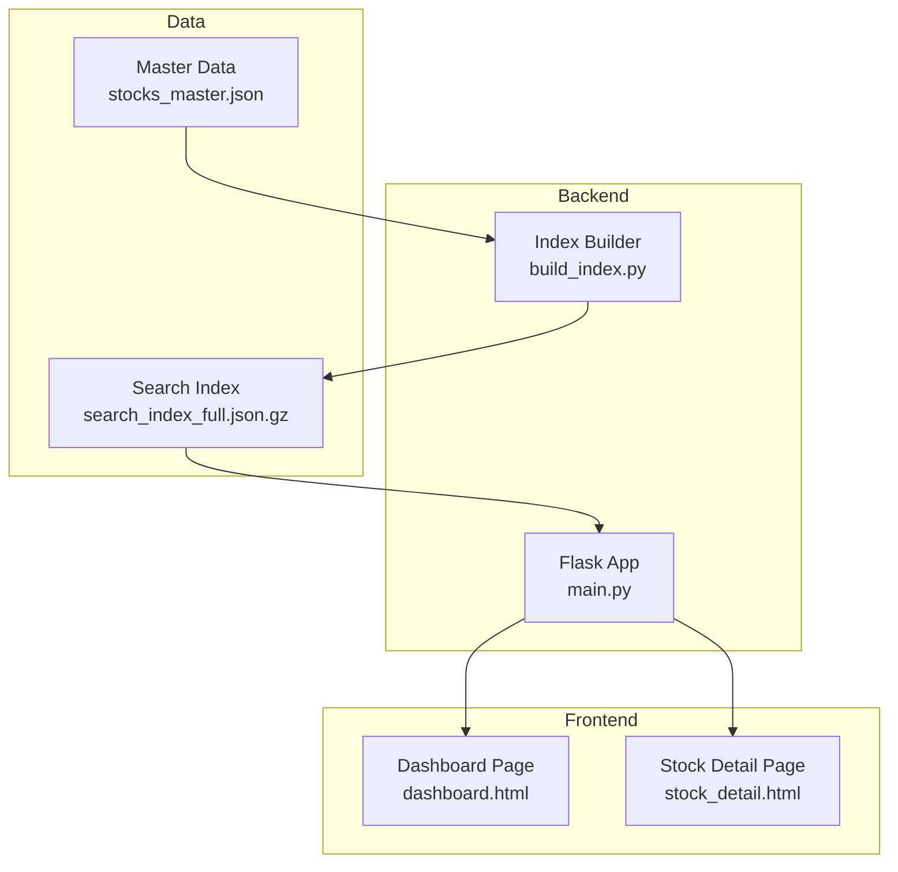
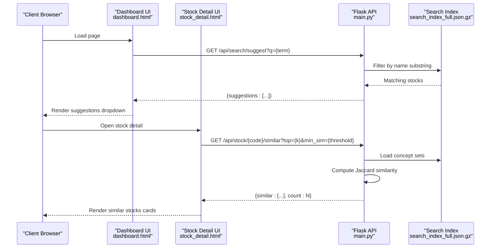
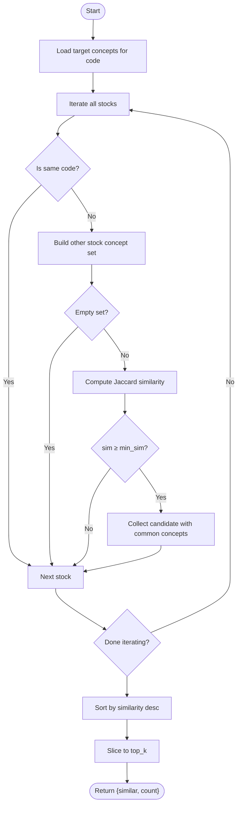
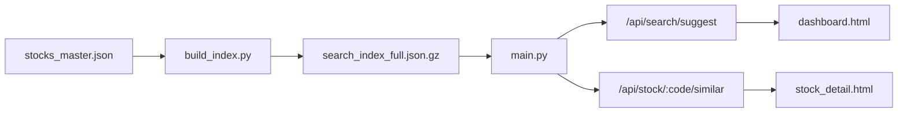

# Search and Discovery API

<cite>
**Referenced Files in This Document**
- [main.py](file://main.py)
- [build_index.py](file://build_index.py)
- [JSON格式标准.md](file://JSON格式标准.md)
- [dashboard.html](file://templates/dashboard.html)
- [stock_detail.html](file://templates/stock_detail.html)
</cite>

## Table of Contents
1. [Introduction](#introduction)
2. [Project Structure](#project-structure)
3. [Core Components](#core-components)
4. [Architecture Overview](#architecture-overview)
5. [Detailed Component Analysis](#detailed-component-analysis)
6. [Dependency Analysis](#dependency-analysis)
7. [Performance Considerations](#performance-considerations)
8. [Troubleshooting Guide](#troubleshooting-guide)
9. [Conclusion](#conclusion)

## Introduction
This document provides comprehensive API documentation for the search and discovery functionality of the stock research platform. It covers:
- GET /api/search/suggest for autocomplete suggestions with query parameter handling and response formatting
- GET /api/stock/:code/similar for concept-based similarity recommendations using the Jaccard similarity algorithm

It also explains parameter specifications, response schemas, integration examples, and the underlying similarity calculation logic.

## Project Structure
The search and discovery features are implemented in the Flask application with supporting data generation scripts and frontend templates:
- Backend routes and logic: main.py
- Data indexing pipeline: build_index.py
- Data format standards: JSON格式标准.md
- Frontend integration examples: templates/dashboard.html, templates/stock_detail.html

**Diagram sources**
- [main.py](file://main.py)
- [build_index.py](file://build_index.py)
- [JSON格式标准.md](file://JSON格式标准.md)

**Section sources**
- [main.py](file://main.py)
- [build_index.py](file://build_index.py)
- [JSON格式标准.md](file://JSON格式标准.md)

## Core Components
- Autocomplete suggestions endpoint: GET /api/search/suggest
- Similarity recommendations endpoint: GET /api/stock/:code/similar
- Underlying similarity computation: Jaccard similarity over concept sets
- Data loading: search index (compressed JSON) and master data

Key implementation references:
- Autocomplete route and logic: [main.py](file://main.py)
- Similarity route and logic: [main.py](file://main.py)
- Jaccard similarity function: [main.py](file://main.py)
- Concept-based recommendation engine: [main.py](file://main.py)
- Data index generation: [build_index.py](file://build_index.py)
- Data format standards: [JSON格式标准.md](file://JSON格式标准.md)

**Section sources**
- [main.py](file://main.py)
- [build_index.py](file://build_index.py)
- [JSON格式标准.md](file://JSON格式标准.md)

## Architecture Overview
The search and discovery pipeline integrates frontend UI with backend APIs and data processing:

**Diagram sources**
- [main.py](file://main.py)
- [dashboard.html](file://templates/dashboard.html)
- [stock_detail.html](file://templates/stock_detail.html)

## Detailed Component Analysis

### GET /api/search/suggest
Purpose:
- Provide real-time autocomplete suggestions for stock names based on a query term.

Parameters:
- q (required): Search query string. Minimum length enforced server-side.

Behavior:
- Returns up to 10 suggestions matching the query substring in stock names.
- Suggestion items include code, name, and mention_count.

Response Schema:
- Field: suggestions (array)
  - Items: object with fields
    - code (string): 6-digit stock code
    - name (string): stock name
    - mention_count (number): frequency metric

Integration Example (frontend fetch):
- See usage in dashboard template for client-side integration.

Notes:
- Query length threshold prevents trivial queries.
- Suggestions are limited to name matches.

**Section sources**
- [main.py](file://main.py)
- [dashboard.html](file://templates/dashboard.html)

### GET /api/stock/:code/similar
Purpose:
- Recommend similar stocks based on concept overlap using Jaccard similarity.

Parameters:
- top (optional, default 10): Maximum number of recommendations to return.
- min_sim (optional, default 0.1): Minimum similarity threshold.

Behavior:
- Loads concept sets from the search index.
- Computes Jaccard similarity between the target stock’s concepts and all other stocks’ concepts.
- Filters results by minimum similarity and limits by top.
- Returns recommendations sorted by similarity descending.

Response Schema:
- Field: similar (array)
  - Items: object with fields
    - code (string): 6-digit stock code
    - name (string): stock name
    - similarity (number): Jaccard coefficient in [0, 1]
    - common_concepts (array of strings): overlapping concept tags
    - common_count (number): count of overlapping concepts
    - mention_count (number): frequency metric
    - concepts (array of strings): all concepts for the recommended stock
- Field: count (number): total number of recommendations returned

Similarity Calculation Logic:
- Jaccard similarity = |A ∩ B| / |A ∪ B|
- Concepts are treated as sets.
- Recommendations require similarity ≥ min_sim.

Frontend Integration:
- Stock detail page renders similar stocks cards with percentage similarity and common concept badges.

**Section sources**
- [main.py](file://main.py)
- [stock_detail.html](file://templates/stock_detail.html)

### Underlying Similarity Computation and Concept Matching
Implementation highlights:
- Jaccard similarity function computes coefficient between two sets.
- Recommendation engine:
  - Builds target concept set from the specified stock.
  - Iterates all stocks, skipping the target itself.
  - Computes similarity and collects candidates meeting min_sim.
  - Sorts by similarity descending and slices to top_k.

**Diagram sources**
- [main.py](file://main.py)

**Section sources**
- [main.py](file://main.py)

### Data Loading and Indexing
- Search index file: search_index_full.json.gz (compressed)
- Index generation script: build_index.py
- Data format standards: JSON格式标准.md

Key points:
- The Flask app loads the compressed search index at startup.
- The index contains cleaned, structured fields optimized for search and discovery.
- The index builder merges master data and sentiment mentions, extracts concepts, and produces a gzipped JSON for fast client delivery.

**Section sources**
- [main.py](file://main.py)
- [build_index.py](file://build_index.py)
- [JSON格式标准.md](file://JSON格式标准.md)

## Dependency Analysis
High-level dependencies:
- main.py depends on the search index file for runtime lookups.
- build_index.py generates the search index from master data and sentiment sources.
- Frontend templates consume API responses to render suggestions and recommendations.

**Diagram sources**
- [main.py](file://main.py)
- [build_index.py](file://build_index.py)
- [JSON格式标准.md](file://JSON格式标准.md)

**Section sources**
- [main.py](file://main.py)
- [build_index.py](file://build_index.py)
- [JSON格式标准.md](file://JSON格式标准.md)

## Performance Considerations
- Query filtering on the server side ensures minimal payload sizes for autocomplete.
- Jaccard similarity computation iterates over all stocks; consider caching or precomputing dense similarity matrices for very large datasets.
- The search index is gzipped to reduce transfer size; ensure clients handle decompression efficiently.
- Frontend debouncing is implemented for autocomplete input to avoid excessive requests.

## Troubleshooting Guide
Common issues and resolutions:
- Empty suggestions for short queries: Ensure q has at least the minimum required length.
- No recommendations returned: Increase min_sim or verify concept tags exist for the target stock.
- Slow similarity responses: Consider reducing top or adding server-side caching.
- Incorrect or missing data: Verify the search index was rebuilt after data updates.

**Section sources**
- [main.py](file://main.py)

## Conclusion
The search and discovery API provides efficient autocomplete and concept-based recommendations powered by a compressed search index and Jaccard similarity. By tuning parameters like top and min_sim, and leveraging the frontend integrations shown in the templates, teams can deliver responsive and accurate discovery experiences.