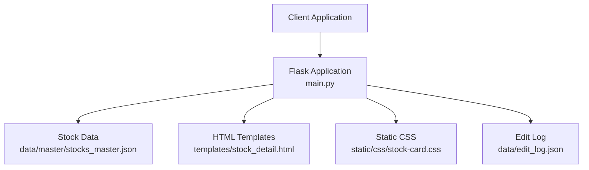
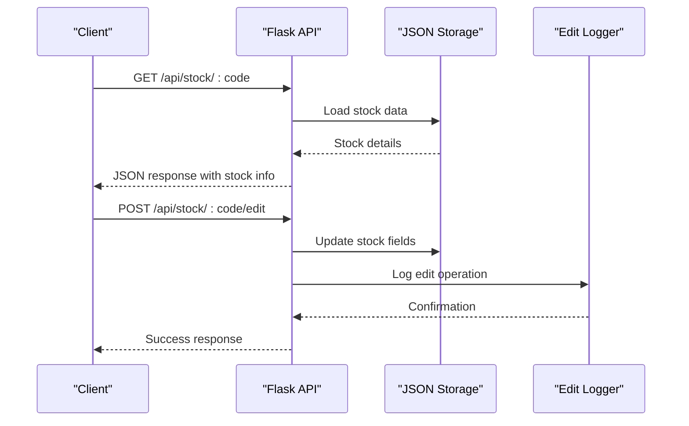
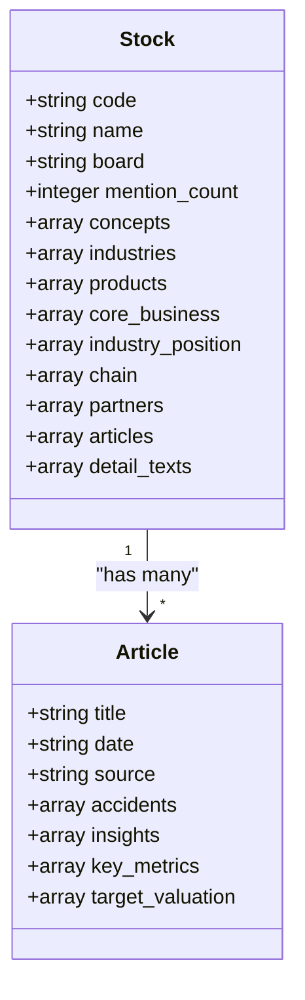
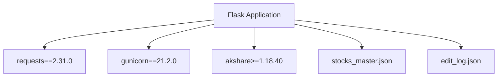

# Stock Management API

<cite>
**Referenced Files in This Document**
- [main.py](file://main.py)
- [README.md](file://README.md)
- [requirements.txt](file://requirements.txt)
- [templates/stock_detail.html](file://templates/stock_detail.html)
- [data/master/stocks_master.json](file://data/master/stocks_master.json)
</cite>

## Table of Contents
1. [Introduction](#introduction)
2. [Project Structure](#project-structure)
3. [Core Components](#core-components)
4. [Architecture Overview](#architecture-overview)
5. [Detailed Component Analysis](#detailed-component-analysis)
6. [Dependency Analysis](#dependency-analysis)
7. [Performance Considerations](#performance-considerations)
8. [Troubleshooting Guide](#troubleshooting-guide)
9. [Conclusion](#conclusion)

## Introduction
This document provides comprehensive API documentation for the stock management endpoints in the individual stock research database. It focuses on two primary endpoints:
- GET /api/stock/:code: Retrieve complete stock information including concepts, articles, products, and industry data
- POST /api/stock/:code/edit: Collaborative editing endpoint supporting core_business, products, industry_position, chain, and partners fields

The documentation covers request/response schemas, parameter validation, error handling, authentication requirements, and practical examples for fetching stock details and updating company information. It also documents the underlying data model and field relationships.

## Project Structure
The project is a Flask-based web application that serves stock research data. Key components include:
- Flask application entry point and routing logic
- Stock data loaded from JSON files
- HTML templates for rendering stock details
- Static assets for styling
- Data files containing master stock information and industry mappings



**Diagram sources**
- [main.py:1-1226](file://main.py#L1-L1226)
- [templates/stock_detail.html:1-1549](file://templates/stock_detail.html#L1-L1549)
- [data/master/stocks_master.json:1-200](file://data/master/stocks_master.json#L1-L200)

**Section sources**
- [main.py:1-1226](file://main.py#L1-L1226)
- [README.md:1-126](file://README.md#L1-L126)

## Core Components
The stock management API consists of two primary endpoints:

### GET /api/stock/:code
Retrieves complete stock information for a given stock code.

### POST /api/stock/:code/edit
Enables collaborative editing of stock information fields.

Both endpoints operate on the same underlying data model representing individual stocks with associated metadata and articles.

**Section sources**
- [main.py:480-495](file://main.py#L480-L495)
- [main.py:431-478](file://main.py#L431-L478)

## Architecture Overview
The API follows a RESTful design pattern with JSON payloads. The application loads stock data from a master JSON file and exposes endpoints for retrieval and modification. The architecture supports:
- Single stock retrieval with comprehensive details
- Field-level updates for collaborative editing
- Edit logging for audit trails
- Real-time data persistence to JSON files



**Diagram sources**
- [main.py:431-495](file://main.py#L431-L495)

## Detailed Component Analysis

### GET /api/stock/:code Endpoint

#### Purpose
Retrieve complete stock information including concepts, articles, products, and industry data for a specified stock code.

#### Request
- Method: GET
- URL: `/api/stock/:code`
- Path Parameter:
  - code (string): Stock ticker symbol (e.g., "603019")

#### Response Schema
```json
{
  "code": "string",
  "name": "string",
  "board": "string",
  "mention_count": "integer",
  "concepts": ["string"],
  "industries": ["string"],
  "products": ["string"],
  "core_business": ["string"],
  "industry_position": ["string"],
  "chain": ["string"],
  "partners": ["string"],
  "articles": [
    {
      "title": "string",
      "date": "string",
      "source": "string",
      "accidents": ["string"],
      "insights": ["string"],
      "key_metrics": ["string"],
      "target_valuation": ["string"]
    }
  ],
  "detail_texts": ["string"]
}
```

#### Authentication
- No authentication required for this endpoint

#### Error Handling
- 404 Not Found: Stock code does not exist in the database
- 500 Internal Server Error: Server-side processing errors

#### Practical Example
```bash
curl -X GET "https://your-domain.com/api/stock/603019"
```

Response:
```json
{
  "code": "603019",
  "name": "中科曙光",
  "board": "SH",
  "mention_count": 21,
  "concepts": ["电池", "锂电", "算力", "中国AI 50"],
  "industries": ["计算机-计算机设备-其他计算机设备"],
  "products": ["芯片", "服务器", "平台", "系统"],
  "core_business": ["算力租赁业务营收占比达40%"],
  "industry_position": ["全球领先", "龙头", "领军企业"],
  "chain": ["AI服务器核心厂商"],
  "partners": ["* **通信设备**"],
  "articles": [...],
  "detail_texts": []
}
```

**Section sources**
- [main.py:480-495](file://main.py#L480-L495)

### POST /api/stock/:code/edit Endpoint

#### Purpose
Enable collaborative editing of stock information fields including core_business, products, industry_position, chain, and partners.

#### Request
- Method: POST
- URL: `/api/stock/:code/edit`
- Path Parameter:
  - code (string): Stock ticker symbol
- Headers:
  - Content-Type: application/json
- Body Schema:
```json
{
  "core_business": ["string"],
  "products": ["string"],
  "industry_position": ["string"],
  "chain": ["string"],
  "partners": ["string"]
}
```

#### Response Schema
```json
{
  "success": true,
  "updated_fields": ["string"]
}
```

#### Authentication
- No authentication required for this endpoint

#### Error Handling
- 400 Bad Request: Invalid JSON payload
- 404 Not Found: Stock code does not exist
- 500 Internal Server Error: Server-side processing errors

#### Practical Example
```bash
curl -X POST "https://your-domain.com/api/stock/603019/edit" \
  -H "Content-Type: application/json" \
  -d '{
    "industry_position": ["全球领先", "技术领先"],
    "chain": ["AI服务器核心厂商", "芯片供应链"],
    "partners": ["* **通信设备**", "* **数据中心服务商**"]
  }'
```

Response:
```json
{
  "success": true,
  "updated_fields": ["industry_position", "chain", "partners"]
}
```

#### Edit Conflict Handling
The endpoint implements a simple write-through mechanism:
- Updates are applied immediately to memory
- Changes are persisted to the master JSON file
- Edit operations are logged for audit purposes
- No explicit conflict resolution mechanism exists

**Section sources**
- [main.py:431-478](file://main.py#L431-L478)

### Data Model and Field Relationships

#### Stock Entity Structure
Each stock record contains the following fields:



**Diagram sources**
- [main.py:480-495](file://main.py#L480-L495)
- [data/master/stocks_master.json:1-200](file://data/master/stocks_master.json#L1-L200)

#### Field Descriptions
- **code**: Unique stock identifier
- **name**: Company name
- **board**: Exchange (SH/SZ)
- **mention_count**: Frequency of mentions
- **concepts**: Industry-related tags
- **industries**: Industry classification
- **products**: Product offerings
- **core_business**: Primary business activities
- **industry_position**: Competitive positioning
- **chain**: Supply chain relationships
- **partners**: Business partnerships
- **articles**: Associated research articles
- **detail_texts**: Additional descriptive text

**Section sources**
- [main.py:480-495](file://main.py#L480-L495)
- [data/master/stocks_master.json:1-200](file://data/master/stocks_master.json#L1-L200)

## Dependency Analysis
The API relies on several key dependencies and external services:



**Diagram sources**
- [requirements.txt:1-5](file://requirements.txt#L1-L5)
- [main.py:1-1226](file://main.py#L1-L1226)

### External Dependencies
- **Flask 3.0.0**: Web framework for API endpoints
- **requests 2.31.0**: HTTP client for external integrations
- **gunicorn 21.2.0**: WSGI server for production deployment
- **akshare 1.18.40+**: Financial data library (optional)

### Data Dependencies
- **stocks_master.json**: Primary stock data storage
- **edit_log.json**: Audit trail for edits
- **Industry mappings**: Classification data for industry relationships

**Section sources**
- [requirements.txt:1-5](file://requirements.txt#L1-L5)
- [main.py:1-1226](file://main.py#L1-L1226)

## Performance Considerations
The current implementation has several performance characteristics:

### Data Loading
- Stock data is loaded from JSON files at startup
- Memory-based caching for fast access during runtime
- JSON parsing overhead for large datasets (110,000+ records)

### API Response Times
- GET endpoint: Sub-second response for complete stock data
- POST endpoint: Immediate response with asynchronous file persistence
- Pagination not implemented for article lists (first 20 articles returned)

### Scalability Limitations
- Single-threaded file I/O operations
- No database connection pooling
- Memory constraints for large datasets
- No caching layer for frequently accessed endpoints

## Troubleshooting Guide

### Common Issues and Solutions

#### 404 Not Found Responses
**Symptoms**: API returns 404 for valid stock codes
**Causes**:
- Stock code not present in master data
- Incorrect stock code format
- Data loading failures

**Solutions**:
- Verify stock code exists in stocks_master.json
- Check data file integrity and encoding
- Restart application to reload data

#### 500 Internal Server Errors
**Symptoms**: Server returns 500 status codes
**Causes**:
- JSON parsing errors in data files
- File permission issues
- Memory exhaustion with large datasets

**Solutions**:
- Validate JSON syntax in data files
- Check file permissions and disk space
- Monitor memory usage during data operations

#### Edit Conflicts
**Symptoms**: Concurrent edits overwrite each other
**Current Behavior**: No conflict detection or resolution
**Workarounds**:
- Implement manual coordination between editors
- Use edit log to track changes
- Consider implementing optimistic locking mechanisms

#### Frontend Integration Issues
**Symptoms**: JavaScript errors when using inline editing
**Causes**:
- Missing template modifications
- Incorrect DOM element references
- Network connectivity issues

**Solutions**:
- Ensure stock_detail.html includes edit functionality
- Verify JavaScript console for errors
- Check network tab for failed API requests

**Section sources**
- [main.py:431-495](file://main.py#L431-L495)
- [templates/stock_detail.html:1401-1509](file://templates/stock_detail.html#L1401-L1509)

## Conclusion
The stock management API provides essential functionality for retrieving and editing stock information in a collaborative environment. The current implementation offers:

**Strengths**:
- Simple and intuitive REST API design
- Comprehensive stock data model
- Real-time edit logging
- Easy deployment with minimal dependencies

**Limitations**:
- No authentication or authorization
- Single-threaded file-based storage
- No built-in conflict resolution
- Limited scalability for large datasets

**Recommendations for Enhancement**:
1. Implement authentication and authorization mechanisms
2. Add database abstraction layer for better scalability
3. Introduce optimistic locking for concurrent edits
4. Add pagination for large article collections
5. Implement rate limiting and input validation
6. Add comprehensive API documentation with OpenAPI specification

The API serves as a foundation for a stock research platform and can be extended to support more advanced features while maintaining its simplicity and accessibility.