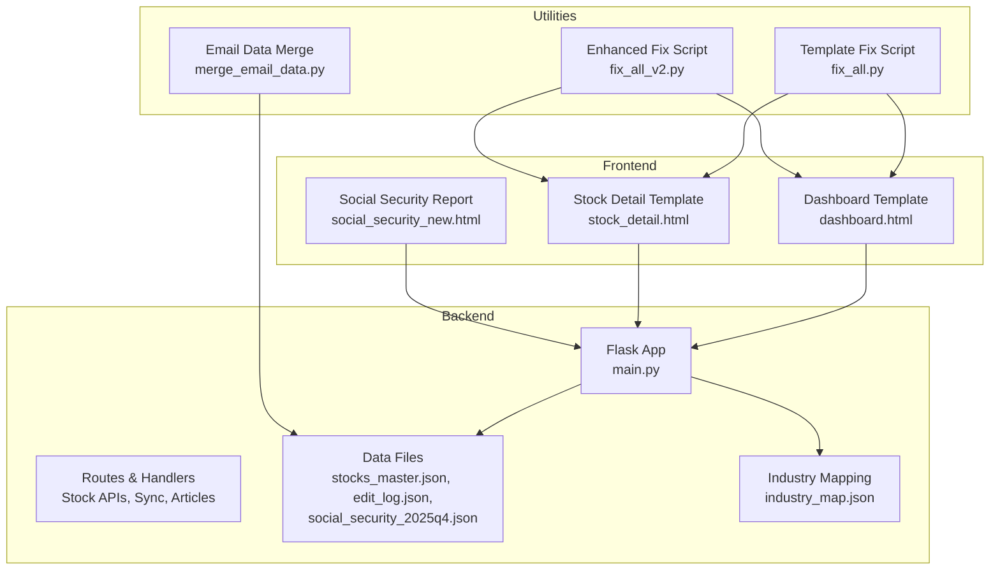
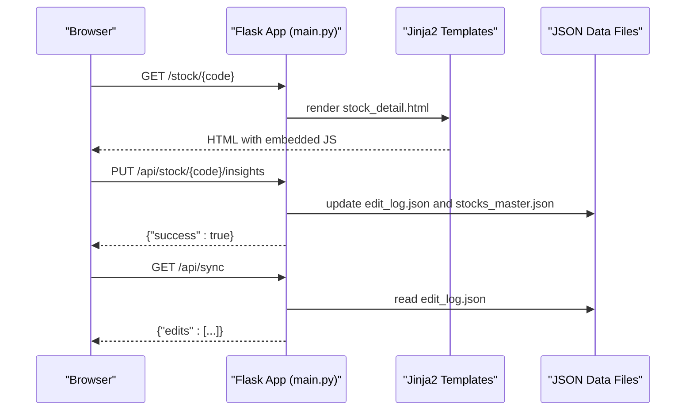
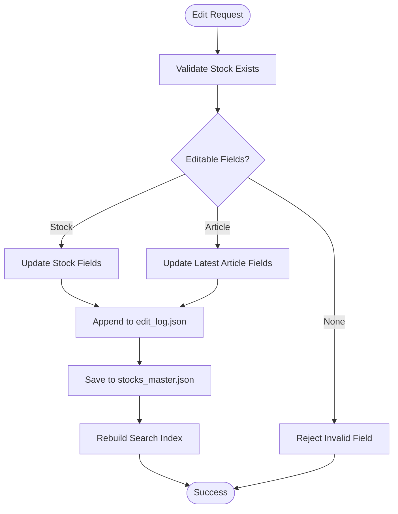
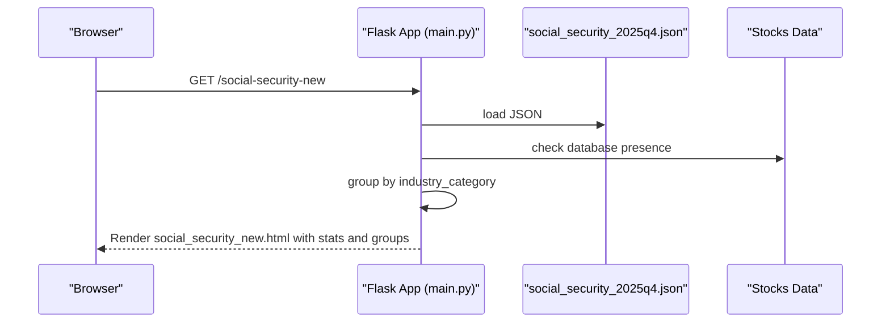
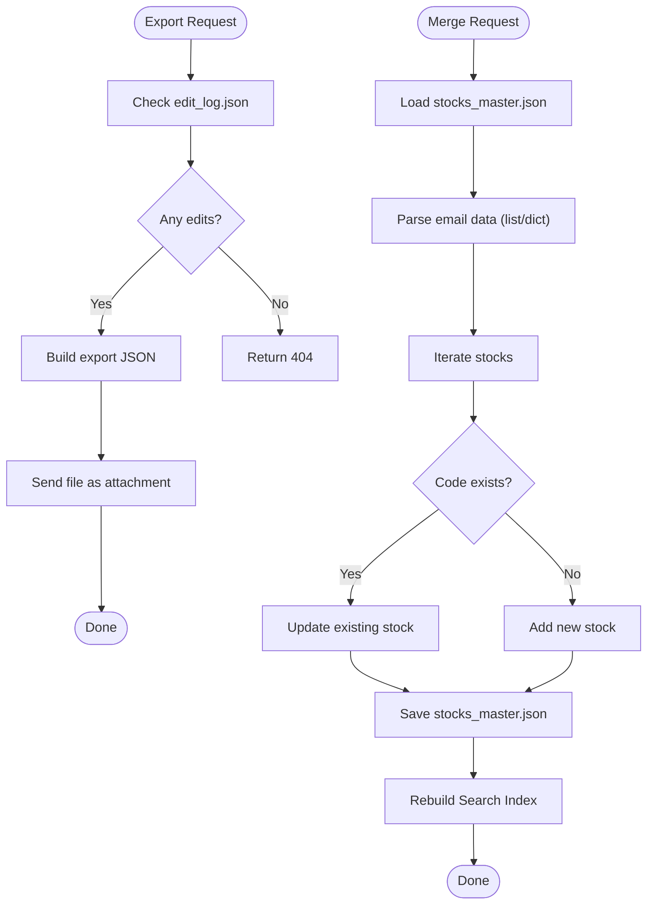
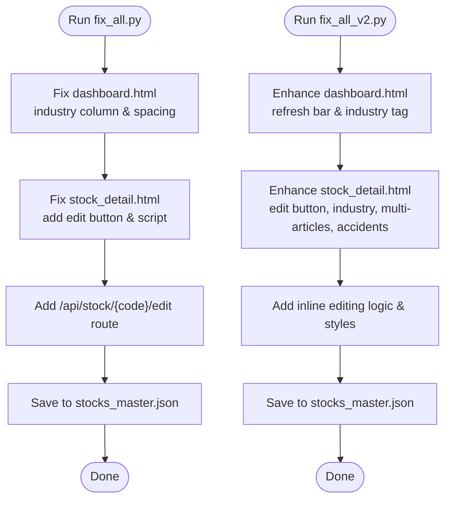
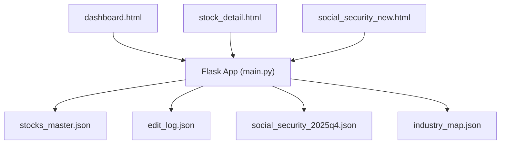

# Advanced Features

<cite>
**Referenced Files in This Document**
- [main.py](file://main.py)
- [INSIGHTS_EDIT_FEATURE.md](file://INSIGHTS_EDIT_FEATURE.md)
- [SYNC_FEATURE.md](file://SYNC_FEATURE.md)
- [fix_all.py](file://fix_all.py)
- [fix_all_v2.py](file://fix_all_v2.py)
- [merge_email_data.py](file://merge_email_data.py)
- [social_security_2025q4.json](file://data/master/social_security_2025q4.json)
- [industry_map.json](file://data/master/industry_map.json)
- [stock_detail.html](file://templates/stock_detail.html)
- [dashboard.html](file://templates/dashboard.html)
- [social_security_new.html](file://templates/social_security_new.html)
</cite>

## Table of Contents
1. [Introduction](#introduction)
2. [Project Structure](#project-structure)
3. [Core Components](#core-components)
4. [Architecture Overview](#architecture-overview)
5. [Detailed Component Analysis](#detailed-component-analysis)
6. [Dependency Analysis](#dependency-analysis)
7. [Performance Considerations](#performance-considerations)
8. [Troubleshooting Guide](#troubleshooting-guide)
9. [Conclusion](#conclusion)
10. [Appendices](#appendices)

## Introduction
This document details the advanced features of the Stock Research Platform, focusing on:
- Community editing system: collaborative enhancement, edit logging and tracking, data synchronization, and conflict resolution mechanisms
- Social Security Fund integration: holdings tracking, industry group analysis, and statistical reporting
- Data export capabilities, email synchronization features, and batch processing utilities
- Code quality and maintenance tools for bulk data corrections and consistency checks
- Extension points, plugin mechanisms, and customization options for advanced users

## Project Structure
The platform is a Flask-based web application with Jinja2 templates and JSON-based data storage. Key areas:
- Backend: Flask routes, data loading, search index rebuild, and API endpoints
- Frontend: HTML templates for dashboard, stock detail, social security report, and components
- Data: JSON files for stocks, industry mapping, and edit logs
- Utilities: scripts for fixing templates, merging email data, and batch processing

**Diagram sources**
- [main.py:138-273](file://main.py#L138-L273)
- [dashboard.html:527-663](file://templates/dashboard.html#L527-L663)
- [stock_detail.html:1-120](file://templates/stock_detail.html#L1-L120)
- [social_security_new.html:280-374](file://templates/social_security_new.html#L280-L374)
- [fix_all.py:1-218](file://fix_all.py#L1-L218)
- [fix_all_v2.py:1-421](file://fix_all_v2.py#L1-L421)
- [merge_email_data.py:1-88](file://merge_email_data.py#L1-L88)

**Section sources**
- [main.py:1-1226](file://main.py#L1-L1226)
- [dashboard.html:1-800](file://templates/dashboard.html#L1-L800)
- [stock_detail.html:1-800](file://templates/stock_detail.html#L1-L800)
- [social_security_new.html:1-388](file://templates/social_security_new.html#L1-L388)

## Core Components
- Community Editing System
  - Editable fields: core_business, products, industry_position, chain, partners
  - Article-level editable fields: accidents, insights, target_valuation
  - Edit logging and persistence via edit_log.json and stocks_master.json
  - Synchronization panel for export, copy, and clear operations
- Social Security Fund Integration
  - Loads social_security_2025q4.json and enriches stock detail pages
  - Provides industry group analysis and statistics on the dedicated page
- Data Export and Email Synchronization
  - Export edits to JSON, email draft generation, and clearing logs
  - Batch merge utility for email attachments into master data
- Maintenance Tools
  - fix_all.py and fix_all_v2.py automate template fixes and enhancements
  - merge_email_data.py merges external email data into master.json

**Section sources**
- [main.py:431-571](file://main.py#L431-L571)
- [main.py:612-685](file://main.py#L612-L685)
- [main.py:940-1185](file://main.py#L940-L1185)
- [social_security_2025q4.json:1-217](file://data/master/social_security_2025q4.json#L1-L217)
- [industry_map.json:1-800](file://data/master/industry_map.json#L1-L800)
- [fix_all.py:1-218](file://fix_all.py#L1-L218)
- [fix_all_v2.py:1-421](file://fix_all_v2.py#L1-L421)
- [merge_email_data.py:1-88](file://merge_email_data.py#L1-L88)

## Architecture Overview
The system combines server-side rendering with client-side interactivity:
- Flask routes serve templates and expose REST endpoints
- Templates render interactive UIs with JavaScript for editing and synchronization
- Data is persisted to JSON files and rebuilt search indices when needed

**Diagram sources**
- [main.py:280-336](file://main.py#L280-L336)
- [main.py:525-571](file://main.py#L525-L571)
- [main.py:612-619](file://main.py#L612-L619)
- [stock_detail.html:1-120](file://templates/stock_detail.html#L1-L120)

**Section sources**
- [main.py:138-336](file://main.py#L138-L336)
- [stock_detail.html:1-120](file://templates/stock_detail.html#L1-L120)

## Detailed Component Analysis

### Community Editing System
The editing system enables collaborative enhancement of stock profiles and article content:
- Editable Fields
  - Stock-level: core_business, products, industry_position, chain, partners
  - Article-level: accidents, insights, target_valuation (updates latest article)
- Edit Logging and Tracking
  - Each edit appends an entry to edit_log.json with timestamp, code, name, fields, and changes
  - Logs are truncated in UI previews to prevent large payloads
- Data Synchronization
  - Export edits to JSON file with full content
  - Copy formatted summary to clipboard for quick sharing
  - Clear logs while preserving saved data
- Conflict Resolution Mechanisms
  - Latest article updates overwrite article fields atomically
  - Master data writes occur after successful field updates
  - Search index rebuild ensures consistency post-edit

**Diagram sources**
- [main.py:431-478](file://main.py#L431-L478)
- [main.py:573-611](file://main.py#L573-L611)
- [main.py:796-804](file://main.py#L796-L804)

**Section sources**
- [INSIGHTS_EDIT_FEATURE.md:1-134](file://INSIGHTS_EDIT_FEATURE.md#L1-L134)
- [SYNC_FEATURE.md:1-164](file://SYNC_FEATURE.md#L1-L164)
- [main.py:431-571](file://main.py#L431-L571)
- [main.py:612-685](file://main.py#L612-L685)

### Social Security Fund Integration
The platform integrates Social Security Fund data for holdings tracking and industry analysis:
- Data Loading
  - Loads social_security_2025q4.json and maps holdings to stock profiles
  - Enriches stock detail pages with holding ratio, note, and industry group
- Industry Group Analysis
  - Groups stocks by industry_category and computes statistics
  - Displays total count, industry count, average ratio, and highest ratio stock
- Reporting Page
  - Renders social_security_new.html with grouped cards and database presence indicators

**Diagram sources**
- [main.py:220-273](file://main.py#L220-L273)
- [social_security_2025q4.json:1-217](file://data/master/social_security_2025q4.json#L1-L217)
- [social_security_new.html:310-373](file://templates/social_security_new.html#L310-L373)

**Section sources**
- [main.py:72-92](file://main.py#L72-L92)
- [main.py:220-273](file://main.py#L220-L273)
- [social_security_2025q4.json:1-217](file://data/master/social_security_2025q4.json#L1-L217)
- [social_security_new.html:1-388](file://templates/social_security_new.html#L1-L388)

### Data Export and Email Synchronization
The platform supports robust export and synchronization workflows:
- Export Edits
  - Download JSON with export_time, total_edits, and full edits array
- Email Draft Generation
  - Generates a formatted email draft file with current edits
- Clear Logs
  - Removes edit history while keeping saved data intact
- Batch Processing Utilities
  - merge_email_data.py merges email attachments into master.json with add/update logic

**Diagram sources**
- [main.py:621-638](file://main.py#L621-L638)
- [main.py:640-677](file://main.py#L640-L677)
- [main.py:679-685](file://main.py#L679-L685)
- [merge_email_data.py:9-76](file://merge_email_data.py#L9-L76)

**Section sources**
- [SYNC_FEATURE.md:1-164](file://SYNC_FEATURE.md#L1-L164)
- [main.py:612-685](file://main.py#L612-L685)
- [merge_email_data.py:1-88](file://merge_email_data.py#L1-L88)

### Code Quality and Maintenance Tools
Bulk correction and consistency checking are supported via dedicated scripts:
- fix_all.py
  - Fixes dashboard.html layout and industry column
  - Adds edit button and inline editing script to stock_detail.html
  - Adds /api/stock/{code}/edit endpoint and saves to master file
- fix_all_v2.py
  - Enhances dashboard with refresh bar and improved industry display
  - Updates stock_detail.html with edit button, industry display, multi-article loop, and accidents support
  - Adds comprehensive inline editing logic and styles

**Diagram sources**
- [fix_all.py:8-36](file://fix_all.py#L8-L36)
- [fix_all.py:38-182](file://fix_all.py#L38-L182)
- [fix_all.py:184-217](file://fix_all.py#L184-L217)
- [fix_all_v2.py:8-210](file://fix_all_v2.py#L8-L210)
- [fix_all_v2.py:212-412](file://fix_all_v2.py#L212-L412)

**Section sources**
- [fix_all.py:1-218](file://fix_all.py#L1-L218)
- [fix_all_v2.py:1-421](file://fix_all_v2.py#L1-L421)

### Extension Points and Customization Options
The platform offers several extension points for advanced users:
- Template Customization
  - Modify dashboard.html and stock_detail.html to add/remove fields or UI elements
  - Extend social_security_new.html for additional analytics or filters
- API Extensions
  - Add new endpoints under /api/ for specialized workflows
  - Integrate external data sources and enrichment services
- Data Model Extensions
  - Extend stocks_master.json schema to include new fields
  - Update industry mapping and concept tagging logic
- Plugin Mechanisms
  - Use Flask blueprints for modular feature sets
  - Implement middleware for cross-cutting concerns (logging, auth)
- Batch Processing
  - Leverage merge_email_data.py as a template for other batch ingestion tasks
  - Automate periodic updates via cron jobs or scheduled tasks

**Section sources**
- [dashboard.html:527-663](file://templates/dashboard.html#L527-L663)
- [stock_detail.html:1-120](file://templates/stock_detail.html#L1-L120)
- [social_security_new.html:310-373](file://templates/social_security_new.html#L310-L373)
- [main.py:940-1185](file://main.py#L940-L1185)

## Dependency Analysis
The system exhibits clear separation of concerns with minimal coupling:
- Flask routes depend on data files and templates
- Templates depend on backend-provided context variables
- Utilities operate independently and modify data files

**Diagram sources**
- [main.py:93-136](file://main.py#L93-L136)
- [dashboard.html:527-663](file://templates/dashboard.html#L527-L663)
- [stock_detail.html:1-120](file://templates/stock_detail.html#L1-L120)
- [social_security_new.html:280-374](file://templates/social_security_new.html#L280-L374)

**Section sources**
- [main.py:93-136](file://main.py#L93-L136)
- [main.py:506-512](file://main.py#L506-L512)

## Performance Considerations
- Data Loading
  - JSON parsing and search index rebuild are CPU-intensive; cache where feasible
  - Use pagination and lazy loading for large datasets
- Network Calls
  - External API calls (e.g., market data) should be rate-limited and cached
- Template Rendering
  - Minimize heavy computations in templates; precompute where possible
- Storage
  - Monitor file sizes; consider compression for large JSON files
  - Regular backups of edit_log.json and stocks_master.json

## Troubleshooting Guide
- Edit Logging Failures
  - Verify edit_log.json write permissions and disk space
  - Check save_edit_log() and save_stocks_to_file() error handling
- Data Persistence Issues
  - Confirm stocks_master.json availability (gz vs json)
  - Validate JSON structure and encoding
- Search Index Problems
  - Ensure build_index.py executes successfully after edits
  - Check for missing dependencies or timeouts
- Email Merge Errors
  - Validate email data format (list or dict with stocks)
  - Confirm master file path and permissions

**Section sources**
- [main.py:573-611](file://main.py#L573-L611)
- [main.py:796-804](file://main.py#L796-L804)
- [merge_email_data.py:67-76](file://merge_email_data.py#L67-L76)

## Conclusion
The Stock Research Platform provides a robust foundation for collaborative research with strong editing, synchronization, and integration capabilities. Its modular architecture and utility scripts enable efficient maintenance and extension for advanced use cases.

## Appendices
- API Reference
  - GET /api/sync: Retrieve edit log entries
  - GET /api/sync/export: Download edit log as JSON
  - POST /api/sync/clear: Clear edit log
  - POST /api/sync/email: Generate email draft
  - PUT /api/stock/{code}/insights: Update insights
  - PUT /api/stock/{code}/accident: Update accident
  - POST /api/stock/{code}/edit: Update stock fields
  - POST /api/article/import: Import and parse article
  - POST /api/article/merge-to-master: Merge imported data
  - GET /api/raw-material/list: List raw material files
- Data Files
  - data/master/stocks_master.json: Stock profiles and articles
  - data/edit_log.json: Edit history
  - data/master/social_security_2025q4.json: Social Security Fund holdings
  - data/master/industry_map.json: Industry categorization