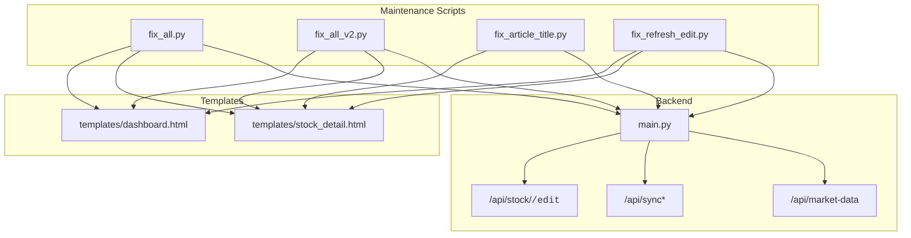
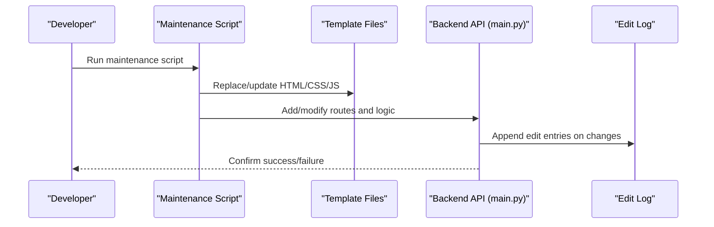
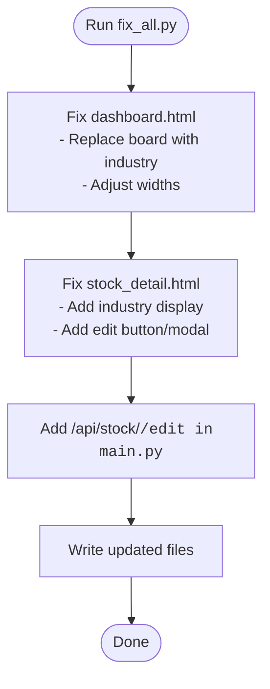
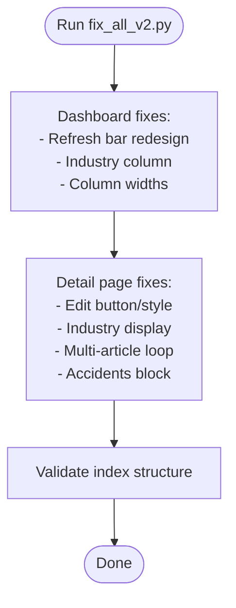
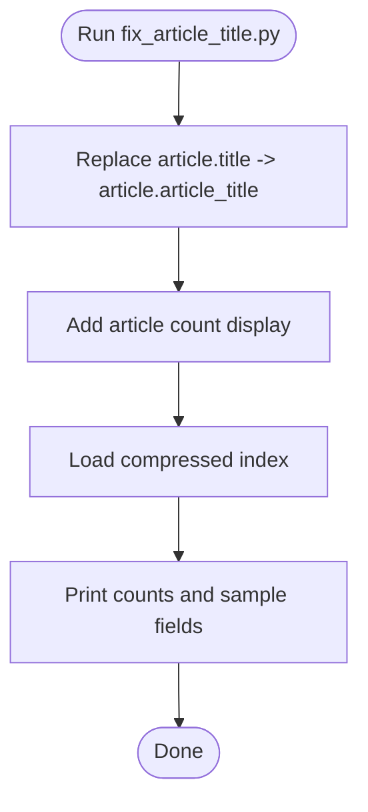
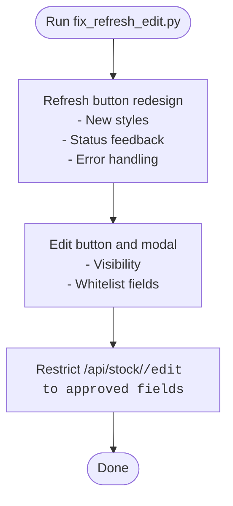
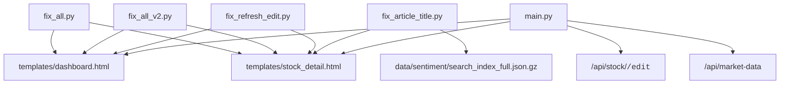

# Code Quality and Maintenance Tools

<cite>
**Referenced Files in This Document**
- [fix_all.py](file://fix_all.py)
- [fix_all_v2.py](file://fix_all_v2.py)
- [fix_article_title.py](file://fix_article_title.py)
- [fix_refresh_edit.py](file://fix_refresh_edit.py)
- [main.py](file://main.py)
- [templates/dashboard.html](file://templates/dashboard.html)
- [templates/stock_detail.html](file://templates/stock_detail.html)
</cite>

## Table of Contents
1. [Introduction](#introduction)
2. [Project Structure](#project-structure)
3. [Core Components](#core-components)
4. [Architecture Overview](#architecture-overview)
5. [Detailed Component Analysis](#detailed-component-analysis)
6. [Dependency Analysis](#dependency-analysis)
7. [Performance Considerations](#performance-considerations)
8. [Troubleshooting Guide](#troubleshooting-guide)
9. [Conclusion](#conclusion)
10. [Appendices](#appendices)

## Introduction
This document describes the code quality and maintenance automation tools used to keep the stock research project’s frontend templates and backend API consistent and correct. It covers:
- fix_all.py: a consolidation script that applies three targeted fixes across templates and the backend API.
- fix_all_v2.py: an expanded maintenance script that modernizes the dashboard layout, standardizes article rendering, and refines editing capabilities.
- fix_article_title.py: a focused tool to normalize article title field usage and validate index data structure.
- fix_refresh_edit.py: a maintenance script that refreshes the dashboard’s market refresh UX and tightens editing permissions.

It also documents the automated correction workflows, validation rules, rollback procedures, scheduling, and integration with the deployment pipeline. Practical usage examples, troubleshooting, and best practices for safe bulk operations are included.

## Project Structure
The maintenance tools operate on:
- Frontend templates under templates/: dashboard.html and stock_detail.html.
- Backend API server in main.py, which serves the UI and exposes endpoints for edits and market data.
- Index data under data/sentiment/search_index_full.json.gz for validation and article metadata.

**Diagram sources**
- [fix_all.py:1-218](file://fix_all.py#L1-L218)
- [fix_all_v2.py:1-421](file://fix_all_v2.py#L1-L421)
- [fix_article_title.py:1-89](file://fix_article_title.py#L1-L89)
- [fix_refresh_edit.py:1-375](file://fix_refresh_edit.py#L1-L375)
- [main.py:430-478](file://main.py#L430-L478)
- [main.py:512-579](file://main.py#L512-L579)
- [main.py:696-769](file://main.py#L696-L769)

**Section sources**
- [fix_all.py:1-218](file://fix_all.py#L1-L218)
- [fix_all_v2.py:1-421](file://fix_all_v2.py#L1-L421)
- [fix_article_title.py:1-89](file://fix_article_title.py#L1-L89)
- [fix_refresh_edit.py:1-375](file://fix_refresh_edit.py#L1-L375)
- [main.py:430-478](file://main.py#L430-L478)
- [main.py:512-579](file://main.py#L512-L579)
- [main.py:696-769](file://main.py#L696-L769)

## Core Components
- fix_all.py
  - Purpose: Apply three immediate fixes: dashboard column layout and board-to-industry substitution, stock detail hero area and edit button addition, and backend edit endpoint creation.
  - Validation: Updates HTML templates and writes corrected content; adds a new API route in main.py.
  - Rollback: Reverts by restoring original files prior to running the script.
- fix_all_v2.py
  - Purpose: Redesign dashboard refresh UX, replace “board” with “industry,” improve column widths, enable multi-article rendering, add “accidents” display, and refine edit UI and permissions.
  - Validation: Checks for presence of edit button/style/article loop/accidents and conditionally injects missing markup; validates index structure.
  - Rollback: Reverts by restoring original files prior to running the script.
- fix_article_title.py
  - Purpose: Normalize article title field references from article.title to article.article_title, add article count display, and validate index structure.
  - Validation: Reads compressed index file, prints counts and sample fields for verification.
  - Rollback: Reverts by restoring original templates prior to running the script.
- fix_refresh_edit.py
  - Purpose: Modernize dashboard refresh button styling and behavior, add error handling, ensure edit button visibility, and restrict editing to approved fields.
  - Validation: Adds missing edit UI elements and updates backend edit logic to whitelist editable fields.
  - Rollback: Reverts by restoring original files prior to running the script.

**Section sources**
- [fix_all.py:1-218](file://fix_all.py#L1-L218)
- [fix_all_v2.py:1-421](file://fix_all_v2.py#L1-L421)
- [fix_article_title.py:1-89](file://fix_article_title.py#L1-L89)
- [fix_refresh_edit.py:1-375](file://fix_refresh_edit.py#L1-L375)

## Architecture Overview
The maintenance tools modify frontend templates and backend routes to enforce consistent data and UI behavior. The backend maintains an edit log and persists changes to disk, while the frontend templates consume normalized data structures.

**Diagram sources**
- [fix_all.py:184-217](file://fix_all.py#L184-L217)
- [fix_all_v2.py:212-412](file://fix_all_v2.py#L212-L412)
- [fix_refresh_edit.py:6-375](file://fix_refresh_edit.py#L6-L375)
- [main.py:430-478](file://main.py#L430-L478)
- [main.py:512-579](file://main.py#L512-L579)

## Detailed Component Analysis

### fix_all.py
- Template fixes
  - dashboard.html: replaces board column with industry column, adjusts column widths, and updates JavaScript to reflect new structure.
  - stock_detail.html: adds industry display, edit button, and inline edit modal/script/style.
- Backend API
  - Adds POST /api/stock/<code>/edit endpoint to handle edits for selected fields.
- Validation rules
  - String replacement of board/industry references.
  - Conditional injection of edit UI only if missing.
- Rollback
  - Restore original files before running the script.

**Diagram sources**
- [fix_all.py:8-36](file://fix_all.py#L8-L36)
- [fix_all.py:38-182](file://fix_all.py#L38-L182)
- [fix_all.py:184-217](file://fix_all.py#L184-L217)

**Section sources**
- [fix_all.py:8-36](file://fix_all.py#L8-L36)
- [fix_all.py:38-182](file://fix_all.py#L38-L182)
- [fix_all.py:184-217](file://fix_all.py#L184-L217)

### fix_all_v2.py
- Dashboard improvements
  - Moves refresh button to top bar, redesigns styles, and removes duplicate refresh button in header.
  - Replaces “Board” column with “Industry,” improves column widths, and updates JS status feedback.
- Stock detail enhancements
  - Ensures edit button exists, adds industry display, enables multi-article loop, and inserts “accidents” block.
  - Adds inline edit modal and saves via /api/stock/<code>/edit.
- Validation rules
  - Uses presence checks to avoid duplication.
  - Validates index structure for article arrays and fields.
- Rollback
  - Restore original files before running the script.

**Diagram sources**
- [fix_all_v2.py:8-210](file://fix_all_v2.py#L8-L210)
- [fix_all_v2.py:212-412](file://fix_all_v2.py#L212-L412)

**Section sources**
- [fix_all_v2.py:8-210](file://fix_all_v2.py#L8-L210)
- [fix_all_v2.py:212-412](file://fix_all_v2.py#L212-L412)

### fix_article_title.py
- Normalizes article title field usage from article.title to article.article_title across templates.
- Adds article count display near the articles section.
- Validates index structure by loading the compressed search index and printing counts and sample fields for verification.
- Rollback
  - Restore original files before running the script.

**Diagram sources**
- [fix_article_title.py:6-44](file://fix_article_title.py#L6-L44)
- [fix_article_title.py:46-89](file://fix_article_title.py#L46-L89)

**Section sources**
- [fix_article_title.py:6-44](file://fix_article_title.py#L6-L44)
- [fix_article_title.py:46-89](file://fix_article_title.py#L46-L89)

### fix_refresh_edit.py
- Dashboard refresh UX
  - Updates refresh button styles and behavior, adds status feedback, and improves error handling.
- Edit UI and permissions
  - Ensures edit button is visible, updates edit modal to whitelist only approved fields, and modifies backend edit endpoint to restrict editable fields.
- Rollback
  - Restore original files before running the script.

**Diagram sources**
- [fix_refresh_edit.py:6-226](file://fix_refresh_edit.py#L6-L226)
- [fix_refresh_edit.py:228-368](file://fix_refresh_edit.py#L228-L368)

**Section sources**
- [fix_refresh_edit.py:6-226](file://fix_refresh_edit.py#L6-L226)
- [fix_refresh_edit.py:228-368](file://fix_refresh_edit.py#L228-L368)

## Dependency Analysis
- Template-to-script dependencies
  - fix_all.py, fix_all_v2.py, and fix_refresh_edit.py all read/write templates/dashboard.html and templates/stock_detail.html.
- Backend-to-template dependencies
  - main.py renders templates and exposes endpoints that templates call (e.g., /api/stock/<code>/edit, /api/market-data).
- Data dependencies
  - fix_article_title.py reads data/sentiment/search_index_full.json.gz to validate index structure.

**Diagram sources**
- [fix_all.py:11-34](file://fix_all.py#L11-L34)
- [fix_all_v2.py:11-208](file://fix_all_v2.py#L11-L208)
- [fix_refresh_edit.py:9-224](file://fix_refresh_edit.py#L9-L224)
- [fix_article_title.py:8-42](file://fix_article_title.py#L8-L42)
- [main.py:430-478](file://main.py#L430-L478)
- [main.py:696-769](file://main.py#L696-L769)

**Section sources**
- [fix_all.py:11-34](file://fix_all.py#L11-L34)
- [fix_all_v2.py:11-208](file://fix_all_v2.py#L11-L208)
- [fix_refresh_edit.py:9-224](file://fix_refresh_edit.py#L9-L224)
- [fix_article_title.py:8-42](file://fix_article_title.py#L8-L42)
- [main.py:430-478](file://main.py#L430-L478)
- [main.py:696-769](file://main.py#L696-L769)

## Performance Considerations
- Template parsing and replacement
  - The scripts perform string replacements; ensure templates are well-formed to avoid partial matches.
- Backend edit logging and persistence
  - Each edit appends to an in-memory log and writes to disk; frequent edits may increase I/O overhead.
- Market data fetching
  - Dashboard refresh calls /api/market-data; rate-limit or cache appropriately to avoid external API pressure.

[No sources needed since this section provides general guidance]

## Troubleshooting Guide
Common issues and resolutions:
- Templates not updating
  - Verify the scripts are executed from the repository root so relative paths resolve correctly.
  - Ensure write permissions for templates/ and main.py.
- Missing edit button or modal
  - fix_all_v2.py and fix_refresh_edit.py add/edit UI conditionally; confirm the templates do not already contain conflicting markup.
- Edit endpoint errors
  - Confirm /api/stock/<code>/edit exists and accepts only whitelisted fields.
- Index validation failures
  - fix_article_title.py requires a valid compressed index; check file integrity and encoding.

Rollback procedures:
- Restore original files from version control or backups before re-running scripts.
- For main.py, revert the added route and logic to the previous state.

**Section sources**
- [fix_all.py:184-217](file://fix_all.py#L184-L217)
- [fix_all_v2.py:212-412](file://fix_all_v2.py#L212-L412)
- [fix_refresh_edit.py:228-368](file://fix_refresh_edit.py#L228-L368)
- [fix_article_title.py:46-89](file://fix_article_title.py#L46-L89)

## Conclusion
These maintenance tools provide a robust, repeatable way to standardize templates, enforce consistent data fields, and tighten editing permissions. By validating index structures and maintaining an edit log, they support safe, auditable bulk operations. Integrate them into your deployment pipeline to automate quality checks and reduce manual drift.

[No sources needed since this section summarizes without analyzing specific files]

## Appendices

### Automated Correction Workflows
- fix_all.py workflow
  - Read dashboard.html and stock_detail.html.
  - Apply board-to-industry substitutions and column width adjustments.
  - Inject edit button and modal into stock_detail.html.
  - Add /api/stock/<code>/edit route in main.py.
- fix_all_v2.py workflow
  - Redesign dashboard refresh bar and remove duplicate header button.
  - Replace “Board” with “Industry” and adjust widths.
  - Enable multi-article loop and insert “accidents” block.
  - Add inline edit modal and save via /api/stock/<code>/edit.
- fix_article_title.py workflow
  - Normalize article.title to article.article_title.
  - Add article count display.
  - Validate index structure by loading compressed index and printing counts.
- fix_refresh_edit.py workflow
  - Update refresh button styles and status feedback.
  - Ensure edit button visibility and restrict editing to approved fields.
  - Modify backend edit endpoint to whitelist editable fields.

**Section sources**
- [fix_all.py:8-36](file://fix_all.py#L8-L36)
- [fix_all.py:38-182](file://fix_all.py#L38-L182)
- [fix_all.py:184-217](file://fix_all.py#L184-L217)
- [fix_all_v2.py:8-210](file://fix_all_v2.py#L8-L210)
- [fix_all_v2.py:212-412](file://fix_all_v2.py#L212-L412)
- [fix_article_title.py:6-44](file://fix_article_title.py#L6-L44)
- [fix_article_title.py:46-89](file://fix_article_title.py#L46-L89)
- [fix_refresh_edit.py:6-226](file://fix_refresh_edit.py#L6-L226)
- [fix_refresh_edit.py:228-368](file://fix_refresh_edit.py#L228-L368)

### Validation Rules Applied by Each Tool
- fix_all.py
  - String replacement for board/industry and column width adjustments.
  - Conditional injection of edit UI elements.
- fix_all_v2.py
  - Presence checks for edit button/style/article loop/accidents.
  - Index validation for article arrays and fields.
- fix_article_title.py
  - Field normalization from article.title to article.article_title.
  - Article count display and index structure verification.
- fix_refresh_edit.py
  - Refresh button style updates and status feedback.
  - Edit permission whitelisting and backend route restrictions.

**Section sources**
- [fix_all.py:8-36](file://fix_all.py#L8-L36)
- [fix_all_v2.py:212-412](file://fix_all_v2.py#L212-L412)
- [fix_article_title.py:6-44](file://fix_article_title.py#L6-L44)
- [fix_article_title.py:46-89](file://fix_article_title.py#L46-L89)
- [fix_refresh_edit.py:6-226](file://fix_refresh_edit.py#L6-L226)

### Rollback Procedures for Failed Operations
- Backup originals before running scripts.
- If a script fails mid-execution, restore templates and main.py from backups.
- For main.py, revert added routes and logic to the previous state.
- Re-run scripts after resolving underlying issues (permissions, file integrity).

**Section sources**
- [fix_all.py:184-217](file://fix_all.py#L184-L217)
- [fix_all_v2.py:212-412](file://fix_all_v2.py#L212-L412)
- [fix_refresh_edit.py:228-368](file://fix_refresh_edit.py#L228-L368)
- [fix_article_title.py:46-89](file://fix_article_title.py#L46-L89)

### Maintenance Scheduling and Deployment Pipeline Integration
- Schedule runs during off-peak hours to minimize impact on live traffic.
- Integrate scripts into CI/CD steps:
  - Pre-deploy: run fix_all_v2.py and fix_article_title.py to standardize templates and validate index.
  - Post-deploy: run fix_refresh_edit.py to finalize UX and permissions.
- Gate deployments on successful validation and index checks.
- Keep a changelog of applied fixes and include rollback instructions in deployment reports.

[No sources needed since this section provides general guidance]

### Usage Examples for Common Maintenance Scenarios
- Standardize article titles across the entire database
  - Run fix_article_title.py to normalize field names and validate index structure.
- Refresh dashboard UX and correct timestamp inconsistencies
  - Run fix_refresh_edit.py to update refresh button styles, add error handling, and ensure edit permissions.
- Bulk apply UI and API fixes
  - Run fix_all.py to apply board-to-industry substitutions, add edit buttons, and create the edit endpoint.
- Expand maintenance coverage with multi-article and industry columns
  - Run fix_all_v2.py to redesign dashboard, enable multi-article loops, and add “accidents” display.

**Section sources**
- [fix_article_title.py:6-44](file://fix_article_title.py#L6-L44)
- [fix_refresh_edit.py:6-226](file://fix_refresh_edit.py#L6-L226)
- [fix_all.py:8-36](file://fix_all.py#L8-L36)
- [fix_all_v2.py:8-210](file://fix_all_v2.py#L8-L210)

### Best Practices for Safe Operation
- Always backup templates and main.py before running scripts.
- Test scripts on a staging environment mirroring production data.
- Validate index integrity after running fix_article_title.py.
- Limit concurrent edits and monitor edit log for anomalies.
- Use version control diffs to track changes and facilitate rollbacks.

**Section sources**
- [fix_all.py:184-217](file://fix_all.py#L184-L217)
- [fix_all_v2.py:212-412](file://fix_all_v2.py#L212-L412)
- [fix_refresh_edit.py:228-368](file://fix_refresh_edit.py#L228-L368)
- [fix_article_title.py:46-89](file://fix_article_title.py#L46-L89)