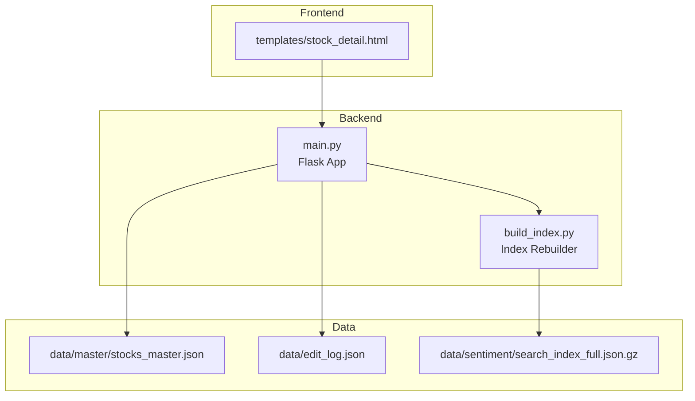
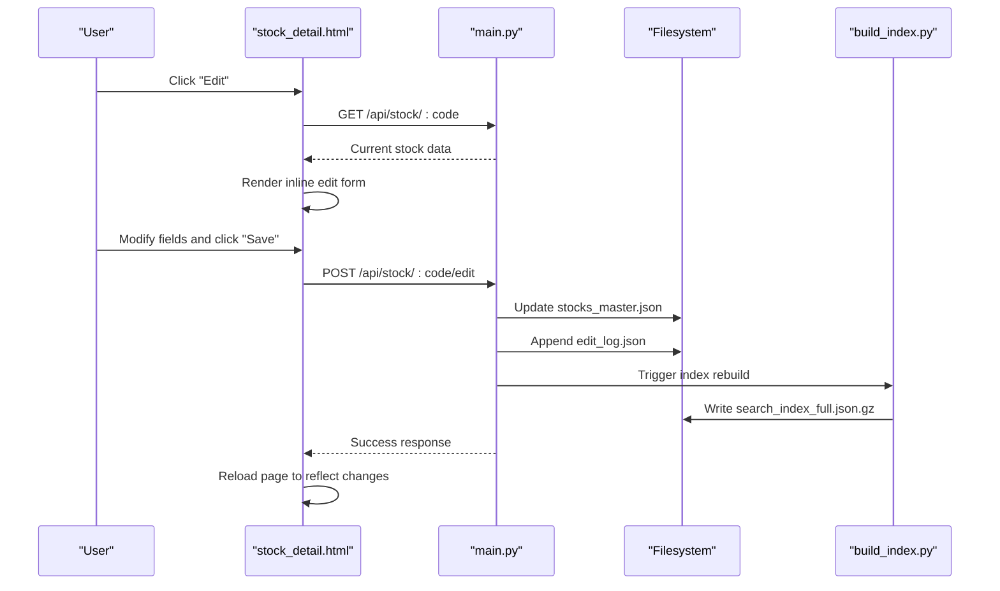
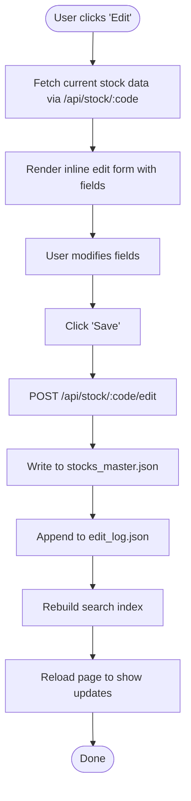
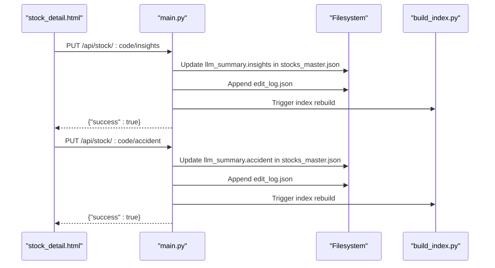
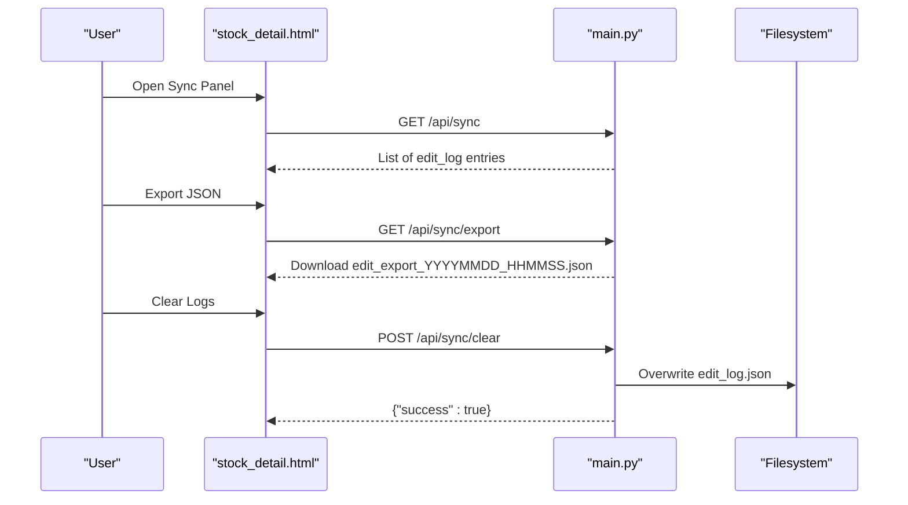
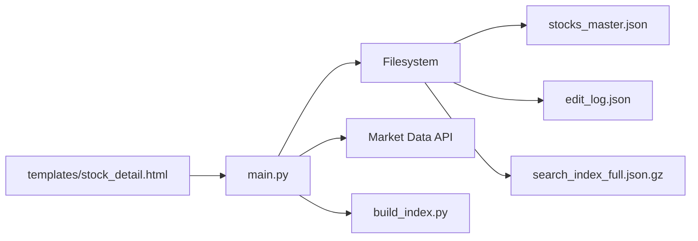

# Collaboration Workflow

<cite>
**Referenced Files in This Document**
- [README.md](file://README.md)
- [main.py](file://main.py)
- [templates/stock_detail.html](file://templates/stock_detail.html)
- [INLINE_EDIT_PLAN.md](file://INLINE_EDIT_PLAN.md)
- [INSIGHTS_EDIT_FEATURE.md](file://INSIGHTS_EDIT_FEATURE.md)
- [SYNC_FEATURE.md](file://SYNC_FEATURE.md)
- [build_index.py](file://build_index.py)
- [fix_refresh_edit.py](file://fix_refresh_edit.py)
- [requirements.txt](file://requirements.txt)
</cite>

## Table of Contents
1. [Introduction](#introduction)
2. [Project Structure](#project-structure)
3. [Core Components](#core-components)
4. [Architecture Overview](#architecture-overview)
5. [Detailed Component Analysis](#detailed-component-analysis)
6. [Dependency Analysis](#dependency-analysis)
7. [Performance Considerations](#performance-considerations)
8. [Troubleshooting Guide](#troubleshooting-guide)
9. [Conclusion](#conclusion)
10. [Appendices](#appendices)

## Introduction
This document describes the community collaboration workflow for editing stock research data. It covers the complete lifecycle from initiation to completion, including user permissions, conflict resolution strategies, approval processes, real-time collaboration features, concurrent editing support, best practices for team coordination, version control of edits, and maintaining data consistency across multiple editors. It also documents the integration between the editing interface and collaborative features, provides workflow examples, common scenarios, and troubleshooting guidance.

## Project Structure
The collaboration workflow spans both backend and frontend components:
- Backend: Flask application exposing REST APIs for editing, synchronization, and index rebuilding.
- Frontend: Jinja2 templates with embedded JavaScript enabling inline editing and real-time updates.
- Data: JSON master dataset, sentiment index, and edit logs.

**Diagram sources**
- [main.py:138-336](file://main.py#L138-L336)
- [templates/stock_detail.html:1306-1458](file://templates/stock_detail.html#L1306-L1458)
- [build_index.py:77-234](file://build_index.py#L77-L234)

**Section sources**
- [README.md:1-126](file://README.md#L1-L126)
- [requirements.txt:1-5](file://requirements.txt#L1-L5)

## Core Components
- Editing APIs:
  - Inline edit endpoint for multiple fields.
  - Field-specific PUT endpoints for accident and insights.
- Synchronization panel:
  - Retrieve, export, and clear edit logs.
- Real-time features:
  - Market data fetching and similarity recommendations.
- Index management:
  - Automatic rebuild of the search index after edits.

Key capabilities:
- Single-page inline editing without modal popups.
- Edit logging for auditability.
- Team-wide visibility via shared index and logs.

**Section sources**
- [main.py:431-571](file://main.py#L431-L571)
- [main.py:612-685](file://main.py#L612-L685)
- [templates/stock_detail.html:1306-1458](file://templates/stock_detail.html#L1306-L1458)

## Architecture Overview
The collaboration workflow integrates the editing UI with backend APIs and data persistence. The frontend triggers edits, the backend validates and persists changes, logs actions, and rebuilds the index for team-wide synchronization.

**Diagram sources**
- [templates/stock_detail.html:1306-1458](file://templates/stock_detail.html#L1306-L1458)
- [main.py:431-571](file://main.py#L431-L571)
- [build_index.py:77-234](file://build_index.py#L77-L234)

## Detailed Component Analysis

### Inline Editing Interface
The inline editing experience allows users to switch into edit mode, modify fields directly on the stock detail page, and save changes in one action. The UI toggles between display and edit modes and supports batch saving.

**Diagram sources**
- [templates/stock_detail.html:1306-1458](file://templates/stock_detail.html#L1306-L1458)
- [main.py:431-571](file://main.py#L431-L571)

**Section sources**
- [templates/stock_detail.html:1306-1458](file://templates/stock_detail.html#L1306-L1458)
- [INLINE_EDIT_PLAN.md:1-168](file://INLINE_EDIT_PLAN.md#L1-L168)

### Field-Level Editing APIs
Field-specific endpoints enable targeted updates for accident and insights, which are applied to the latest article record. These endpoints also log edits and trigger index rebuilds.

**Diagram sources**
- [main.py:549-571](file://main.py#L549-L571)
- [main.py:525-547](file://main.py#L525-L547)
- [build_index.py:77-234](file://build_index.py#L77-L234)

**Section sources**
- [INSIGHTS_EDIT_FEATURE.md:88-129](file://INSIGHTS_EDIT_FEATURE.md#L88-L129)
- [main.py:525-571](file://main.py#L525-L571)

### Synchronization Panel
The synchronization panel provides centralized visibility into recent edits, supports exporting logs, and allows clearing logs without affecting persisted data.

**Diagram sources**
- [SYNC_FEATURE.md:88-160](file://SYNC_FEATURE.md#L88-L160)
- [main.py:612-685](file://main.py#L612-L685)

**Section sources**
- [SYNC_FEATURE.md:1-164](file://SYNC_FEATURE.md#L1-L164)
- [main.py:612-685](file://main.py#L612-L685)

### Permissions and Access Control
- Current state: No authentication or authorization enforced; anyone can edit.
- Recommended future enhancements: Add user authentication, roles, and approval workflows.

**Section sources**
- [INSIGHTS_EDIT_FEATURE.md:105-112](file://INSIGHTS_EDIT_FEATURE.md#L105-L112)

### Conflict Resolution Strategies
- Single-writer model: Edits are applied atomically per request; no concurrent write conflicts occur.
- Idempotent writes: Latest article fields are overwritten; no partial merges are performed.
- Manual verification: After edits, team members should review changes before wider consumption.

**Section sources**
- [main.py:431-571](file://main.py#L431-L571)
- [main.py:770-804](file://main.py#L770-L804)

### Approval Processes
- Not implemented yet; recommended future steps include:
  - Review queue for pending edits.
  - Approve/deny actions with comments.
  - Audit trail integration with approvals.

**Section sources**
- [INSIGHTS_EDIT_FEATURE.md:114-122](file://INSIGHTS_EDIT_FEATURE.md#L114-L122)

### Real-Time Collaboration Features
- Real-time market data: Fetches current prices and displays changes.
- Similarity recommendations: Computes and displays related stocks based on concepts.
- Auto-refresh: After successful save, the page reloads to reflect updated data.

Note: True real-time collaboration (live co-editing) is not implemented; changes are saved as discrete edits.

**Section sources**
- [templates/stock_detail.html:1229-1304](file://templates/stock_detail.html#L1229-L1304)
- [main.py:696-804](file://main.py#L696-L804)

### Concurrent Editing Support
- No built-in optimistic concurrency control or operational transforms.
- Recommendation: Introduce lightweight conflict detection (e.g., last-modified timestamps) and manual merge prompts.

**Section sources**
- [main.py:431-571](file://main.py#L431-L571)

### Version Control of Edits
- Edit logs capture who changed what and when.
- Future enhancement: Add structured diff and revert capability.

**Section sources**
- [SYNC_FEATURE.md:99-140](file://SYNC_FEATURE.md#L99-L140)
- [main.py:573-580](file://main.py#L573-L580)

### Maintaining Data Consistency
- Atomic updates per request reduce inconsistency risk.
- Index rebuild ensures team-wide visibility of changes.
- Best practice: Batch edits and save together to minimize intermediate states.

**Section sources**
- [main.py:431-571](file://main.py#L431-L571)
- [build_index.py:77-234](file://build_index.py#L77-L234)

### Integration Between Editing Interface and Collaborative Features
- Inline editing triggers backend APIs that persist to master data and append logs.
- Index rebuild propagates changes to the shared search index for all users.
- Synchronization panel provides a team audit and backup mechanism.

**Section sources**
- [templates/stock_detail.html:1306-1458](file://templates/stock_detail.html#L1306-L1458)
- [main.py:431-571](file://main.py#L431-L571)
- [build_index.py:77-234](file://build_index.py#L77-L234)

## Dependency Analysis
The collaboration workflow depends on:
- Flask for routing and serving endpoints.
- Filesystem for master data, logs, and index storage.
- External market data service for real-time prices.

**Diagram sources**
- [main.py:138-336](file://main.py#L138-L336)
- [templates/stock_detail.html:1306-1458](file://templates/stock_detail.html#L1306-L1458)
- [build_index.py:77-234](file://build_index.py#L77-L234)

**Section sources**
- [requirements.txt:1-5](file://requirements.txt#L1-L5)
- [main.py:696-768](file://main.py#L696-L768)

## Performance Considerations
- Index rebuild cost: Rebuilding the search index after each edit can be expensive for large datasets; consider incremental updates or scheduled rebuilds.
- Network latency: Market data fetches depend on external service availability and response times.
- UI responsiveness: Batch edits and single-page reloads keep the UI snappy.

[No sources needed since this section provides general guidance]

## Troubleshooting Guide
Common issues and resolutions:
- Save fails:
  - Verify network connectivity and backend health.
  - Check edit logs for errors and retry.
- Index not updating:
  - Confirm rebuild process completes successfully.
  - Manually trigger index rebuild if needed.
- Edit log cleared unexpectedly:
  - Use export to back up logs before clearing.
- Permission concerns:
  - Enable authentication and role-based access control.

**Section sources**
- [main.py:573-580](file://main.py#L573-L580)
- [SYNC_FEATURE.md:133-140](file://SYNC_FEATURE.md#L133-L140)
- [INSIGHTS_EDIT_FEATURE.md:105-112](file://INSIGHTS_EDIT_FEATURE.md#L105-L112)

## Conclusion
The current collaboration workflow emphasizes simplicity and transparency: inline editing, atomic saves, comprehensive logging, and automatic index rebuilding. While real-time collaborative editing is not implemented, the system provides strong auditability and team-wide synchronization. Future enhancements should focus on permission controls, approval workflows, and optional real-time collaboration features.

[No sources needed since this section summarizes without analyzing specific files]

## Appendices

### Workflow Examples
- Example 1: Edit multiple fields for a single stock
  - Open stock detail, click “Edit”, modify fields, click “Save”.
  - Observe page reload and updated display.
- Example 2: Update insights for the latest article
  - Use the insights endpoint to apply changes to the latest article.
- Example 3: Audit recent edits
  - Open the sync panel, review logs, export for backup.

**Section sources**
- [templates/stock_detail.html:1306-1458](file://templates/stock_detail.html#L1306-L1458)
- [main.py:549-571](file://main.py#L549-L571)
- [SYNC_FEATURE.md:114-130](file://SYNC_FEATURE.md#L114-L130)

### Best Practices for Team Coordination
- Batch edits to minimize intermediate states.
- Use the sync panel to coordinate and share updates.
- Manually verify critical edits before wider consumption.
- Back up edit logs regularly.

**Section sources**
- [SYNC_FEATURE.md:114-130](file://SYNC_FEATURE.md#L114-L130)
- [INSIGHTS_EDIT_FEATURE.md:105-112](file://INSIGHTS_EDIT_FEATURE.md#L105-L112)

### Relationship Between Individual Edits and Team-Wide Synchronization
- Individual edits are persisted to master data and logged.
- The index is rebuilt to propagate changes to all users.
- The sync panel provides a centralized view of recent activity.

**Section sources**
- [main.py:431-571](file://main.py#L431-L571)
- [build_index.py:77-234](file://build_index.py#L77-L234)
- [SYNC_FEATURE.md:99-111](file://SYNC_FEATURE.md#L99-L111)