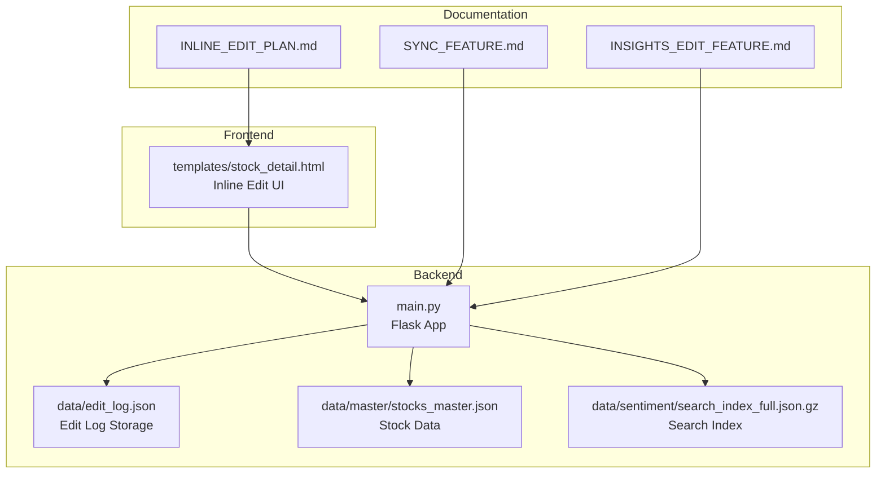
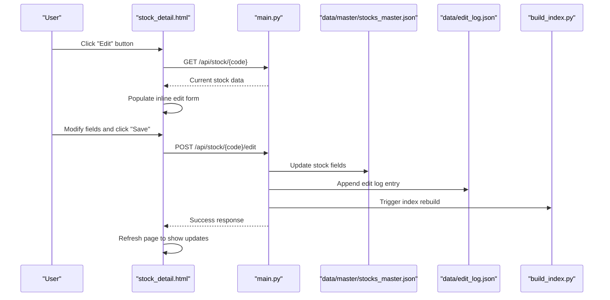
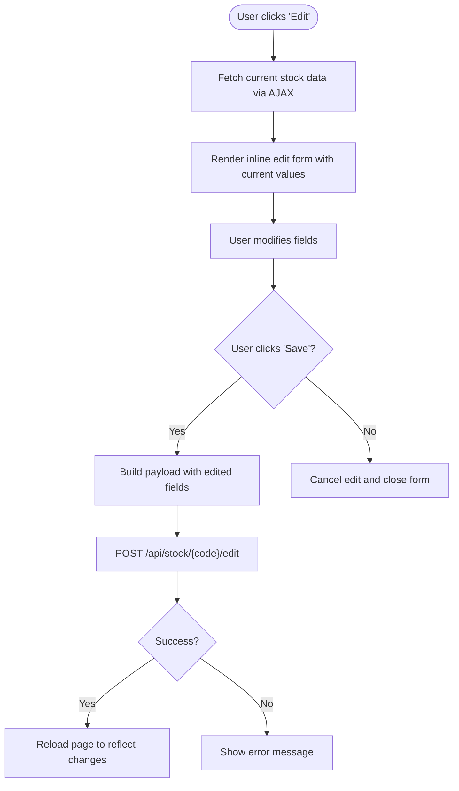
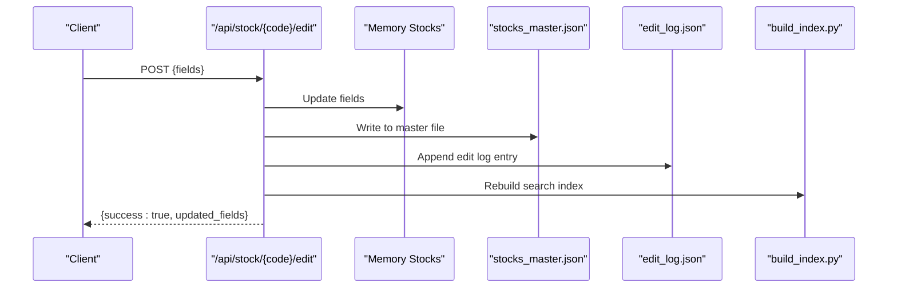
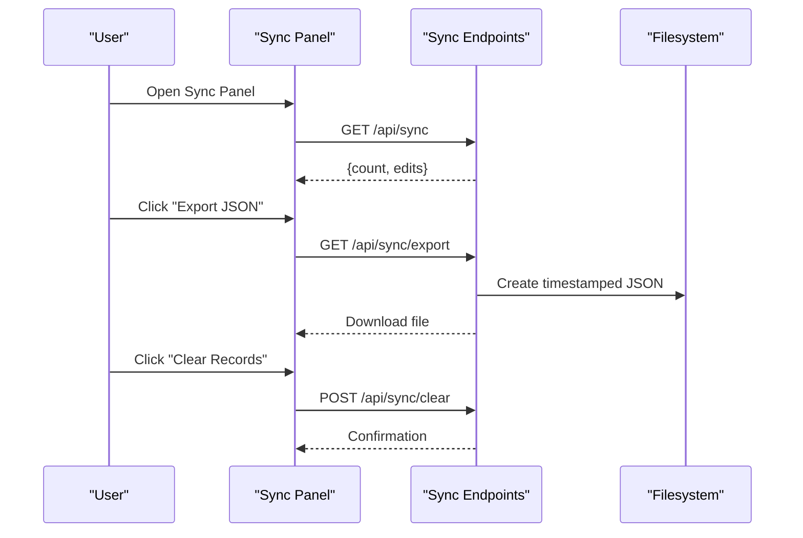
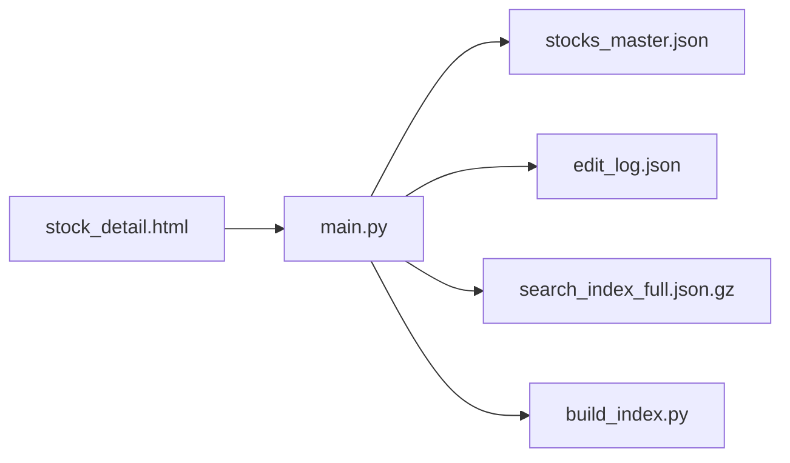

# Community Editing System

<cite>
**Referenced Files in This Document**
- [main.py](file://main.py)
- [templates/stock_detail.html](file://templates/stock_detail.html)
- [SYNC_FEATURE.md](file://SYNC_FEATURE.md)
- [INSIGHTS_EDIT_FEATURE.md](file://INSIGHTS_EDIT_FEATURE.md)
- [INLINE_EDIT_PLAN.md](file://INLINE_EDIT_PLAN.md)
- [build_index.py](file://build_index.py)
- [fix_refresh_edit.py](file://fix_refresh_edit.py)
- [README.md](file://README.md)
</cite>

## Table of Contents
1. [Introduction](#introduction)
2. [Project Structure](#project-structure)
3. [Core Components](#core-components)
4. [Architecture Overview](#architecture-overview)
5. [Detailed Component Analysis](#detailed-component-analysis)
6. [Dependency Analysis](#dependency-analysis)
7. [Performance Considerations](#performance-considerations)
8. [Troubleshooting Guide](#troubleshooting-guide)
9. [Conclusion](#conclusion)

## Introduction
This document describes the community editing system for collaborative enhancement of stock research data. It covers the inline editing interface, AJAX-based updates, edit logging, real-time synchronization, and data export capabilities. The system enables multiple contributors to collaboratively update stock information fields such as core business, products, industry position, chain, and partners, while tracking all modifications for auditability and team collaboration.

## Project Structure
The system is built around a Flask web application serving a modern stock research interface. Key components include:
- Backend API endpoints for editing stock information and managing edit logs
- Frontend templates implementing inline editing with AJAX
- Synchronization endpoints for exporting and clearing edit records
- Index rebuilding utilities for search functionality

**Diagram sources**
- [main.py](file://main.py)
- [templates/stock_detail.html](file://templates/stock_detail.html)
- [SYNC_FEATURE.md](file://SYNC_FEATURE.md)
- [INSIGHTS_EDIT_FEATURE.md](file://INSIGHTS_EDIT_FEATURE.md)
- [INLINE_EDIT_PLAN.md](file://INLINE_EDIT_PLAN.md)

**Section sources**
- [README.md](file://README.md)
- [main.py](file://main.py)
- [templates/stock_detail.html](file://templates/stock_detail.html)

## Core Components
- Inline editing interface: A modal-based editor embedded directly in the stock detail page, enabling real-time editing of selected fields with immediate AJAX submission.
- Edit logging: Automatic recording of all edits with timestamps, affected fields, and content previews to support auditing and team coordination.
- Synchronization endpoints: APIs for retrieving, exporting, and clearing edit logs, supporting backup and reporting workflows.
- Data persistence: Updates are saved to the master stock dataset and the search index is rebuilt to reflect changes.

Key implementation references:
- Inline edit UI and AJAX submission: [templates/stock_detail.html](file://templates/stock_detail.html)
- Edit logging and persistence: [main.py](file://main.py)
- Synchronization endpoints: [main.py](file://main.py), [SYNC_FEATURE.md](file://SYNC_FEATURE.md)
- Search index rebuild: [build_index.py](file://build_index.py)

**Section sources**
- [templates/stock_detail.html](file://templates/stock_detail.html)
- [main.py](file://main.py)
- [SYNC_FEATURE.md](file://SYNC_FEATURE.md)
- [build_index.py](file://build_index.py)

## Architecture Overview
The system follows a client-server architecture:
- The frontend renders the stock detail page and manages inline editing controls.
- The backend exposes REST endpoints for editing stock fields and managing edit logs.
- Changes are persisted to JSON files and the search index is regenerated to keep queries current.

**Diagram sources**
- [templates/stock_detail.html](file://templates/stock_detail.html)
- [main.py](file://main.py)
- [build_index.py](file://build_index.py)

## Detailed Component Analysis

### Inline Editing Interface
The inline editing system allows users to switch into edit mode, modify fields directly on the stock detail page, and submit changes via AJAX. The interface supports:
- Real-time population of editable fields from current stock data
- Multi-field editing with a single save operation
- Status feedback and automatic page refresh upon successful save

Implementation highlights:
- Edit mode toggle and form rendering: [templates/stock_detail.html](file://templates/stock_detail.html)
- AJAX save handler posting to the edit endpoint: [templates/stock_detail.html](file://templates/stock_detail.html)
- Field-specific hints indicating which article fields are updated: [templates/stock_detail.html](file://templates/stock_detail.html)

**Diagram sources**
- [templates/stock_detail.html](file://templates/stock_detail.html)

**Section sources**
- [templates/stock_detail.html](file://templates/stock_detail.html)
- [INLINE_EDIT_PLAN.md](file://INLINE_EDIT_PLAN.md)

### Edit Endpoint: /api/stock/<code>/edit
The primary endpoint for collaborative editing supports updating multiple fields atomically:
- Accepts JSON payload containing editable fields: core_business, products, industry_position, chain, partners
- Also supports updating article-related fields on the most recent article: accidents, insights, target_valuation
- Logs all changes with timestamps, affected fields, and previews
- Persists changes to the master stock dataset and triggers index rebuild

Processing logic:
- Validates stock existence and request payload
- Applies field updates to memory and persists to disk
- Records edit log entries with truncated content for compact storage
- Rebuilds the search index to incorporate changes

**Diagram sources**
- [main.py](file://main.py)

**Section sources**
- [main.py](file://main.py)

### Edit Logging System
The system maintains a persistent edit log to track all modifications:
- Log entries include timestamp, stock code/name, affected fields, and content previews
- Content is truncated in logs to prevent excessive file growth
- Exported files contain full content for archival and reporting
- Clearing the log removes only the log entries without affecting persisted data

Key behaviors:
- Automatic append on successful edits
- Separate endpoints for retrieval, export, and clearing
- Timezone-aware timestamps using server time

**Section sources**
- [main.py](file://main.py)
- [SYNC_FEATURE.md](file://SYNC_FEATURE.md)

### Synchronization and Data Export
The synchronization subsystem provides three primary capabilities:
- Retrieve all edit logs via GET /api/sync
- Export logs as downloadable JSON via GET /api/sync/export
- Clear logs via POST /api/sync/clear
- Email draft generation via POST /api/sync/email (placeholder)

Workflow:
- Export endpoint generates a timestamped JSON file containing all logs
- Email endpoint creates a formatted draft file for team communication
- Clear endpoint resets the in-memory and persisted log arrays

**Diagram sources**
- [main.py](file://main.py)
- [SYNC_FEATURE.md](file://SYNC_FEATURE.md)

**Section sources**
- [main.py](file://main.py)
- [SYNC_FEATURE.md](file://SYNC_FEATURE.md)

### Article Field Updates
While the inline editor focuses on stock-level fields, article-related fields can also be updated:
- PUT /api/stock/<code>/accident for catalyst/risk events
- PUT /api/stock/<code>/insights for investment insights
- These endpoints update the latest article and append concise logs for auditability

**Section sources**
- [main.py](file://main.py)
- [INSIGHTS_EDIT_FEATURE.md](file://INSIGHTS_EDIT_FEATURE.md)

### Data Persistence and Index Rebuild
Changes are persisted to the master stock dataset and the search index is rebuilt to ensure search and display accuracy:
- Master dataset updates occur atomically per request
- Search index rebuild is triggered after edits to incorporate new content
- The rebuild process merges sentiment mentions and constructs searchable artifacts

**Section sources**
- [main.py](file://main.py)
- [build_index.py](file://build_index.py)

## Dependency Analysis
The system exhibits clear separation of concerns:
- Frontend depends on backend endpoints for data and mutations
- Backend depends on filesystem for persistent storage and index generation
- Edit logs are independent of persisted data, enabling auditability without data loss risk

**Diagram sources**
- [main.py](file://main.py)
- [templates/stock_detail.html](file://templates/stock_detail.html)
- [build_index.py](file://build_index.py)

**Section sources**
- [main.py](file://main.py)
- [templates/stock_detail.html](file://templates/stock_detail.html)
- [build_index.py](file://build_index.py)

## Performance Considerations
- Edit throughput: The system writes to JSON files synchronously; for high-frequency collaborative editing, consider batching or database-backed storage.
- Index rebuild cost: Rebuilding the search index is CPU-intensive; schedule rebuilds during off-peak hours or cache results where appropriate.
- Network efficiency: AJAX saves minimize page reloads; ensure client-side validation reduces unnecessary requests.
- Log size management: Truncated previews in logs reduce file sizes; periodic archival of exports prevents unbounded growth.

## Troubleshooting Guide
Common issues and resolutions:
- Save failures: Verify network connectivity and backend availability; inspect browser console for AJAX errors.
- Empty or stale data: Confirm that the stock exists and that the search index was rebuilt after edits.
- Edit log discrepancies: Check that logs are appended on success and cleared via the dedicated endpoint.
- Permission and field restrictions: Only permitted fields can be edited; concept tags and core business are generated automatically.

Operational checks:
- Confirm that the master dataset and edit log files are writable by the application.
- Validate that the index rebuild script executes successfully and completes within acceptable time.
- Review synchronization endpoints for proper JSON formatting and file creation.

**Section sources**
- [main.py](file://main.py)
- [templates/stock_detail.html](file://templates/stock_detail.html)
- [SYNC_FEATURE.md](file://SYNC_FEATURE.md)

## Conclusion
The community editing system provides a robust foundation for collaborative stock research data enhancement. Its inline editing interface, comprehensive edit logging, and synchronization features enable efficient team workflows while maintaining data integrity. Future enhancements could include user authentication, version history, conflict detection, and automated Git commits to further strengthen governance and traceability.