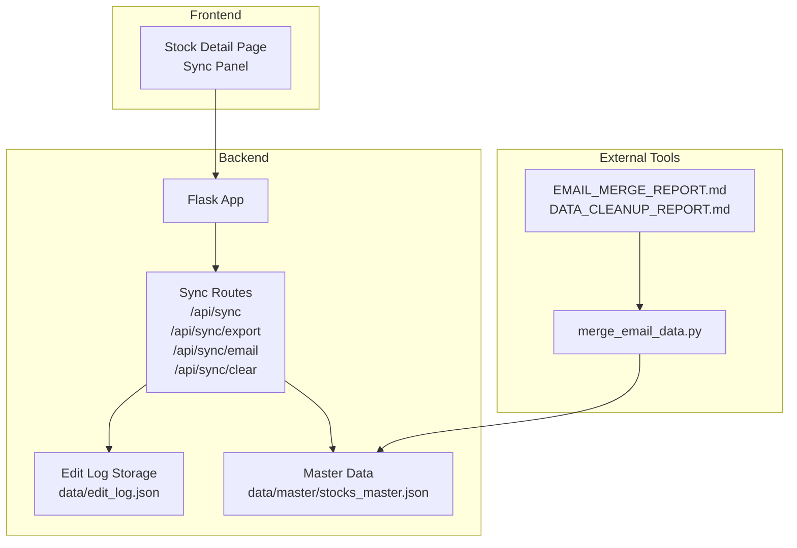
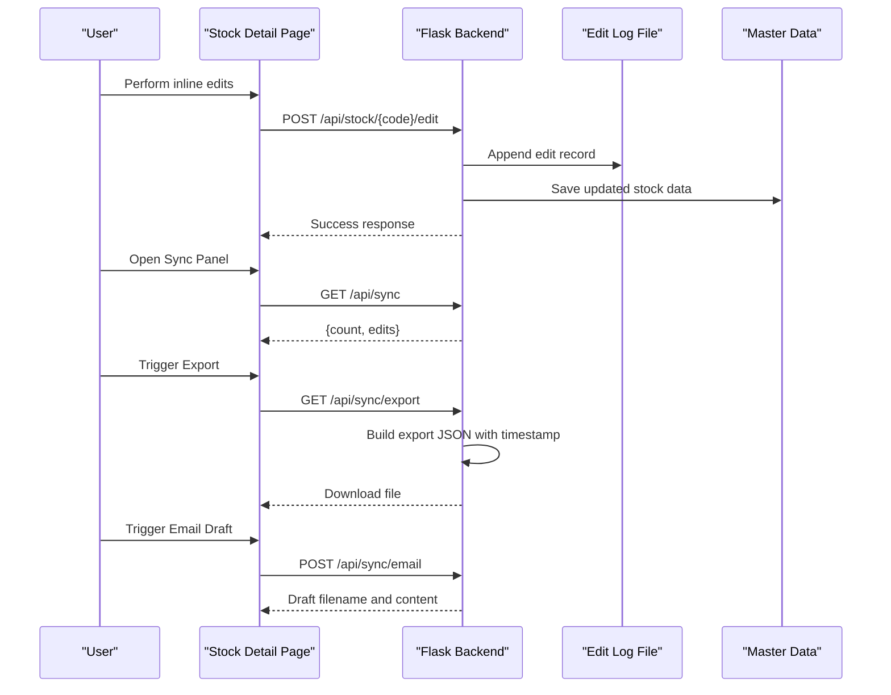
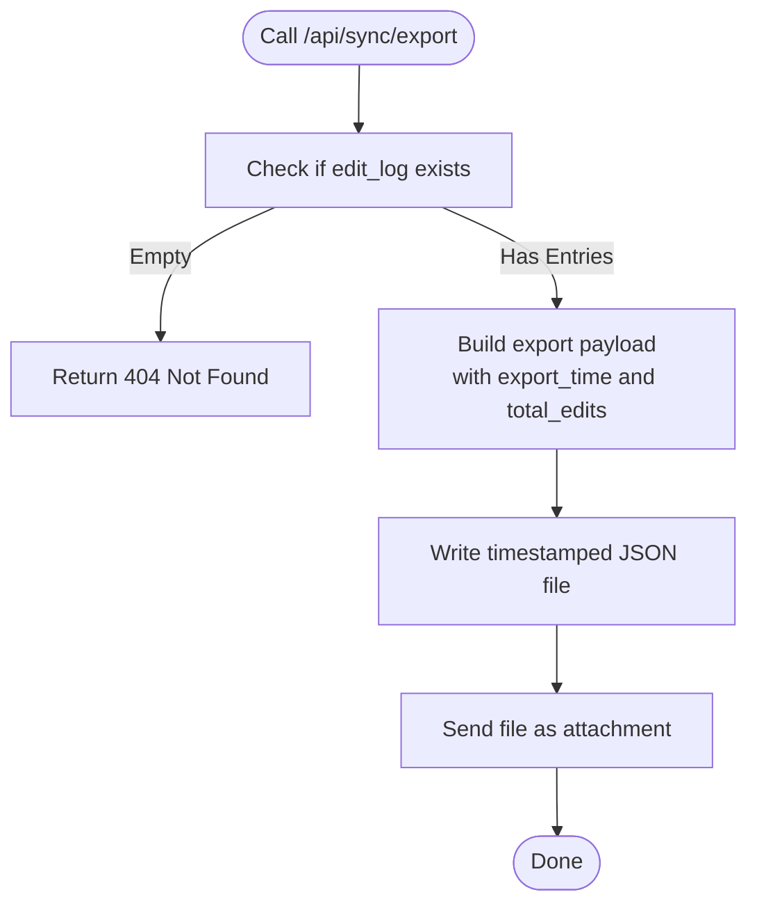
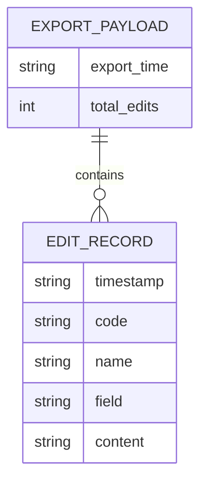
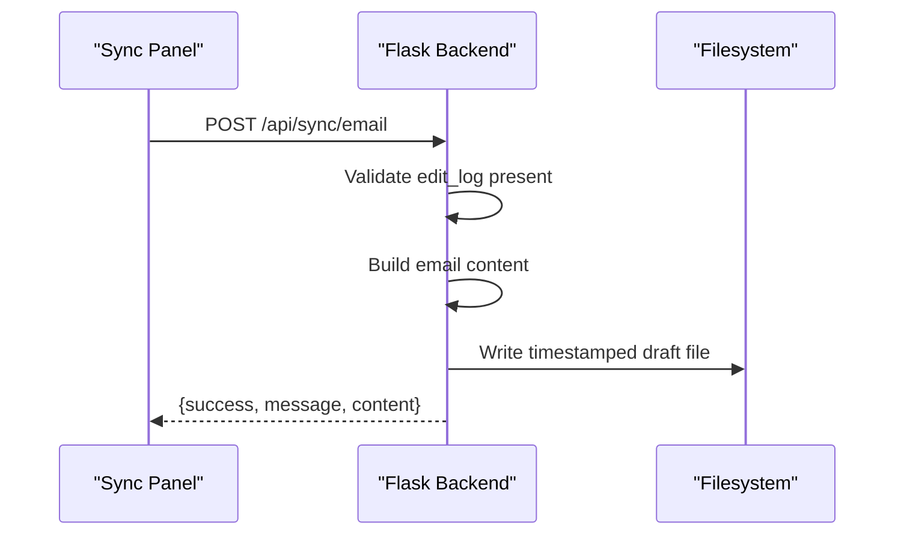
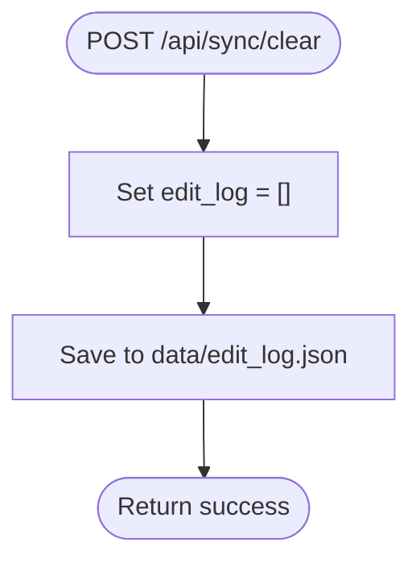
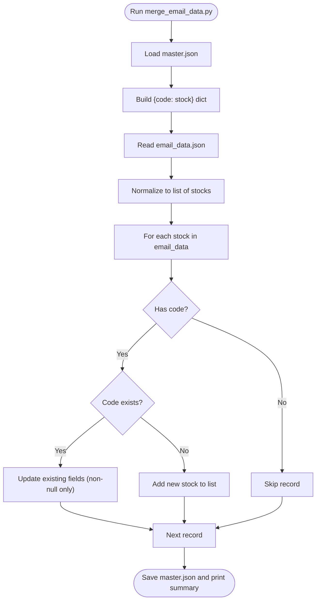
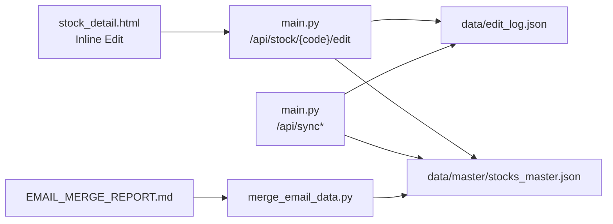

# Data Synchronization

<cite>
**Referenced Files in This Document**
- [main.py](file://main.py)
- [SYNC_FEATURE.md](file://SYNC_FEATURE.md)
- [merge_email_data.py](file://merge_email_data.py)
- [EMAIL_MERGE_REPORT.md](file://EMAIL_MERGE_REPORT.md)
- [DATA_CLEANUP_REPORT.md](file://DATA_CLEANUP_REPORT.md)
- [templates/stock_detail.html](file://templates/stock_detail.html)
</cite>

## Table of Contents
1. [Introduction](#introduction)
2. [Project Structure](#project-structure)
3. [Core Components](#core-components)
4. [Architecture Overview](#architecture-overview)
5. [Detailed Component Analysis](#detailed-component-analysis)
6. [Dependency Analysis](#dependency-analysis)
7. [Performance Considerations](#performance-considerations)
8. [Troubleshooting Guide](#troubleshooting-guide)
9. [Conclusion](#conclusion)

## Introduction
This document describes the data synchronization system that enables users to export, review, and manage inline editing history for stock research data. It covers:
- The /api/sync endpoint for retrieving edit logs
- The /api/sync/export endpoint for downloading structured JSON exports
- The /api/sync/email endpoint for generating email drafts
- The clear edits functionality and cleanup procedures
- Practical workflows for backup, reporting, and team collaboration
- Batch processing via the merge_email_data.py script for integrating externally extracted data

## Project Structure
The synchronization system spans backend routes, frontend integration, and data persistence:
- Backend routes and handlers are implemented in main.py
- Frontend integration appears in templates/stock_detail.html
- Edit logs are persisted to data/edit_log.json
- Email-related merge automation is implemented in merge_email_data.py
- Operational reports document usage and cleanup procedures

**Diagram sources**
- [main.py:612-685](file://main.py#L612-L685)
- [templates/stock_detail.html:1418-1458](file://templates/stock_detail.html#L1418-L1458)
- [merge_email_data.py:9-76](file://merge_email_data.py#L9-L76)
- [EMAIL_MERGE_REPORT.md:93-114](file://EMAIL_MERGE_REPORT.md#L93-L114)

**Section sources**
- [main.py:612-685](file://main.py#L612-L685)
- [SYNC_FEATURE.md:88-111](file://SYNC_FEATURE.md#L88-L111)

## Core Components
- Sync endpoints
  - GET /api/sync: Returns current edit log count and entries
  - GET /api/sync/export: Generates a JSON export file and triggers download
  - POST /api/sync/email: Generates an email draft file and returns content
  - POST /api/sync/clear: Clears the in-memory edit log and persists empty state
- Data storage
  - Edit logs stored in data/edit_log.json
  - Master stock data stored in data/master/stocks_master.json
- Frontend integration
  - Stock detail page supports inline editing and triggers backend APIs
- Merge tooling
  - merge_email_data.py merges external JSON data into the master stock dataset

**Section sources**
- [main.py:612-685](file://main.py#L612-L685)
- [SYNC_FEATURE.md:90-111](file://SYNC_FEATURE.md#L90-L111)
- [merge_email_data.py:9-76](file://merge_email_data.py#L9-L76)

## Architecture Overview
The synchronization architecture connects user actions on the stock detail page to backend endpoints, which operate against in-memory edit logs and persist them to disk. Export and email endpoints produce downloadable artifacts for offline or team sharing. The merge_email_data.py script integrates external data into the master dataset.

**Diagram sources**
- [main.py:431-478](file://main.py#L431-L478)
- [main.py:612-685](file://main.py#L612-L685)
- [templates/stock_detail.html:1418-1458](file://templates/stock_detail.html#L1418-L1458)

## Detailed Component Analysis

### Sync Endpoints
- GET /api/sync
  - Purpose: Retrieve current edit log summary and entries
  - Behavior: Returns success flag, edit count, and edit array
- GET /api/sync/export
  - Purpose: Produce a downloadable JSON export
  - Behavior: Builds export payload with export_time and total_edits, writes a timestamped file, and sends it as attachment
- POST /api/sync/email
  - Purpose: Generate an email draft file and return content
  - Behavior: Creates a formatted text draft with a timestamped filename and returns metadata
- POST /api/sync/clear
  - Purpose: Clear the in-memory edit log and persist empty state
  - Behavior: Resets edit_log to empty and saves to disk

**Diagram sources**
- [main.py:621-638](file://main.py#L621-L638)

**Section sources**
- [main.py:612-685](file://main.py#L612-L685)
- [SYNC_FEATURE.md:92-97](file://SYNC_FEATURE.md#L92-L97)

### Edit Export Functionality
- Timestamp generation
  - export_time is generated server-side using ISO format
- File naming convention
  - edit_export_YYYYMMDD_HHMMSS.json
- Content structure
  - export_time: ISO timestamp
  - total_edits: integer count
  - edits: array of edit records

**Diagram sources**
- [main.py:628-632](file://main.py#L628-L632)

**Section sources**
- [SYNC_FEATURE.md:36-52](file://SYNC_FEATURE.md#L36-L52)
- [main.py:628-638](file://main.py#L628-L638)

### Email Synchronization Capability
- Endpoint: POST /api/sync/email
- Behavior:
  - Validates presence of edit log
  - Builds a formatted email draft text
  - Writes a timestamped .txt draft file
  - Returns success metadata including message and content preview

**Diagram sources**
- [main.py:640-677](file://main.py#L640-L677)

**Section sources**
- [SYNC_FEATURE.md](file://SYNC_FEATURE.md#L96)
- [main.py:640-677](file://main.py#L640-L677)

### Clear Edits Functionality and Cleanup
- Endpoint: POST /api/sync/clear
- Behavior:
  - Clears in-memory edit_log
  - Persists empty log to data/edit_log.json
- Notes:
  - Clearing does not affect saved stock data in stocks_master.json
  - Useful for resetting audit trails while preserving content

**Diagram sources**
- [main.py:679-685](file://main.py#L679-L685)

**Section sources**
- [SYNC_FEATURE.md:79-84](file://SYNC_FEATURE.md#L79-L84)
- [main.py:679-685](file://main.py#L679-L685)

### Merge Email Data Script
Purpose: Merge external JSON data (often from email attachments) into the master stock dataset.

Key behaviors:
- Loads master.json and builds a lookup dictionary keyed by stock code
- Accepts either a list of stocks or a single stock object
- Merges updates by code, adding new stocks and updating existing ones
- Saves the updated master dataset to output path (defaults to master file)

**Diagram sources**
- [merge_email_data.py:9-76](file://merge_email_data.py#L9-L76)

**Section sources**
- [merge_email_data.py:9-76](file://merge_email_data.py#L9-L76)
- [EMAIL_MERGE_REPORT.md:93-114](file://EMAIL_MERGE_REPORT.md#L93-L114)

### Practical Workflows and Examples
- Backup edits
  - Steps: Open Sync Panel → Click Download JSON → Save file locally or to cloud
  - File naming: edit_export_YYYYMMDD_HHMMSS.json
- Team collaboration via email
  - Steps: Open Sync Panel → Click Email Draft → Review returned content → Send via email client
- Audit and cleanup
  - Steps: Open Sync Panel → Review edit list → Clear edits when appropriate
- Batch processing external data
  - Steps: Extract JSON from email → Run merge_email_data.py → Verify coverage improvements → Commit and deploy

**Section sources**
- [SYNC_FEATURE.md:114-129](file://SYNC_FEATURE.md#L114-L129)
- [EMAIL_MERGE_REPORT.md:137-141](file://EMAIL_MERGE_REPORT.md#L137-L141)

### Integration with External Systems
- Email ingestion pipeline
  - External extraction produces JSON with stock fields
  - merge_email_data.py merges into stocks_master.json
  - Reports track coverage improvements and validation steps
- Data cleanup and validation
  - DATA_CLEANUP_REPORT.md documents corrective actions for incorrect article associations
  - Suggests adding validation checks for content relevance and deduplication

**Section sources**
- [EMAIL_MERGE_REPORT.md:100-114](file://EMAIL_MERGE_REPORT.md#L100-L114)
- [DATA_CLEANUP_REPORT.md:84-127](file://DATA_CLEANUP_REPORT.md#L84-L127)

## Dependency Analysis
- Backend dependencies
  - Flask app routes depend on in-memory edit_log and persistent files
  - Export and email endpoints depend on filesystem write permissions
- Frontend dependencies
  - Inline editing triggers POST /api/stock/{code}/edit, which appends to edit_log and persists master data
- External tool dependencies
  - merge_email_data.py depends on data/master/stocks_master.json and writes updated master data

**Diagram sources**
- [main.py:431-478](file://main.py#L431-L478)
- [main.py:612-685](file://main.py#L612-L685)
- [merge_email_data.py:9-76](file://merge_email_data.py#L9-L76)

**Section sources**
- [main.py:431-478](file://main.py#L431-L478)
- [main.py:612-685](file://main.py#L612-L685)
- [merge_email_data.py:9-76](file://merge_email_data.py#L9-L76)

## Performance Considerations
- Edit log growth
  - Logs append automatically; large logs may slow GET /api/sync responses
  - Recommendation: Periodically export and clear logs for long-running sessions
- Export file size
  - Export includes full content; very large logs increase file size
  - Recommendation: Use export for periodic snapshots rather than frequent downloads
- Email draft generation
  - Generates a text file per request; ensure sufficient disk space and permissions
- Merge operations
  - merge_email_data.py iterates over incoming records and updates master; consider batching large datasets

[No sources needed since this section provides general guidance]

## Troubleshooting Guide
- No edit log found when exporting or emailing
  - Cause: edit_log is empty
  - Resolution: Perform at least one inline edit to populate the log
- Export returns 404
  - Cause: No edits recorded
  - Resolution: Confirm edits were made; check GET /api/sync for count > 0
- Email draft not generated
  - Cause: No edits or server-side error
  - Resolution: Verify edit_log presence and retry; inspect server logs
- Clear edits did not reset
  - Cause: Misunderstanding of persistence scope
  - Resolution: Remember that clearing edits does not affect saved stock data; confirm by checking master file
- Incorrect article associations after email ingestion
  - Cause: Incorrectly linked article content
  - Resolution: Follow DATA_CLEANUP_REPORT.md steps to remove erroneous mentions and rebuild index

**Section sources**
- [main.py:624-625](file://main.py#L624-L625)
- [main.py:643-644](file://main.py#L643-L644)
- [DATA_CLEANUP_REPORT.md:84-127](file://DATA_CLEANUP_REPORT.md#L84-L127)

## Conclusion
The data synchronization system provides a robust mechanism for auditing, exporting, and collaborating on inline edits. It offers immediate visibility into changes via GET /api/sync, reliable backups through JSON exports, and convenient email draft generation. The merge_email_data.py script streamlines integration of external data into the master dataset, while operational reports guide cleanup and validation. Together, these components support efficient workflows for backup, reporting, and team collaboration.