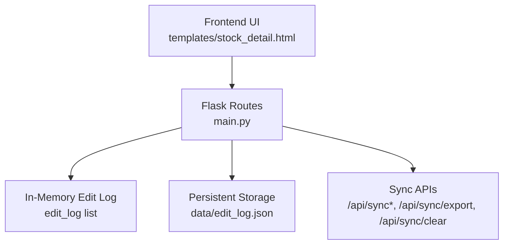
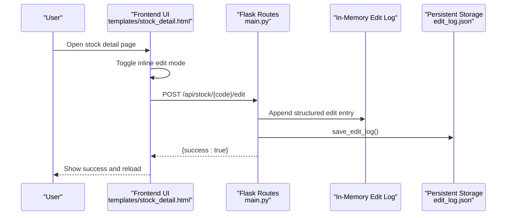
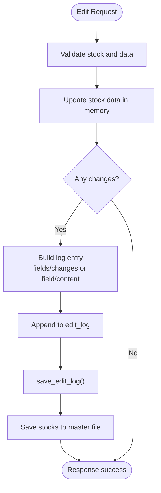
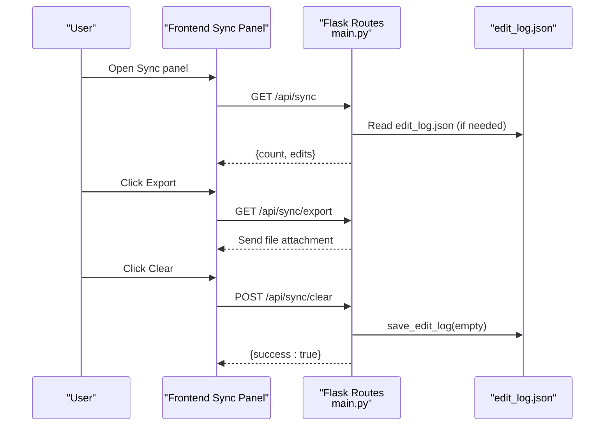
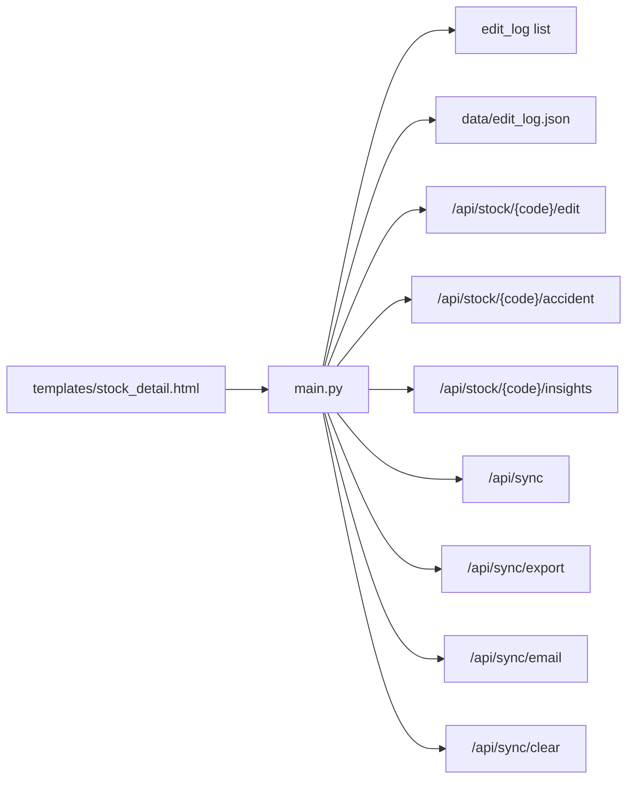

# Edit Logging and Tracking

<cite>
**Referenced Files in This Document**
- [main.py](file://main.py)
- [templates/stock_detail.html](file://templates/stock_detail.html)
- [SYNC_FEATURE.md](file://SYNC_FEATURE.md)
- [EDIT_FEATURE_GUIDE.md](file://EDIT_FEATURE_GUIDE.md)
</cite>

## Table of Contents
1. [Introduction](#introduction)
2. [Project Structure](#project-structure)
3. [Core Components](#core-components)
4. [Architecture Overview](#architecture-overview)
5. [Detailed Component Analysis](#detailed-component-analysis)
6. [Dependency Analysis](#dependency-analysis)
7. [Performance Considerations](#performance-considerations)
8. [Troubleshooting Guide](#troubleshooting-guide)
9. [Conclusion](#conclusion)

## Introduction
This document describes the edit logging and tracking system used to record all modifications made to stock data. It explains the log structure, the automatic logging mechanism triggered by editing operations, the persistent storage in edit_log.json, and the audit trail capabilities. It also covers the synchronization APIs, query patterns for retrieving edit history, and best practices for maintaining data integrity and managing large edit histories.

## Project Structure
The edit logging system spans backend routes, frontend interactions, and persistent storage:
- Backend: Flask routes handle edits, maintain an in-memory edit log, and persist it to disk.
- Frontend: Inline editing UI posts updates to the backend, which triggers logging.
- Storage: edit_log.json stores the audit trail as a JSON array.

**Diagram sources**
- [main.py:431-478](file://main.py#L431-L478)
- [main.py:572-580](file://main.py#L572-L580)
- [main.py:612-685](file://main.py#L612-L685)
- [templates/stock_detail.html:1418-1458](file://templates/stock_detail.html#L1418-L1458)

**Section sources**
- [main.py:506-524](file://main.py#L506-L524)
- [SYNC_FEATURE.md:88-111](file://SYNC_FEATURE.md#L88-L111)

## Core Components
- Edit log structure: Each entry captures timestamp, stock code and name, fields modified, and changes made (or field and content depending on the operation).
- Automatic logging: Triggered by all editing operations (both inline editing and dedicated PUT endpoints).
- Persistent storage: save_edit_log writes the in-memory edit_log to data/edit_log.json.
- Audit trail APIs: sync_edits, export_edits, email_edits, and clear_edits provide retrieval, export, notification, and cleanup.

Key implementation highlights:
- Inline edit endpoint logs structured changes with fields and values.
- Dedicated PUT endpoints log simpler entries with field and content (with truncation).
- save_edit_log persists the entire log array atomically.

**Section sources**
- [main.py:431-478](file://main.py#L431-L478)
- [main.py:525-571](file://main.py#L525-L571)
- [main.py:572-580](file://main.py#L572-L580)
- [main.py:612-685](file://main.py#L612-L685)
- [SYNC_FEATURE.md:133-139](file://SYNC_FEATURE.md#L133-L139)

## Architecture Overview
The system integrates frontend editing with backend logging and persistence, exposing APIs for audit and synchronization.

**Diagram sources**
- [templates/stock_detail.html:1418-1458](file://templates/stock_detail.html#L1418-L1458)
- [main.py:431-478](file://main.py#L431-L478)
- [main.py:572-580](file://main.py#L572-L580)

## Detailed Component Analysis

### Edit Log Structure
Two distinct log entry formats exist depending on the editing operation:

- Inline edit log (POST /api/stock/{code}/edit):
  - Fields: timestamp, code, name, fields (list), changes (object mapping field to new values).
  - Example structure: see [EDIT_FEATURE_GUIDE.md:72-83](file://EDIT_FEATURE_GUIDE.md#L72-L83).

- Dedicated field edit logs (PUT /api/stock/{code}/accident, /api/stock/{code}/insights):
  - Fields: timestamp, code, name, field, content (truncated to 200 chars).
  - Example structure: see [SYNC_FEATURE.md:36-52](file://SYNC_FEATURE.md#L36-L52).

Notes:
- Timestamp uses ISO format from server time.
- Content is truncated in logs to prevent excessive growth; exports contain full content.

**Section sources**
- [main.py:465-473](file://main.py#L465-L473)
- [main.py:537-545](file://main.py#L537-L545)
- [main.py:561-569](file://main.py#L561-L569)
- [SYNC_FEATURE.md:133-139](file://SYNC_FEATURE.md#L133-L139)

### Automatic Logging Mechanism
Automatic logging occurs in two primary places:

- Inline editing flow:
  - On successful updates, the backend appends a structured entry to edit_log and calls save_edit_log.
  - The frontend posts JSON with comma-separated values per field; the backend splits and trims values.

- Dedicated field updates:
  - PUT endpoints for accident and insights append a simplified entry with field and content (truncated).

**Diagram sources**
- [main.py:431-478](file://main.py#L431-L478)
- [main.py:525-571](file://main.py#L525-L571)
- [main.py:572-580](file://main.py#L572-L580)

**Section sources**
- [main.py:431-478](file://main.py#L431-L478)
- [main.py:525-571](file://main.py#L525-L571)
- [templates/stock_detail.html:1418-1458](file://templates/stock_detail.html#L1418-L1458)

### save_edit_log() Function and Persistent Storage
- Purpose: Write the entire edit_log list to data/edit_log.json.
- Behavior: Uses UTF-8 encoding and indented JSON for readability.
- Error handling: Prints failure messages to console; does not raise exceptions to callers.

Storage location and lifecycle:
- File path: data/edit_log.json.
- Load on startup: If present, the file is loaded into memory; otherwise, an empty list is used.
- Append-only: New entries are appended; existing entries are preserved.

**Section sources**
- [main.py:572-580](file://main.py#L572-L580)
- [main.py:511-524](file://main.py#L511-L524)

### Edit History Tracking and Audit Trail
Audit trail capabilities include:
- Retrieval: GET /api/sync returns count and full edits array.
- Export: GET /api/sync/export downloads a JSON file containing export_time, total_edits, and edits.
- Email draft: POST /api/sync/email generates a text draft summarizing edits.
- Clear: POST /api/sync/clear empties the in-memory log and persists the empty list.

**Diagram sources**
- [main.py:612-685](file://main.py#L612-L685)
- [SYNC_FEATURE.md:88-111](file://SYNC_FEATURE.md#L88-L111)

**Section sources**
- [main.py:612-685](file://main.py#L612-L685)
- [SYNC_FEATURE.md:114-129](file://SYNC_FEATURE.md#L114-L129)

### Query Patterns for Retrieving Edit History
Common retrieval patterns:
- List recent edits: GET /api/sync
- Export full history: GET /api/sync/export
- Filter by stock: Use client-side filtering on the returned edits array (no server-side filters are provided).
- Count and stats: Use the count field from /api/sync for quick checks.

Example usage references:
- See [SYNC_FEATURE.md:183-193](file://SYNC_FEATURE.md#L183-L193) for local and API examples.

**Section sources**
- [main.py:612-638](file://main.py#L612-L638)
- [SYNC_FEATURE.md:183-193](file://SYNC_FEATURE.md#L183-L193)

### Integration with Synchronization System
- The edit log is independent of the master data file; clearing logs does not affect saved stock data.
- After each edit, the system saves both the updated stock data and the log.
- The sync panel provides a unified interface to manage and share edit history.

Operational notes:
- Timezone: timestamps reflect server time (Asia/Shanghai).
- Content truncation: logs show truncated content to keep files small; exports include full content.

**Section sources**
- [main.py:475-477](file://main.py#L475-L477)
- [SYNC_FEATURE.md:133-139](file://SYNC_FEATURE.md#L133-L139)

## Dependency Analysis
The edit logging system depends on:
- Flask routes for handling edits and sync operations.
- In-memory edit_log list for immediate access and persistence.
- File system for edit_log.json storage.
- Frontend templates for triggering edits and displaying status.

**Diagram sources**
- [templates/stock_detail.html:1418-1458](file://templates/stock_detail.html#L1418-L1458)
- [main.py:431-478](file://main.py#L431-L478)
- [main.py:525-571](file://main.py#L525-L571)
- [main.py:612-685](file://main.py#L612-L685)

**Section sources**
- [main.py:431-478](file://main.py#L431-L478)
- [main.py:525-571](file://main.py#L525-L571)
- [main.py:612-685](file://main.py#L612-L685)

## Performance Considerations
- Log growth: Each edit appends to the log; over time, edit_log.json can grow large.
- Truncation: Content is truncated in logs to mitigate file size; exports retain full content.
- Persistence cost: save_edit_log writes the entire array; frequent edits increase write frequency.
- Recommendations:
  - Periodically export and archive edit_log.json to external storage.
  - Consider rotating logs (e.g., monthly archives) and pruning old entries.
  - Monitor file sizes and implement server-side pagination or filtering if needed.

[No sources needed since this section provides general guidance]

## Troubleshooting Guide
Common issues and resolutions:
- Save fails:
  - Causes: network errors, invalid data, missing stock.
  - Resolution: check browser console, ensure stock exists, retry after refresh.
- Data not updating:
  - Causes: browser cache.
  - Resolution: hard refresh, clear cache, wait a moment for propagation.
- Empty fields:
  - Explanation: normal if no prior data; populate and save to update.
- Clearing logs:
  - Action: POST /api/sync/clear clears only the log, not the underlying stock data.

**Section sources**
- [EDIT_FEATURE_GUIDE.md:152-182](file://EDIT_FEATURE_GUIDE.md#L152-L182)
- [SYNC_FEATURE.md:133-139](file://SYNC_FEATURE.md#L133-L139)

## Conclusion
The edit logging and tracking system provides a robust audit trail for all stock data modifications. It automatically logs edits, persists them to edit_log.json, and exposes APIs for review, export, and cleanup. By following best practices—such as periodic exports, rotation, and truncation—the system remains efficient and maintainable even with extensive edit histories.