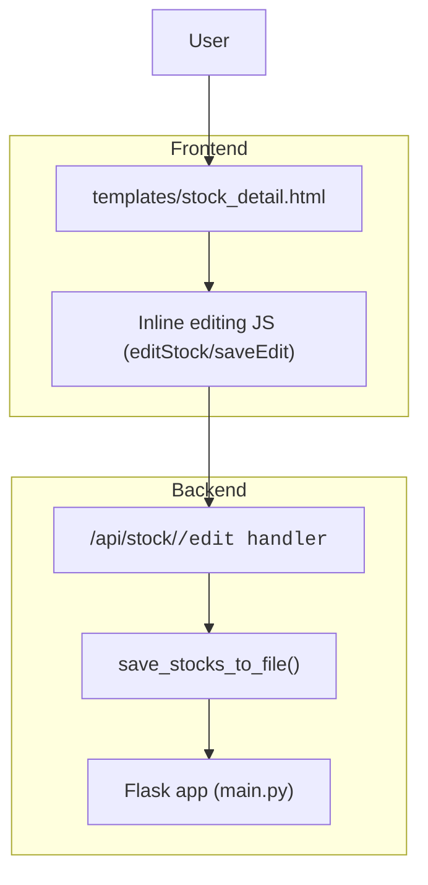
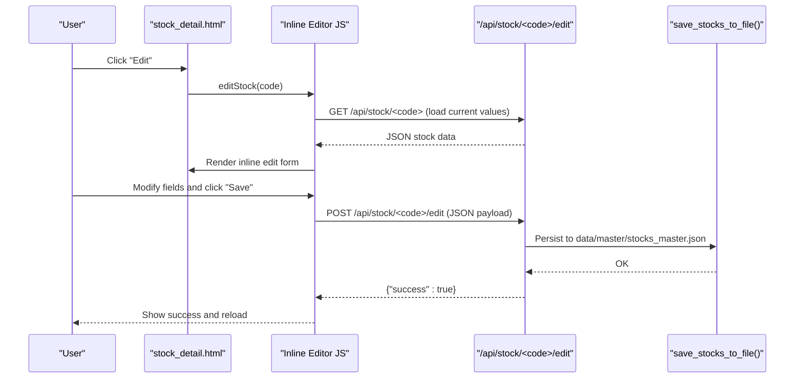
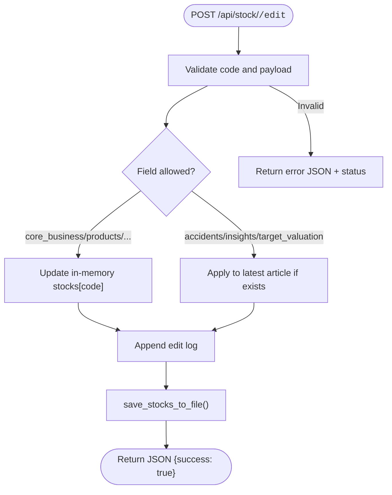
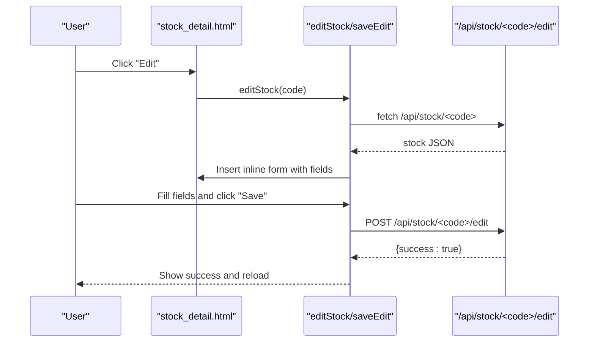
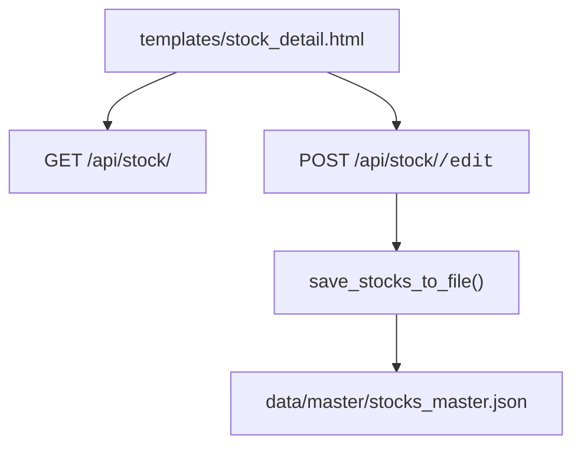

# Editing Interface

<cite>
**Referenced Files in This Document**
- [main.py](file://main.py)
- [stock_detail.html](file://templates/stock_detail.html)
- [INLINE_EDIT_PLAN.md](file://INLINE_EDIT_PLAN.md)
- [INSIGHTS_EDIT_FEATURE.md](file://INSIGHTS_EDIT_FEATURE.md)
- [fix_refresh_edit.py](file://fix_refresh_edit.py)
</cite>

## Table of Contents
1. [Introduction](#introduction)
2. [Project Structure](#project-structure)
3. [Core Components](#core-components)
4. [Architecture Overview](#architecture-overview)
5. [Detailed Component Analysis](#detailed-component-analysis)
6. [Dependency Analysis](#dependency-analysis)
7. [Performance Considerations](#performance-considerations)
8. [Troubleshooting Guide](#troubleshooting-guide)
9. [Conclusion](#conclusion)

## Introduction
This document describes the community editing interface for the stock research platform. It focuses on the real-time editing experience enabled by the /api/stock/<code>/edit endpoint, the inline editing UI, and the backend data persistence pipeline. It also documents supported editable fields, validation and sanitization behavior, error handling, and integration patterns with the frontend templates.

## Project Structure
The editing interface spans three primary areas:
- Backend API routes and data persistence logic
- Frontend stock detail page with inline editing UI
- Design and UX guidance for inline editing

**Diagram sources**
- [main.py:431-478](file://main.py#L431-L478)
- [main.py:581-610](file://main.py#L581-L610)
- [stock_detail.html:1306-1458](file://templates/stock_detail.html#L1306-L1458)

**Section sources**
- [main.py:431-478](file://main.py#L431-L478)
- [stock_detail.html:1306-1458](file://templates/stock_detail.html#L1306-L1458)

## Core Components
- Editable fields: core_business, products, industry_position, chain, partners
- Article-related fields: accidents, insights, target_valuation (applied to the latest article)
- Real-time inline editing UI: populates a compact form, validates locally, and submits via AJAX
- Backend route: /api/stock/<code>/edit handles updates and persists to disk
- Persistence: writes the master stock dataset to data/master/stocks_master.json

Supported editable fields and their behavior:
- core_business: array of strings describing the company’s main business
- products: array of product/service names
- industry_position: array of strings describing market position/share
- chain: array of strings describing upstream/downstream roles
- partners: array of partner/customer names
- accidents, insights, target_valuation: arrays applied to the first article in the list

Validation and sanitization:
- Frontend trims and filters empty entries when splitting comma-separated values
- Backend accepts only the allowed fields and updates memory and disk consistently

Error handling:
- Returns structured JSON with success/error fields
- On invalid code or missing payload, returns appropriate HTTP status codes

**Section sources**
- [main.py:441-478](file://main.py#L441-L478)
- [stock_detail.html:1425-1440](file://templates/stock_detail.html#L1425-L1440)

## Architecture Overview
The editing flow connects the frontend UI to the backend API and persistence layer.

**Diagram sources**
- [stock_detail.html:1306-1416](file://templates/stock_detail.html#L1306-L1416)
- [main.py:431-478](file://main.py#L431-L478)
- [main.py:581-610](file://main.py#L581-L610)

## Detailed Component Analysis

### Backend: /api/stock/<code>/edit
- Purpose: Accept edits for supported fields and persist them
- Supported fields: core_business, products, industry_position, chain, partners
- Article fields: accidents, insights, target_valuation are applied to the latest article if present
- Validation: rejects missing payload; only allowed fields are processed
- Persistence: updates in-memory dict and writes to data/master/stocks_master.json

Processing logic:
- Load allowed fields from request JSON
- Update stocks[code][field] for each allowed field
- If articles exist, apply accidents, insights, target_valuation to the first article
- Append an edit log entry
- Save to disk

**Diagram sources**
- [main.py:431-478](file://main.py#L431-L478)
- [main.py:581-610](file://main.py#L581-L610)

**Section sources**
- [main.py:431-478](file://main.py#L431-L478)
- [main.py:581-610](file://main.py#L581-L610)

### Frontend: Inline Editing UI
- Trigger: Clicking the “Edit” button in the stock hero renders an inline form
- Fields rendered: core_business, products, industry_position, chain, partners
- Article fields: accidents, insights, target_valuation are shown for the latest article
- Behavior:
  - Split comma-separated values into arrays
  - Trim whitespace and filter empty items
  - Submit via POST to /api/stock/<code>/edit
  - Show status feedback and reload on success

**Diagram sources**
- [stock_detail.html:1306-1458](file://templates/stock_detail.html#L1306-L1458)

**Section sources**
- [stock_detail.html:1306-1458](file://templates/stock_detail.html#L1306-L1458)

### Field Validation and Sanitization
- Frontend:
  - Splits comma-separated input into array
  - Trims each element and filters out empty strings
- Backend:
  - Only processes allowed fields
  - No additional server-side sanitization beyond accepting arrays
- Article fields:
  - Applied only if the stock has at least one article

Practical example (comma-separated input):
- Input: "value1 ,  value2,   , value3,  "
- Output array: ["value1", "value2", "value3"]

**Section sources**
- [stock_detail.html:1425-1440](file://templates/stock_detail.html#L1425-L1440)
- [main.py:441-478](file://main.py#L441-L478)

### Error Handling
- Invalid payload or missing JSON: returns 400 with error message
- Stock not found: returns 404 with error message
- Successful edits: returns 200 with success flag
- Persistence errors: logged to console; API still returns success after attempted write

Example responses:
- Success: {"success": true, "updated_fields": ["field1","field2"]}
- Error (invalid payload): {"success": false, "error": "..."}, 400
- Error (stock not found): {"error": "..."}, 404

**Section sources**
- [main.py:431-478](file://main.py#L431-L478)

### Integration Patterns with Templates
- The stock detail template provides:
  - A compact inline form for supported fields
  - Status indicators for save progress
  - Auto-reload on success
- The inline editing plan outlines an alternative inline-edit-mode approach with per-field editable blocks and a unified save action.

**Section sources**
- [stock_detail.html:1306-1458](file://templates/stock_detail.html#L1306-L1458)
- [INLINE_EDIT_PLAN.md:1-168](file://INLINE_EDIT_PLAN.md#L1-L168)

### Relationship to Data Storage
- In-memory data model: a dictionary keyed by stock code
- Persistent storage: data/master/stocks_master.json (list of stock objects)
- Persistence routine: save_stocks_to_file() converts the in-memory dict to a list and writes to disk

**Diagram sources**
- [main.py:581-610](file://main.py#L581-L610)

**Section sources**
- [main.py:581-610](file://main.py#L581-L610)

## Dependency Analysis
- The inline editor depends on:
  - GET /api/stock/<code> to populate initial values
  - POST /api/stock/<code>/edit to save changes
- The backend depends on:
  - In-memory stocks dictionary
  - File system for persistent storage

**Diagram sources**
- [stock_detail.html:1306-1458](file://templates/stock_detail.html#L1306-L1458)
- [main.py:431-478](file://main.py#L431-L478)
- [main.py:581-610](file://main.py#L581-L610)

**Section sources**
- [stock_detail.html:1306-1458](file://templates/stock_detail.html#L1306-L1458)
- [main.py:431-478](file://main.py#L431-L478)
- [main.py:581-610](file://main.py#L581-L610)

## Performance Considerations
- The inline form loads a single stock’s data via a lightweight GET endpoint
- Saving triggers a synchronous write to disk; this is acceptable for small datasets
- Consider batching edits or adding optimistic UI updates if scaling to many concurrent editors

## Troubleshooting Guide
Common issues and resolutions:
- Save fails immediately:
  - Verify the stock code exists and the request payload is valid JSON
  - Confirm the inline form is populated and “Save” is clicked after editing
- Changes not reflected:
  - Ensure the page reloads automatically after a successful save
  - Check browser network tab for POST /api/stock/<code>/edit responses
- File write errors:
  - Backend logs failures to console; check server logs for exceptions during save

**Section sources**
- [main.py:431-478](file://main.py#L431-L478)
- [main.py:581-610](file://main.py#L581-L610)
- [stock_detail.html:1442-1458](file://templates/stock_detail.html#L1442-L1458)

## Conclusion
The editing interface provides a streamlined, real-time experience for community contributors to update company profile fields and article metadata. The inline UI integrates seamlessly with the stock detail page, while the backend enforces a clear set of editable fields and persists changes reliably to disk. Future enhancements could include richer validation, user authentication, and audit trails.