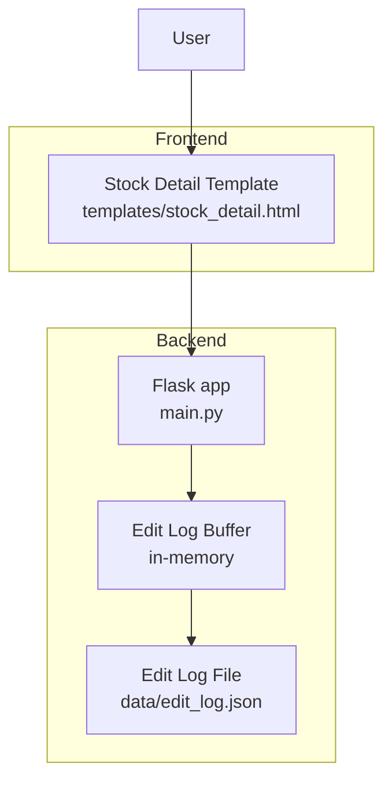
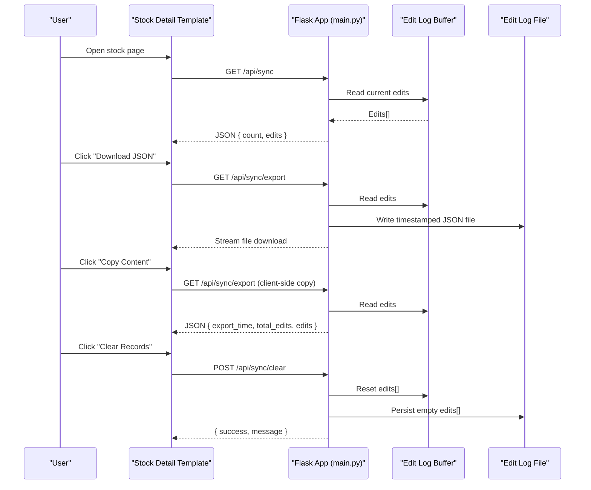
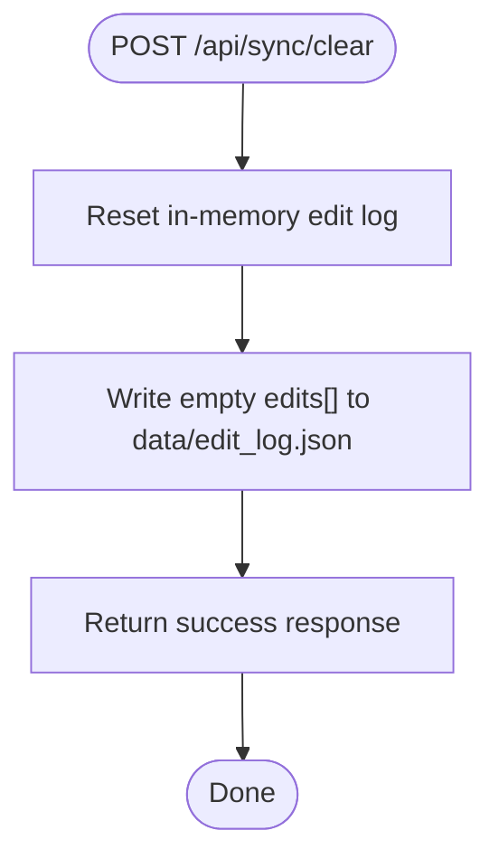
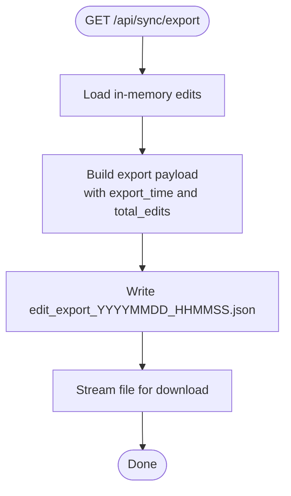
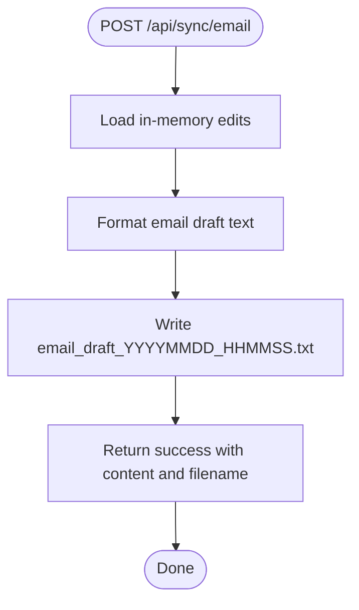
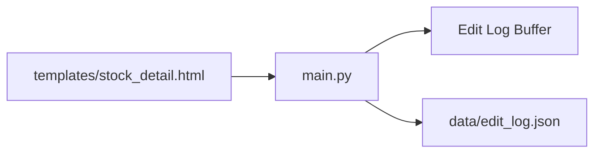

# Data Archival and Cleanup

<cite>
**Referenced Files in This Document**
- [main.py](file://main.py)
- [SYNC_FEATURE.md](file://SYNC_FEATURE.md)
- [templates/stock_detail.html](file://templates/stock_detail.html)
</cite>

## Table of Contents
1. [Introduction](#introduction)
2. [Project Structure](#project-structure)
3. [Core Components](#core-components)
4. [Architecture Overview](#architecture-overview)
5. [Detailed Component Analysis](#detailed-component-analysis)
6. [Dependency Analysis](#dependency-analysis)
7. [Performance Considerations](#performance-considerations)
8. [Troubleshooting Guide](#troubleshooting-guide)
9. [Conclusion](#conclusion)
10. [Appendices](#appendices)

## Introduction
This document explains the data archival and cleanup operations within the synchronization system. It focuses on:
- The /api/sync/clear endpoint for clearing edit records, including confirmation requirements and data persistence implications
- Timestamp-based naming convention for exported files (edit_export_YYYYMMDD_HHMMSS.json, email_draft_YYYYMMDD_HHMMSS.txt) and rationale
- File management workflow including temporary file creation, cleanup procedures, and storage location considerations
- Relationship between active edit logs and archived exports, including retention policies and storage optimization strategies
- Examples of file naming patterns, cleanup procedures, and best practices for maintaining organized data archives
- Security considerations for sensitive edit data and compliance requirements for data retention

## Project Structure
The synchronization feature resides in the backend Flask application and interacts with a small set of frontend templates. The key elements are:
- Backend routes for sync operations
- In-memory edit log buffer persisted to a JSON file
- Frontend template that renders the sync panel and triggers operations

**Diagram sources**
- [main.py](file://main.py)
- [templates/stock_detail.html](file://templates/stock_detail.html)

**Section sources**
- [main.py](file://main.py)
- [SYNC_FEATURE.md](file://SYNC_FEATURE.md)

## Core Components
- Edit log buffer: An in-memory list that accumulates edits during runtime
- Persistent storage: A JSON file that stores the edit log array
- Synchronization endpoints:
  - GET /api/sync: Returns current edit log entries
  - GET /api/sync/export: Exports the edit log to a timestamped JSON file and serves it for download
  - POST /api/sync/email: Generates a timestamped email draft text file
  - POST /api/sync/clear: Clears the in-memory edit log and persists the empty state

Key behaviors:
- Export and email endpoints create timestamped files in the same directory as the edit log file
- Clear endpoint resets the in-memory buffer and writes an empty array to disk
- The edit log file is separate from the master data file containing stock records

**Section sources**
- [main.py](file://main.py)
- [SYNC_FEATURE.md](file://SYNC_FEATURE.md)

## Architecture Overview
The synchronization workflow connects user actions in the frontend to backend endpoints, which manage the edit log buffer and produce archival artifacts.

**Diagram sources**
- [main.py](file://main.py)
- [templates/stock_detail.html](file://templates/stock_detail.html)

## Detailed Component Analysis

### Endpoint: /api/sync/clear
Purpose:
- Remove all recorded edits from memory and persist an empty log to disk

Behavior:
- Resets the in-memory edit log buffer
- Writes an empty JSON array to the edit log file
- Returns a success response indicating the log was cleared

Confirmation requirements:
- The frontend triggers this action via a button click; no explicit confirmation dialog is implemented in the backend route itself
- The frontend template defines the UI and action binding; the backend does not enforce client-side confirmation

Data persistence implications:
- Only the edit log file is affected
- The master stock data file remains unchanged
- After clearing, subsequent edits append to the newly empty log

**Diagram sources**
- [main.py](file://main.py)

**Section sources**
- [main.py](file://main.py)
- [SYNC_FEATURE.md](file://SYNC_FEATURE.md)

### Endpoint: /api/sync/export
Purpose:
- Export the current edit log as a timestamped JSON file and serve it for download

File naming pattern:
- edit_export_YYYYMMDD_HHMMSS.json

Rationale:
- The filename embeds a sortable timestamp to ensure uniqueness and chronological ordering
- Facilitates easy identification and retrieval of archival snapshots
- Prevents accidental overwrites by including precise time down to seconds

Processing logic:
- Reads the current in-memory edit log
- Constructs an export payload with metadata (export_time, total_edits, edits)
- Writes a timestamped JSON file in the same directory as the edit log file
- Streams the file for download

**Diagram sources**
- [main.py](file://main.py)

**Section sources**
- [main.py](file://main.py)
- [SYNC_FEATURE.md](file://SYNC_FEATURE.md)

### Endpoint: /api/sync/email
Purpose:
- Generate a human-readable email draft text file from the current edit log

File naming pattern:
- email_draft_YYYYMMDD_HHMMSS.txt

Rationale:
- Provides a ready-to-send text file for manual distribution
- Uses a timestamp to avoid collisions and enable audit trails
- The draft is stored locally in the same directory as the edit log file

Processing logic:
- Reads the current in-memory edit log
- Formats a multi-record text draft with headers and separators
- Writes a timestamped .txt file in the same directory as the edit log file
- Returns a success response with the generated content and filename

**Diagram sources**
- [main.py](file://main.py)

**Section sources**
- [main.py](file://main.py)
- [SYNC_FEATURE.md](file://SYNC_FEATURE.md)

### Relationship Between Active Edit Logs and Archived Exports
- Active edit log: In-memory list that grows with each edit operation
- Archived exports: Timestamped JSON and text files created on demand
- Retention policy: There is no automated retention policy; exports are created manually when requested
- Storage optimization: Keeping exports separate from the live edit log avoids bloating the in-memory buffer and enables periodic archival without impacting runtime performance

Best practices:
- Periodically export and archive edits using the timestamped filenames
- Store exports in a dedicated backup location outside the application directory if possible
- Keep the edit log file small by clearing it after successful archival and offboarding

**Section sources**
- [main.py](file://main.py)
- [SYNC_FEATURE.md](file://SYNC_FEATURE.md)

### File Management Workflow
- Temporary file creation:
  - Export endpoint creates a single-use JSON file named with a timestamp
  - Email endpoint creates a single-use text file named with a timestamp
- Cleanup procedures:
  - Files are written to the same directory as the edit log file
  - No automatic cleanup is implemented; administrators should manage file lifecycle externally
- Storage location considerations:
  - Both exports and drafts are created in the directory containing the edit log file
  - Ensure the application has write permissions to this directory
  - Consider backing up this directory regularly for disaster recovery

**Section sources**
- [main.py](file://main.py)
- [SYNC_FEATURE.md](file://SYNC_FEATURE.md)

### Naming Conventions and Rationale
- edit_export_YYYYMMDD_HHMMSS.json
  - Purpose: Complete archival snapshot of edits
  - Format: JSON for machine readability and portability
- email_draft_YYYYMMDD_HHMMSS.txt
  - Purpose: Human-readable summary for quick review and sharing
  - Format: Plain text with structured headers and separators

Rationale:
- Timestamps enable unambiguous ordering and prevent collisions
- Separate formats optimize for different consumption scenarios (machine vs. human)
- Using the same directory simplifies discovery and management

**Section sources**
- [main.py](file://main.py)
- [SYNC_FEATURE.md](file://SYNC_FEATURE.md)

### Security and Compliance Considerations
- Sensitive data handling:
  - The edit log may contain sensitive content; treat exported files as confidential
  - Limit access to the application directory and exported files
- Data retention:
  - No built-in retention policy; maintain logs only as long as necessary
  - Comply with organizational policies for data minimization and secure disposal
- Auditability:
  - Timestamped filenames support traceability of archival actions
  - Consider logging administrative actions (e.g., clearing) at the application level if needed

**Section sources**
- [main.py](file://main.py)
- [SYNC_FEATURE.md](file://SYNC_FEATURE.md)

## Dependency Analysis
The synchronization feature depends on:
- Flask routing and request handling
- In-memory edit log buffer and persistent JSON file
- Frontend template for UI and user interaction

**Diagram sources**
- [main.py](file://main.py)
- [templates/stock_detail.html](file://templates/stock_detail.html)

**Section sources**
- [main.py](file://main.py)
- [SYNC_FEATURE.md](file://SYNC_FEATURE.md)

## Performance Considerations
- Export and email endpoints:
  - Create a single file per invocation; overhead is proportional to the number of edits
  - For very large logs, consider pagination or filtering in future enhancements
- Clear endpoint:
  - Minimal cost; resets in-memory buffer and writes an empty array
- File I/O:
  - Writes occur synchronously; for high-frequency operations, consider asynchronous background tasks

[No sources needed since this section provides general guidance]

## Troubleshooting Guide
Common issues and resolutions:
- No edit records returned:
  - Verify that edits have occurred and the in-memory buffer is populated
  - Confirm that the edit log file exists and is readable
- Export fails:
  - Check write permissions for the edit log directory
  - Ensure sufficient disk space
- Email draft generation fails:
  - Confirm the in-memory buffer is not empty
  - Verify the application can write files in the edit log directory
- Clearing does nothing:
  - Ensure the frontend invokes the POST /api/sync/clear endpoint
  - Check server logs for errors

**Section sources**
- [main.py](file://main.py)
- [SYNC_FEATURE.md](file://SYNC_FEATURE.md)

## Conclusion
The synchronization system provides a straightforward mechanism for archiving and cleaning up edit records:
- Use /api/sync/export to create timestamped JSON archives
- Use /api/sync/email to generate timestamped email drafts
- Use /api/sync/clear to reset the in-memory edit log and persist an empty state
- Adopt best practices for file naming, storage, and retention to maintain organized archives and meet compliance needs

[No sources needed since this section summarizes without analyzing specific files]

## Appendices

### API Reference Summary
- GET /api/sync: Returns current edit log entries
- GET /api/sync/export: Creates and downloads a timestamped JSON archive
- POST /api/sync/email: Creates a timestamped email draft text file
- POST /api/sync/clear: Clears the in-memory edit log and persists an empty array

**Section sources**
- [main.py](file://main.py)
- [SYNC_FEATURE.md](file://SYNC_FEATURE.md)