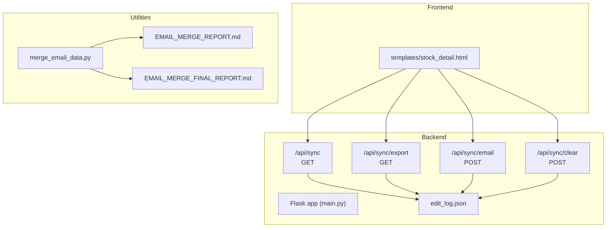
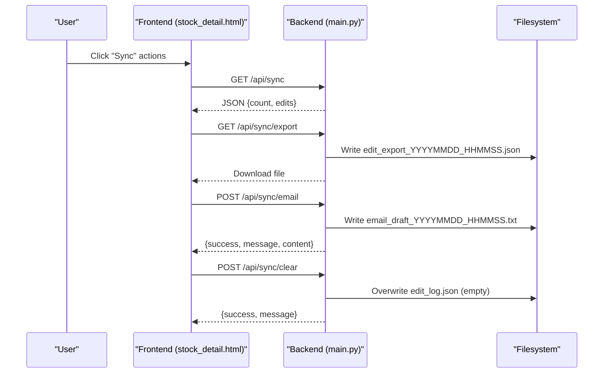
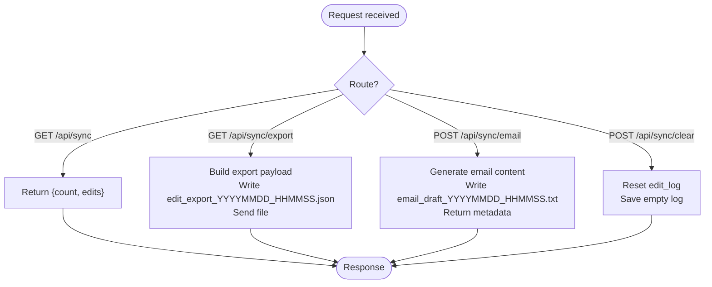
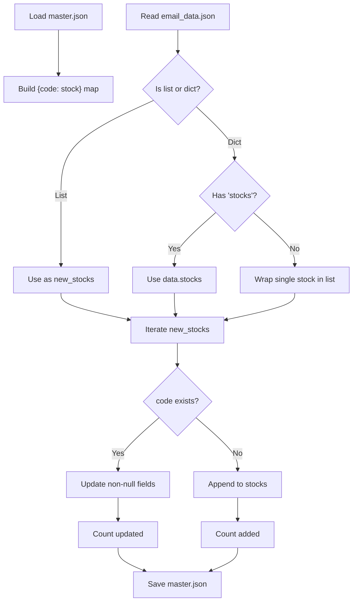
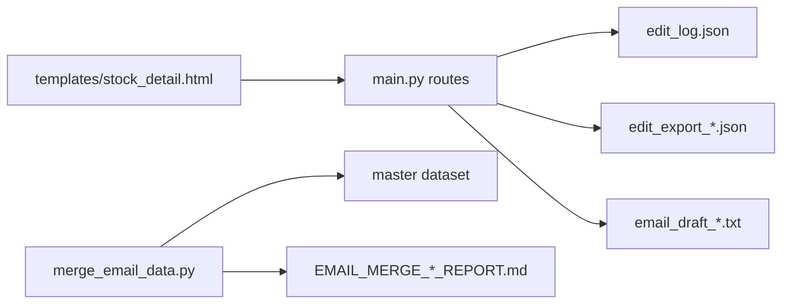

# Data Export and Synchronization

<cite>
**Referenced Files in This Document**
- [main.py](file://main.py)
- [SYNC_FEATURE.md](file://SYNC_FEATURE.md)
- [merge_email_data.py](file://merge_email_data.py)
- [EMAIL_MERGE_REPORT.md](file://EMAIL_MERGE_REPORT.md)
- [EMAIL_MERGE_FINAL_REPORT.md](file://EMAIL_MERGE_FINAL_REPORT.md)
- [templates/stock_detail.html](file://templates/stock_detail.html)
</cite>

## Table of Contents
1. [Introduction](#introduction)
2. [Project Structure](#project-structure)
3. [Core Components](#core-components)
4. [Architecture Overview](#architecture-overview)
5. [Detailed Component Analysis](#detailed-component-analysis)
6. [Dependency Analysis](#dependency-analysis)
7. [Performance Considerations](#performance-considerations)
8. [Troubleshooting Guide](#troubleshooting-guide)
9. [Conclusion](#conclusion)
10. [Appendices](#appendices)

## Introduction
This document explains the data export and synchronization capabilities of the stock research platform. It covers:
- Edit synchronization APIs for retrieving and exporting edit history
- Email draft generation for sharing edit summaries
- Email data merging utilities for consolidating external datasets
- Export file formats, timestamp-based naming, and archival strategies
- Reporting mechanisms for tracking email synchronization activities
- Best practices for batch processing and maintaining audit trails for compliance

## Project Structure
The synchronization and export features are implemented across backend routes, frontend templates, and standalone utilities:
- Backend routes handle retrieval, export, email draft generation, and clearing of edit logs
- Frontend templates provide the user interface for initiating synchronization actions
- Utilities support merging external email datasets into the master dataset

**Diagram sources**
- [main.py](file://main.py)
- [templates/stock_detail.html](file://templates/stock_detail.html)
- [merge_email_data.py](file://merge_email_data.py)
- [EMAIL_MERGE_REPORT.md](file://EMAIL_MERGE_REPORT.md)
- [EMAIL_MERGE_FINAL_REPORT.md](file://EMAIL_MERGE_FINAL_REPORT.md)

**Section sources**
- [SYNC_FEATURE.md](file://SYNC_FEATURE.md)
- [main.py](file://main.py)
- [templates/stock_detail.html](file://templates/stock_detail.html)
- [merge_email_data.py](file://merge_email_data.py)

## Core Components
- Edit log storage: JSON array persisted to a file for each edit operation
- Synchronization endpoints:
  - Retrieve edits: GET /api/sync
  - Export edits: GET /api/sync/export (downloads a timestamped JSON file)
  - Email draft: POST /api/sync/email (generates a timestamped text draft)
  - Clear logs: POST /api/sync/clear
- Frontend integration: stock detail page provides UI to trigger synchronization actions
- Email data merging: utility script merges external email datasets into the master stock dataset

Key behaviors:
- Timestamps use server time
- Content previews in logs are truncated; exports include full content
- Clearing logs does not affect saved stock data

**Section sources**
- [SYNC_FEATURE.md](file://SYNC_FEATURE.md)
- [main.py](file://main.py)

## Architecture Overview
The synchronization system follows a straightforward request-response pattern:
- Frontend triggers actions via buttons in the stock detail page
- Backend routes process requests, read/write the edit log, and optionally produce downloadable artifacts
- Email draft generation writes a temporary file for later manual review or sending

**Diagram sources**
- [main.py](file://main.py)
- [templates/stock_detail.html](file://templates/stock_detail.html)

## Detailed Component Analysis

### Backend Routes and Data Model
- Edit log persistence:
  - Loaded from a JSON file at startup
  - Appended on each edit operation
  - Saved after updates
- Endpoints:
  - GET /api/sync: returns current count and edits
  - GET /api/sync/export: constructs a structured export payload and sends a timestamped JSON file
  - POST /api/sync/email: builds a formatted text draft and saves it as a timestamped .txt file
  - POST /api/sync/clear: resets the in-memory log and persists empty log

**Diagram sources**
- [main.py](file://main.py)

**Section sources**
- [main.py](file://main.py)

### Frontend Integration
- Stock detail page exposes:
  - A “Sync” panel to view counts and recent edits
  - Actions to download JSON, copy summary text, and clear logs
- The panel leverages the backend endpoints to present and act upon edit history

Note: The panel UI and action handlers are defined in the stock detail template.

**Section sources**
- [SYNC_FEATURE.md](file://SYNC_FEATURE.md)
- [templates/stock_detail.html](file://templates/stock_detail.html)

### Email Data Merging Utility
The merge utility reads an external email dataset and merges it into the master stock dataset:
- Accepts either a list of stocks or a single stock object
- Updates existing entries by non-null fields and appends new stocks
- Saves the merged result back to the master file
- Produces detailed reports on additions, updates, and coverage improvements

**Diagram sources**
- [merge_email_data.py](file://merge_email_data.py)

**Section sources**
- [merge_email_data.py](file://merge_email_data.py)
- [EMAIL_MERGE_REPORT.md](file://EMAIL_MERGE_REPORT.md)
- [EMAIL_MERGE_FINAL_REPORT.md](file://EMAIL_MERGE_FINAL_REPORT.md)

### Export Formats and Naming Conventions
- JSON export:
  - File name: edit_export_YYYYMMDD_HHMMSS.json
  - Payload includes export_time, total_edits, and edits array
- Email draft:
  - File name: email_draft_YYYYMMDD_HHMMSS.txt
  - Content includes a subject line and a formatted summary per edit record

These conventions ensure deterministic, timestamped artifacts suitable for archiving and auditing.

**Section sources**
- [SYNC_FEATURE.md](file://SYNC_FEATURE.md)
- [main.py](file://main.py)

### Archival Strategies
- Keep exported JSON files with timestamped names for historical auditability
- Maintain a rolling backup of the master dataset before large merges
- Store generated email drafts locally for manual review prior to sending

**Section sources**
- [EMAIL_MERGE_REPORT.md](file://EMAIL_MERGE_REPORT.md)
- [EMAIL_MERGE_FINAL_REPORT.md](file://EMAIL_MERGE_FINAL_REPORT.md)

## Dependency Analysis
- Backend depends on:
  - Edit log file for persistence
  - Flask routing for HTTP endpoints
- Frontend depends on:
  - Template rendering and client-side scripts to call endpoints
- Email merging utility depends on:
  - Master dataset file and external email data file

**Diagram sources**
- [main.py](file://main.py)
- [templates/stock_detail.html](file://templates/stock_detail.html)
- [merge_email_data.py](file://merge_email_data.py)
- [EMAIL_MERGE_REPORT.md](file://EMAIL_MERGE_REPORT.md)
- [EMAIL_MERGE_FINAL_REPORT.md](file://EMAIL_MERGE_FINAL_REPORT.md)

**Section sources**
- [main.py](file://main.py)
- [templates/stock_detail.html](file://templates/stock_detail.html)
- [merge_email_data.py](file://merge_email_data.py)

## Performance Considerations
- Large edit logs:
  - Prefer incremental processing and pagination where applicable
  - Avoid loading entire logs into memory for very large datasets
- Export throughput:
  - Stream large JSON exports when feasible
  - Compress artifacts for long-term storage
- Email merging:
  - Batch updates to minimize repeated file I/O
  - Validate input data to prevent unnecessary writes

[No sources needed since this section provides general guidance]

## Troubleshooting Guide
Common issues and resolutions:
- No edit records returned:
  - Verify that edits occurred and the log was saved
  - Confirm the edit log file exists and is readable
- Export fails:
  - Ensure sufficient disk space for writing the timestamped file
  - Check permissions for the data directory
- Email draft not generated:
  - Confirm the endpoint receives a non-empty edit log
  - Inspect the generated draft file in the data directory
- Merge errors:
  - Validate the email data file format (list or dict with stocks)
  - Confirm stock codes are present and unique
  - Review the merge report for counts and anomalies

**Section sources**
- [main.py](file://main.py)
- [merge_email_data.py](file://merge_email_data.py)
- [EMAIL_MERGE_REPORT.md](file://EMAIL_MERGE_REPORT.md)
- [EMAIL_MERGE_FINAL_REPORT.md](file://EMAIL_MERGE_FINAL_REPORT.md)

## Conclusion
The synchronization and export system provides robust mechanisms for capturing, reviewing, and archiving editing activity, as well as integrating external email-derived data into the master dataset. By leveraging timestamped artifacts, clear endpoint semantics, and detailed reporting, teams can maintain audit trails and streamline collaboration workflows.

[No sources needed since this section summarizes without analyzing specific files]

## Appendices

### API Reference Summary
- GET /api/sync
  - Returns current edit count and list of edits
- GET /api/sync/export
  - Downloads a timestamped JSON export file
- POST /api/sync/email
  - Generates a timestamped email draft file and returns metadata
- POST /api/sync/clear
  - Clears the edit log and persists an empty log

**Section sources**
- [SYNC_FEATURE.md](file://SYNC_FEATURE.md)
- [main.py](file://main.py)