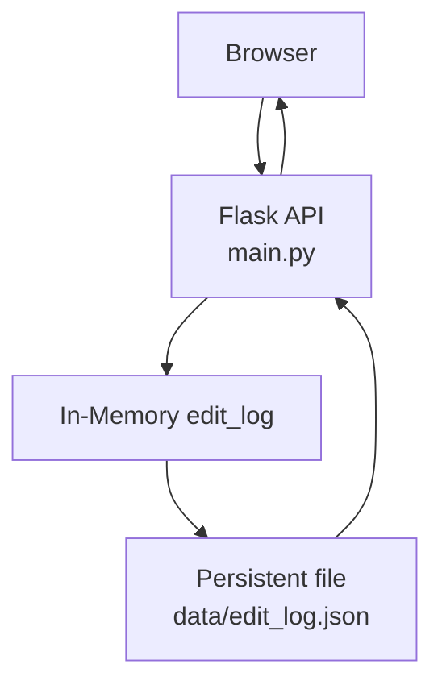
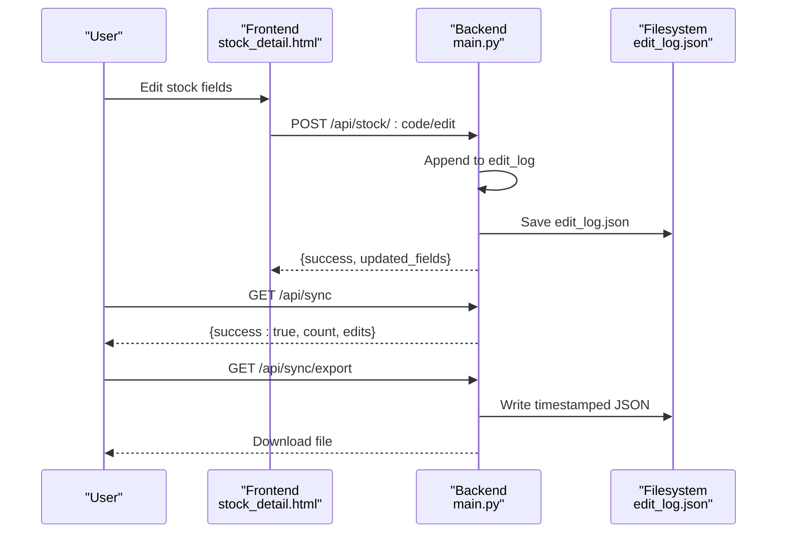
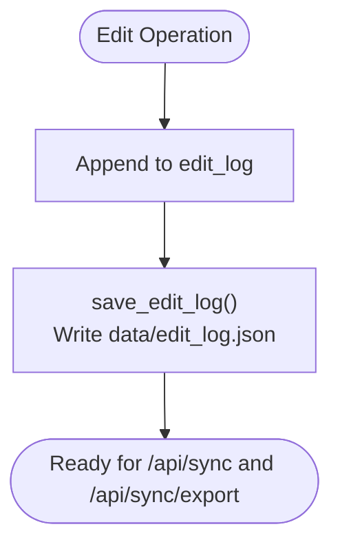
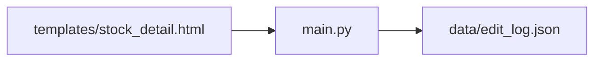

# Edit Synchronization

<cite>
**Referenced Files in This Document**
- [SYNC_FEATURE.md](file://SYNC_FEATURE.md)
- [main.py](file://main.py)
- [stock_detail.html](file://templates/stock_detail.html)
</cite>

## Table of Contents
1. [Introduction](#introduction)
2. [Project Structure](#project-structure)
3. [Core Components](#core-components)
4. [Architecture Overview](#architecture-overview)
5. [Detailed Component Analysis](#detailed-component-analysis)
6. [Dependency Analysis](#dependency-analysis)
7. [Performance Considerations](#performance-considerations)
8. [Troubleshooting Guide](#troubleshooting-guide)
9. [Conclusion](#conclusion)

## Introduction
This document describes the edit synchronization system that tracks, persists, and exports modifications made to stock research data. It covers:
- The /api/sync endpoint that returns all modification records
- The /api/sync/export endpoint that downloads a complete timestamped history
- The edit logging mechanism and persistence to data/edit_log.json
- The relationship between in-memory edit_log and persistent storage
- API response formats, error handling, and best practices for managing large edit histories

## Project Structure
The synchronization feature spans backend routes, in-memory state, and a persistent JSON log file:
- Backend routes and state management live in main.py
- The edit log is stored as data/edit_log.json
- Frontend integration appears in stock_detail.html via inline editing and a dedicated sync panel

**Diagram sources**
- [main.py:511-524](file://main.py#L511-L524)
- [main.py:612-685](file://main.py#L612-L685)

**Section sources**
- [main.py:506-524](file://main.py#L506-L524)
- [SYNC_FEATURE.md:88-111](file://SYNC_FEATURE.md#L88-L111)

## Core Components
- In-memory edit_log: List of edit entries accumulated during runtime
- Persistent edit_log.json: JSON file storing the edit history
- API endpoints:
  - GET /api/sync: Returns success flag, count, and edits array
  - GET /api/sync/export: Generates a timestamped JSON file and triggers download
  - POST /api/sync/clear: Clears in-memory edit_log and persists empty state
  - POST /api/sync/email: Generates an email draft file (future enhancement)

Key edit logging occurs when editing stock fields, where each edit is appended to edit_log and immediately saved to disk.

**Section sources**
- [main.py:514-515](file://main.py#L514-L515)
- [main.py:573-580](file://main.py#L573-L580)
- [main.py:612-685](file://main.py#L612-L685)
- [SYNC_FEATURE.md:90-111](file://SYNC_FEATURE.md#L90-L111)

## Architecture Overview
The synchronization workflow integrates inline editing with persistent logging and export capabilities.

**Diagram sources**
- [main.py:431-478](file://main.py#L431-L478)
- [main.py:612-638](file://main.py#L612-L638)

## Detailed Component Analysis

### API Endpoints

#### GET /api/sync
- Purpose: Retrieve all modification records
- Response format:
  - success: Boolean indicating operation success
  - count: Number of edits in the current in-memory log
  - edits: Array of edit objects
- Typical edit object fields:
  - timestamp: ISO timestamp of the edit
  - code: Stock code
  - name: Stock name
  - field or fields: Single field or list of edited fields
  - content or changes: Field-specific content or changed values
- Notes:
  - Returns empty edits array when no edits exist
  - Timestamps reflect server time

Example response structure:
{
  "success": true,
  "count": 5,
  "edits": [
    {
      "timestamp": "2026-03-16T15:30:12.123456",
      "code": "300308",
      "name": "中际旭创",
      "field": "insights",
      "content": "..."
    },
    ...
  ]
}

**Section sources**
- [main.py:612-619](file://main.py#L612-L619)
- [SYNC_FEATURE.md:36-52](file://SYNC_FEATURE.md#L36-L52)

#### GET /api/sync/export
- Purpose: Export complete edit history as a timestamped JSON file
- Behavior:
  - Generates a file named edit_export_YYYYMMDD_HHMMSS.json
  - Includes export_time (ISO timestamp), total_edits, and edits array
  - Sends the file as an attachment for download
- Error handling:
  - Returns 404 with error message when edit_log is empty

Example export structure:
{
  "export_time": "2026-03-16T15:45:30.123456",
  "total_edits": 5,
  "edits": [
    {
      "timestamp": "2026-03-16T15:30:12.123456",
      "code": "300308",
      "name": "中际旭创",
      "field": "insights",
      "content": "..."
    },
    ...
  ]
}

**Section sources**
- [main.py:621-638](file://main.py#L621-L638)
- [SYNC_FEATURE.md:31-37](file://SYNC_FEATURE.md#L31-L37)

#### POST /api/sync/clear
- Purpose: Clear the in-memory edit_log and persist an empty log
- Response: Success message confirming clearing

**Section sources**
- [main.py:679-685](file://main.py#L679-L685)

#### POST /api/sync/email
- Purpose: Generate an email draft file containing the current edit log summary
- Status: Implemented as a future enhancement

**Section sources**
- [main.py:640-677](file://main.py#L640-L677)
- [SYNC_FEATURE.md:96](file://SYNC_FEATURE.md#L96)

### Edit Logging Mechanism and Persistence

#### In-Memory edit_log
- Initialized as an empty list at startup
- Populated when editing stock fields (accident, insights, or general fields)
- Saved to disk after each edit

#### Persistent edit_log.json
- Stored under data/edit_log.json
- Loaded at startup if present
- Automatically appended to on each edit

#### Relationship Between Memory and File Storage
- edit_log is the in-memory representation
- save_edit_log writes edit_log to data/edit_log.json
- On restart, if the file exists, edit_log is initialized from it

**Diagram sources**
- [main.py:573-580](file://main.py#L573-L580)
- [main.py:518-523](file://main.py#L518-L523)

**Section sources**
- [main.py:514-515](file://main.py#L514-L515)
- [main.py:518-523](file://main.py#L518-L523)
- [main.py:573-580](file://main.py#L573-L580)

### Frontend Integration
- Inline editing in stock_detail.html triggers POST /api/stock/:code/edit
- Successful edits append to edit_log and persist to disk
- Users can open the sync panel to:
  - View total edits, affected stocks, and last edit time
  - Download JSON export
  - Copy formatted content
  - Clear logs

**Section sources**
- [stock_detail.html:1418-1458](file://templates/stock_detail.html#L1418-L1458)
- [SYNC_FEATURE.md:15-84](file://SYNC_FEATURE.md#L15-L84)

## Dependency Analysis
- main.py defines:
  - Routes for sync and export
  - edit_log initialization and persistence
  - File path constants for edit_log.json
- stock_detail.html provides:
  - Inline editing UI and submission to /api/stock/:code/edit
  - Integration with sync panel for viewing and exporting

**Diagram sources**
- [main.py:506-524](file://main.py#L506-L524)
- [main.py:612-638](file://main.py#L612-L638)

**Section sources**
- [main.py:506-524](file://main.py#L506-L524)
- [main.py:612-638](file://main.py#L612-L638)

## Performance Considerations
- Large edit histories:
  - Keep edit_log.json compact by limiting content length in logs (content truncated to 200 chars in logs)
  - Use export endpoint to archive and prune in-memory logs
- Frequent writes:
  - save_edit_log is called per edit; consider batching for very high-frequency editing
- API response size:
  - /api/sync returns the full edits array; for very large histories, prefer incremental retrieval or pagination if extended

[No sources needed since this section provides general guidance]

## Troubleshooting Guide
Common issues and resolutions:
- Empty edit log:
  - Cause: No edits performed yet or logs cleared
  - Resolution: Perform edits to populate edit_log; confirm data/edit_log.json exists and is readable
- Export fails with 404:
  - Cause: edit_log is empty
  - Resolution: Perform edits to populate logs; retry export
- Permission errors writing edit_log.json:
  - Cause: Insufficient write permissions to data/ directory
  - Resolution: Ensure the application process has write access to data/
- Timezone considerations:
  - Timestamps are server-side; ensure server timezone is Asia/Shanghai as documented

**Section sources**
- [main.py:624-625](file://main.py#L624-L625)
- [SYNC_FEATURE.md:133-139](file://SYNC_FEATURE.md#L133-L139)

## Conclusion
The edit synchronization system provides a straightforward mechanism to track, persist, and export stock research edits. By combining in-memory edit_log with persistent JSON storage, it ensures reliable auditability and easy archival. Use the /api/sync endpoint for real-time inspection and /api/sync/export for backup and sharing. For large datasets, leverage periodic exports and clear operations to maintain manageable logs.