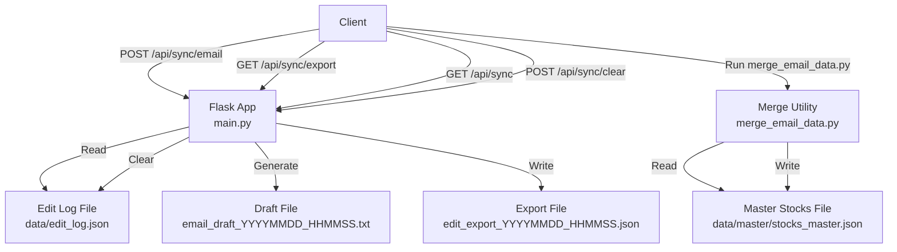
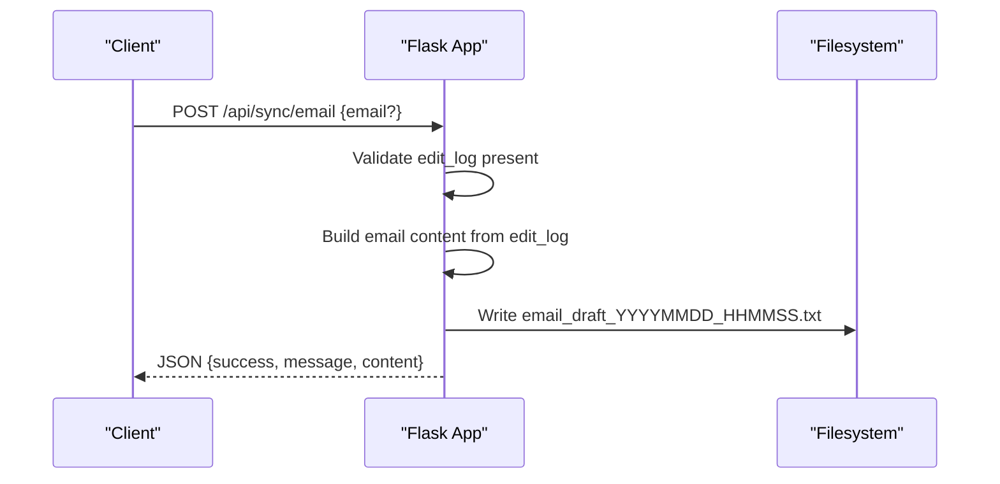
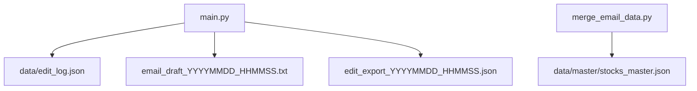

# Email Synchronization

<cite>
**Referenced Files in This Document**
- [main.py](file://main.py)
- [merge_email_data.py](file://merge_email_data.py)
- [SYNC_FEATURE.md](file://SYNC_FEATURE.md)
</cite>

## Table of Contents
1. [Introduction](#introduction)
2. [Project Structure](#project-structure)
3. [Core Components](#core-components)
4. [Architecture Overview](#architecture-overview)
5. [Detailed Component Analysis](#detailed-component-analysis)
6. [Dependency Analysis](#dependency-analysis)
7. [Performance Considerations](#performance-considerations)
8. [Troubleshooting Guide](#troubleshooting-guide)
9. [Conclusion](#conclusion)
10. [Appendices](#appendices)

## Introduction
This document describes the email synchronization feature that generates formatted email drafts containing edit summaries. It covers the /api/sync/email endpoint, including request parameters, response format, and generated file naming conventions. It also documents the email content structure (timestamp, stock information, field types, and content excerpts), the merge_email_data.py utility for combining multiple email datasets, and the email generation process including temporary file creation and cleanup. Examples of generated email content, integration with email clients, and batch processing capabilities for large datasets are included, along with error handling, validation requirements, and best practices.

## Project Structure
The email synchronization feature spans backend API endpoints, data storage, and a data merge utility:
- Backend API endpoints in main.py handle retrieval, export, email draft generation, and clearing of edit logs.
- Edit logs are stored in a JSON file and appended automatically when editing stock fields.
- The merge_email_data.py utility merges email-provided stock data into the master dataset.

**Diagram sources**
- [main.py:511-523](file://main.py#L511-L523)
- [main.py:640-677](file://main.py#L640-L677)
- [main.py:621-638](file://main.py#L621-L638)
- [main.py:679-685](file://main.py#L679-L685)
- [merge_email_data.py:9-76](file://merge_email_data.py#L9-L76)

**Section sources**
- [main.py:511-523](file://main.py#L511-L523)
- [main.py:621-638](file://main.py#L621-L638)
- [main.py:640-677](file://main.py#L640-L677)
- [main.py:679-685](file://main.py#L679-L685)
- [merge_email_data.py:1-88](file://merge_email_data.py#L1-L88)

## Core Components
- Edit log storage and persistence
  - Edit logs are loaded from and saved to a JSON file. Each edit record includes timestamp, stock code/name, field type, and truncated content.
- Email draft generation endpoint
  - The POST /api/sync/email endpoint validates presence of edits, builds a formatted email body, writes a temporary draft file, and returns metadata.
- Export endpoint
  - The GET /api/sync/export endpoint creates a timestamped JSON export file containing full edit records and serves it as an attachment.
- Clear endpoint
  - The POST /api/sync/clear endpoint clears the in-memory edit log and persists the empty state.
- Merge utility
  - The merge_email_data.py script reads email-provided stock data and merges it into the master dataset, supporting both list and single-record inputs.

**Section sources**
- [main.py:511-523](file://main.py#L511-L523)
- [main.py:536-569](file://main.py#L536-L569)
- [main.py:621-638](file://main.py#L621-L638)
- [main.py:640-677](file://main.py#L640-L677)
- [main.py:679-685](file://main.py#L679-L685)
- [merge_email_data.py:9-76](file://merge_email_data.py#L9-L76)

## Architecture Overview
The email synchronization feature integrates frontend actions with backend endpoints and filesystem operations. The primary flow for generating an email draft is shown below.

**Diagram sources**
- [main.py:640-677](file://main.py#L640-L677)

## Detailed Component Analysis

### Endpoint: POST /api/sync/email
Purpose
- Generate a formatted email draft from current edit logs and write it to a temporary file.

Request
- Method: POST
- Content-Type: application/json
- Body parameters
  - email: optional string; recipient address hint (not validated or used for sending)
- Behavior
  - Returns error 404 if no edit logs exist.
  - Builds a plain-text email body with a subject line and a section per edit, including timestamp, stock name/code, field type, and content excerpt.
  - Writes a temporary file named email_draft_YYYYMMDD_HHMMSS.txt in the same directory as the edit log file.
  - Returns a JSON object with success flag, message indicating the filename, and the full content.

Response
- Success payload
  - success: boolean true
  - message: string describing the generated filename
  - content: string containing the full email body
- Error payload
  - error: string when no edit logs are present

Generated file naming convention
- Pattern: email_draft_YYYYMMDD_HHMMSS.txt
- Location: next to the edit log file (data/edit_log.json)

Email content structure
- Subject line: "Stock Data Edit Sync - N updates"
- Sections
  - Timestamp
  - Stock name and code
  - Field type (e.g., insights or accident)
  - Content excerpt (truncated to 200 characters in logs)
- Delimiter between entries: horizontal rule

Integration with email clients
- The endpoint writes a .txt file intended to be opened in an email client as a draft. The client can then copy/paste the content or use the file as a starting point for an email.

Batch processing
- The endpoint processes all current edit logs in memory. For very large edit histories, consider exporting via /api/sync/export to a JSON file and processing externally.

Validation and error handling
- If no edit logs exist, returns 404 with an error message.
- On successful generation, returns 200 with success payload.

**Section sources**
- [main.py:640-677](file://main.py#L640-L677)
- [SYNC_FEATURE.md:59-77](file://SYNC_FEATURE.md#L59-L77)

### Endpoint: GET /api/sync/export
Purpose
- Export the current edit logs as a timestamped JSON file.

Behavior
- Validates presence of edit logs; returns 404 if none.
- Constructs an export payload with export_time, total_edits, and edits.
- Writes a file named edit_export_YYYYMMDD_HHMMSS.json in the edit log directory.
- Sends the file as an attachment.

File naming convention
- Pattern: edit_export_YYYYMMDD_HHMMSS.json

**Section sources**
- [main.py:621-638](file://main.py#L621-L638)
- [SYNC_FEATURE.md:31-52](file://SYNC_FEATURE.md#L31-L52)

### Endpoint: GET /api/sync
Purpose
- Retrieve current edit logs as JSON.

Behavior
- Returns a JSON object with success flag, count, and edits array.

**Section sources**
- [main.py:612-619](file://main.py#L612-L619)

### Endpoint: POST /api/sync/clear
Purpose
- Clear the in-memory edit log and persist the empty state.

Behavior
- Resets edit_log to an empty list and saves to disk.

**Section sources**
- [main.py:679-685](file://main.py#L679-L685)

### Data Model: Edit Log
Fields
- timestamp: ISO-format datetime string
- code: stock code
- name: stock name
- field: either "accident" or "insights"
- content: content excerpt (up to 200 characters)

Persistence
- Loaded from and saved to data/edit_log.json.

**Section sources**
- [main.py:511-523](file://main.py#L511-L523)
- [main.py:536-569](file://main.py#L536-L569)
- [SYNC_FEATURE.md:23-27](file://SYNC_FEATURE.md#L23-L27)

### Utility: merge_email_data.py
Purpose
- Merge stock data extracted from email attachments into the master dataset.

Input
- master.json path: default path configured in the script
- email_data.json path: path passed as command-line argument
- Optional output path: defaults to master.json if omitted

Processing workflow
- Load master.json and build a dictionary keyed by stock code.
- Load email_data.json; accept either a list of stocks or a single stock object.
- Iterate over incoming stocks:
  - Skip entries without a code.
  - For existing codes, update non-null fields.
  - For new codes, append to the stocks list and update the lookup dictionary.
- Save the updated master dataset to the output path.

Output
- Updated master.json with merged data.

Merge strategies
- Non-null overwrite: only non-empty values from the email data overwrite existing fields.
- Deduplicate by code: later updates supersede earlier ones for the same code.

Command-line usage
- python3 merge_email_data.py <email_data.json> [output.json]

Notes
- The script prints progress messages and final counts for added and updated stocks.

**Section sources**
- [merge_email_data.py:9-76](file://merge_email_data.py#L9-L76)
- [merge_email_data.py:78-87](file://merge_email_data.py#L78-L87)

### Email Generation Process and Cleanup
Generation steps
- Validate edit_log is non-empty.
- Construct email content from edit_log entries.
- Write a temporary file named email_draft_YYYYMMDD_HHMMSS.txt in the edit log directory.
- Return JSON response with success, filename, and content.

Cleanup
- The endpoint does not delete the generated draft file after use. Administrators can manage these files manually or via external scripts.

**Section sources**
- [main.py:640-677](file://main.py#L640-L677)

## Dependency Analysis
High-level dependencies
- main.py depends on the edit log file for input and writes temporary draft files to the same directory.
- merge_email_data.py depends on the master dataset file and accepts an email data file as input.

**Diagram sources**
- [main.py:511-523](file://main.py#L511-L523)
- [main.py:640-677](file://main.py#L640-L677)
- [main.py:621-638](file://main.py#L621-L638)
- [merge_email_data.py:86-87](file://merge_email_data.py#L86-L87)

**Section sources**
- [main.py:511-523](file://main.py#L511-L523)
- [main.py:621-638](file://main.py#L621-L638)
- [main.py:640-677](file://main.py#L640-L677)
- [merge_email_data.py:86-87](file://merge_email_data.py#L86-L87)

## Performance Considerations
- Large edit logs
  - The email draft endpoint iterates over all edits to build the content. For very large logs, consider pagination or filtering before invoking the endpoint.
- File I/O
  - Writing temporary draft files is synchronous. For high-throughput scenarios, consider asynchronous processing and cleanup scheduling.
- Export vs. draft
  - Prefer /api/sync/export for bulk operations and archival, as it produces a compact JSON file suitable for downstream processing.

## Troubleshooting Guide
Common issues and resolutions
- No edit logs available
  - Symptom: 404 error from /api/sync/email.
  - Resolution: Perform edits to populate the log, then retry.
- Empty or missing edit log file
  - Symptom: Errors during load/save.
  - Resolution: Ensure the edit log file exists and is readable/writable by the server process.
- Merge utility errors
  - Symptom: Script exits with usage message or fails to update master.
  - Resolution: Verify input paths, ensure email_data.json is valid JSON, and confirm the default master path is correct.
- Draft file not found
  - Symptom: Client cannot locate the generated draft.
  - Resolution: Check the returned filename in the response and confirm the directory permissions.

Validation requirements
- Request body for /api/sync/email is optional; email address is not validated.
- Presence of edit logs is mandatory for /api/sync/email.

Best practices
- Use /api/sync/export for backups and audits.
- Use /api/sync/email for quick draft generation and manual distribution.
- Periodically clean up old draft files to avoid clutter.
- For large datasets, process exports with merge_email_data.py and review changes before committing to master.

**Section sources**
- [main.py:640-677](file://main.py#L640-L677)
- [merge_email_data.py:78-87](file://merge_email_data.py#L78-L87)

## Conclusion
The email synchronization feature provides a streamlined workflow for generating email-ready summaries of stock research edits. The /api/sync/email endpoint produces a structured draft file, while /api/sync/export offers a durable JSON export for batch processing. The merge_email_data.py utility supports integrating email-derived stock data into the master dataset. Together, these components enable efficient collaboration, auditing, and data maintenance for stock research workflows.

## Appendices

### API Reference: Email Synchronization Endpoints
- GET /api/sync
  - Returns current edit logs.
- GET /api/sync/export
  - Generates and downloads a timestamped JSON export.
- POST /api/sync/email
  - Generates a draft file and returns metadata.
- POST /api/sync/clear
  - Clears the in-memory edit log.

**Section sources**
- [main.py:612-619](file://main.py#L612-L619)
- [main.py:621-638](file://main.py#L621-L638)
- [main.py:640-677](file://main.py#L640-L677)
- [main.py:679-685](file://main.py#L679-L685)

### Example: Generated Email Content
- Subject line: "Stock Data Edit Sync - N updates"
- Entry format:
  - Time: <timestamp>
  - Stock: <name> (<code>)
  - Field: <field>
  - Content: <excerpt>
  - Separator: horizontal rule

**Section sources**
- [SYNC_FEATURE.md:59-77](file://SYNC_FEATURE.md#L59-L77)
- [main.py:650-666](file://main.py#L650-L666)