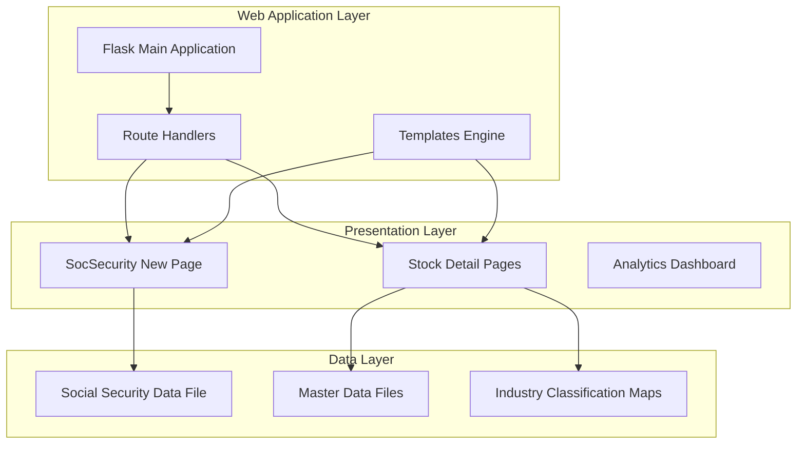
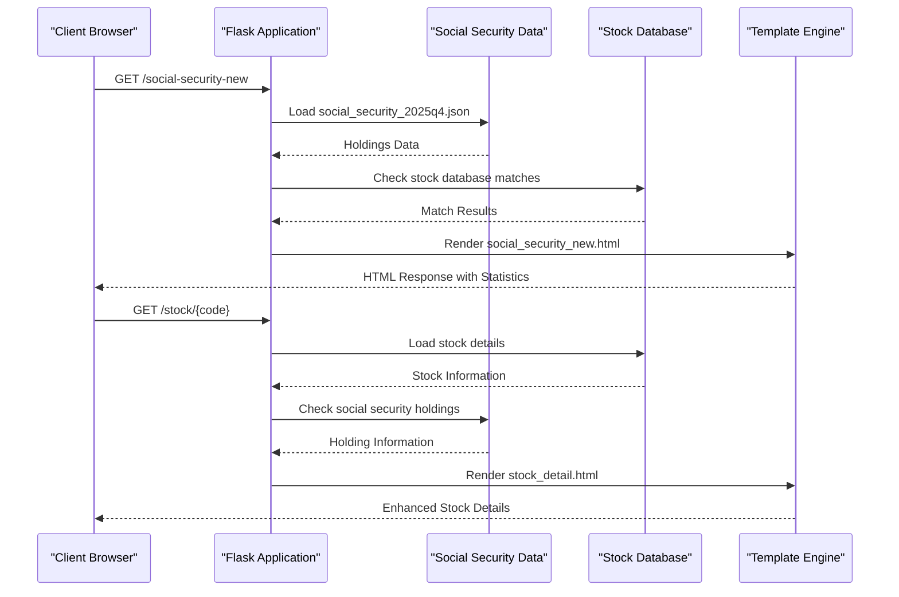
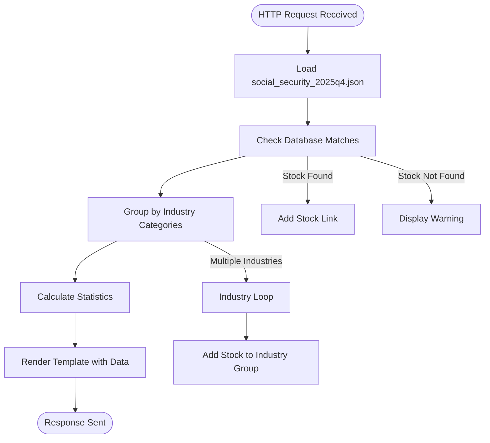
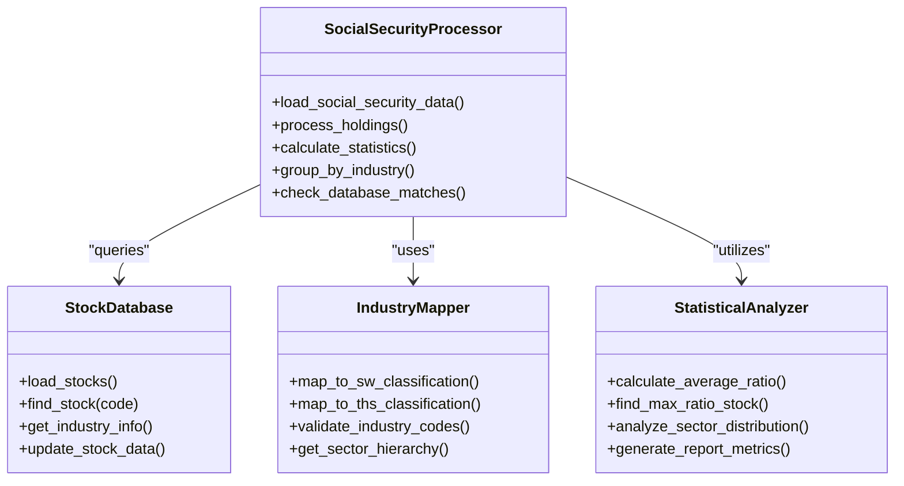
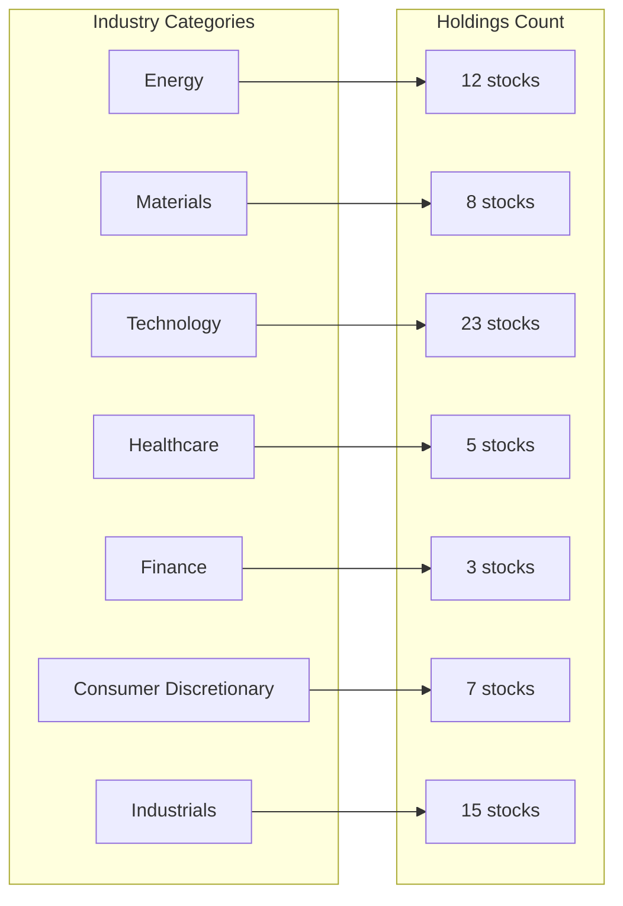
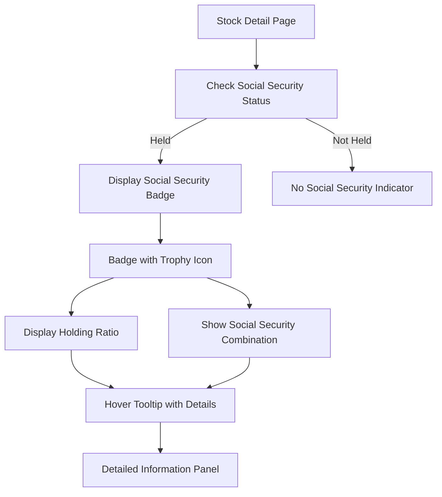
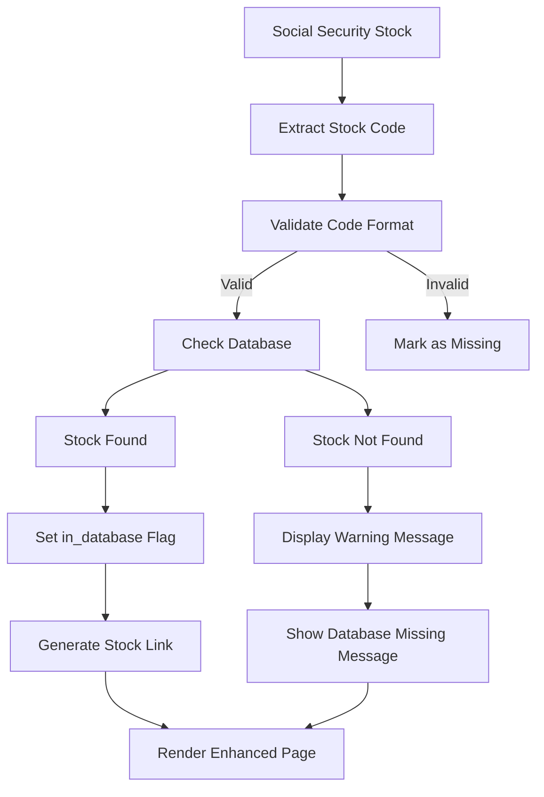

# Social Security Fund Integration

<cite>
**Referenced Files in This Document**
- [main.py](file://main.py)
- [social_security_2025q4.json](file://data/master/social_security_2025q4.json)
- [social_security_new.html](file://templates/social_security_new.html)
- [stock_detail.html](file://templates/stock_detail.html)
- [industry_map.json](file://data/master/industry_map.json)
- [ths_industry_map.json](file://data/master/ths_industry_map.json)
- [README.md](file://README.md)
</cite>

## Table of Contents
1. [Introduction](#introduction)
2. [Project Structure](#project-structure)
3. [Core Components](#core-components)
4. [Architecture Overview](#architecture-overview)
5. [Detailed Component Analysis](#detailed-component-analysis)
6. [Industry Group Analysis](#industry-group-analysis)
7. [Statistical Reporting Features](#statistical-reporting-features)
8. [Social Security Holdings Integration](#social-security-holdings-integration)
9. [Data Validation and Matching](#data-validation-and-matching)
10. [Usage Examples](#usage-examples)
11. [Performance Considerations](#performance-considerations)
12. [Troubleshooting Guide](#troubleshooting-guide)
13. [Conclusion](#conclusion)

## Introduction

The Social Security Fund Integration system is a comprehensive data analytics platform designed to track and analyze China's social security fund holdings in A-share markets. This system provides institutional investors and retail analysts with real-time visibility into major institutional positioning, enabling data-driven investment decisions through detailed sector analysis, statistical reporting, and integrated stock research capabilities.

The platform centers around the `/social-security-new` endpoint, which presents the 2025Q4 holdings data from the `social_security_2025q4.json` data source. This integration allows users to monitor new positions taken by national social security funds, providing insights into macroeconomic trends and institutional sentiment across various sectors including Energy, Materials, Technology, Healthcare, and Financials.

## Project Structure

The social security fund integration system follows a modular Flask architecture with clear separation of concerns:

**Diagram sources**
- [main.py:220-273](file://main.py#L220-L273)
- [social_security_2025q4.json:1-217](file://data/master/social_security_2025q4.json#L1-L217)

**Section sources**
- [main.py:138-218](file://main.py#L138-L218)
- [README.md:1-126](file://README.md#L1-L126)

## Core Components

### Social Security Data Management

The system maintains a dedicated dataset containing quarterly social security fund holdings with comprehensive metadata including holding ratios, industry classifications, and core business descriptions. The data structure supports both historical tracking and real-time monitoring capabilities.

### Industry Classification System

The platform implements a multi-tiered industry classification system supporting both SW (Shanghai-Wuhan) and THS (Tong Hua Shun) classification standards. This dual approach ensures comprehensive coverage of sector categorization while maintaining flexibility for different analytical perspectives.

### Statistical Reporting Engine

Built-in statistical analysis capabilities provide instant insights including average holding ratios, maximum position tracking, and sector distribution analysis. These metrics enable quick assessment of institutional positioning across different market segments.

**Section sources**
- [main.py:72-91](file://main.py#L72-L91)
- [main.py:220-273](file://main.py#L220-L273)

## Architecture Overview

The social security fund integration follows a client-server architecture with Flask serving as the primary web framework:

**Diagram sources**
- [main.py:220-336](file://main.py#L220-L336)
- [social_security_new.html:310-328](file://templates/social_security_new.html#L310-L328)

## Detailed Component Analysis

### Social Security Holdings Tracking Endpoint

The `/social-security-new` endpoint serves as the central hub for social security fund holdings analysis:

**Diagram sources**
- [main.py:220-273](file://main.py#L220-L273)
- [social_security_new.html:330-373](file://templates/social_security_new.html#L330-L373)

**Section sources**
- [main.py:220-273](file://main.py#L220-L273)
- [social_security_2025q4.json:7-215](file://data/master/social_security_2025q4.json#L7-L215)

### Data Loading and Processing Pipeline

The system implements a robust data loading mechanism that handles multiple data sources and formats:

**Diagram sources**
- [main.py:72-91](file://main.py#L72-L91)
- [main.py:220-273](file://main.py#L220-L273)

**Section sources**
- [main.py:72-91](file://main.py#L72-L91)
- [main.py:220-273](file://main.py#L220-L273)

## Industry Group Analysis

The platform provides sophisticated industry classification and analysis capabilities through multiple mapping systems:

### Multi-Level Industry Classification

The system supports three-tier industry classification covering:

- **Level 1**: Broad economic sectors (Energy, Materials, Technology, Healthcare, Financials, etc.)
- **Level 2**: Sub-sector categorization (Renewable Energy, Specialty Chemicals, Semiconductors, etc.)
- **Level 3**: Specific industry细分 (Thin-film Solar, Lithium Battery Materials, Chip Manufacturing, etc.)

### Industry Distribution Analysis

The platform automatically groups social security holdings by industry categories and provides distribution statistics:

**Diagram sources**
- [social_security_2025q4.json:11-178](file://data/master/social_security_2025q4.json#L11-L178)

**Section sources**
- [social_security_2025q4.json:11-178](file://data/master/social_security_2025q4.json#L11-L178)
- [industry_map.json:6-800](file://data/master/industry_map.json#L6-L800)

## Statistical Reporting Features

### Real-Time Metrics Calculation

The system automatically calculates key statistical metrics for social security holdings:

| Metric Type | Description | Calculation Method |
|-------------|-------------|-------------------|
| Average Holding Ratio | Mean percentage of shares held across all positions | Sum of all ratios ÷ Total holdings |
| Maximum Ratio Holder | Stock with highest individual holding percentage | Find maximum value in ratio array |
| Sector Distribution | Holdings by industry category | Group by industry_category field |
| Portfolio Concentration | Percentage of total holdings in top N sectors | Sum top N sectors ÷ Total holdings |

### Dynamic Statistics Display

The `/social-security-new` page presents four key statistics cards:

1. **Total Count**: Number of new social security holdings (currently 23)
2. **Industry Coverage**: Number of distinct industry sectors represented
3. **Average Holding Ratio**: Mean percentage across all holdings
4. **Highest Single Position**: Largest individual holding percentage

**Section sources**
- [main.py:247-267](file://main.py#L247-L267)
- [social_security_new.html:311-328](file://templates/social_security_new.html#L311-L328)

## Social Security Holdings Integration

### Stock Detail Page Enhancement

Each stock detail page integrates social security fund information through a prominent badge system:

**Diagram sources**
- [main.py:328-335](file://main.py#L328-L335)
- [stock_detail.html:958-965](file://templates/stock_detail.html#L958-L965)

### Visual Indicators and Styling

The social security badge features:

- **Distinctive Yellow/Gold Color Scheme**: Differentiates from other institutional indicators
- **Animated Glow Effect**: Subtle pulsing animation to draw attention
- **Trophy Icon**: Visual representation of "new position" status
- **Holding Ratio Display**: Shows the specific percentage held
- **Hover Tooltips**: Provides detailed information on mouseover

**Section sources**
- [stock_detail.html:261-287](file://templates/stock_detail.html#L261-L287)
- [stock_detail.html:958-965](file://templates/stock_detail.html#L958-L965)

## Data Validation and Matching

### Database Integration Process

The system implements a sophisticated matching algorithm to connect social security holdings with existing stock database records:

**Diagram sources**
- [main.py:232-238](file://main.py#L232-L238)
- [social_security_new.html:339-369](file://templates/social_security_new.html#L339-L369)

### Validation Rules and Error Handling

The matching process includes several validation steps:

1. **Code Format Validation**: Ensures proper 6-digit stock code format
2. **Database Lookup**: Confirms stock exists in master database
3. **Industry Category Mapping**: Validates industry classification codes
4. **Ratio Parsing**: Converts percentage strings to numeric values
5. **Change Type Verification**: Confirms valid change type values

**Section sources**
- [main.py:232-238](file://main.py#L232-L238)
- [social_security_2025q4.json:8-215](file://data/master/social_security_2025q4.json#L8-L215)

## Usage Examples

### Portfolio Analysis Workflow

The social security fund integration enables comprehensive portfolio analysis through the following workflow:

1. **Initial Screening**: Use `/social-security-new` to identify trending sectors
2. **Detailed Analysis**: Click on specific holdings for detailed stock information
3. **Comparison Analysis**: Compare social security positions with other institutional holders
4. **Trend Monitoring**: Track quarterly changes in social security positioning

### Investment Decision Support

The platform provides actionable insights for investment decisions:

- **Sector Rotation Signals**: Early identification of institutional positioning shifts
- **Quality Assessment**: Social security holdings often indicate quality companies
- **Timing Insights**: New positions may signal undervalued opportunities
- **Risk Diversification**: Understanding broad institutional positioning helps diversification decisions

### Example Analysis Scenarios

**Scenario 1: Technology Sector Analysis**
- Social security fund increased exposure to technology sector
- Focus on semiconductor and renewable energy subsectors
- Monitor leadership positions in AI and clean energy

**Scenario 2: Financial Sector Rotation**
- Shift from traditional financials to specialized financial services
- Increased focus on asset management and insurance sectors
- Evaluate impact on banking sector valuations

**Section sources**
- [social_security_2025q4.json:1-217](file://data/master/social_security_2025q4.json#L1-L217)
- [main.py:220-273](file://main.py#L220-L273)

## Performance Considerations

### Data Loading Optimization

The system implements several performance optimizations:

- **Lazy Loading**: Social security data loaded only when needed
- **Caching Mechanisms**: Frequently accessed data cached in memory
- **Efficient JSON Parsing**: Optimized parsing of large JSON datasets
- **Database Indexing**: Proper indexing for fast stock lookup operations

### Memory Management

- **Streaming JSON Processing**: Large files processed in chunks to minimize memory usage
- **Object Pooling**: Reuse of frequently created objects
- **Garbage Collection**: Strategic cleanup of unused objects

### Scalability Features

- **Asynchronous Processing**: Background tasks for heavy computations
- **Database Connection Pooling**: Efficient database resource management
- **Template Caching**: Compiled templates for faster rendering

## Troubleshooting Guide

### Common Issues and Solutions

**Issue 1: Social Security Data Loading Failures**
- **Symptoms**: Empty holdings list or error messages
- **Causes**: Missing or corrupted `social_security_2025q4.json` file
- **Solutions**: Verify file existence and JSON validity, check file permissions

**Issue 2: Stock Database Matching Problems**
- **Symptoms**: Many holdings show "Database Missing" warnings
- **Causes**: Stock code mismatches or missing database entries
- **Solutions**: Validate stock codes against exchange listings, update master database

**Issue 3: Performance Degradation**
- **Symptoms**: Slow page load times or timeouts
- **Causes**: Large dataset processing or insufficient server resources
- **Solutions**: Implement pagination, optimize database queries, add caching layers

**Issue 4: Industry Classification Errors**
- **Symptoms**: Incorrect sector assignments or missing classifications
- **Causes**: Outdated industry mapping files or inconsistent naming
- **Solutions**: Update industry mapping files, standardize naming conventions

**Section sources**
- [main.py:225-230](file://main.py#L225-L230)
- [main.py:89-91](file://main.py#L89-L91)

## Conclusion

The Social Security Fund Integration system provides a comprehensive solution for tracking and analyzing institutional investor positioning in China's A-share markets. Through its sophisticated data processing pipeline, industry classification system, and real-time statistical reporting capabilities, the platform enables both institutional and retail investors to make informed decisions based on macro-level positioning trends.

The integration of social security fund holdings into stock detail pages creates a seamless user experience that combines fundamental analysis with institutional positioning insights. The system's modular architecture ensures scalability and maintainability while providing powerful analytical capabilities for portfolio management and investment research.

Future enhancements could include real-time data feeds, expanded institutional coverage, and advanced predictive analytics based on historical positioning patterns. The current foundation provides an excellent base for continued development and feature expansion.