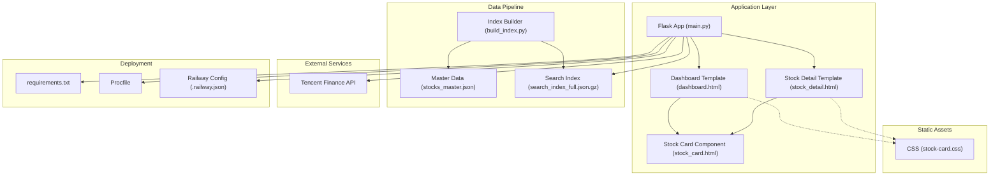
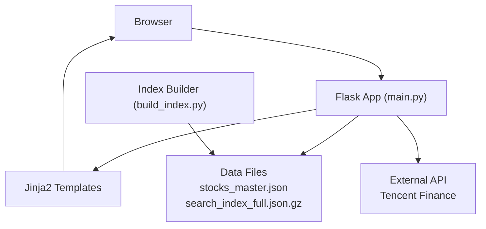
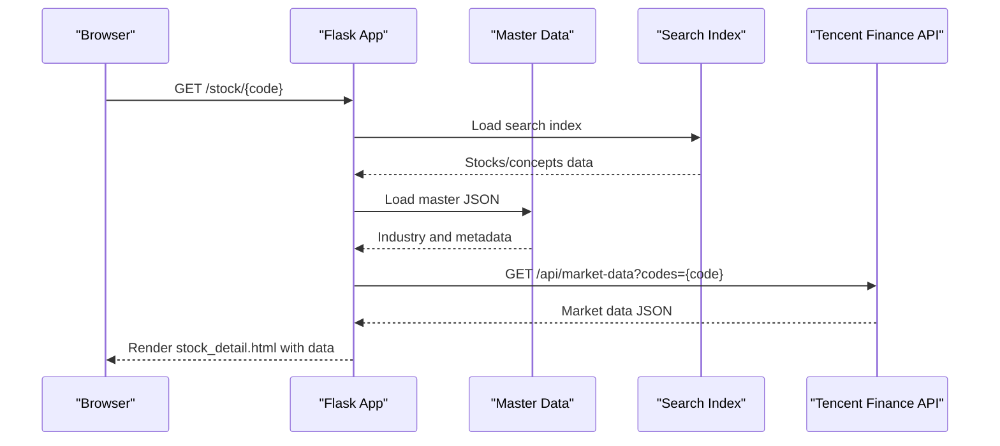
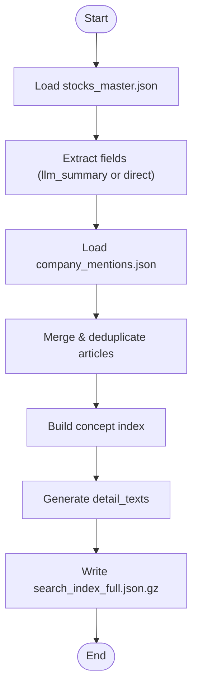
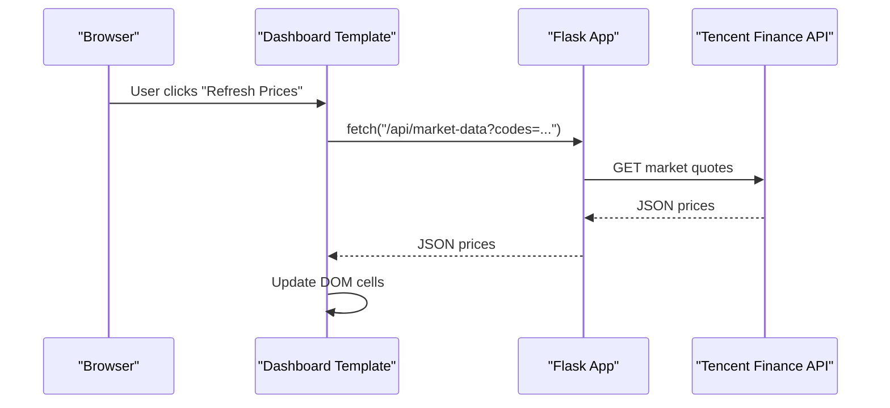
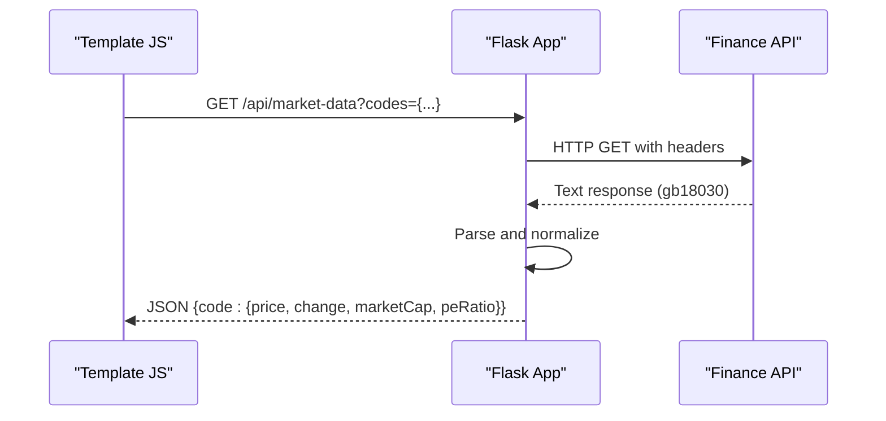
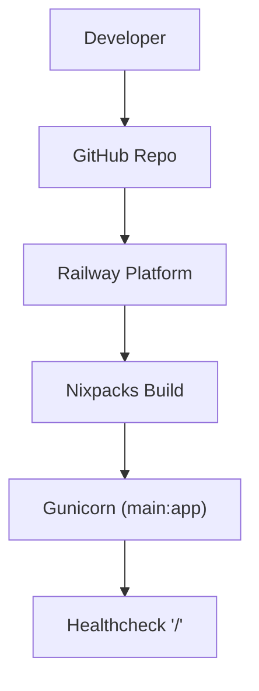
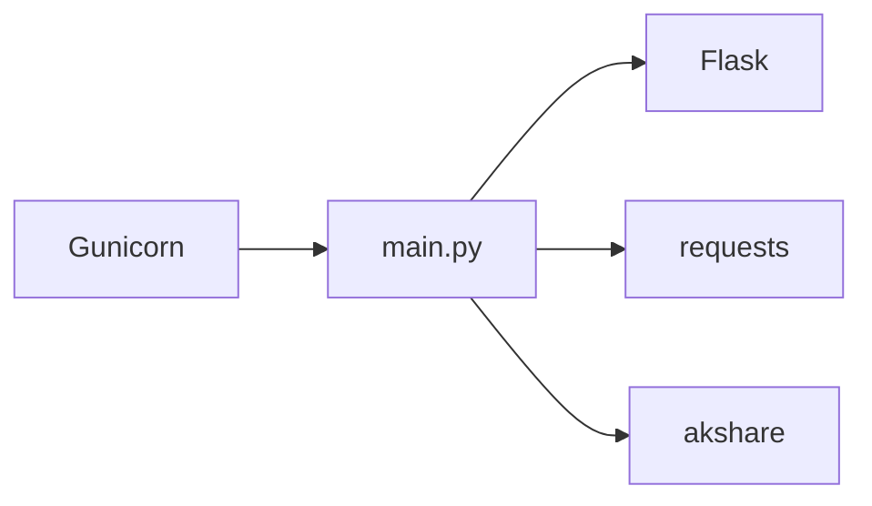

# Architecture Overview

<cite>
**Referenced Files in This Document**
- [main.py](file://main.py)
- [requirements.txt](file://requirements.txt)
- [Procfile](file://Procfile)
- [.railway.json](file://.railway.json)
- [templates/dashboard.html](file://templates/dashboard.html)
- [templates/stock_detail.html](file://templates/stock_detail.html)
- [templates/components/stock_card.html](file://templates/components/stock_card.html)
- [static/css/stock-card.css](file://static/css/stock-card.css)
- [build_index.py](file://build_index.py)
- [data/master/stocks_master.json](file://data/master/stocks_master.json)
- [README.md](file://README.md)
- [DEPLOYMENT_CHECKLIST.md](file://DEPLOYMENT_CHECKLIST.md)
- [RAILWAY_CACHE_DEBUG.md](file://RAILWAY_CACHE_DEBUG.md)
- [RAILWAY_NUCLEAR_OPTION.md](file://RAILWAY_NUCLEAR_OPTION.md)
- [trigger_deploy.sh](file://trigger_deploy.sh)
</cite>

## Table of Contents
1. [Introduction](#introduction)
2. [Project Structure](#project-structure)
3. [Core Components](#core-components)
4. [Architecture Overview](#architecture-overview)
5. [Detailed Component Analysis](#detailed-component-analysis)
6. [Dependency Analysis](#dependency-analysis)
7. [Performance Considerations](#performance-considerations)
8. [Troubleshooting Guide](#troubleshooting-guide)
9. [Conclusion](#conclusion)
10. [Appendices](#appendices)

## Introduction
This document describes the architecture of the Stock Research Platform built with Flask and Jinja2. The system follows an MVC-like pattern: Flask routes act as controllers, Jinja2 templates serve as views, and Python logic handles model-like data processing. The platform integrates a data processing pipeline that transforms raw sentiment and master datasets into a search index for fast web queries. It supports AJAX-driven updates for real-time market data via an external financial API and deploys to Railway with cloud-native configuration.

## Project Structure
The repository is organized around a Flask application, Jinja2 templates, static assets, and a data processing pipeline:
- Application entry and routing: main.py
- Template rendering: templates/*
- Static assets: static/css/*
- Data processing: build_index.py and data/*
- Deployment configuration: requirements.txt, Procfile, .railway.json
- Documentation and deployment logs: various markdown files

**Diagram sources**
- [main.py](file://main.py)
- [templates/dashboard.html](file://templates/dashboard.html)
- [templates/stock_detail.html](file://templates/stock_detail.html)
- [templates/components/stock_card.html](file://templates/components/stock_card.html)
- [static/css/stock-card.css](file://static/css/stock-card.css)
- [build_index.py](file://build_index.py)
- [data/master/stocks_master.json](file://data/master/stocks_master.json)
- [requirements.txt](file://requirements.txt)
- [Procfile](file://Procfile)
- [.railway.json](file://.railway.json)

**Section sources**
- [main.py](file://main.py)
- [templates/dashboard.html](file://templates/dashboard.html)
- [templates/stock_detail.html](file://templates/stock_detail.html)
- [templates/components/stock_card.html](file://templates/components/stock_card.html)
- [static/css/stock-card.css](file://static/css/stock-card.css)
- [build_index.py](file://build_index.py)
- [data/master/stocks_master.json](file://data/master/stocks_master.json)
- [requirements.txt](file://requirements.txt)
- [Procfile](file://Procfile)
- [.railway.json](file://.railway.json)

## Core Components
- Flask application: Defines routes for dashboards, lists, concepts, search, and API endpoints. Loads and augments stock data from JSON/Gzip files and exposes AJAX endpoints for market data and edits.
- Templates: Jinja2 templates render pages and components. They embed JavaScript to call API endpoints and update DOM dynamically.
- Static assets: CSS files define reusable components for stock cards and page layouts.
- Data processing pipeline: A Python script builds a compressed search index from master and sentiment data, enabling fast client-side queries.
- Deployment configuration: Requirements specify runtime dependencies; Procfile configures the WSGI server; .railway.json defines build and healthcheck behavior.

**Section sources**
- [main.py](file://main.py)
- [templates/dashboard.html](file://templates/dashboard.html)
- [templates/stock_detail.html](file://templates/stock_detail.html)
- [templates/components/stock_card.html](file://templates/components/stock_card.html)
- [static/css/stock-card.css](file://static/css/stock-card.css)
- [build_index.py](file://build_index.py)
- [data/master/stocks_master.json](file://data/master/stocks_master.json)
- [requirements.txt](file://requirements.txt)
- [Procfile](file://Procfile)
- [.railway.json](file://.railway.json)

## Architecture Overview
The system architecture follows a layered MVC-like design:
- Model-like layer: Data loading and processing logic in main.py and build_index.py. Data sources include master JSON files and compressed search index.
- View layer: Jinja2 templates render HTML with embedded JavaScript for AJAX updates.
- Controller layer: Flask routes handle HTTP requests, orchestrate data retrieval, and render templates or JSON responses.

**Diagram sources**
- [main.py](file://main.py)
- [templates/dashboard.html](file://templates/dashboard.html)
- [templates/stock_detail.html](file://templates/stock_detail.html)
- [build_index.py](file://build_index.py)
- [data/master/stocks_master.json](file://data/master/stocks_master.json)

## Detailed Component Analysis

### Flask Application (Controller)
The Flask app orchestrates:
- Page routes: dashboard, stock list, concepts, search, and stock detail pages.
- API endpoints: stock data, suggestions, market data, editing endpoints, and synchronization.
- Data loading: loads compressed search index and master data, augments with industry info, and filters stocks for display.
- AJAX handling: detects XMLHttpRequest to return JSON for pagination and dynamic updates.

Key behaviors:
- Dashboard route paginates stocks and supports AJAX pagination.
- Stock detail route enriches stock data with articles and social security indicators.
- Market data endpoint fetches live quotes from Tencent Finance API and returns JSON.
- Edit endpoints update fields in memory and persist to master JSON, with logging and optional reindex rebuild.

**Diagram sources**
- [main.py](file://main.py)
- [templates/stock_detail.html](file://templates/stock_detail.html)

**Section sources**
- [main.py](file://main.py)
- [templates/stock_detail.html](file://templates/stock_detail.html)

### Data Processing Pipeline (Model)
The pipeline transforms raw data into a searchable index:
- Reads master stock records and extracts fields (including llm_summary variants).
- Cleans and normalizes textual content, preserving multi-source separators.
- Merges sentiment mentions into articles per stock, deduplicating by article ID.
- Builds concept-to-stocks mapping and generates detail summaries.
- Outputs a gzipped JSON index and optionally pushes changes to Git for deployment.

**Diagram sources**
- [build_index.py](file://build_index.py)
- [data/master/stocks_master.json](file://data/master/stocks_master.json)

**Section sources**
- [build_index.py](file://build_index.py)
- [data/master/stocks_master.json](file://data/master/stocks_master.json)

### Frontend Templates and Components (View)
Templates render the UI and embed JavaScript for AJAX updates:
- Dashboard template renders a sortable table of stocks, supports pagination, and triggers market data refresh.
- Stock detail template displays enriched stock information, related articles, and a “similar stocks” recommendation section.
- Stock card component provides reusable UI for base, detail, compact, and timeline variants.

AJAX interactions:
- Fetch market data for selected codes and update price/change/market cap cells.
- Load more stocks via AJAX for infinite scroll.
- Open modals for importing articles and merging into master data.

**Diagram sources**
- [templates/dashboard.html](file://templates/dashboard.html)
- [main.py](file://main.py)

**Section sources**
- [templates/dashboard.html](file://templates/dashboard.html)
- [templates/stock_detail.html](file://templates/stock_detail.html)
- [templates/components/stock_card.html](file://templates/components/stock_card.html)
- [static/css/stock-card.css](file://static/css/stock-card.css)
- [main.py](file://main.py)

### External Financial API Integration
The application integrates with a third-party finance API to fetch real-time market data:
- Endpoint: /api/market-data?codes={comma-separated}
- Request: HTTP GET with referer and user-agent headers.
- Response: JSON keyed by stock code with price, change percentage, market capitalization, and P/E ratio.
- Error handling: Returns zeroed totals on failure and logs errors.

**Diagram sources**
- [main.py](file://main.py)

**Section sources**
- [main.py](file://main.py)

### Deployment Topology on Railway
Railway provisions a cloud-native environment:
- Build: Nixpacks builder with caching disabled.
- Runtime: Gunicorn WSGI server bound to PORT.
- Health checks: GET "/" with 100s timeout.
- Restart policy: ON_FAILURE with retries.
- Environment: No variables required for basic deployment.

**Diagram sources**
- [.railway.json](file://.railway.json)
- [Procfile](file://Procfile)
- [README.md](file://README.md)

**Section sources**
- [.railway.json](file://.railway.json)
- [Procfile](file://Procfile)
- [README.md](file://README.md)

## Dependency Analysis
Runtime dependencies are declared in requirements.txt and include Flask, Gunicorn, requests, and akshare. These support the web server, HTTP client for external APIs, and optional financial data library.

**Diagram sources**
- [requirements.txt](file://requirements.txt)
- [main.py](file://main.py)

**Section sources**
- [requirements.txt](file://requirements.txt)
- [main.py](file://main.py)

## Performance Considerations
- Data loading: The application loads a compressed search index and master JSON at startup. Using gzipped files reduces I/O overhead.
- Pagination: Dashboard and stock list pages implement server-side pagination to limit payload sizes.
- AJAX updates: Real-time market data is fetched asynchronously to avoid blocking page load.
- Rendering: Templates predefine placeholders for market data and populate them after AJAX completion.
- Scalability: The current design serves a single process via Gunicorn. For higher concurrency, increase worker count or scale horizontally.

[No sources needed since this section provides general guidance]

## Troubleshooting Guide
Common issues and resolutions:
- Outdated data on Railway: The platform may cache old files. Use the nuclear option to delete and recreate the project, or force a rebuild with cache busting.
- Deployment delays: Trigger redeploy via empty commit or verify GitHub Actions and Railway logs.
- Market data failures: Check referer/user-agent headers and API response encoding; the app expects GB18030 decoding.

Operational references:
- Deployment checklist and verification steps.
- Cache debug report detailing persistent file cache problems.
- Nuclear option procedure for severe cache corruption.

**Section sources**
- [DEPLOYMENT_CHECKLIST.md](file://DEPLOYMENT_CHECKLIST.md)
- [RAILWAY_CACHE_DEBUG.md](file://RAILWAY_CACHE_DEBUG.md)
- [RAILWAY_NUCLEAR_OPTION.md](file://RAILWAY_NUCLEAR_OPTION.md)
- [trigger_deploy.sh](file://trigger_deploy.sh)

## Conclusion
The Stock Research Platform employs a clean separation of concerns: Flask routes as controllers, Jinja2 templates as views, and Python scripts for data processing. The MVC-like design enables modular development, while AJAX-driven updates deliver a responsive user experience. Railway’s cloud-native configuration simplifies deployment and scaling. Robust deployment procedures and troubleshooting guides help maintain reliability and data freshness.

[No sources needed since this section summarizes without analyzing specific files]

## Appendices

### Technology Stack Decisions
- Flask: Lightweight WSGI framework suitable for small to medium applications.
- Jinja2: Powerful templating engine for dynamic HTML generation.
- Gunicorn: Production-grade WSGI HTTP server for Python.
- requests: HTTP client for external API integration.
- akshare: Optional financial data library for advanced analytics.

**Section sources**
- [requirements.txt](file://requirements.txt)
- [main.py](file://main.py)

### Infrastructure Requirements
- Compute: Single dyno sufficient for typical traffic; scale workers or instances as needed.
- Storage: Local filesystem for data files; consider object storage for large datasets.
- Network: Outbound HTTPS access for external API calls.
- Monitoring: Enable Railway healthchecks and review logs for errors.

**Section sources**
- [.railway.json](file://.railway.json)
- [Procfile](file://Procfile)