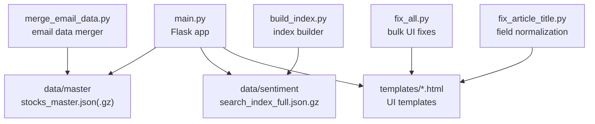
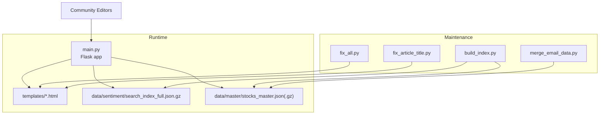
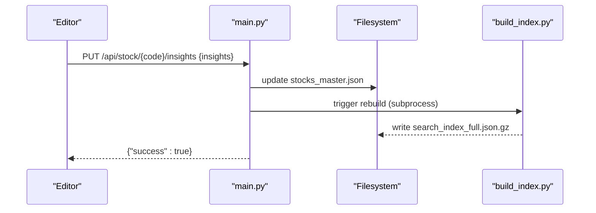
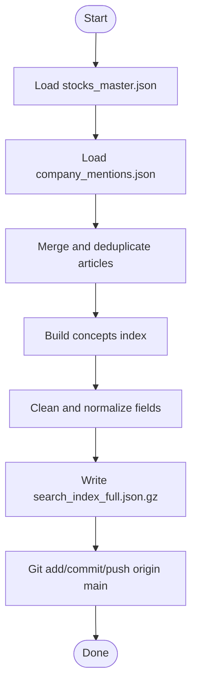
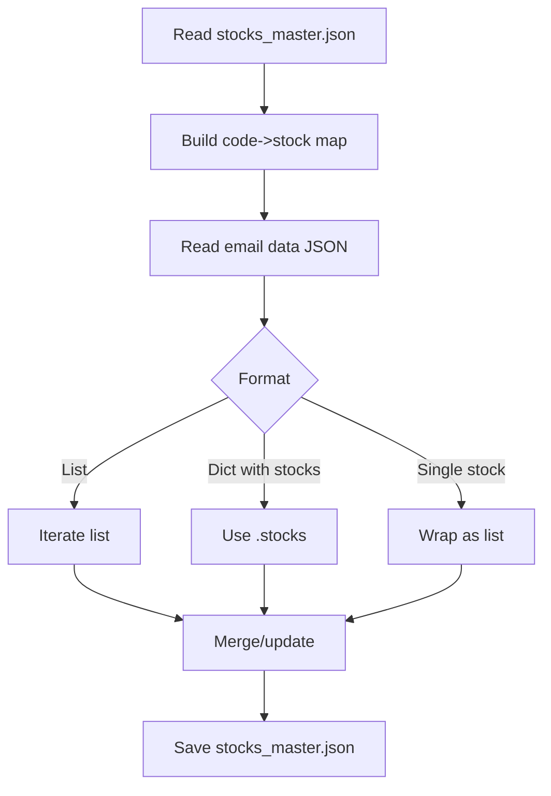
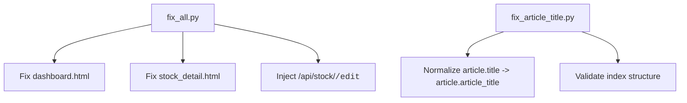
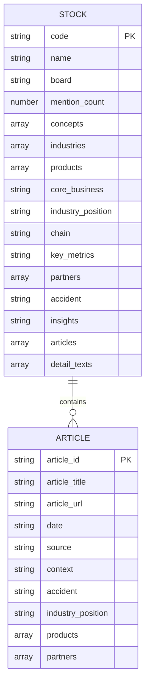
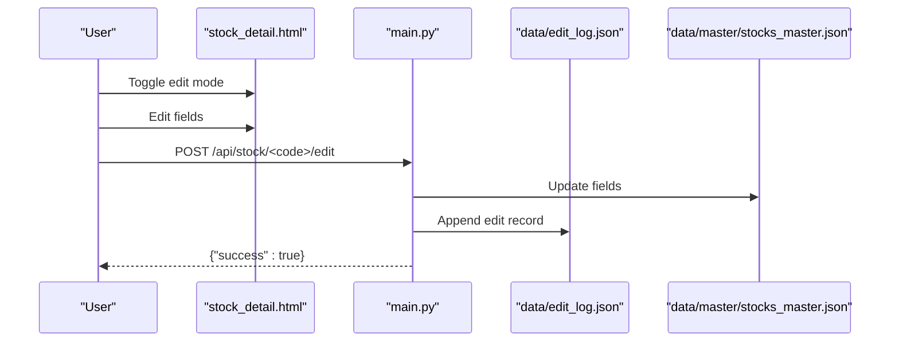
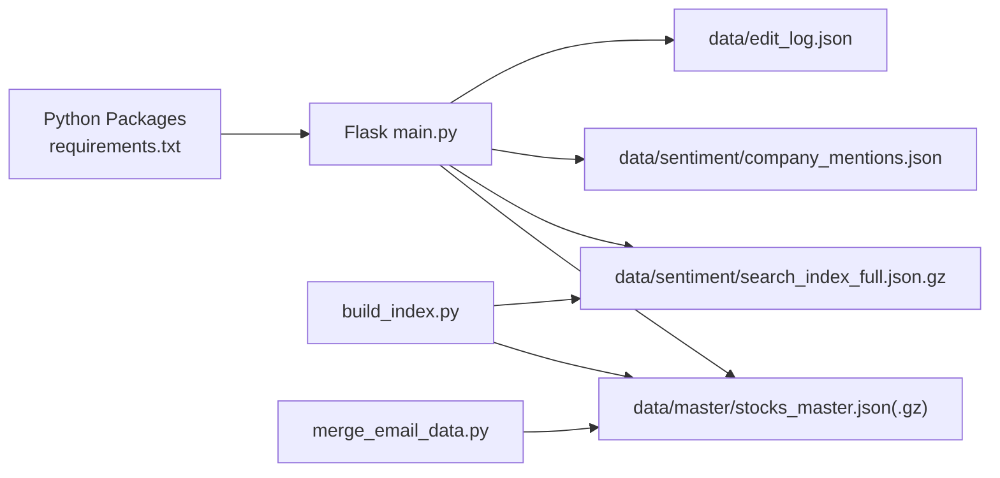
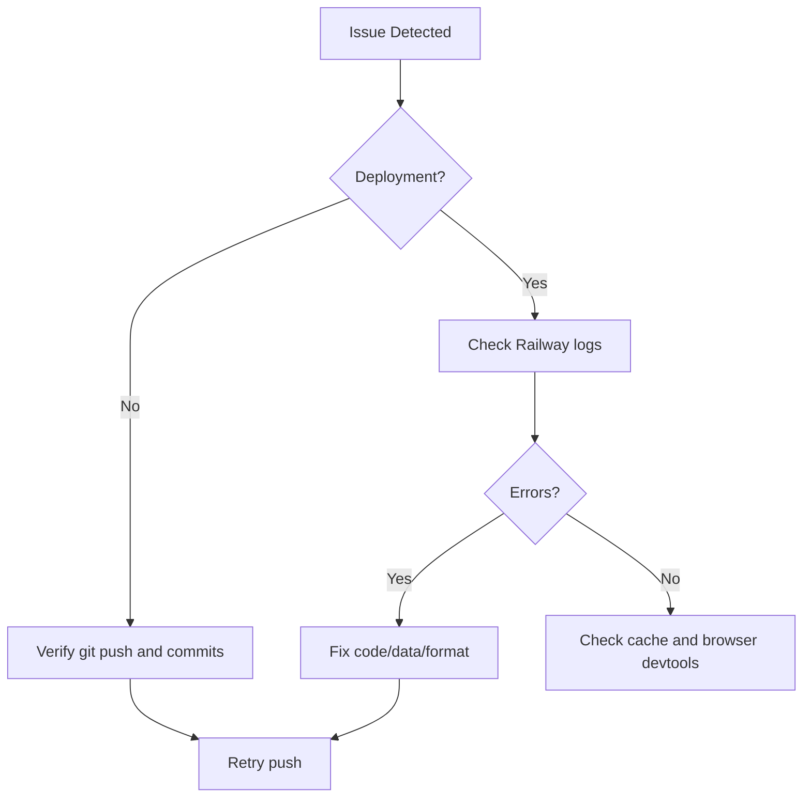

# Contributing Guide

<cite>
**Referenced Files in This Document**
- [README.md](file://README.md)
- [main.py](file://main.py)
- [requirements.txt](file://requirements.txt)
- [build_index.py](file://build_index.py)
- [merge_email_data.py](file://merge_email_data.py)
- [fix_all.py](file://fix_all.py)
- [fix_article_title.py](file://fix_article_title.py)
- [SYNC_FEATURE.md](file://SYNC_FEATURE.md)
- [INSIGHTS_EDIT_FEATURE.md](file://INSIGHTS_EDIT_FEATURE.md)
- [INLINE_EDIT_PLAN.md](file://INLINE_EDIT_PLAN.md)
- [JSON格式标准.md](file://JSON格式标准.md)
- [DATA_CLEANUP_REPORT.md](file://DATA_CLEANUP_REPORT.md)
- [EMAIL_MERGE_REPORT.md](file://EMAIL_MERGE_REPORT.md)
- [DEPLOYMENT_CHECKLIST.md](file://DEPLOYMENT_CHECKLIST.md)
</cite>

## Table of Contents
1. [Introduction](#introduction)
2. [Project Structure](#project-structure)
3. [Core Components](#core-components)
4. [Architecture Overview](#architecture-overview)
5. [Detailed Component Analysis](#detailed-component-analysis)
6. [Dependency Analysis](#dependency-analysis)
7. [Performance Considerations](#performance-considerations)
8. [Troubleshooting Guide](#troubleshooting-guide)
9. [Conclusion](#conclusion)
10. [Appendices](#appendices)

## Introduction
This guide documents how to contribute effectively to the Stock Research Platform. It covers development environment setup, code style expectations, testing procedures, pull request processes, data contribution workflows, community editing practices, maintenance scripts, deployment and issue reporting procedures, and collaboration best practices. The platform is a Flask web app that serves a curated dataset of Chinese A-share stocks with sentiment and research data, exposing both a UI and a set of APIs for data editing and synchronization.

## Project Structure
The repository is organized around a minimal Flask application, data assets, and maintenance scripts:
- Application: main.py (Flask routes, APIs, and runtime logic)
- Data: data/master (master stock records), data/sentiment (mentions and search index)
- Templates: templates (Jinja2 HTML pages)
- Scripts: build_index.py, merge_email_data.py, fix_all.py, fix_article_title.py
- Documentation: Markdown reports and feature guides
- Deployment: Procfile, .railway.json, requirements.txt

**Diagram sources**
- [main.py:1-1226](file://main.py#L1-L1226)
- [build_index.py:1-271](file://build_index.py#L1-L271)
- [merge_email_data.py:1-88](file://merge_email_data.py#L1-L88)
- [fix_all.py:1-218](file://fix_all.py#L1-L218)
- [fix_article_title.py:1-89](file://fix_article_title.py#L1-L89)

**Section sources**
- [README.md:1-126](file://README.md#L1-L126)
- [requirements.txt:1-5](file://requirements.txt#L1-L5)

## Core Components
- Flask application and routes: dashboard, stock detail, concepts, search, and editing APIs
- Data loading and indexing pipeline: builds a gzipped search index from master and sentiment data
- Email data ingestion: merges external JSON data into the master dataset
- Maintenance scripts: normalize templates, fix field names, and apply bulk UI updates
- Edit logging and synchronization: record edits and export/clear logs

Key responsibilities:
- main.py: route handlers, data loading, editing endpoints, market data retrieval, and index rebuild triggers
- build_index.py: transforms stocks_master.json and company_mentions.json into a frontend-ready search index
- merge_email_data.py: merges external JSON into stocks_master.json
- fix_* scripts: maintain UI consistency and data field normalization

**Section sources**
- [main.py:138-800](file://main.py#L138-L800)
- [build_index.py:77-271](file://build_index.py#L77-L271)
- [merge_email_data.py:9-88](file://merge_email_data.py#L9-L88)
- [fix_all.py:1-218](file://fix_all.py#L1-L218)
- [fix_article_title.py:1-89](file://fix_article_title.py#L1-L89)

## Architecture Overview
The system comprises a Flask backend serving HTML templates and JSON APIs, backed by local JSON data files and a generated compressed search index. Community editors can update data via inline editing and sync/export/clear APIs. Automated scripts handle data ingestion and index regeneration.

**Diagram sources**
- [main.py:138-800](file://main.py#L138-L800)
- [build_index.py:1-271](file://build_index.py#L1-L271)
- [merge_email_data.py:1-88](file://merge_email_data.py#L1-L88)
- [fix_all.py:1-218](file://fix_all.py#L1-L218)
- [fix_article_title.py:1-89](file://fix_article_title.py#L1-L89)

## Detailed Component Analysis

### Flask Application and Routes
- Dashboard and pagination: filters A-share equities, excludes ETFs/indexes, sorts by last_updated and latest article date
- Stock detail page: normalizes article fields, enriches with social security info
- Concepts and search: supports multi-field scoring and suggestion API
- Editing APIs: per-field PUT endpoints for accident and insights; batch POST endpoint for general fields; sync endpoints for export/clear
- Market data: fetches real-time quotes from a third-party API

**Diagram sources**
- [main.py:525-571](file://main.py#L525-L571)
- [main.py:770-800](file://main.py#L770-L800)
- [build_index.py:236-267](file://build_index.py#L236-L267)

**Section sources**
- [main.py:138-800](file://main.py#L138-L800)

### Search Index Builder
- Loads stocks_master.json and optionally stocks_master.json.gz
- Loads company_mentions.json and deduplicates by article_id
- Extracts and cleans fields, generates concepts index, and writes a gzipped search index
- Pushes changes to origin/main and triggers Railway auto-deploy

**Diagram sources**
- [build_index.py:77-271](file://build_index.py#L77-L271)

**Section sources**
- [build_index.py:77-271](file://build_index.py#L77-L271)

### Email Data Merger
- Reads master stock dataset and external JSON (single stock or list)
- Merges non-null values into existing stocks or adds new ones
- Saves back to stocks_master.json

**Diagram sources**
- [merge_email_data.py:9-77](file://merge_email_data.py#L9-L77)

**Section sources**
- [merge_email_data.py:9-88](file://merge_email_data.py#L9-L88)

### Maintenance Scripts
- fix_all.py: bulk UI fixes for dashboard and stock detail templates, adds edit button and modal, injects edit API route
- fix_article_title.py: normalizes article title field references and validates index structure

**Diagram sources**
- [fix_all.py:1-218](file://fix_all.py#L1-L218)
- [fix_article_title.py:1-89](file://fix_article_title.py#L1-L89)

**Section sources**
- [fix_all.py:1-218](file://fix_all.py#L1-L218)
- [fix_article_title.py:1-89](file://fix_article_title.py#L1-L89)

### Data Formats and Standards
- stocks_master.json: array of stock objects with fields for concepts, industries, products, core_business, industry_position, chain, key_metrics, partners, accident, insights, articles, detail_texts
- articles: array of article objects with standardized fields including article_id, article_title, article_url, date, source, and content fields
- search_index_full.json.gz: frontend-ready index with cleaned text and gzip compression

**Diagram sources**
- [JSON格式标准.md:22-106](file://JSON格式标准.md#L22-L106)

**Section sources**
- [JSON格式标准.md:1-312](file://JSON格式标准.md#L1-L312)

### Community Editing Workflows
- Inline editing: toggle edit mode, edit specific fields, save via API, rebuild index automatically
- Sync/export/clear: view edit log, export JSON, copy formatted summary, clear logs without affecting persisted data
- Multi-source content: support numbered sources separated by divider lines

**Diagram sources**
- [INSIGHTS_EDIT_FEATURE.md:12-67](file://INSIGHTS_EDIT_FEATURE.md#L12-L67)
- [SYNC_FEATURE.md:29-85](file://SYNC_FEATURE.md#L29-L85)
- [main.py:431-478](file://main.py#L431-L478)

**Section sources**
- [INSIGHTS_EDIT_FEATURE.md:1-134](file://INSIGHTS_EDIT_FEATURE.md#L1-L134)
- [SYNC_FEATURE.md:1-164](file://SYNC_FEATURE.md#L1-L164)
- [main.py:431-686](file://main.py#L431-L686)

## Dependency Analysis
- Runtime dependencies: Flask, gunicorn, requests, akshare
- Data dependencies: stocks_master.json(.gz), company_mentions.json, search_index_full.json.gz
- Maintenance dependencies: Python standard library, subprocess for triggering index rebuilds

**Diagram sources**
- [requirements.txt:1-5](file://requirements.txt#L1-L5)
- [main.py:1-1226](file://main.py#L1-L1226)
- [build_index.py:1-271](file://build_index.py#L1-L271)
- [merge_email_data.py:1-88](file://merge_email_data.py#L1-L88)

**Section sources**
- [requirements.txt:1-5](file://requirements.txt#L1-L5)
- [main.py:1-1226](file://main.py#L1-L1226)

## Performance Considerations
- Search index compression: search_index_full.json.gz reduces payload size and improves load times
- Deduplication: build_index.py removes duplicate articles before generating the index
- Pagination: dashboard and stock lists support pagination to avoid large DOM rendering
- Lazy imports: akshare is imported lazily to reduce startup overhead

[No sources needed since this section provides general guidance]

## Troubleshooting Guide
Common issues and resolutions:
- Deployment not triggered: check Railway dashboard, verify git push and commit messages
- Data not updating: confirm data files are present in Git, check index rebuild logs
- API errors: validate JSON payloads and required fields, inspect server logs
- Index generation failures: ensure stocks_master.json and company_mentions.json are valid JSON

**Section sources**
- [DEPLOYMENT_CHECKLIST.md:100-141](file://DEPLOYMENT_CHECKLIST.md#L100-L141)

## Conclusion
This guide consolidates the platform’s development and contribution practices. Contributors should focus on maintaining data quality, following the documented JSON formats, using the provided scripts for bulk fixes and merges, and leveraging the editing and synchronization features responsibly. Adhering to the deployment and troubleshooting steps ensures smooth updates and reliable operation.

[No sources needed since this section summarizes without analyzing specific files]

## Appendices

### Development Environment Setup
- Install dependencies: see requirements.txt
- Run locally: use the Flask app entry point
- Access the UI and APIs at localhost

**Section sources**
- [requirements.txt:1-5](file://requirements.txt#L1-L5)
- [README.md:15-92](file://README.md#L15-L92)

### Testing Procedures
- Manual verification: browse dashboard, search, and stock detail pages
- API testing: use curl or Postman to test endpoints (e.g., GET /api/stock/{code}, PUT /api/stock/{code}/insights)
- Index validation: after edits, confirm search_index_full.json.gz is regenerated and deployed

**Section sources**
- [DEPLOYMENT_CHECKLIST.md:70-98](file://DEPLOYMENT_CHECKLIST.md#L70-L98)
- [build_index.py:236-267](file://build_index.py#L236-L267)

### Pull Request Process
- Branch from main, make focused changes
- Update documentation and reports as needed
- Include a short summary of changes in commit messages
- Trigger deployment and verify in Railway dashboard

**Section sources**
- [DEPLOYMENT_CHECKLIST.md:20-34](file://DEPLOYMENT_CHECKLIST.md#L20-L34)

### Data Contribution Guidelines
- Follow JSON format standards for stocks_master.json and articles
- Use merge_email_data.py for ingesting external JSON
- Normalize field names with fix_article_title.py when needed
- Rebuild the index and deploy after major changes

**Section sources**
- [JSON格式标准.md:22-106](file://JSON格式标准.md#L22-L106)
- [merge_email_data.py:9-88](file://merge_email_data.py#L9-L88)
- [fix_article_title.py:1-89](file://fix_article_title.py#L1-L89)
- [build_index.py:236-267](file://build_index.py#L236-L267)

### Issue Reporting and Feature Requests
- Use GitHub Issues to report bugs and propose features
- Include environment details, reproduction steps, and expected vs. actual behavior
- Reference related documentation and scripts when applicable

[No sources needed since this section provides general guidance]

### Code Review Standards
- Keep changes scoped and well-documented
- Ensure data format compliance and index rebuilds
- Validate UI and API behavior after modifications

[No sources needed since this section provides general guidance]

### Community Guidelines and Communication
- Be respectful and collaborative
- Use clear commit messages and PR descriptions
- Engage constructively in discussions

[No sources needed since this section provides general guidance]

### Maintenance Scripts and Tools
- build_index.py: regenerate search index and push to origin/main
- merge_email_data.py: merge external JSON into stocks_master.json
- fix_all.py: bulk UI fixes and edit modal injection
- fix_article_title.py: normalize article title field references

**Section sources**
- [build_index.py:1-271](file://build_index.py#L1-L271)
- [merge_email_data.py:1-88](file://merge_email_data.py#L1-L88)
- [fix_all.py:1-218](file://fix_all.py#L1-L218)
- [fix_article_title.py:1-89](file://fix_article_title.py#L1-L89)

### Bulk Data Corrections and Article Title Fixes
- Use fix_all.py for template-level fixes and edit modal integration
- Use fix_article_title.py to standardize article title field references
- Validate changes against the index structure

**Section sources**
- [fix_all.py:1-218](file://fix_all.py#L1-L218)
- [fix_article_title.py:1-89](file://fix_article_title.py#L1-L89)
- [DATA_CLEANUP_REPORT.md:1-152](file://DATA_CLEANUP_REPORT.md#L1-L152)

### Email Data Merging
- Execute merge_email_data.py with the email JSON path
- Backup and verify before pushing to origin/main
- Monitor coverage improvements and field completeness

**Section sources**
- [merge_email_data.py:1-88](file://merge_email_data.py#L1-L88)
- [EMAIL_MERGE_REPORT.md:1-154](file://EMAIL_MERGE_REPORT.md#L1-L154)

### Content Enhancement Procedures
- Use inline editing to update insights and accident fields
- Export and review edit logs for auditability
- Clear logs when appropriate without affecting persisted data

**Section sources**
- [INSIGHTS_EDIT_FEATURE.md:1-134](file://INSIGHTS_EDIT_FEATURE.md#L1-L134)
- [SYNC_FEATURE.md:1-164](file://SYNC_FEATURE.md#L1-L164)
- [main.py:431-686](file://main.py#L431-L686)