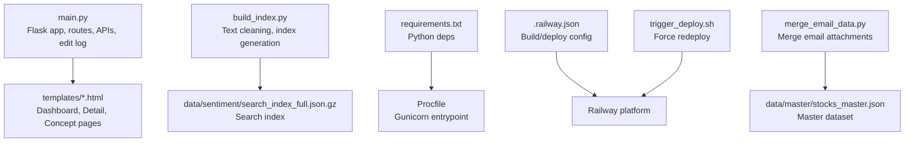
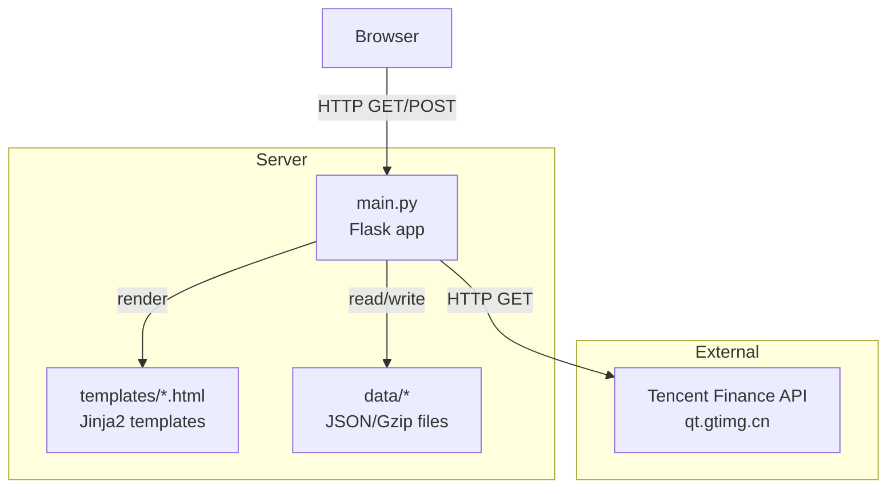
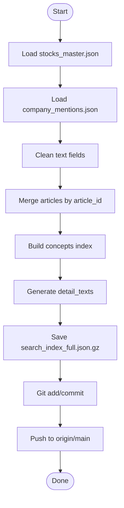
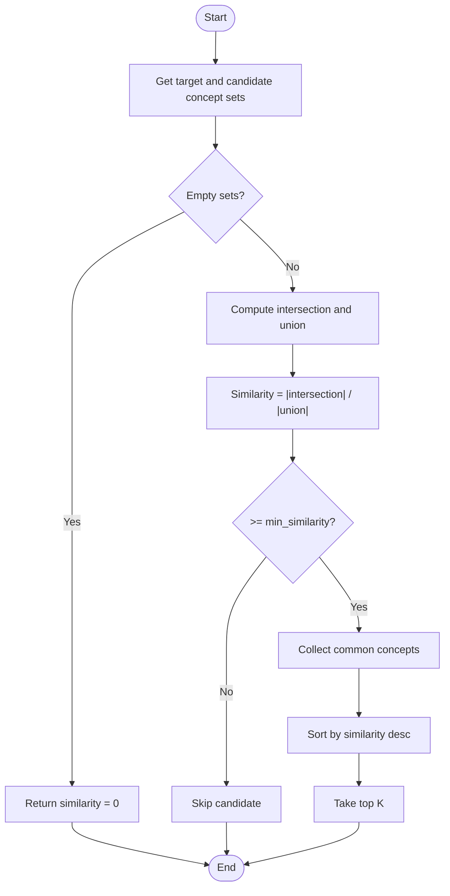
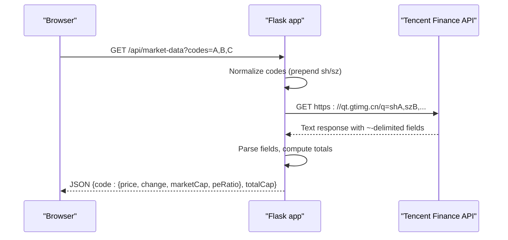
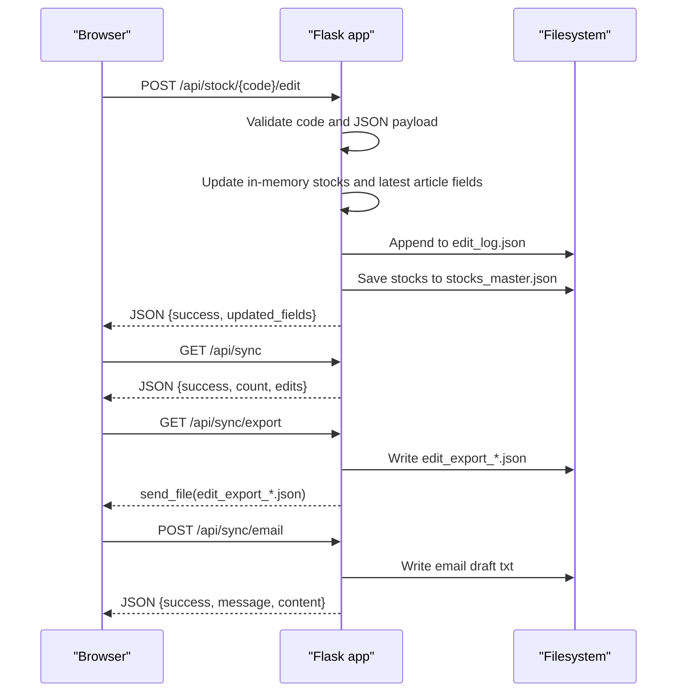
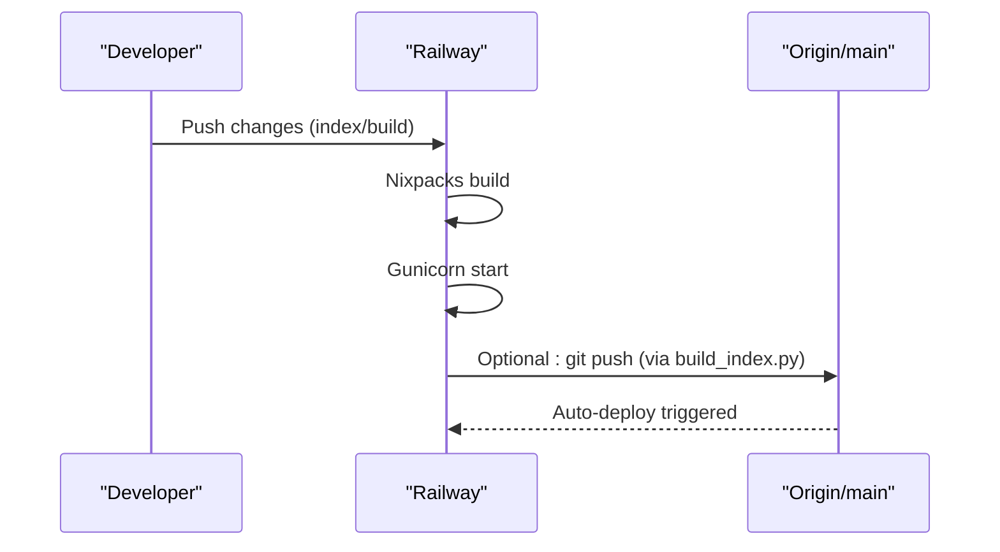
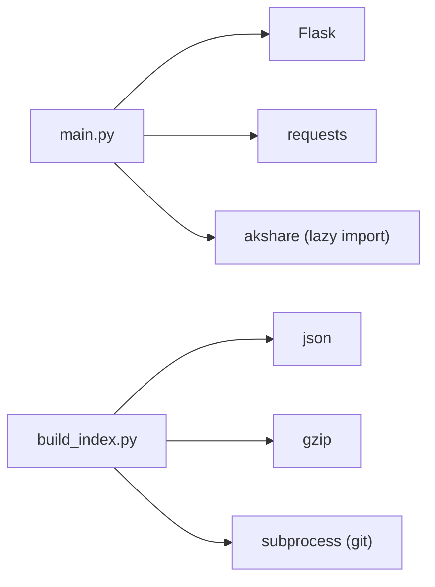

# Core Application

<cite>
**Referenced Files in This Document**
- [main.py](file://main.py)
- [build_index.py](file://build_index.py)
- [requirements.txt](file://requirements.txt)
- [Procfile](file://Procfile)
- [.railway.json](file://.railway.json)
- [README.md](file://README.md)
- [trigger_deploy.sh](file://trigger_deploy.sh)
- [merge_email_data.py](file://merge_email_data.py)
- [templates/dashboard.html](file://templates/dashboard.html)
- [templates/stock_detail.html](file://templates/stock_detail.html)
- [templates/concept_detail.html](file://templates/concept_detail.html)
</cite>

## Table of Contents
1. [Introduction](#introduction)
2. [Project Structure](#project-structure)
3. [Core Components](#core-components)
4. [Architecture Overview](#architecture-overview)
5. [Detailed Component Analysis](#detailed-component-analysis)
6. [Dependency Analysis](#dependency-analysis)
7. [Performance Considerations](#performance-considerations)
8. [Troubleshooting Guide](#troubleshooting-guide)
9. [Conclusion](#conclusion)
10. [Appendices](#appendices)

## Introduction
This document explains the core application components of the Stock Research Platform. It covers Flask application initialization, routing configuration, and the Jinja2 template rendering system. It documents the data processing pipeline from raw material ingestion to index generation and deployment automation. It also details the Jaccard similarity algorithm for concept matching, real-time market data integration via a third-party API, and the inline editing and logging mechanisms. Practical examples are provided via file references to demonstrate common usage patterns and integration approaches.

## Project Structure
The application is organized around a single Flask entrypoint, a data processing pipeline script, and a set of Jinja2 templates. Deployment is configured for Railway using Gunicorn and Nixpacks.

**Diagram sources**
- [main.py:138-210](file://main.py#L138-L210)
- [build_index.py:11-231](file://build_index.py#L11-L231)
- [requirements.txt:1-5](file://requirements.txt#L1-L5)
- [Procfile:1-2](file://Procfile#L1-L2)
- [.railway.json:1-15](file://.railway.json#L1-L15)
- [trigger_deploy.sh:1-25](file://trigger_deploy.sh#L1-L25)
- [merge_email_data.py:9-76](file://merge_email_data.py#L9-L76)

**Section sources**
- [main.py:138-210](file://main.py#L138-L210)
- [build_index.py:77-231](file://build_index.py#L77-L231)
- [requirements.txt:1-5](file://requirements.txt#L1-L5)
- [Procfile:1-2](file://Procfile#L1-L2)
- [.railway.json:1-15](file://.railway.json#L1-L15)
- [trigger_deploy.sh:1-25](file://trigger_deploy.sh#L1-L25)
- [merge_email_data.py:9-76](file://merge_email_data.py#L9-L76)

## Core Components
- Flask application initialization and WSGI entrypoint
- Routing and template rendering for dashboard, stock detail, concepts, and search
- Real-time market data retrieval from a third-party API
- Edit logging and synchronization endpoints
- Data processing pipeline for cleaning, merging, indexing, and deploying updates

Key implementation references:
- Flask app creation and routes: [main.py:20-210](file://main.py#L20-L210)
- Market data endpoint: [main.py:696-768](file://main.py#L696-L768)
- Edit logging and sync endpoints: [main.py:514-685](file://main.py#L514-L685)
- Index generation and deployment automation: [build_index.py:77-267](file://build_index.py#L77-L267)
- Email data merge utility: [merge_email_data.py:9-76](file://merge_email_data.py#L9-L76)

**Section sources**
- [main.py:20-210](file://main.py#L20-L210)
- [main.py:514-685](file://main.py#L514-L685)
- [build_index.py:77-267](file://build_index.py#L77-L267)
- [merge_email_data.py:9-76](file://merge_email_data.py#L9-L76)

## Architecture Overview
The application follows a thin server model:
- The Flask app serves rendered HTML pages and JSON APIs.
- Templates are rendered server-side with Jinja2.
- Data is loaded from compressed search index and master JSON files.
- Market data is fetched on-demand from a third-party API.
- Edit actions update in-memory data and persist to disk, optionally triggering index rebuild and Git push.

**Diagram sources**
- [main.py:138-210](file://main.py#L138-L210)
- [main.py:696-768](file://main.py#L696-L768)
- [templates/dashboard.html:1-800](file://templates/dashboard.html#L1-L800)
- [templates/stock_detail.html:1-800](file://templates/stock_detail.html#L1-L800)

## Detailed Component Analysis

### Flask Application Initialization and WSGI
- Creates a Flask app instance and sets up data paths.
- Uses Gunicorn via Procfile for production deployment on Railway.
- Loads prebuilt search index and master data at startup.

References:
- App creation and imports: [main.py:6-20](file://main.py#L6-L20)
- Gunicorn entrypoint: [Procfile:1](file://Procfile#L1)
- Railway build/deploy config: [.railway.json:1-15](file://.railway.json#L1-L15)

**Section sources**
- [main.py:6-20](file://main.py#L6-L20)
- [Procfile:1-2](file://Procfile#L1-L2)
- [.railway.json:1-15](file://.railway.json#L1-L15)

### Routing and Template Rendering
- Dashboard route renders paginated stock listings with filters and sorting.
- Stock detail page renders comprehensive profile and article timeline.
- Concepts listing and detail pages support concept-based filtering.
- Search route supports full-text matching across multiple fields.

References:
- Dashboard: [main.py:138-210](file://main.py#L138-L210)
- Stock detail: [main.py:280-336](file://main.py#L280-L336)
- Concepts: [main.py:338-356](file://main.py#L338-L356)
- Search: [main.py:358-429](file://main.py#L358-L429)
- Templates:
  - Dashboard: [templates/dashboard.html:1-800](file://templates/dashboard.html#L1-L800)
  - Stock detail: [templates/stock_detail.html:1-800](file://templates/stock_detail.html#L1-L800)
  - Concept detail: [templates/concept_detail.html:1-51](file://templates/concept_detail.html#L1-L51)

**Section sources**
- [main.py:138-210](file://main.py#L138-L210)
- [main.py:280-336](file://main.py#L280-L336)
- [main.py:338-356](file://main.py#L338-L356)
- [main.py:358-429](file://main.py#L358-L429)
- [templates/dashboard.html:1-800](file://templates/dashboard.html#L1-L800)
- [templates/stock_detail.html:1-800](file://templates/stock_detail.html#L1-L800)
- [templates/concept_detail.html:1-51](file://templates/concept_detail.html#L1-L51)

### Data Processing Pipeline: Text Cleaning, Index Generation, and Deployment Automation
- Text cleaning removes Markdown/HTML artifacts while preserving multi-source separators and structured lists.
- Index generation merges master data and sentiment mentions, builds concepts index, and outputs a gzipped JSON index.
- Deployment automation pushes changes to Git and triggers Railway redeploy.

**Diagram sources**
- [build_index.py:77-231](file://build_index.py#L77-L231)

**Section sources**
- [build_index.py:16-56](file://build_index.py#L16-L56)
- [build_index.py:77-231](file://build_index.py#L77-L231)

### Jaccard Similarity Algorithm for Concept Matching
- Computes Jaccard similarity between two sets of concepts.
- Identifies similar stocks by concept overlap and returns ranked results with common concepts.

**Diagram sources**
- [main.py:29-71](file://main.py#L29-L71)

**Section sources**
- [main.py:29-71](file://main.py#L29-L71)

### Real-Time Market Data Integration
- Fetches current prices, change percentages, market caps, and P/E ratios from a third-party API.
- Supports batch queries for multiple codes and aggregates total market capitalization.

**Diagram sources**
- [main.py:696-768](file://main.py#L696-L768)

**Section sources**
- [main.py:696-768](file://main.py#L696-L768)

### Edit Logging Mechanisms and Inline Editing
- Provides inline editing for selected fields on the stock detail page.
- Logs edits with timestamps, stock info, changed fields, and content previews.
- Exposes endpoints to sync, export, email, and clear edit logs.

**Diagram sources**
- [main.py:431-478](file://main.py#L431-L478)
- [main.py:514-685](file://main.py#L514-L685)

**Section sources**
- [main.py:431-478](file://main.py#L431-L478)
- [main.py:514-685](file://main.py#L514-L685)

### API Endpoints Summary
- GET /stocks: Render stock list page.
- GET /social-security-new: Render social security new holdings page.
- GET /demo/cards: Demo card components page.
- GET /stock/<code>: Render stock detail page.
- GET /concepts: Render concepts list.
- GET /concept/<name>: Render concept detail page.
- GET /search: Render search results page.
- GET /api/stock/<code>: Return JSON stock summary.
- GET /api/search/suggest: Return search suggestions.
- POST /api/stock/<code>/edit: Inline edit stock fields.
- PUT /api/stock/<code>/accident: Update accident field.
- PUT /api/stock/<code>/insights: Update insights field.
- GET /api/stock/<code>/similar: Return similar stocks by concept Jaccard.
- GET /api/market-data: Return market data for given codes.
- GET /api/sync: Export edit log metadata.
- GET /api/sync/export: Download edit log export.
- POST /api/sync/email: Generate email draft for edits.
- POST /api/sync/clear: Clear edit log.

**Section sources**
- [main.py:212-218](file://main.py#L212-L218)
- [main.py:220-273](file://main.py#L220-L273)
- [main.py:275-278](file://main.py#L275-L278)
- [main.py:280-336](file://main.py#L280-L336)
- [main.py:338-356](file://main.py#L338-L356)
- [main.py:358-429](file://main.py#L358-L429)
- [main.py:480-495](file://main.py#L480-L495)
- [main.py:497-504](file://main.py#L497-L504)
- [main.py:431-478](file://main.py#L431-L478)
- [main.py:525-571](file://main.py#L525-L571)
- [main.py:687-694](file://main.py#L687-L694)
- [main.py:696-768](file://main.py#L696-L768)
- [main.py:612-685](file://main.py#L612-L685)

### Error Handling and Logging Strategies
- Route-level checks return appropriate HTTP status codes (e.g., 404 for missing stock).
- Market data endpoint gracefully handles failures and returns partial results.
- Edit operations log errors and failures to console; edit log persistence is guarded by try/except.
- Index generation writes progress messages and handles Git timeouts with warnings.

**Section sources**
- [main.py:282-283](file://main.py#L282-L283)
- [main.py:528-529](file://main.py#L528-L529)
- [main.py:766-768](file://main.py#L766-L768)
- [main.py:573-580](file://main.py#L573-L580)
- [build_index.py:258-264](file://build_index.py#L258-L264)

### Deployment Automation
- Railway build/deploy configuration uses Nixpacks and Gunicorn.
- Index generation script commits and pushes to Git, triggering Railway redeploy.
- Utility script forces redeploy by pushing an empty commit.

**Diagram sources**
- [.railway.json:3-13](file://.railway.json#L3-L13)
- [build_index.py:238-261](file://build_index.py#L238-L261)
- [trigger_deploy.sh:10-12](file://trigger_deploy.sh#L10-L12)

**Section sources**
- [.railway.json:1-15](file://.railway.json#L1-L15)
- [build_index.py:238-261](file://build_index.py#L238-L261)
- [trigger_deploy.sh:1-25](file://trigger_deploy.sh#L1-L25)

### Data Ingestion and Merging Utilities
- Email data merge utility reads email attachments and merges into master dataset, handling both arrays and single objects.
- Supports optional output path override and prints merge statistics.

**Section sources**
- [merge_email_data.py:9-76](file://merge_email_data.py#L9-L76)

## Dependency Analysis
Runtime dependencies are minimal and focused on web serving and HTTP client capabilities.

**Diagram sources**
- [requirements.txt:1-5](file://requirements.txt#L1-L5)
- [main.py:6-18](file://main.py#L6-L18)
- [build_index.py:6-8](file://build_index.py#L6-L8)

**Section sources**
- [requirements.txt:1-5](file://requirements.txt#L1-L5)
- [main.py:6-18](file://main.py#L6-L18)
- [build_index.py:6-8](file://build_index.py#L6-L8)

## Performance Considerations
- Data loading: Index is gzipped and loaded once at startup; consider caching strategies if memory becomes constrained.
- Pagination: Dashboard uses pagination to limit DOM and network payload.
- Market data: Batch requests reduce external API calls; consider rate limiting and caching.
- Edit persistence: Writes occur on each edit; consider batching for high-frequency edits.
- Template rendering: Keep templates minimal and avoid heavy loops; leverage precomputed fields where possible.

## Troubleshooting Guide
Common issues and remedies:
- Missing or corrupted index: Re-run index generation to rebuild the gzipped search index.
  - Reference: [build_index.py:77-231](file://build_index.py#L77-L231)
- Market data failures: Verify API availability and network connectivity; inspect returned error payload.
  - Reference: [main.py:766-768](file://main.py#L766-L768)
- Edit log write failures: Check filesystem permissions and disk space; review console logs.
  - Reference: [main.py:573-580](file://main.py#L573-L580)
- Deployment not triggering: Use the force redeploy script to push an empty commit.
  - Reference: [trigger_deploy.sh:10-12](file://trigger_deploy.sh#L10-L12)
- Railway health check: Confirm healthcheck path and timeout settings.
  - Reference: [.railway.json:11-12](file://.railway.json#L11-L12)

**Section sources**
- [build_index.py:77-231](file://build_index.py#L77-L231)
- [main.py:766-768](file://main.py#L766-L768)
- [main.py:573-580](file://main.py#L573-L580)
- [trigger_deploy.sh:10-12](file://trigger_deploy.sh#L10-L12)
- [.railway.json:11-12](file://.railway.json#L11-L12)

## Conclusion
The Stock Research Platform combines a lightweight Flask server with robust data processing and deployment automation. The system emphasizes fast server-rendered pages, efficient data loading, and straightforward editing workflows. The Jaccard-based concept matching and real-time market data integration provide practical value for research and monitoring. The documented endpoints, error handling, and automation scripts enable reliable operation and maintenance.

## Appendices
- Example references for common tasks:
  - Render dashboard with pagination: [main.py:138-210](file://main.py#L138-L210)
  - Fetch market data for multiple codes: [main.py:696-768](file://main.py#L696-L768)
  - Edit stock fields and log changes: [main.py:431-478](file://main.py#L431-L478)
  - Export edit logs: [main.py:621-638](file://main.py#L621-L638)
  - Rebuild index and deploy: [build_index.py:238-261](file://build_index.py#L238-L261)