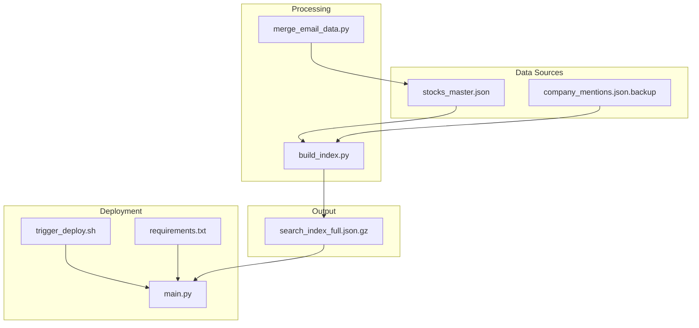
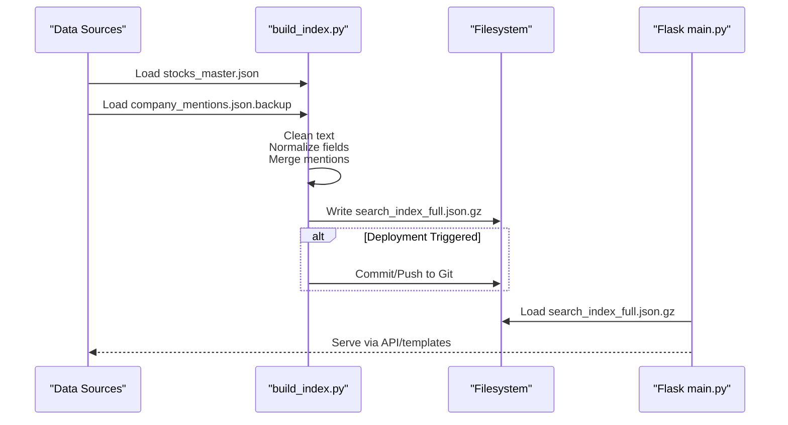
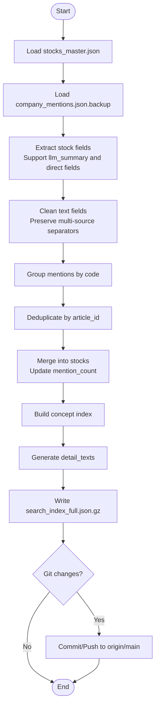
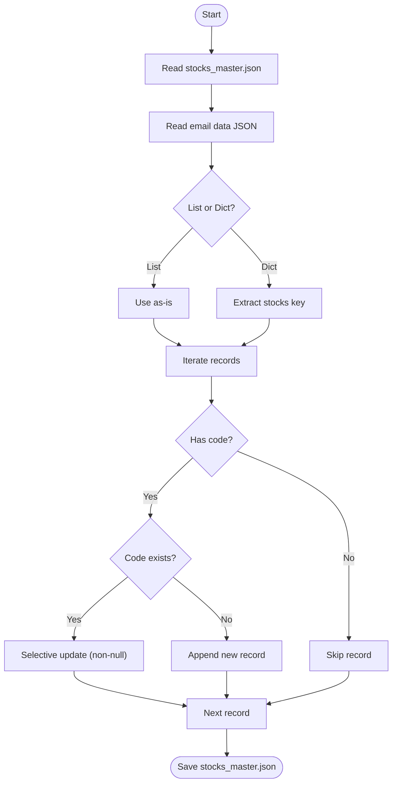
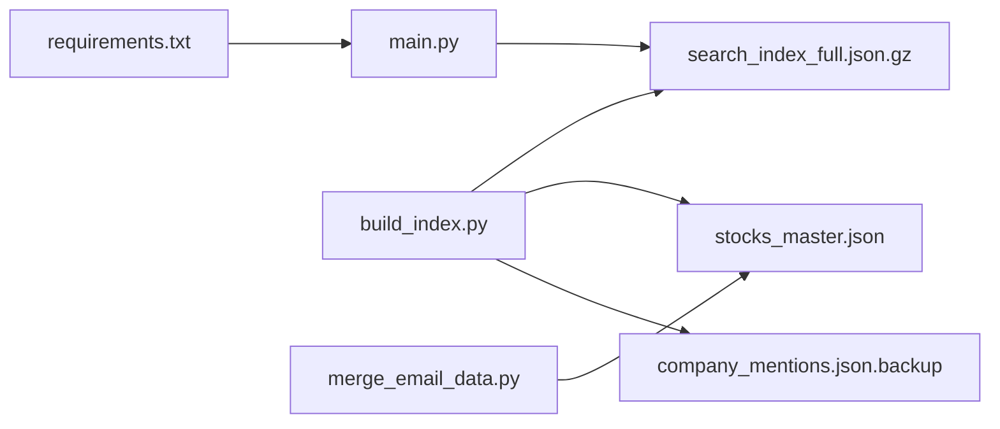
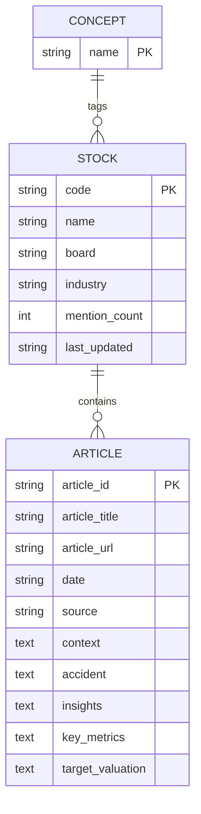

# Data Processing Pipeline

<cite>
**Referenced Files in This Document**
- [build_index.py](file://build_index.py)
- [merge_email_data.py](file://merge_email_data.py)
- [trigger_deploy.sh](file://trigger_deploy.sh)
- [main.py](file://main.py)
- [requirements.txt](file://requirements.txt)
- [README.md](file://README.md)
- [DEPLOYMENT_CHECKLIST.md](file://DEPLOYMENT_CHECKLIST.md)
- [DEPLOYMENT_REPORT_v8.md](file://DEPLOYMENT_REPORT_v8.md)
- [DATA_CLEANUP_REPORT.md](file://DATA_CLEANUP_REPORT.md)
- [data/master/stocks_master.json](file://data/master/stocks_master.json)
- [data/sentiment/company_mentions.json.backup](file://data/sentiment/company_mentions.json.backup)
</cite>

## Table of Contents
1. [Introduction](#introduction)
2. [Project Structure](#project-structure)
3. [Core Components](#core-components)
4. [Architecture Overview](#architecture-overview)
5. [Detailed Component Analysis](#detailed-component-analysis)
6. [Dependency Analysis](#dependency-analysis)
7. [Performance Considerations](#performance-considerations)
8. [Troubleshooting Guide](#troubleshooting-guide)
9. [Conclusion](#conclusion)
10. [Appendices](#appendices)

## Introduction
This document describes the data processing pipeline that powers the Railway-based stock research application. It covers the ingestion of raw company mentions, text cleaning and normalization, multi-source data merging, index generation with compression and JSON optimization, deployment automation, and integration with the Flask application. Practical examples illustrate the end-to-end flow from raw input to the compressed search index consumed by the web interface.

## Project Structure
The pipeline spans several scripts and data assets:
- Data ingestion and index generation: build_index.py
- Email data merging: merge_email_data.py
- Deployment automation: trigger_deploy.sh
- Web application and runtime integration: main.py
- Dependencies: requirements.txt
- Deployment documentation and reports: README.md, DEPLOYMENT_CHECKLIST.md, DEPLOYMENT_REPORT_v8.md, DATA_CLEANUP_REPORT.md
- Data assets: data/master/stocks_master.json, data/sentiment/company_mentions.json.backup

**Diagram sources**
- [build_index.py:1-271](file://build_index.py#L1-L271)
- [merge_email_data.py:1-88](file://merge_email_data.py#L1-L88)
- [trigger_deploy.sh:1-25](file://trigger_deploy.sh#L1-L25)
- [main.py:1-1240](file://main.py#L1-L1240)
- [requirements.txt:1-5](file://requirements.txt#L1-L5)

**Section sources**
- [build_index.py:1-271](file://build_index.py#L1-L271)
- [merge_email_data.py:1-88](file://merge_email_data.py#L1-L88)
- [trigger_deploy.sh:1-25](file://trigger_deploy.sh#L1-L25)
- [main.py:1-1240](file://main.py#L1-L1240)
- [requirements.txt:1-5](file://requirements.txt#L1-L5)

## Core Components
- Index generator: Loads master stock metadata, normalizes and cleans text, merges sentiment mentions, builds concept indices, and outputs a gzipped JSON index.
- Email data merger: Merges external email-supplied stock data into the master dataset with deduplication and selective updates.
- Deployment trigger: Pushes a commit to GitHub to initiate Railway auto-deployment.
- Flask integration: Loads the compressed index at runtime, exposes APIs, and renders templates.

Key responsibilities:
- Text normalization and multi-source preservation
- Deduplication during merge
- Compression and JSON optimization
- Git-triggered deployment
- Runtime consumption of the index

**Section sources**
- [build_index.py:77-271](file://build_index.py#L77-L271)
- [merge_email_data.py:9-77](file://merge_email_data.py#L9-L77)
- [trigger_deploy.sh:1-25](file://trigger_deploy.sh#L1-L25)
- [main.py:94-137](file://main.py#L94-L137)

## Architecture Overview
The pipeline follows a staged workflow:
1. Raw data ingestion from stocks_master.json and company_mentions.json.backup
2. Text cleaning and normalization while preserving multi-source content
3. Merging sentiment mentions into stock records with deduplication
4. Generating concept indices and detail text summaries
5. Writing a gzipped JSON index optimized for web serving
6. Optional Git push to trigger Railway deployment
7. Flask app loads the index and serves it via API and templates

**Diagram sources**
- [build_index.py:77-271](file://build_index.py#L77-L271)
- [main.py:94-137](file://main.py#L94-L137)

## Detailed Component Analysis

### Index Generation Engine (build_index.py)
Responsibilities:
- Load master stock metadata and sentiment mentions
- Normalize and clean text fields while preserving multi-source separators
- Merge sentiment articles into stock records without duplicates
- Build concept-to-stocks mapping
- Generate detail text summaries for display
- Output a gzipped JSON index with metadata and timestamps
- Optionally trigger deployment by pushing to Git

Text cleaning highlights:
- Handles arrays by joining with commas and stripping whitespace
- Detects multi-source content markers and preserves separators during cleaning
- Removes citations, Markdown links/images, bare URLs, and HTML tags
- Normalizes whitespace and restores multi-source separators post-cleaning

Merging strategy:
- Groups mentions by stock code
- Builds article identifiers from code + URL to detect duplicates
- Merges new articles into existing stock records and updates mention counts

Index composition:
- Version and update timestamp
- Stocks dictionary keyed by code
- Concepts mapping concept names to lists of stock codes

Compression and JSON optimization:
- Writes a gzipped JSON file to reduce payload size
- Uses UTF-8 encoding and indentation for readability during development

Deployment automation:
- Configures Git identity and checks for changes
- Commits with a descriptive message and pushes to origin/main
- Times out after a fixed duration to avoid hanging

**Diagram sources**
- [build_index.py:77-271](file://build_index.py#L77-L271)

**Section sources**
- [build_index.py:16-56](file://build_index.py#L16-L56)
- [build_index.py:57-76](file://build_index.py#L57-L76)
- [build_index.py:77-271](file://build_index.py#L77-L271)

### Multi-Source Data Merger (merge_email_data.py)
Responsibilities:
- Merge external email-supplied stock data into stocks_master.json
- Support both single stock and list/dictionary formats
- Update existing records selectively and append new ones
- Save the merged dataset back to disk

Behavior:
- Reads master.json and constructs a lookup by stock code
- Accepts either a list of stocks or a dict containing a stocks key
- Iterates through incoming records, skipping entries without a code
- Updates existing records with non-null values and logs additions/updates
- Writes the updated master dataset

**Diagram sources**
- [merge_email_data.py:9-77](file://merge_email_data.py#L9-L77)

**Section sources**
- [merge_email_data.py:9-77](file://merge_email_data.py#L9-L77)

### Deployment Automation Trigger (trigger_deploy.sh)
Purpose:
- Force a Railway redeployment by pushing an empty commit to the main branch
- Provides status messages and links for monitoring and verification

Workflow:
- Change to the working directory
- Create an empty commit with a timestamped message
- Push to origin main
- Print success and links for monitoring

**Section sources**
- [trigger_deploy.sh:1-25](file://trigger_deploy.sh#L1-L25)

### Flask Application Integration (main.py)
Runtime responsibilities:
- Load the gzipped search index at startup
- Supplement stock records with industry data from stocks_master.json
- Expose routes for dashboard, stock details, concepts, and search
- Provide APIs for editing stock fields and triggering index rebuild
- Serve templates and JSON responses

Index loading:
- Attempts to load the gzipped index file
- Falls back to empty datasets on failure
- Supports both uncompressed and gzipped master stock files

Search and similarity:
- Implements a simple text-based search across multiple fields
- Computes Jaccard similarity between concept sets for recommendations

JSON optimization:
- Uses gzip for the index file to reduce memory footprint and transfer size
- Ensures UTF-8 encoding and indentation for human-readable development artifacts

**Section sources**
- [main.py:94-137](file://main.py#L94-L137)
- [main.py:358-429](file://main.py#L358-L429)
- [main.py:687-694](file://main.py#L687-L694)

## Dependency Analysis
External dependencies:
- Flask, Gunicorn, Requests, Akshare as defined in requirements.txt

Internal dependencies:
- build_index.py depends on data/master/stocks_master.json and data/sentiment/company_mentions.json.backup
- main.py depends on the generated search_index_full.json.gz and optionally stocks_master.json
- merge_email_data.py depends on data/master/stocks_master.json

**Diagram sources**
- [requirements.txt:1-5](file://requirements.txt#L1-L5)
- [main.py:94-137](file://main.py#L94-L137)
- [build_index.py:11-14](file://build_index.py#L11-L14)
- [merge_email_data.py:12-14](file://merge_email_data.py#L12-L14)

**Section sources**
- [requirements.txt:1-5](file://requirements.txt#L1-L5)
- [main.py:94-137](file://main.py#L94-L137)
- [build_index.py:11-14](file://build_index.py#L11-L14)
- [merge_email_data.py:12-14](file://merge_email_data.py#L12-L14)

## Performance Considerations
- Index size and load time:
  - The index is gzipped to minimize memory and network overhead
  - The Flask app loads the index once at startup; subsequent requests are served from memory
- Text processing:
  - Cleaning operations use regex and string transformations; keep input sizes reasonable
  - Multi-source preservation avoids expensive parsing but requires careful separator handling
- Deduplication:
  - Article ID construction and set-based lookups ensure O(1) average-time checks
- Search:
  - Full-text search iterates over all stocks; consider adding inverted indices for large-scale deployments
- Deployment:
  - Git push timeouts are handled gracefully; monitor Railway logs for long-running operations

[No sources needed since this section provides general guidance]

## Troubleshooting Guide
Common issues and resolutions:
- Index not found or empty:
  - Verify the presence of search_index_full.json.gz and that build_index.py ran successfully
  - Check main.py’s index loading logic and fallback behavior
- Data not updating after merge:
  - Confirm stocks_master.json was updated by merge_email_data.py
  - Re-run build_index.py to regenerate the index and push to Git if needed
- Deployment not triggered:
  - Use trigger_deploy.sh to force a redeploy
  - Monitor Railway dashboard for build/deploy status
- Data quality problems:
  - Refer to DATA_CLEANUP_REPORT.md for examples of incorrect mentions and corrective actions
- Validation checklist:
  - Follow DEPLOYMENT_CHECKLIST.md steps to verify data, Git push, Railway status, and application behavior

**Section sources**
- [main.py:94-137](file://main.py#L94-L137)
- [DATA_CLEANUP_REPORT.md:1-152](file://DATA_CLEANUP_REPORT.md#L1-L152)
- [DEPLOYMENT_CHECKLIST.md:1-170](file://DEPLOYMENT_CHECKLIST.md#L1-L170)
- [trigger_deploy.sh:1-25](file://trigger_deploy.sh#L1-L25)

## Conclusion
The data processing pipeline integrates ingestion, cleaning, merging, indexing, and deployment automation to deliver a searchable, compressed index consumed by the Flask application. The modular design allows independent updates to master data and sentiment mentions, with robust deduplication and multi-source preservation. Deployment is automated via Git commits, and the Flask app efficiently serves the index with basic search and similarity features.

[No sources needed since this section summarizes without analyzing specific files]

## Appendices

### Practical Example: From Raw Input to Search Index
- Raw input:
  - Master stock metadata: data/master/stocks_master.json
  - Sentiment mentions: data/sentiment/company_mentions.json.backup
- Processing:
  - Run build_index.py to normalize text, merge mentions, and write search_index_full.json.gz
- Consumption:
  - main.py loads the gzipped index and serves it via API and templates
- Optional deployment:
  - Execute trigger_deploy.sh to push a commit and trigger Railway redeployment

**Section sources**
- [build_index.py:77-271](file://build_index.py#L77-L271)
- [main.py:94-137](file://main.py#L94-L137)
- [trigger_deploy.sh:1-25](file://trigger_deploy.sh#L1-L25)

### Configuration Options
- Data paths:
  - stocks_master.json location is detected automatically (uncompressed or gzipped)
  - search_index_full.json.gz is written to data/sentiment/
- Index generation:
  - Clean text behavior and multi-source separator handling are embedded in the script
- Deployment:
  - Git identity and remote are configured within build_index.py; adjust as needed
- Flask:
  - Port and server are managed by Railway; ensure requirements.txt matches runtime

**Section sources**
- [main.py:507-511](file://main.py#L507-L511)
- [build_index.py:11-14](file://build_index.py#L11-L14)
- [requirements.txt:1-5](file://requirements.txt#L1-L5)

### Data Models Overview

**Diagram sources**
- [build_index.py:94-126](file://build_index.py#L94-L126)
- [build_index.py:180-185](file://build_index.py#L180-L185)