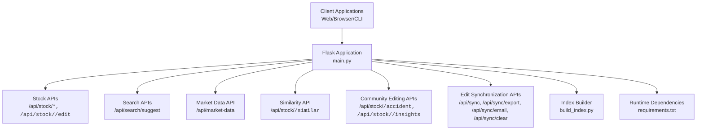
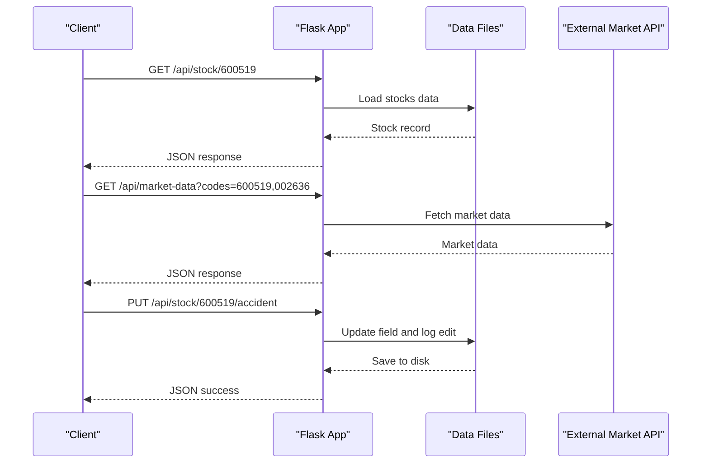
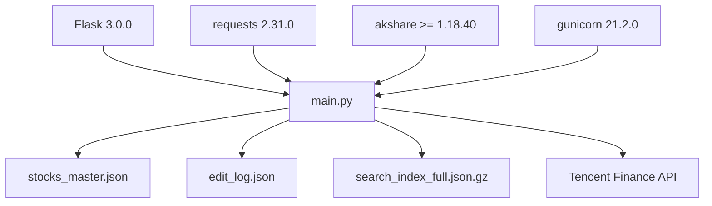

# API Endpoints

<cite>
**Referenced Files in This Document**
- [main.py](file://main.py)
- [build_index.py](file://build_index.py)
- [requirements.txt](file://requirements.txt)
- [README.md](file://README.md)
- [JSON格式标准.md](file://JSON格式标准.md)
</cite>

## Table of Contents
1. [Introduction](#introduction)
2. [Project Structure](#project-structure)
3. [Core Components](#core-components)
4. [Architecture Overview](#architecture-overview)
5. [Detailed Component Analysis](#detailed-component-analysis)
6. [Dependency Analysis](#dependency-analysis)
7. [Performance Considerations](#performance-considerations)
8. [Troubleshooting Guide](#troubleshooting-guide)
9. [Conclusion](#conclusion)

## Introduction
This document provides comprehensive API documentation for the stock research database RESTful endpoints. It covers HTTP methods, URL patterns, request/response schemas, authentication requirements, and practical usage examples for:
- Stock management APIs
- Search APIs
- Market data integration
- Similarity recommendations
- Community editing APIs
- Edit synchronization system

The backend is a Flask application that serves both HTML pages and JSON APIs. The APIs operate on a curated dataset of Chinese A-share stocks and related articles, concepts, and sentiment data.

## Project Structure
The API surface is primarily defined in the main application module. Supporting scripts handle index building and deployment metadata.

**Diagram sources**
- [main.py:137-1242](file://main.py#L137-L1242)
- [build_index.py:1-271](file://build_index.py#L1-L271)
- [requirements.txt:1-5](file://requirements.txt#L1-L5)

**Section sources**
- [main.py:137-1242](file://main.py#L137-L1242)
- [build_index.py:1-271](file://build_index.py#L1-L271)
- [requirements.txt:1-5](file://requirements.txt#L1-L5)

## Core Components
- Flask application entrypoint and routing
- Data loading from JSON/GZIP files
- Edit logging and persistence
- Market data integration via external API
- Search suggestion and similarity computation
- Index building pipeline for frontend consumption

Key runtime dependencies include Flask, Requests, and optional akshare for market data.

**Section sources**
- [main.py:6-18](file://main.py#L6-L18)
- [requirements.txt:1-5](file://requirements.txt#L1-L5)

## Architecture Overview
The API architecture follows a simple layered design:
- Presentation layer: Flask routes serving JSON responses and HTML templates
- Data layer: JSON/GZIP files containing stocks, concepts, and edit logs
- Integration layer: External market data provider (Tencent Finance)
- Indexing layer: Build script generates compressed search index for frontend

**Diagram sources**
- [main.py:480-768](file://main.py#L480-L768)

## Detailed Component Analysis

### Authentication and Security
- No authentication is implemented for any API endpoints.
- All endpoints are public and accept unauthenticated requests.
- No rate limiting or CORS policies are configured in the current implementation.

Practical implication: Use behind a reverse proxy or API gateway for production deployments requiring security controls.

**Section sources**
- [main.py:430-768](file://main.py#L430-L768)

### Stock Management APIs

#### GET /api/stock/{code}
- Purpose: Retrieve detailed stock information by stock code.
- Path parameters:
  - code: Stock code (e.g., 600519)
- Query parameters: None
- Request body: None
- Response: JSON object containing stock details
  - Fields include code, name, board, concepts, industries, products, core_business, industry_position, chain, partners, articles, detail_texts
- Error responses:
  - 404 Not Found if stock does not exist

Example usage:
- curl "https://your-domain/api/stock/600519"

Response schema:
- code: string
- name: string
- board: string
- mention_count: integer
- concepts: array[string]
- industries: array[string]
- products: array[string]
- core_business: array[string]
- industry_position: array[string]
- chain: array[string]
- partners: array[string]
- articles: array[object]
- detail_texts: array[string]

**Section sources**
- [main.py:480-495](file://main.py#L480-L495)

#### POST /api/stock/{code}/edit
- Purpose: Batch-edit stock information fields.
- Path parameters:
  - code: Stock code
- Request body: JSON object with one or more of the following fields:
  - core_business: array[string]
  - products: array[string]
  - industry_position: array[string]
  - chain: array[string]
  - partners: array[string]
- Response: JSON object indicating success and updated fields
- Error responses:
  - 400 Bad Request if request body is invalid
  - 404 Not Found if stock does not exist

Example usage:
- curl -X POST "https://your-domain/api/stock/600519/edit" -H "Content-Type: application/json" -d '{"products":["服务器","芯片"],"partners":["英伟达"]}'

Response schema:
- success: boolean
- updated_fields: array[string]

Notes:
- Updates are persisted to the master data file and edit log is recorded.

**Section sources**
- [main.py:431-478](file://main.py#L431-L478)

### Search APIs

#### GET /api/search/suggest
- Purpose: Provide search suggestions based on partial stock name matches.
- Path parameters: None
- Query parameters:
  - q: Search term (minimum length 2)
- Request body: None
- Response: JSON object containing suggestions
  - suggestions: array of objects with code, name, mention_count
- Error responses:
  - 200 OK with empty suggestions array if query too short or no matches

Example usage:
- curl "https://your-domain/api/search/suggest?q=中科"

Response schema:
- suggestions: array[object]
  - code: string
  - name: string
  - mention_count: integer

**Section sources**
- [main.py:497-504](file://main.py#L497-L504)

### Market Data Integration

#### GET /api/market-data
- Purpose: Fetch real-time market data for specified stock codes.
- Path parameters: None
- Query parameters:
  - codes: Comma-separated list of stock codes (e.g., 600519,002636)
- Request body: None
- Response: JSON object mapping each code to market metrics plus total market cap
  - Keys are stock codes (strings)
  - Values include price, change, marketCap, peRatio
  - totalCap: aggregated market capitalization across requested codes
- Error responses:
  - 200 OK with default values if no codes provided
  - 200 OK with error field if external API call fails

Example usage:
- curl "https://your-domain/api/market-data?codes=600519,002636,300308"

Response schema:
- [code]: object
  - price: number
  - change: number
  - marketCap: number
  - peRatio: number/null
- totalCap: number

Notes:
- Uses Tencent Finance API with specific referer and user-agent headers.
- Data parsing expects GB18030 encoding.

**Section sources**
- [main.py:696-768](file://main.py#L696-L768)

### Similarity Recommendations

#### GET /api/stock/{code}/similar
- Purpose: Get similar stocks based on concept overlap using Jaccard similarity.
- Path parameters:
  - code: Target stock code
- Query parameters:
  - top: Integer limit for results (default 10)
  - min_sim: Minimum similarity threshold (default 0.1)
- Request body: None
- Response: JSON object containing similar stocks and count
  - similar: array of recommendation objects
  - count: integer
- Recommendation object schema:
  - code: string
  - name: string
  - similarity: number
  - common_concepts: array[string]
  - common_count: integer
  - mention_count: integer
  - concepts: array[string]
- Error responses:
  - 200 OK with empty array if stock not found or no similarities meet threshold

Example usage:
- curl "https://your-domain/api/stock/600519/similar?top=5&min_sim=0.15"

**Section sources**
- [main.py:687-694](file://main.py#L687-L694)
- [main.py:37-70](file://main.py#L37-L70)

### Community Editing APIs

#### PUT /api/stock/{code}/accident
- Purpose: Update the accident (catalyst) field for a stock.
- Path parameters:
  - code: Stock code
- Request body: JSON object with field accident (string)
- Response: JSON object indicating success/failure
- Error responses:
  - 404 Not Found if stock does not exist
  - On success, edit is logged and saved to master data

Example usage:
- curl -X PUT "https://your-domain/api/stock/600519/accident" -H "Content-Type: application/json" -d '{"accident":"管理层变动"}'

**Section sources**
- [main.py:525-547](file://main.py#L525-L547)

#### PUT /api/stock/{code}/insights
- Purpose: Update the insights (investment insight) field for a stock.
- Path parameters:
  - code: Stock code
- Request body: JSON object with field insights (string)
- Response: JSON object indicating success/failure
- Error responses:
  - 404 Not Found if stock does not exist
  - On success, edit is logged and saved to master data

Example usage:
- curl -X PUT "https://your-domain/api/stock/600519/insights" -H "Content-Type: application/json" -d '{"insights":"短期看涨"}'

**Section sources**
- [main.py:549-571](file://main.py#L549-L571)

### Edit Synchronization System

#### GET /api/sync
- Purpose: Retrieve all edit logs for synchronization.
- Path parameters: None
- Query parameters: None
- Request body: None
- Response: JSON object containing edit count and edits
  - success: boolean
  - count: integer
  - edits: array[object]
- Edit log object schema:
  - timestamp: ISO string
  - code: string
  - name: string
  - fields: array[string] or field/content depending on operation
  - changes: object (for batch edits)

Example usage:
- curl "https://your-domain/api/sync"

**Section sources**
- [main.py:612-619](file://main.py#L612-L619)

#### GET /api/sync/export
- Purpose: Export edit logs to a downloadable JSON file.
- Path parameters: None
- Query parameters: None
- Request body: None
- Response: JSON file attachment containing export data
  - export_time: ISO string
  - total_edits: integer
  - edits: array[object]
- Error responses:
  - 404 Not Found if no edit logs exist

Example usage:
- curl -O "https://your-domain/api/sync/export"

**Section sources**
- [main.py:621-638](file://main.py#L621-L638)

#### POST /api/sync/email
- Purpose: Generate an email draft containing edit logs.
- Path parameters: None
- Query parameters: None
- Request body: JSON object with field email (string)
- Response: JSON object indicating success and content preview
  - success: boolean
  - message: string (filename of generated draft)
  - content: string (preview of email content)
- Error responses:
  - 404 Not Found if no edit logs exist

Example usage:
- curl -X POST "https://your-domain/api/sync/email" -H "Content-Type: application/json" -d '{"email":"user@example.com"}'

**Section sources**
- [main.py:640-677](file://main.py#L640-L677)

#### POST /api/sync/clear
- Purpose: Clear all edit logs.
- Path parameters: None
- Query parameters: None
- Request body: None
- Response: JSON object confirming clear operation
  - success: boolean
  - message: string
- Error responses: None

Example usage:
- curl -X POST "https://your-domain/api/sync/clear"

**Section sources**
- [main.py:679-685](file://main.py#L679-L685)

### Additional Article Import and Merge APIs

These endpoints support importing articles from WeChat links and merging extracted stock data into the master dataset.

#### POST /api/article/import
- Purpose: Import a WeChat article and extract stock mentions.
- Path parameters: None
- Query parameters: None
- Request body: JSON object with field url (string)
- Response: JSON object with import results
  - success: boolean
  - article_title: string
  - stocks: array[object]
  - unmatched_names: array[string]
  - total_found: integer
  - total_matched: integer
  - message: string
- Error responses:
  - 400 Bad Request for invalid URL or missing data
  - 500 Internal Server Error for processing failures

Example usage:
- curl -X POST "https://your-domain/api/article/import" -H "Content-Type: application/json" -d '{"url":"https://mp.weixin.qq.com/s/..."}'

**Section sources**
- [main.py:942-1073](file://main.py#L942-L1073)

#### POST /api/article/merge-to-master
- Purpose: Merge imported article data into the master stock dataset.
- Path parameters: None
- Query parameters: None
- Request body: JSON object with optional field filepath (string)
- Response: JSON object with merge results
  - success: boolean
  - merged_count: integer
  - skipped_count: integer
  - merged_stocks: array[object]
  - message: string
- Error responses:
  - 400 Bad Request if no import files exist
  - 500 Internal Server Error for processing failures

Example usage:
- curl -X POST "https://your-domain/api/article/merge-to-master" -H "Content-Type: application/json" -d '{}'

**Section sources**
- [main.py:1076-1201](file://main.py#L1076-L1201)

#### GET /api/raw-material/list
- Purpose: List all imported article files in the raw material directory.
- Path parameters: None
- Query parameters: None
- Request body: None
- Response: JSON object with file list
  - success: boolean
  - files: array[object]
  - total: integer
- Error responses:
  - 500 Internal Server Error for processing failures

Example usage:
- curl "https://your-domain/api/raw-material/list"

**Section sources**
- [main.py:1204-1235](file://main.py#L1204-L1235)

## Dependency Analysis
The API relies on several runtime dependencies and external integrations.

**Diagram sources**
- [requirements.txt:1-5](file://requirements.txt#L1-L5)
- [main.py:696-768](file://main.py#L696-L768)

**Section sources**
- [requirements.txt:1-5](file://requirements.txt#L1-L5)
- [main.py:696-768](file://main.py#L696-L768)

## Performance Considerations
- Data loading: Stocks and concepts are loaded from compressed JSON files at startup. Large datasets may impact initialization time.
- External API calls: Market data fetching uses a third-party service with timeouts and encoding handling. Network latency affects response times.
- Index building: The index generation script processes large JSON files and writes compressed output. Scheduled rebuilds should be considered for frequent data updates.
- Pagination: The dashboard supports pagination to reduce payload sizes for large lists.

[No sources needed since this section provides general guidance]

## Troubleshooting Guide
Common issues and resolutions:
- 404 Not Found for stock endpoints: Verify the stock code exists in the dataset.
- Empty suggestions: Ensure query length is at least 2 characters.
- Market data errors: Check network connectivity and external API availability.
- Edit synchronization failures: Confirm edit logs exist before export/email/clear operations.
- Index rebuilding: Use the index builder script to regenerate the search index after data updates.

**Section sources**
- [main.py:480-768](file://main.py#L480-L768)
- [build_index.py:77-267](file://build_index.py#L77-L267)

## Conclusion
The API suite provides comprehensive coverage for stock data retrieval, editing, search, market integration, similarity recommendations, and synchronization. While currently unauthenticated, it offers a solid foundation for building secure integrations behind proxies or gateways. The modular design allows for incremental enhancements such as adding authentication, rate limiting, and database-backed storage.