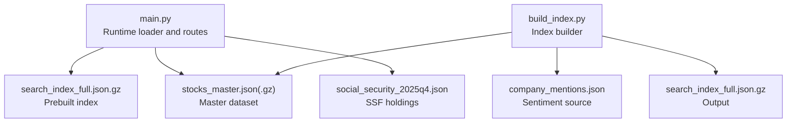
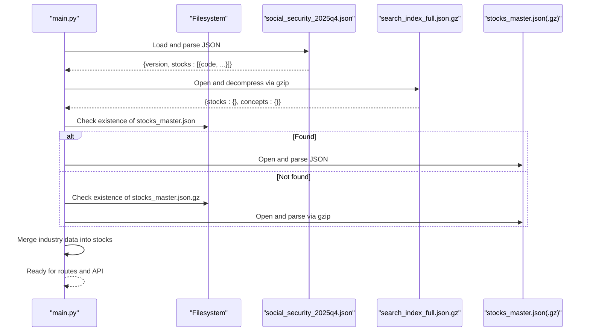
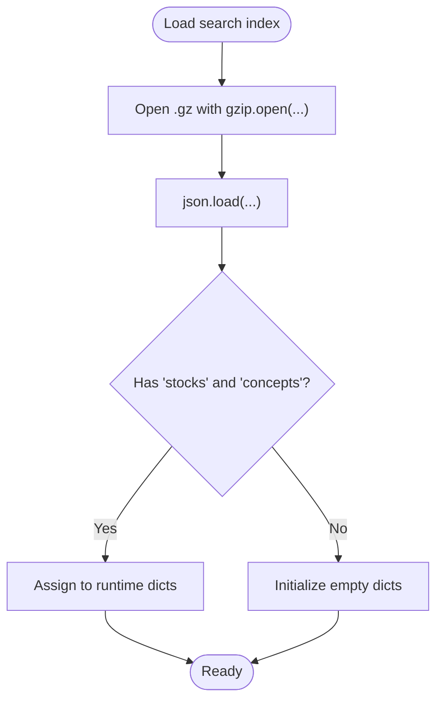
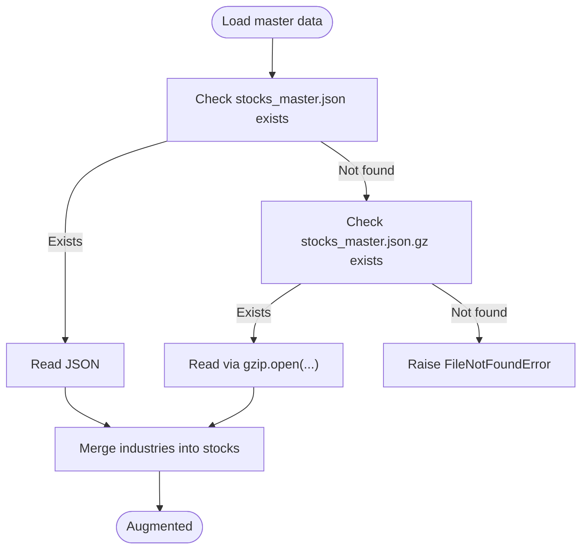
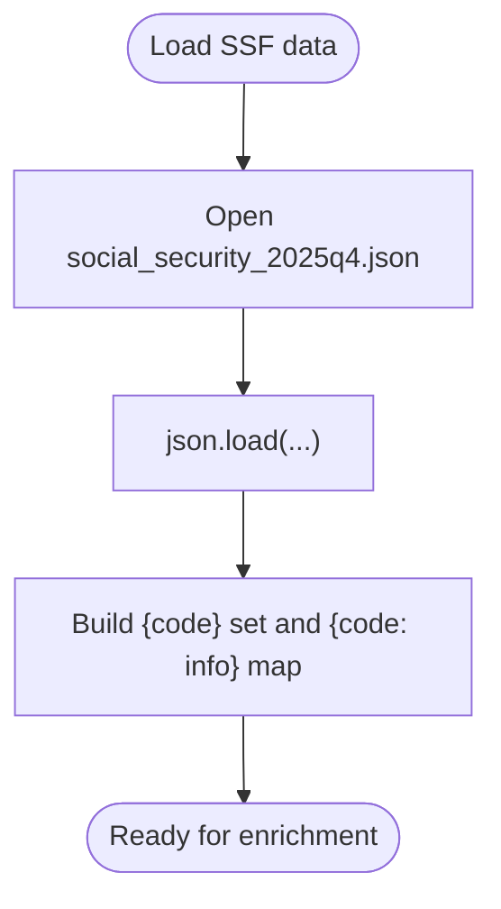
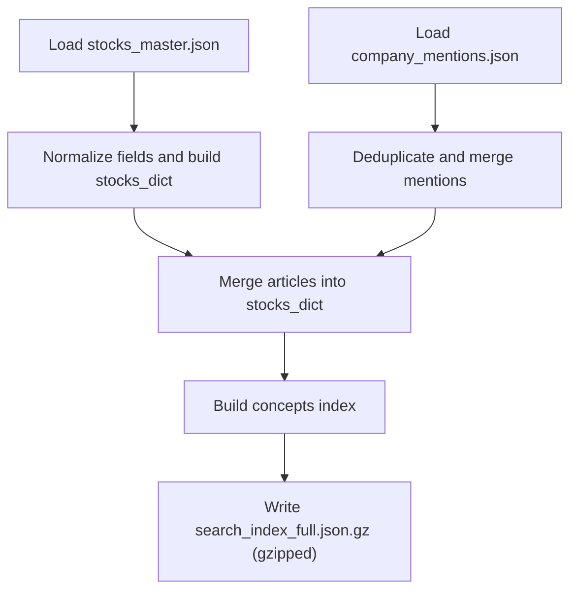
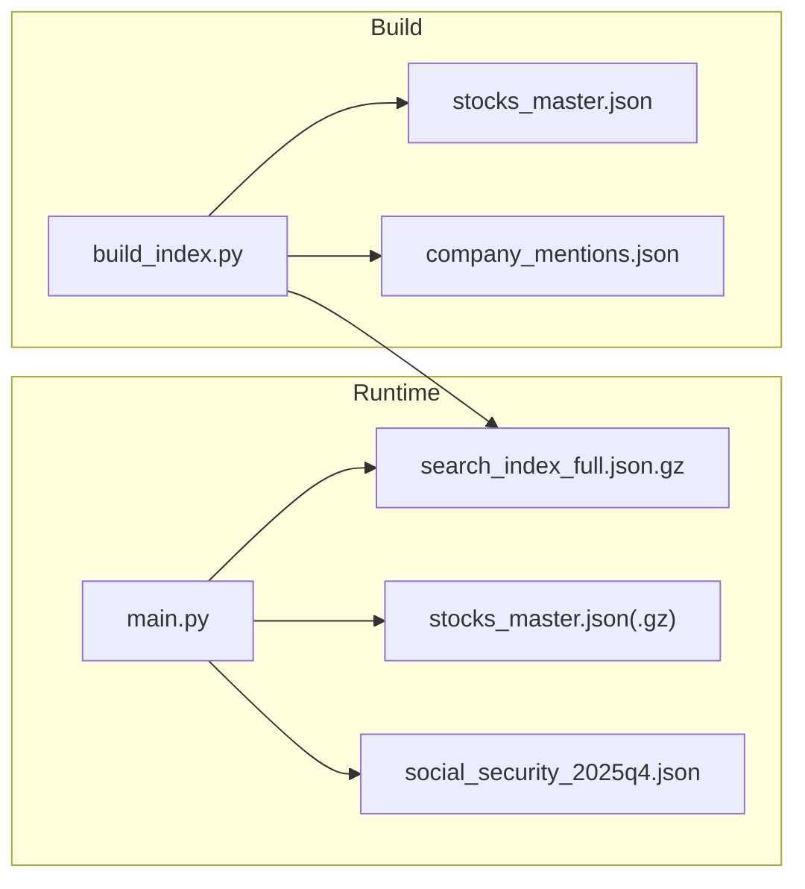

# Data Loading and Parsing

<cite>
**Referenced Files in This Document**
- [main.py](file://main.py)
- [build_index.py](file://build_index.py)
- [social_security_2025q4.json](file://data/master/social_security_2025q4.json)
- [industry_map.json](file://data/master/industry_map.json)
</cite>

## Table of Contents
1. [Introduction](#introduction)
2. [Project Structure](#project-structure)
3. [Core Components](#core-components)
4. [Architecture Overview](#architecture-overview)
5. [Detailed Component Analysis](#detailed-component-analysis)
6. [Dependency Analysis](#dependency-analysis)
7. [Performance Considerations](#performance-considerations)
8. [Troubleshooting Guide](#troubleshooting-guide)
9. [Conclusion](#conclusion)

## Introduction
This document explains the data loading and parsing system used by the application to load and augment stock research data. It covers:
- Compressed JSON loading for the search index
- Dual-file master data loading (compressed vs uncompressed)
- Industry data augmentation
- Social security fund data integration
- Error handling, fallback mechanisms, and memory management strategies
- Typical data structures, loading sequences, and error scenarios with resolutions

## Project Structure
The data pipeline centers around:
- A gzipped search index containing prebuilt stock and concept data
- A master dataset (JSON or gzipped JSON) used to enrich stock records with industry metadata
- Social security fund holdings data for 2025Q4
- A build script to regenerate the search index from raw sentiment and master data

**Diagram sources**
- [main.py](file://main.py)
- [build_index.py](file://build_index.py)

**Section sources**
- [main.py](file://main.py)
- [build_index.py](file://build_index.py)

## Core Components
- Search index loader: Reads a gzipped JSON file and extracts stocks and concepts dictionaries.
- Master data loader: Loads the master dataset from either an uncompressed JSON or a gzipped JSON, with a fallback strategy.
- Industry augmentation: Merges industry metadata from the master dataset into the loaded stocks.
- Social security fund loader: Loads 2025Q4 holdings and builds quick lookup sets and info maps.
- Index builder: Aggregates sentiment and master data into a gzipped search index for runtime consumption.

Key runtime data structures:
- stocks: dictionary keyed by stock code; each value is a stock record enriched with fields such as name, board, concepts, industries, articles, and metrics.
- concepts: dictionary keyed by concept name; each value is a list of stock codes associated with that concept.
- social_security_stocks: set of stock codes present in the social security dataset.
- social_security_info: mapping from stock code to a small info bundle (holding ratio, note, industry group).

**Section sources**
- [main.py](file://main.py)
- [social_security_2025q4.json](file://data/master/social_security_2025q4.json)

## Architecture Overview
The runtime loading sequence is as follows:

**Diagram sources**
- [main.py](file://main.py)

## Detailed Component Analysis

### Search Index Loader (search_index_full.json.gz)
- Purpose: Provide a ready-to-use index of stocks and concepts for fast web serving.
- Mechanism:
  - Opens the gzipped file with text mode and UTF-8 encoding.
  - Parses JSON into a dictionary.
  - Extracts two top-level keys: stocks (dictionary keyed by code) and concepts (dictionary keyed by concept name).
- Error handling:
  - On failure, logs an error and initializes empty dictionaries for stocks and concepts.
- Memory considerations:
  - Entire index is loaded into memory as a Python dictionary; size depends on dataset scale.

**Diagram sources**
- [main.py](file://main.py)

**Section sources**
- [main.py](file://main.py)

### Master Data Loader (Dual-file approach)
- Purpose: Load the master dataset to augment stock records with industry metadata.
- Mechanism:
  - Checks for the presence of stocks_master.json first.
  - If absent, checks for stocks_master.json.gz.
  - Raises a file-not-found error if neither exists.
  - Parses the chosen file and iterates over the stocks array.
- Industry augmentation:
  - For each stock code present in both the master dataset and the loaded index, copy the industry field into the stock record.
  - Tracks how many stocks were augmented.
- Error handling:
  - On any failure, logs a warning and continues without augmentation.

**Diagram sources**
- [main.py](file://main.py)

**Section sources**
- [main.py](file://main.py)

### Social Security Fund Data Integration
- Purpose: Load 2025Q4 holdings to power dedicated pages and enrich stock detail views.
- Mechanism:
  - Reads the JSON file and constructs:
    - A set of stock codes present in the dataset
    - A mapping from code to a small info bundle (holding ratio, note, industry group)
- Error handling:
  - On failure, logs a warning and proceeds with empty structures.

**Diagram sources**
- [main.py](file://main.py)
- [social_security_2025q4.json](file://data/master/social_security_2025q4.json)

**Section sources**
- [main.py](file://main.py)
- [social_security_2025q4.json](file://data/master/social_security_2025q4.json)

### Industry Data Augmentation (External Industry Map)
- Purpose: Optionally enrich stocks with industry categories from an external industry map.
- Mechanism:
  - The industry map file contains a dictionary keyed by industry name with lists of stock codes.
  - During runtime, the application can iterate over this map to:
    - Build industry-to-stocks mappings
    - Or cross-reference to further annotate stocks already in memory
- Notes:
  - The runtime loader does not directly consume this file; it is available for potential future augmentation.

**Section sources**
- [industry_map.json](file://data/master/industry_map.json)

### Index Builder (build_index.py)
- Purpose: Regenerate the gzipped search index from the master dataset and sentiment mentions.
- Inputs:
  - stocks_master.json
  - company_mentions.json
- Outputs:
  - search_index_full.json.gz
- Processing highlights:
  - Extracts and normalizes fields from the master dataset and sentiment mentions.
  - Builds per-stock articles arrays and aggregates concept indices.
  - Writes a gzipped JSON with version, update time, stocks dictionary, and concepts dictionary.

**Diagram sources**
- [build_index.py](file://build_index.py)

**Section sources**
- [build_index.py](file://build_index.py)

## Dependency Analysis
- Runtime dependencies:
  - main.py depends on:
    - search_index_full.json.gz (for initial stock/concept data)
    - stocks_master.json(.gz) (for industry augmentation)
    - social_security_2025q4.json (for SSF-related features)
- Build-time dependencies:
  - build_index.py depends on:
    - stocks_master.json
    - company_mentions.json
    - Produces search_index_full.json.gz

**Diagram sources**
- [main.py](file://main.py)
- [build_index.py](file://build_index.py)

**Section sources**
- [main.py](file://main.py)
- [build_index.py](file://build_index.py)

## Performance Considerations
- Compression and streaming:
  - The search index is gzipped to reduce payload size; it is decompressed in-memory during startup.
  - For very large datasets, consider lazy loading or partial reads if feasible; currently, the entire index is loaded.
- File I/O:
  - Dual-file master data support avoids unnecessary compression overhead in deployment environments.
  - Existence checks are O(1) via filesystem stat operations.
- Memory footprint:
  - stocks and concepts dictionaries are held in memory; monitor memory usage as dataset scales.
- JSON parsing:
  - Single-pass loads for index and master data; ensure UTF-8 encoding is consistently applied.

## Troubleshooting Guide
Common issues and resolutions:
- Missing search index file
  - Symptom: Startup logs show an error and empty stocks/concepts.
  - Resolution: Ensure search_index_full.json.gz exists and is readable. Rebuild using the index builder if needed.
  - Section sources
    - [main.py](file://main.py)
    - [build_index.py](file://build_index.py)
- Missing master data files
  - Symptom: Industry augmentation shows zero updates or warnings.
  - Resolution: Place stocks_master.json or stocks_master.json.gz under data/master/. Prefer the uncompressed JSON for deployment simplicity.
  - Section sources
    - [main.py](file://main.py)
- Social security data missing
  - Symptom: SSF page fails to load or enrichment is empty.
  - Resolution: Ensure social_security_2025q4.json exists under data/master/.
  - Section sources
    - [main.py](file://main.py)
    - [social_security_2025q4.json](file://data/master/social_security_2025q4.json)
- Incorrect file permissions or encoding
  - Symptom: JSON parse errors or UnicodeDecodeError.
  - Resolution: Verify file permissions and ensure UTF-8 encoding. The loader explicitly opens with UTF-8 text mode.
  - Section sources
    - [main.py](file://main.py)
- Outdated search index after data updates
  - Symptom: Old stock counts or missing recent mentions.
  - Resolution: Run the index builder to regenerate search_index_full.json.gz from the latest master and sentiment data.
  - Section sources
    - [build_index.py](file://build_index.py)

## Conclusion
The data loading and parsing system is designed for reliability and simplicity:
- The runtime loads a gzipped search index for fast serving.
- Master data is loaded from either an uncompressed JSON or a gzipped JSON, with a clear fallback.
- Industry augmentation enriches stock records from the master dataset.
- Social security fund data is integrated to power specialized pages and stock detail enrichments.
- The index builder consolidates sentiment and master data into a single, compressed index for distribution.

This architecture balances ease of deployment with maintainability and provides robust error handling and fallbacks to keep the service resilient.