# Data Processing and Loading

<cite>
**Referenced Files in This Document**
- [main.py](file://main.py)
- [build_index.py](file://build_index.py)
- [merge_email_data.py](file://merge_email_data.py)
- [requirements.txt](file://requirements.txt)
- [README.md](file://README.md)
- [data/master/social_security_2025q4.json](file://data/master/social_security_2025q4.json)
- [data/master/industry_map.json](file://data/master/industry_map.json)
- [data/master/thingsindustry_map.json](file://data/master/thingsindustry_map.json)
- [data/master/ths_industry_map.json](file://data/master/ths_industry_map.json)
- [data/master/stocks_master.json](file://data/master/stocks_master.json)
- [data/sentiment/company_mentions.json.backup](file://data/sentiment/company_mentions.json.backup)
- [fix_all.py](file://fix_all.py)
- [fix_all_v2.py](file://fix_all_v2.py)
</cite>

## Table of Contents
1. [Introduction](#introduction)
2. [Project Structure](#project-structure)
3. [Core Components](#core-components)
4. [Architecture Overview](#architecture-overview)
5. [Detailed Component Analysis](#detailed-component-analysis)
6. [Dependency Analysis](#dependency-analysis)
7. [Performance Considerations](#performance-considerations)
8. [Troubleshooting Guide](#troubleshooting-guide)
9. [Conclusion](#conclusion)
10. [Appendices](#appendices)

## Introduction
This document explains the data processing and loading system used by the stock research web application. It covers:
- Loading and decompression of compressed JSON data (search index and master data)
- Transformation and enrichment of data (concept indexing, mention aggregation, detail text generation)
- Memory management strategies during runtime
- Jaccard similarity algorithm for concept-based stock matching
- Data augmentation via external datasets (social security funds, industry classifications)
- Real-time market data fetching and integration
- Performance optimizations, error handling, and fallback mechanisms
- Examples of data structures, loading sequences, and processing pipelines

## Project Structure
The system consists of:
- A Flask web server that serves the UI and APIs
- A data ingestion pipeline that builds a compressed search index from sentiment and master data
- Auxiliary scripts for merging external data and fixing UI templates
- Industry classification and social security datasets for augmentation

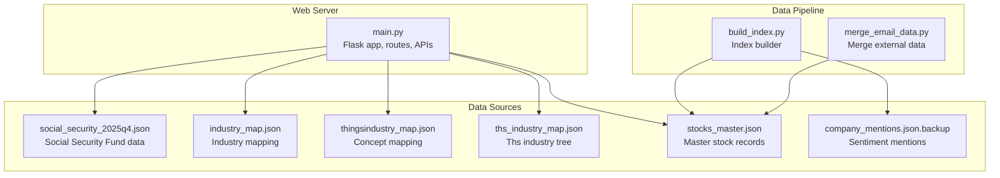

**Diagram sources**
- [main.py](file://main.py)
- [build_index.py](file://build_index.py)
- [merge_email_data.py](file://merge_email_data.py)
- [data/master/social_security_2025q4.json](file://data/master/social_security_2025q4.json)
- [data/master/industry_map.json](file://data/master/industry_map.json)
- [data/master/thingsindustry_map.json](file://data/master/thingsindustry_map.json)
- [data/master/ths_industry_map.json](file://data/master/ths_industry_map.json)
- [data/master/stocks_master.json](file://data/master/stocks_master.json)
- [data/sentiment/company_mentions.json.backup](file://data/sentiment/company_mentions.json.backup)

**Section sources**
- [main.py](file://main.py)
- [build_index.py](file://build_index.py)
- [merge_email_data.py](file://merge_email_data.py)
- [README.md](file://README.md)

## Core Components
- Data loader and runtime data structures
  - Loads compressed search index and master data
  - Maintains in-memory dictionaries for stocks and concepts
  - Provides APIs for stock details, similarity, and market data
- Index builder
  - Reads master stock records and sentiment mentions
  - Cleans and normalizes text
  - Builds a compressed search index with concepts and detail texts
- Data augmentation
  - Integrates social security fund holdings
  - Enriches industries from multiple classification sources
- UI editing and synchronization
  - Allows manual edits and sync/export of edit logs

**Section sources**
- [main.py](file://main.py)
- [build_index.py](file://build_index.py)
- [merge_email_data.py](file://merge_email_data.py)

## Architecture Overview
The system follows a pipeline-driven architecture:
- Build phase: build_index.py transforms raw data into a compressed search index
- Runtime phase: main.py loads the index, augments data, and exposes APIs
- Optional merge phase: merge_email_data.py integrates external updates into master data

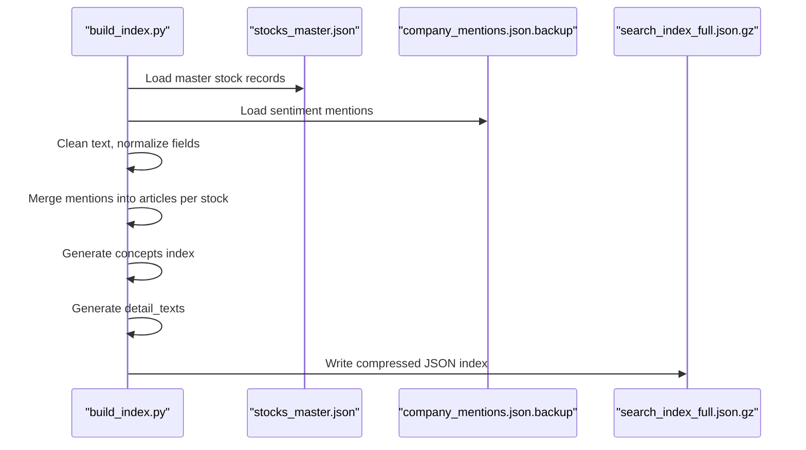

**Diagram sources**
- [build_index.py](file://build_index.py)
- [data/master/stocks_master.json](file://data/master/stocks_master.json)
- [data/sentiment/company_mentions.json.backup](file://data/sentiment/company_mentions.json.backup)

## Detailed Component Analysis

### Data Loading and Memory Management
- Compressed search index loading
  - Uses gzip to decompress and load the search index
  - Extracts stocks dictionary and concepts mapping
  - On failure, falls back to empty structures and logs errors
- Master data loading
  - Attempts to load either uncompressed or gzipped stocks_master.json
  - On missing file, logs warning and continues
- Industry data enrichment
  - Reads industry classifications from multiple sources
  - Updates stocks with industry fields when present
- Runtime memory model
  - Maintains in-memory dictionaries for fast lookup
  - Filters and sorts data on demand for UI rendering
  - Uses minimal temporary structures during transformations

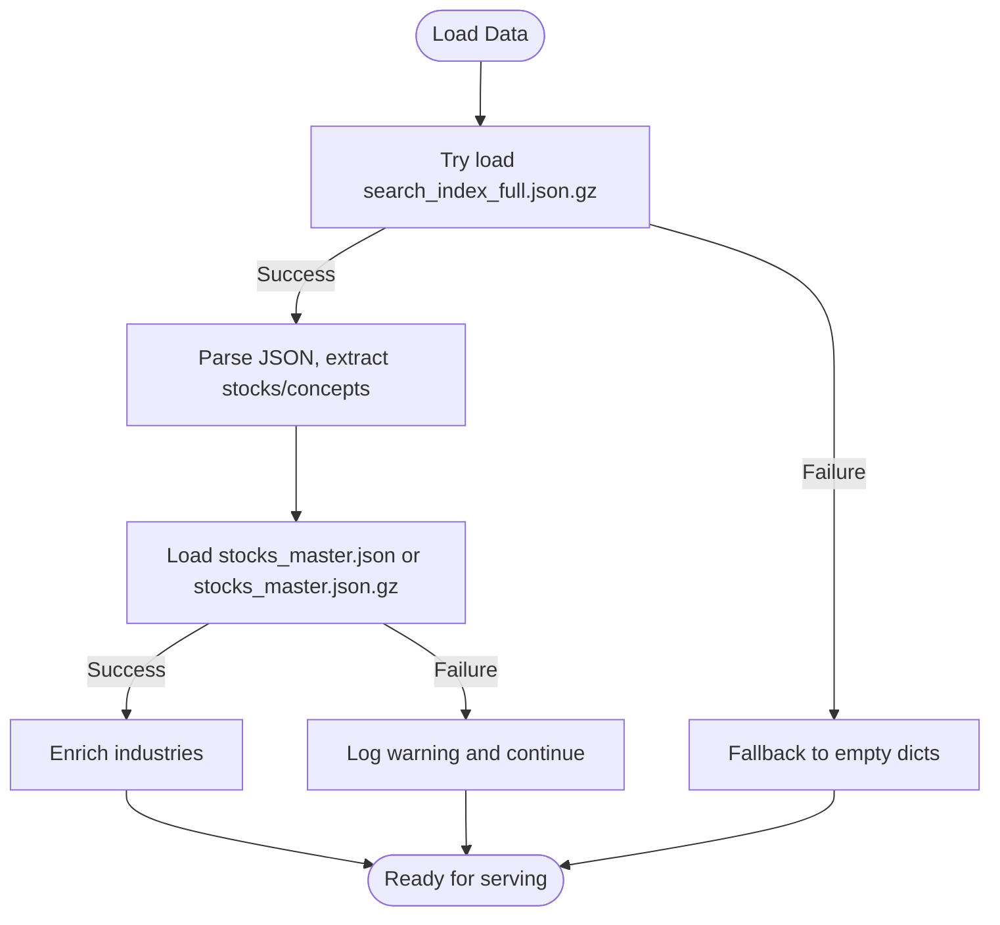

**Diagram sources**
- [main.py](file://main.py)

**Section sources**
- [main.py](file://main.py)

### Jaccard Similarity and Concept Matching
- Implementation
  - Computes Jaccard similarity between sets of concept tags
  - Filters pairs below a minimum similarity threshold
  - Returns top-K matches with shared concepts and mention counts
- Usage
  - Used for recommending similar stocks based on overlapping concepts
  - Supports configurable thresholds and result sizes

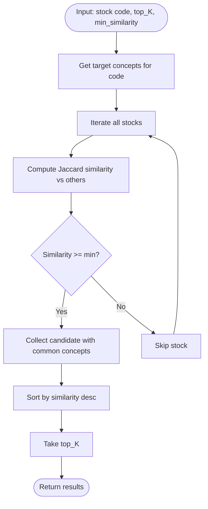

**Diagram sources**
- [main.py](file://main.py)

**Section sources**
- [main.py](file://main.py)

### Data Transformation and Index Building
- Text cleaning
  - Removes Markdown/HTML, preserves multi-source separators
  - Normalizes arrays to comma-separated strings
- Field extraction and normalization
  - Pulls llm_summary or direct fields from master records
  - Converts various formats to lists or cleaned strings
- Mention aggregation
  - Groups sentiment mentions by stock code
  - Deduplicates by article ID
  - Merges into existing articles
- Concept index generation
  - Builds a mapping from concept names to stock codes
- Detail text generation
  - Creates concise summary blocks for UI detail pages
- Output
  - Writes a compressed JSON index with stocks, concepts, and metadata

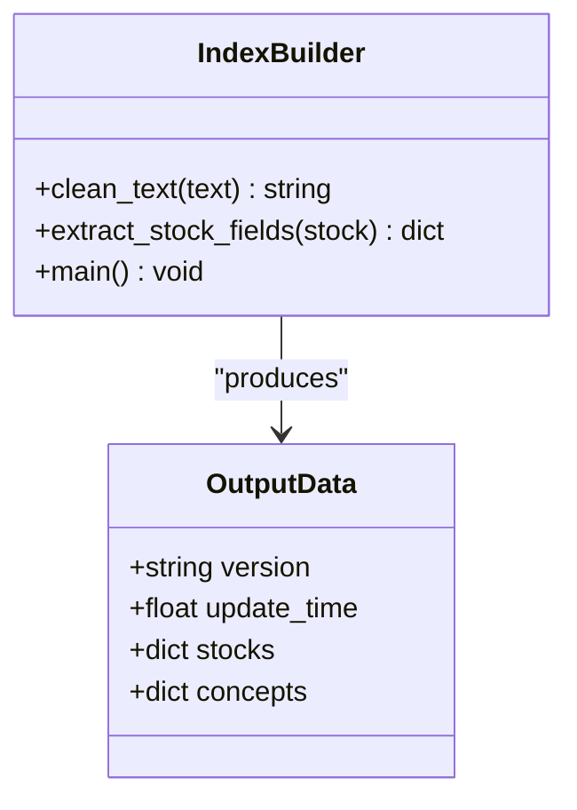

**Diagram sources**
- [build_index.py](file://build_index.py)

**Section sources**
- [build_index.py](file://build_index.py)

### Data Augmentation: Social Security Fund Holdings
- Integration
  - Loads social_security_2025q4.json
  - Builds a set of holding codes and a mapping of attributes
  - Flags stocks as "social security" and enriches detail views
- UI impact
  - Dedicated page for new holdings by quarter
  - Grouping by industry category and statistics

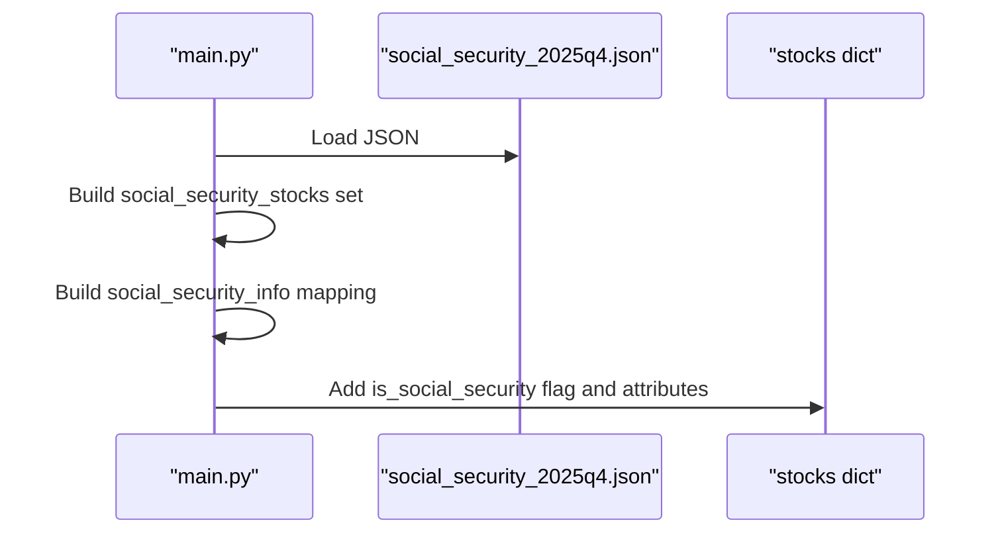

**Diagram sources**
- [main.py](file://main.py)
- [data/master/social_security_2025q4.json](file://data/master/social_security_2025q4.json)

**Section sources**
- [main.py](file://main.py)
- [data/master/social_security_2025q4.json](file://data/master/social_security_2025q4.json)

### Industry Classification Mapping
- Multiple sources
  - industry_map.json: industry-to-stocks mapping
  - thingsindustry_map.json: concept-to-stocks mapping
  - ths_industry_map.json: hierarchical industry taxonomy
- Enrichment strategy
  - During runtime, attempts to map stocks to industry fields
  - Updates only when non-empty industry data is found
- Benefits
  - Improves discoverability and filtering in dashboards

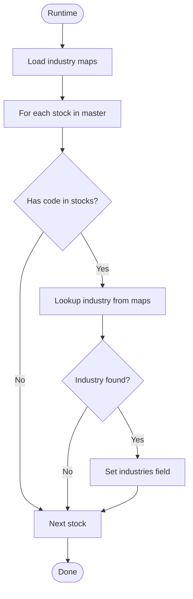

**Diagram sources**
- [main.py](file://main.py)
- [data/master/industry_map.json](file://data/master/industry_map.json)
- [data/master/thingsindustry_map.json](file://data/master/thingsindustry_map.json)
- [data/master/ths_industry_map.json](file://data/master/ths_industry_map.json)

**Section sources**
- [main.py](file://main.py)
- [data/master/industry_map.json](file://data/master/industry_map.json)
- [data/master/thingsindustry_map.json](file://data/master/thingsindustry_map.json)
- [data/master/ths_industry_map.json](file://data/master/ths_industry_map.json)

### Real-Time Market Data Fetching
- Endpoint
  - GET /api/market-data accepts a comma-separated list of stock codes
- Request construction
  - Translates SH/SZ codes to Tencent Finance API symbols
  - Requests via HTTPS with GB18030 decoding
- Parsing and aggregation
  - Parses response lines into structured data
  - Computes total market capitalization across requested symbols
- Error handling
  - Returns safe defaults on failures and logs errors

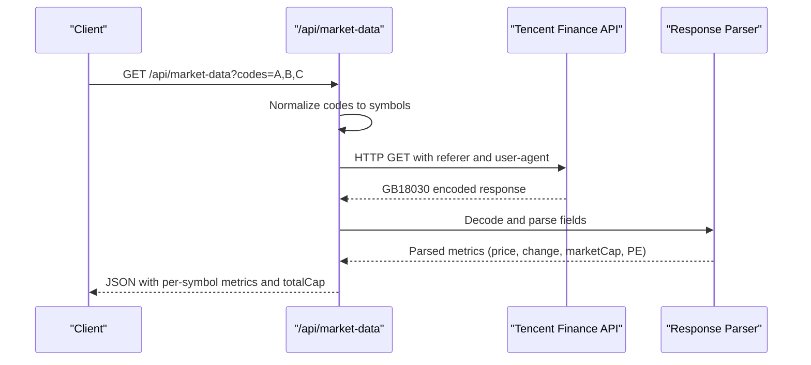

**Diagram sources**
- [main.py](file://main.py)

**Section sources**
- [main.py](file://main.py)

### Edit and Sync Workflows
- Manual edits
  - Users can edit select fields via UI; backend persists to master JSON
  - Edits are logged in an edit log with timestamps and changes
- Export and sync
  - Expose edits via API
  - Export to JSON file for sharing or backup
  - Clear edits endpoint for cleanup

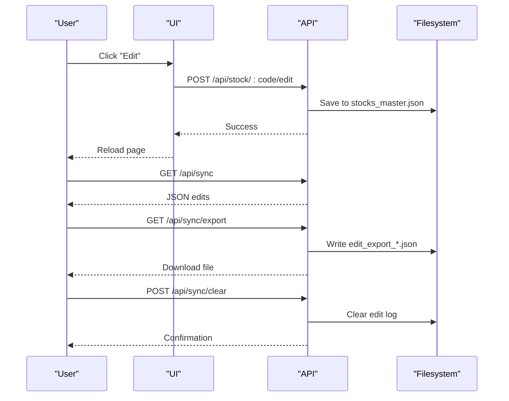

**Diagram sources**
- [main.py](file://main.py)

**Section sources**
- [main.py](file://main.py)

### External Data Merge Script
- Purpose
  - Merge external email-provided stock data into master JSON
  - Handles both single stock and list formats
  - Updates existing records and adds new ones
- Output
  - Saves merged data back to master JSON

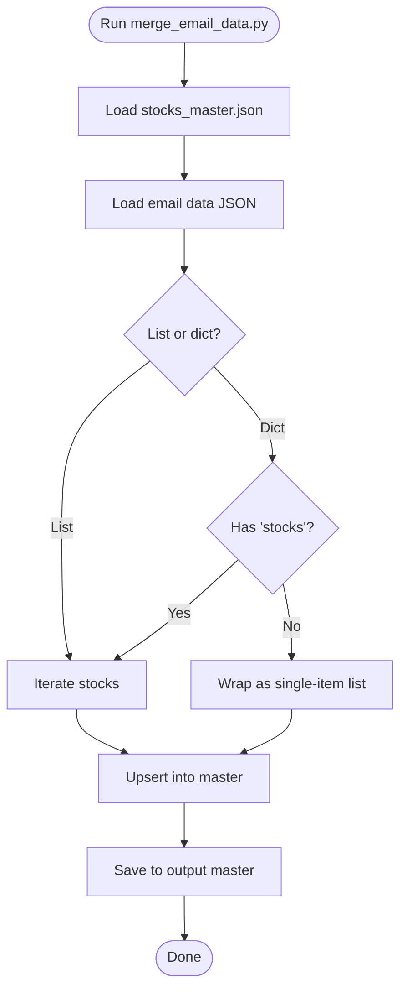

**Diagram sources**
- [merge_email_data.py](file://merge_email_data.py)
- [data/master/stocks_master.json](file://data/master/stocks_master.json)

**Section sources**
- [merge_email_data.py](file://merge_email_data.py)
- [data/master/stocks_master.json](file://data/master/stocks_master.json)

## Dependency Analysis
- Runtime dependencies
  - Flask, Gunicorn, requests, optional akshare
- Internal dependencies
  - main.py depends on built index and master data
  - build_index.py depends on master and sentiment data
  - merge_email_data.py depends on master data

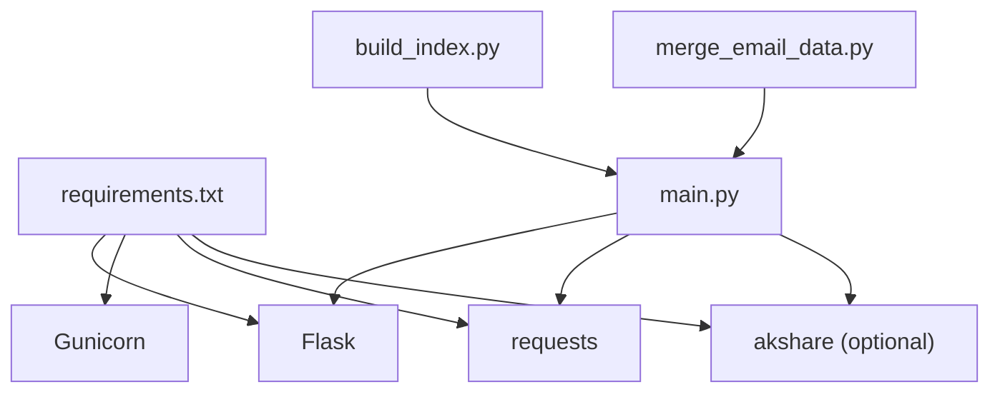

**Diagram sources**
- [requirements.txt](file://requirements.txt)
- [main.py](file://main.py)
- [build_index.py](file://build_index.py)
- [merge_email_data.py](file://merge_email_data.py)

**Section sources**
- [requirements.txt](file://requirements.txt)
- [main.py](file://main.py)

## Performance Considerations
- Data loading
  - Prefer compressed index for faster I/O; fallback gracefully on missing files
  - Lazy loading of large JSON files (master data) only when needed
- Memory usage
  - Keep only essential fields in memory; avoid deep copies where possible
  - Use generators or streaming where feasible for large datasets
- Processing
  - Deduplicate mentions during index build to reduce storage and improve search quality
  - Compute Jaccard similarity on demand with early exits for empty sets
- Network
  - Cache parsed market data per request batch; avoid repeated API calls
  - Set timeouts for external API calls to prevent blocking

## Troubleshooting Guide
- Missing data files
  - Search index: logs error and initializes empty structures
  - Master data: logs warning and continues; UI may show limited data
  - Social security data: logs warning and renders empty/default view
- Market data fetch failures
  - Logs error and returns safe defaults; UI shows placeholders
- Edit persistence failures
  - Logs errors and prevents invalid saves; check filesystem permissions
- Concept similarity returns empty
  - Verify concept tags exist and are non-empty
  - Adjust minimum similarity threshold

**Section sources**
- [main.py](file://main.py)

## Conclusion
The system combines a robust data ingestion pipeline with efficient runtime processing to deliver a responsive stock research interface. By leveraging compressed indices, modular augmentation, and practical error handling, it balances performance and reliability while supporting manual editing and real-time market data integration.

## Appendices

### Data Structures Overview
- Search index (compressed JSON)
  - Fields: version, update_time, stocks (dict), concepts (dict)
- Stock record
  - Fields: code, name, board, industries, concepts, mention_count, articles, llm_summary-like fields
- Concepts index
  - Fields: concept_name -> list of stock codes
- Social security holdings
  - Fields: code, name, industry_category, social_security_fund, change_type, ratio, core_business

**Section sources**
- [build_index.py](file://build_index.py)
- [data/master/stocks_master.json](file://data/master/stocks_master.json)
- [data/master/social_security_2025q4.json](file://data/master/social_security_2025q4.json)

### Loading Sequences and Pipelines
- Build index
  - Load master, load mentions, clean and normalize, merge mentions, generate concepts, write compressed index
- Runtime load
  - Load compressed index, optionally load master for enrichment, apply filters and sorting, serve APIs

**Section sources**
- [build_index.py](file://build_index.py)
- [main.py](file://main.py)