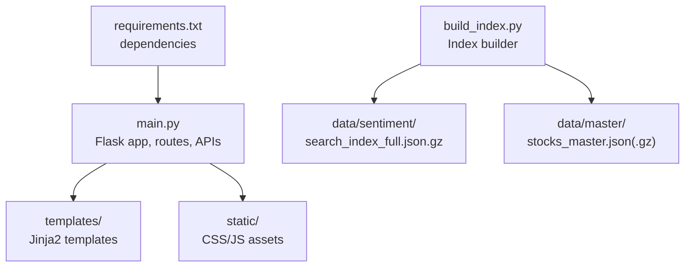
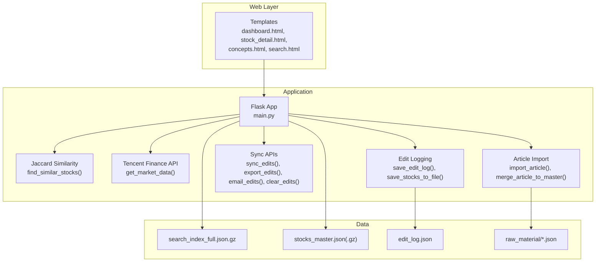
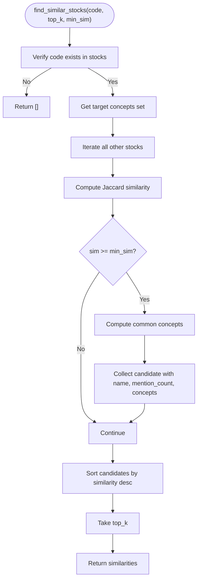
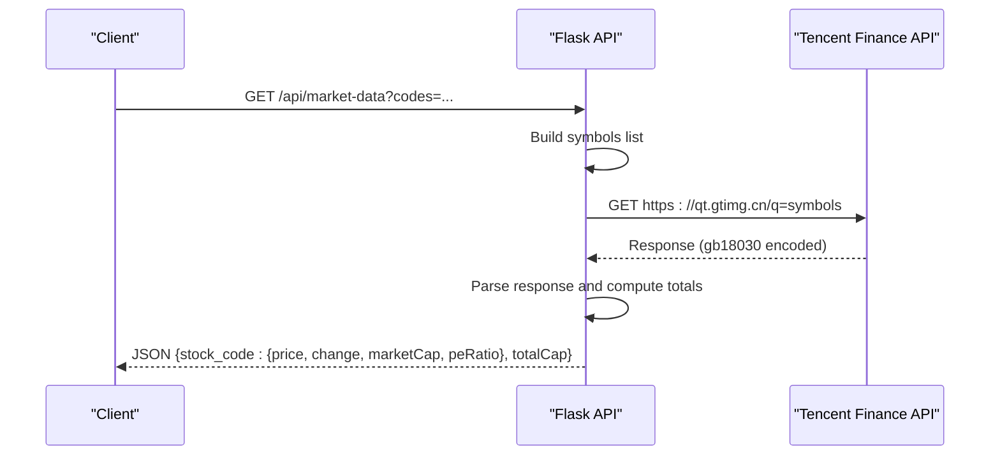
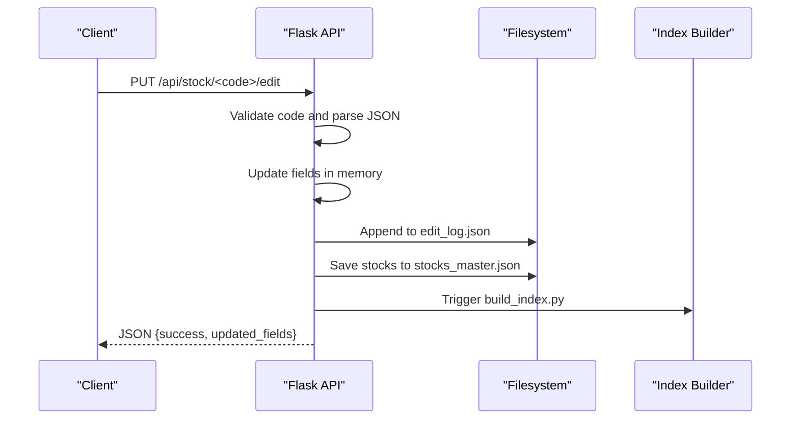
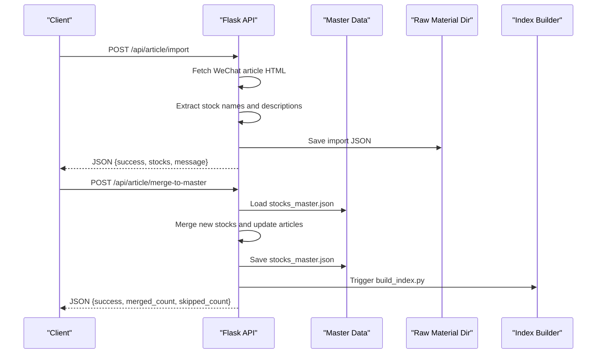
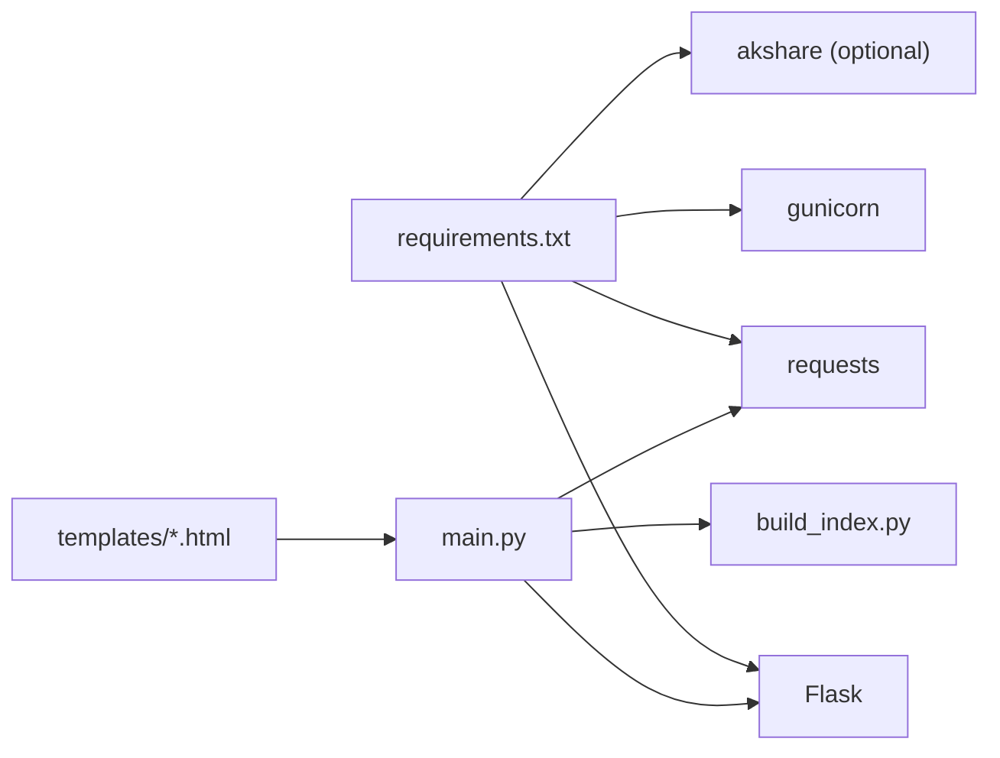

# Flask Application

<cite>
**Referenced Files in This Document**
- [main.py](file://main.py)
- [requirements.txt](file://requirements.txt)
- [README.md](file://README.md)
- [templates/dashboard.html](file://templates/dashboard.html)
- [templates/stock_detail.html](file://templates/stock_detail.html)
- [templates/concepts.html](file://templates/concepts.html)
- [templates/search.html](file://templates/search.html)
- [templates/components/stock_card.html](file://templates/components/stock_card.html)
- [build_index.py](file://build_index.py)
</cite>

## Table of Contents
1. [Introduction](#introduction)
2. [Project Structure](#project-structure)
3. [Core Components](#core-components)
4. [Architecture Overview](#architecture-overview)
5. [Detailed Component Analysis](#detailed-component-analysis)
6. [Dependency Analysis](#dependency-analysis)
7. [Performance Considerations](#performance-considerations)
8. [Troubleshooting Guide](#troubleshooting-guide)
9. [Conclusion](#conclusion)
10. [Appendices](#appendices)

## Introduction
This document describes the Flask application component of the Stock Research Platform. It covers application initialization, routing configuration, template rendering, core routes (dashboard, stock detail, concepts, search), the Jaccard similarity algorithm for concept matching, real-time market data integration via Tencent Finance API, and edit logging mechanisms. It also documents API endpoints for stock management, community editing features, and data synchronization, along with error handling strategies, logging mechanisms, and performance optimizations. Practical examples are provided via code snippet paths to actual implementation locations.

## Project Structure
The Flask application is implemented in a single module with a clear separation of concerns:
- Application initialization and routing in main.py
- Template rendering using Jinja2 templates under templates/
- Static assets under static/
- Data indexing pipeline under build_index.py
- Dependencies declared in requirements.txt

**Diagram sources**
- [main.py:1-1226](file://main.py#L1-L1226)
- [build_index.py:1-271](file://build_index.py#L1-L271)
- [requirements.txt:1-5](file://requirements.txt#L1-L5)

**Section sources**
- [main.py:1-1226](file://main.py#L1-L1226)
- [requirements.txt:1-5](file://requirements.txt#L1-L5)
- [README.md:1-126](file://README.md#L1-L126)

## Core Components
- Flask application instance and configuration
- Data loading and preprocessing (index and master data)
- Routing for UI and API endpoints
- Template rendering for dashboard, stock detail, concepts, and search
- Edit logging and synchronization APIs
- Real-time market data integration via Tencent Finance API

Key implementation references:
- Application creation and basic configuration: [main.py:20](file://main.py#L20)
- Data loading and preprocessing: [main.py:94-136](file://main.py#L94-L136)
- Dashboard route: [main.py:138-210](file://main.py#L138-L210)
- Stock detail route: [main.py:280-336](file://main.py#L280-L336)
- Concepts routes: [main.py:338-356](file://main.py#L338-L356)
- Search route: [main.py:358-429](file://main.py#L358-L429)
- Similarity recommendation: [main.py:37-70](file://main.py#L37-L70)
- Market data API: [main.py:696-768](file://main.py#L696-L768)
- Edit APIs and logging: [main.py:431-478](file://main.py#L431-L478), [main.py:525-571](file://main.py#L525-L571), [main.py:573-610](file://main.py#L573-L610)
- Sync APIs: [main.py:612-685](file://main.py#L612-L685)
- Article import and merge: [main.py:940-1185](file://main.py#L940-L1185)

**Section sources**
- [main.py:20-136](file://main.py#L20-L136)
- [main.py:138-429](file://main.py#L138-L429)
- [main.py:431-685](file://main.py#L431-L685)
- [main.py:696-1185](file://main.py#L696-L1185)

## Architecture Overview
The Flask application orchestrates data loading, routing, and rendering. Templates define the UI, while APIs expose data and editing capabilities. The index builder maintains a compressed search index for efficient UI rendering.

**Diagram sources**
- [main.py:20-1226](file://main.py#L20-L1226)
- [build_index.py:77-234](file://build_index.py#L77-L234)

## Detailed Component Analysis

### Flask Application Initialization and Data Loading
- Creates Flask app instance and sets up data paths.
- Loads compressed search index and builds in-memory data structures (stocks, concepts).
- Loads master industry data and merges into stocks.
- Initializes edit log from disk.

Implementation references:
- App creation and imports: [main.py:6-20](file://main.py#L6-L20)
- Data paths and index loading: [main.py:23-26](file://main.py#L23-L26), [main.py:94-104](file://main.py#L94-L104)
- Industry data merge: [main.py:106-136](file://main.py#L106-L136)
- Edit log load: [main.py:518-523](file://main.py#L518-L523)

**Section sources**
- [main.py:6-20](file://main.py#L6-L20)
- [main.py:94-136](file://main.py#L94-L136)
- [main.py:518-523](file://main.py#L518-L523)

### Routing Configuration and Template Rendering
- Dashboard route renders paginated stock list with AJAX support.
- Stock detail route renders detailed page with articles and related data.
- Concepts routes list and detail concept pages.
- Search route provides full-text search across multiple fields.
- Concept similarity recommendation powered by Jaccard similarity.

Implementation references:
- Dashboard: [main.py:138-210](file://main.py#L138-L210)
- Stock detail: [main.py:280-336](file://main.py#L280-L336)
- Concepts list/detail: [main.py:338-356](file://main.py#L338-L356)
- Search: [main.py:358-429](file://main.py#L358-L429)
- Similarity: [main.py:37-70](file://main.py#L37-L70)

Template references:
- Dashboard template: [templates/dashboard.html](file://templates/dashboard.html)
- Stock detail template: [templates/stock_detail.html](file://templates/stock_detail.html)
- Concepts template: [templates/concepts.html](file://templates/concepts.html)
- Search template: [templates/search.html](file://templates/search.html)
- Stock card component: [templates/components/stock_card.html](file://templates/components/stock_card.html)

**Section sources**
- [main.py:138-429](file://main.py#L138-L429)
- [templates/dashboard.html:1-800](file://templates/dashboard.html#L1-L800)
- [templates/stock_detail.html:1-800](file://templates/stock_detail.html#L1-L800)
- [templates/concepts.html:1-612](file://templates/concepts.html#L1-L612)
- [templates/search.html:1-139](file://templates/search.html#L1-L139)
- [templates/components/stock_card.html:1-218](file://templates/components/stock_card.html#L1-L218)

### Jaccard Similarity Algorithm for Concept Matching
The algorithm computes similarity between two sets of concepts and returns top-k matches meeting a minimum threshold. It also identifies common concepts and counts.

Implementation references:
- Jaccard similarity function: [main.py:29-35](file://main.py#L29-L35)
- Similar stock finder: [main.py:37-70](file://main.py#L37-L70)

**Diagram sources**
- [main.py:37-70](file://main.py#L37-L70)

**Section sources**
- [main.py:29-70](file://main.py#L29-L70)

### Real-Time Market Data Integration via Tencent Finance API
The application fetches real-time market data for a list of stock codes and returns aggregated metrics including price, change percentage, total market capitalization, and P/E ratio.

Implementation references:
- Market data endpoint: [main.py:696-768](file://main.py#L696-L768)
- Request building and parsing logic: [main.py:709-763](file://main.py#L709-L763)

**Diagram sources**
- [main.py:696-768](file://main.py#L696-L768)

**Section sources**
- [main.py:696-768](file://main.py#L696-L768)

### Edit Logging Mechanisms and Community Editing Features
The application supports community editing of stock fields and article-related fields, logs edits, and synchronizes changes to disk and rebuilds the search index.

Key endpoints and functions:
- Edit stock fields: [main.py:431-478](file://main.py#L431-L478)
- Update accident field: [main.py:525-547](file://main.py#L525-L547)
- Update insights field: [main.py:549-571](file://main.py#L549-L571)
- Save edit log: [main.py:573-580](file://main.py#L573-L580)
- Save stocks to file: [main.py:581-610](file://main.py#L581-L610)
- Sync endpoints: [main.py:612-685](file://main.py#L612-L685)

**Diagram sources**
- [main.py:431-478](file://main.py#L431-L478)
- [main.py:573-610](file://main.py#L573-L610)
- [build_index.py:77-234](file://build_index.py#L77-L234)

**Section sources**
- [main.py:431-610](file://main.py#L431-L610)
- [build_index.py:77-234](file://build_index.py#L77-L234)

### Data Synchronization and Article Import Pipeline
The application supports importing articles from WeChat links, extracting stock mentions, and merging them into the master dataset.

Endpoints:
- Import article: [main.py:940-1057](file://main.py#L940-L1057)
- Merge to master: [main.py:1060-1185](file://main.py#L1060-L1185)
- List raw materials: [main.py:1188-1219](file://main.py#L1188-L1219)

**Diagram sources**
- [main.py:940-1185](file://main.py#L940-L1185)
- [build_index.py:77-234](file://build_index.py#L77-L234)

**Section sources**
- [main.py:940-1185](file://main.py#L940-L1185)
- [build_index.py:77-234](file://build_index.py#L77-L234)

### Core Routes and Their Responsibilities
- Dashboard (/): Renders paginated stock list, supports AJAX pagination, filters A-share stocks, excludes ETF/index names, sorts by last_updated or latest article date.
- Stocks (/stocks): Lists all stocks sorted by last_updated and mention_count.
- Social Security New (/social-security-new): Renders 2025Q4 new holdings grouped by industry with statistics.
- Demo Cards (/demo/cards): Renders component demo page.
- Stock Detail (/stock/<code>): Renders detailed stock page with unified article fields, social security info, and similarity recommendations.
- Concepts (/concepts): Renders concept list sorted by count.
- Concept Detail (/concept/<name>): Renders stocks in a concept sorted by mention_count.
- Search (/search): Full-text search across name, code, concepts, and various fields; shows top 20 by mention_count when no query.

Implementation references:
- Dashboard: [main.py:138-210](file://main.py#L138-L210)
- Stocks: [main.py:212-218](file://main.py#L212-L218)
- Social Security: [main.py:220-273](file://main.py#L220-L273)
- Demo Cards: [main.py:275-278](file://main.py#L275-L278)
- Stock Detail: [main.py:280-336](file://main.py#L280-L336)
- Concepts: [main.py:338-356](file://main.py#L338-L356)
- Concept Detail: [main.py:344-356](file://main.py#L344-L356)
- Search: [main.py:358-429](file://main.py#L358-L429)

**Section sources**
- [main.py:138-429](file://main.py#L138-L429)

### API Endpoints for Stock Management and Community Editing
- GET /api/stock/<code>: Returns stock metadata and recent articles.
- POST /api/stock/<code>/edit: Updates editable fields and latest article fields; logs edits and saves to disk.
- PUT /api/stock/<code>/accident: Updates accident field; logs edit.
- PUT /api/stock/<code>/insights: Updates insights field; logs edit.
- GET /api/search/suggest?q: Returns name suggestions for search input.
- GET /api/stock/<code>/similar?top=&min_sim=: Returns similar stocks by Jaccard similarity.
- GET /api/market-data?codes=: Returns market data for given codes.

Implementation references:
- Stock API: [main.py:480-495](file://main.py#L480-L495)
- Edit API: [main.py:431-478](file://main.py#L431-L478)
- Accident API: [main.py:525-547](file://main.py#L525-L547)
- Insights API: [main.py:549-571](file://main.py#L549-L571)
- Suggest API: [main.py:497-504](file://main.py#L497-L504)
- Similar API: [main.py:687-694](file://main.py#L687-L694)
- Market API: [main.py:696-768](file://main.py#L696-L768)

**Section sources**
- [main.py:431-768](file://main.py#L431-L768)

### Data Synchronization Endpoints
- GET /api/sync: Returns all edit logs.
- GET /api/sync/export: Exports edit logs to a downloadable JSON file.
- POST /api/sync/email: Generates an email draft file with edit summaries.
- POST /api/sync/clear: Clears edit logs.

Implementation references:
- Sync endpoints: [main.py:612-685](file://main.py#L612-L685)

**Section sources**
- [main.py:612-685](file://main.py#L612-L685)

## Dependency Analysis
External dependencies:
- Flask 3.0.0
- gunicorn 21.2.0
- requests 2.31.0
- akshare>=1.18.40 (delayed import)

Internal dependencies:
- Templates depend on Jinja2 globals and macros.
- APIs depend on in-memory data structures built from search index and master data.
- Edit APIs depend on filesystem persistence and subprocess invocation of index builder.

**Diagram sources**
- [requirements.txt:1-5](file://requirements.txt#L1-L5)
- [main.py:6-20](file://main.py#L6-L20)
- [build_index.py:1-271](file://build_index.py#L1-L271)

**Section sources**
- [requirements.txt:1-5](file://requirements.txt#L1-L5)
- [main.py:6-20](file://main.py#L6-L20)
- [build_index.py:1-271](file://build_index.py#L1-L271)

## Performance Considerations
- Data loading: Index is loaded once at startup from a compressed JSON file; master industry data is merged in-memory.
- Pagination: Dashboard supports pagination and AJAX loading to reduce initial payload.
- Sorting: Sorting is performed in-memory; consider database-backed sorting for large datasets.
- Market data: Batched requests to Tencent Finance API; consider caching and rate limiting.
- Edit persistence: Writes occur on each edit; consider batching writes and using async workers.
- Index rebuild: Triggered after edits and merges; consider background jobs and debouncing.

[No sources needed since this section provides general guidance]

## Troubleshooting Guide
Common issues and remedies:
- Missing or corrupted index file: The app falls back to empty data and prints errors; ensure search_index_full.json.gz exists and is readable.
- Missing master data: The app attempts to load uncompressed or gzipped stocks_master.json; ensure at least one exists.
- Tencent API failures: Network errors or encoding issues are caught and logged; verify network connectivity and referer headers.
- Edit log save failures: Errors are printed; check filesystem permissions and disk space.
- Article import failures: Malformed URLs or extraction errors are handled gracefully; verify WeChat article URL validity.

Implementation references:
- Index load fallback: [main.py:94-104](file://main.py#L94-L104)
- Master data fallback: [main.py:108-136](file://main.py#L108-L136)
- Market API error handling: [main.py:766-768](file://main.py#L766-L768)
- Edit log save failure: [main.py:578-579](file://main.py#L578-L579)
- Article import error handling: [main.py:1053-1057](file://main.py#L1053-L1057)

**Section sources**
- [main.py:94-104](file://main.py#L94-L104)
- [main.py:108-136](file://main.py#L108-L136)
- [main.py:766-768](file://main.py#L766-L768)
- [main.py:578-579](file://main.py#L578-L579)
- [main.py:1053-1057](file://main.py#L1053-L1057)

## Conclusion
The Flask application provides a robust foundation for the Stock Research Platform with clear routing, template-driven UI, and comprehensive APIs for data management and community editing. The Jaccard similarity algorithm enables concept-based recommendations, while the Tencent Finance API integration offers real-time market insights. Edit logging and synchronization endpoints support collaborative workflows, and the index builder ensures efficient UI rendering. Future enhancements could include database-backed storage, caching layers, and asynchronous processing for improved scalability.

[No sources needed since this section summarizes without analyzing specific files]

## Appendices

### Practical Usage Patterns and Response Formats
- Dashboard pagination parameters: limit, offset; returns JSON for AJAX requests with stocks, offset, limit, total, has_more.
  - Reference: [main.py:138-210](file://main.py#L138-L210)
- Stock detail fields: code, name, board, industry, mention_count, concepts, core_business, industry_position, accident, insights, chain, key_metrics, partners, products, detail_texts, articles.
  - Reference: [main.py:280-336](file://main.py#L280-L336)
- Market data response: per-code fields (price, change, marketCap, peRatio) plus totalCap; empty codes return minimal structure.
  - Reference: [main.py:696-768](file://main.py#L696-L768)
- Edit API response: success flag and updated_fields; logs stored in edit_log.json.
  - Reference: [main.py:431-478](file://main.py#L431-L478), [main.py:573-580](file://main.py#L573-L580)
- Sync API responses: sync_edits returns edits array; export creates downloadable JSON; email generates draft file; clear resets logs.
  - Reference: [main.py:612-685](file://main.py#L612-L685)

**Section sources**
- [main.py:138-336](file://main.py#L138-L336)
- [main.py:431-685](file://main.py#L431-L685)
- [main.py:696-768](file://main.py#L696-L768)