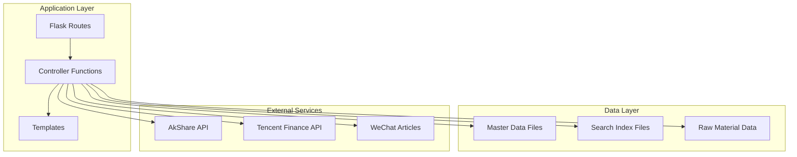
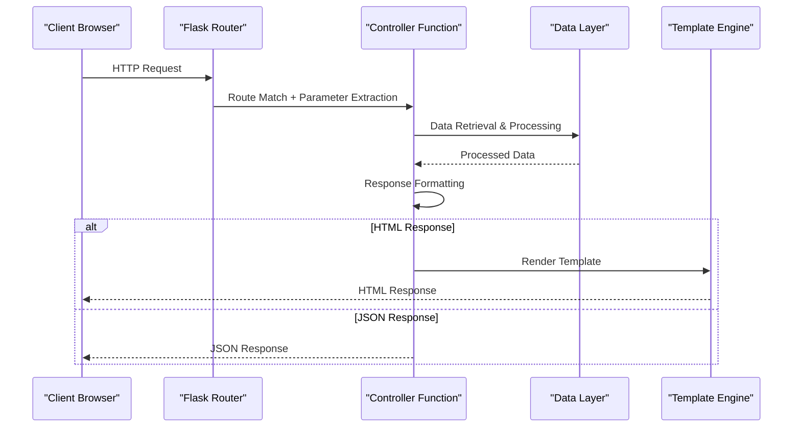
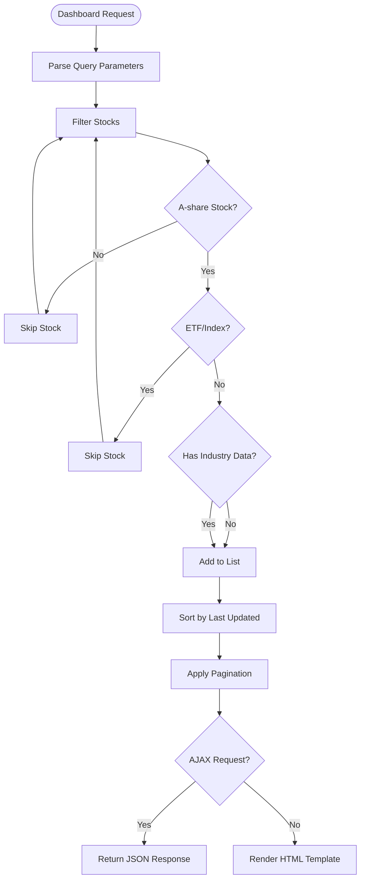
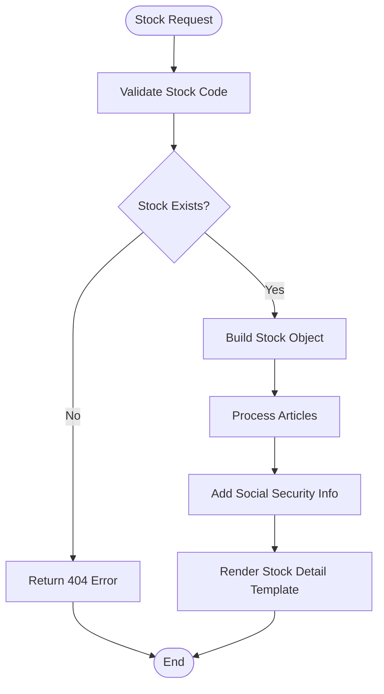
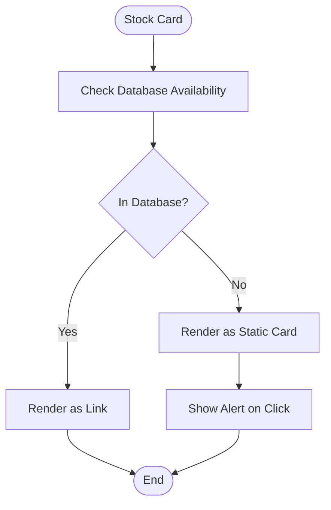
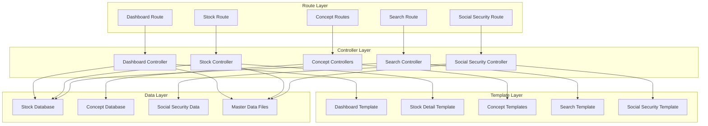

# Routing and Controllers

<cite>
**Referenced Files in This Document**
- [main.py](file://main.py)
- [dashboard.html](file://templates/dashboard.html)
- [stock_detail.html](file://templates/stock_detail.html)
- [concepts.html](file://templates/concepts.html)
- [concept_detail.html](file://templates/concept_detail.html)
- [search.html](file://templates/search.html)
- [social_security_new.html](file://templates/social_security_new.html)
- [stocks.html](file://templates/stocks.html)
</cite>

## Table of Contents
1. [Introduction](#introduction)
2. [Project Structure](#project-structure)
3. [Core Components](#core-components)
4. [Architecture Overview](#architecture-overview)
5. [Detailed Component Analysis](#detailed-component-analysis)
6. [Dependency Analysis](#dependency-analysis)
7. [Performance Considerations](#performance-considerations)
8. [Troubleshooting Guide](#troubleshooting-guide)
9. [Conclusion](#conclusion)

## Introduction

This document provides comprehensive coverage of the Flask routing and controller system for the stock research platform. The application serves as an AI-powered investment research platform that aggregates stock research data, concepts, and investment insights. The routing system handles multiple endpoints including dashboard listings, stock details, concept pages, search functionality, and social security pages, each with specific parameter handling, data filtering, and response formatting strategies.

## Project Structure

The application follows a traditional Flask MVC architecture with clear separation between routes, controllers, and templates:

**Diagram sources**
- [main.py:138-210](file://main.py#L138-L210)
- [main.py:280-336](file://main.py#L280-L336)
- [main.py:338-356](file://main.py#L338-L356)
- [main.py:358-429](file://main.py#L358-L429)
- [main.py:220-273](file://main.py#L220-L273)

**Section sources**
- [main.py:1-1240](file://main.py#L1-L1240)

## Core Components

The routing system consists of several key components that handle different aspects of the application:

### Route Definitions and Patterns

The application defines multiple route patterns with specific parameter handling:

- **Dashboard Route**: `/` with pagination support
- **Stock Detail Route**: `/stock/<code>` with parameter validation
- **Concept Routes**: `/concepts` and `/concept/<name>`
- **Search Route**: `/search` with query string processing
- **Social Security Route**: `/social-security-new` with data aggregation
- **API Routes**: Various `/api/` endpoints for programmatic access

### Parameter Handling Strategies

Each route implements specific parameter handling patterns:

- **Query String Processing**: Extracts and validates parameters like `q`, `limit`, `offset`
- **Route Parameters**: Validates stock codes and concept names
- **JSON Request Bodies**: Processes structured data for API endpoints
- **Header Detection**: Identifies AJAX requests for infinite scrolling

### Data Filtering and Processing

Controllers implement sophisticated data filtering mechanisms:

- **Stock Filtering**: Filters A-share stocks, excludes ETFs and indices
- **Concept Matching**: Implements fuzzy matching with scoring algorithms
- **Pagination Logic**: Handles offset-based pagination with has_more indicators
- **AJAX Response Formatting**: Returns JSON for infinite scroll loading

**Section sources**
- [main.py:138-210](file://main.py#L138-L210)
- [main.py:280-336](file://main.py#L280-L336)
- [main.py:338-356](file://main.py#L338-L356)
- [main.py:358-429](file://main.py#L358-L429)
- [main.py:220-273](file://main.py#L220-L273)

## Architecture Overview

The routing architecture implements a layered approach with clear separation of concerns:

**Diagram sources**
- [main.py:138-210](file://main.py#L138-L210)
- [main.py:280-336](file://main.py#L280-L336)
- [main.py:358-429](file://main.py#L358-L429)

The architecture supports both traditional HTML rendering and modern AJAX-based infinite scrolling, enabling seamless user experiences across different interaction patterns.

## Detailed Component Analysis

### Dashboard Controller (`/`)

The dashboard controller implements comprehensive stock listing with advanced filtering and pagination:

#### Route Definition and Parameters
- **Route**: `/` with optional query parameters
- **Parameters**: `limit` (default: 20), `offset` (default: 0)
- **AJAX Detection**: Uses `X-Requested-With: XMLHttpRequest` header

#### Data Filtering Logic
The controller applies multiple filtering criteria:

**Diagram sources**
- [main.py:138-210](file://main.py#L138-L210)

#### Pagination Implementation
The dashboard uses offset-based pagination with intelligent boundary detection:

- **Total Count**: Calculates total filtered stock count
- **Has More**: Determines if additional pages exist
- **Next Offset**: Provides offset for subsequent requests
- **Limit Validation**: Ensures pagination parameters are valid integers

#### Response Formatting
The controller supports dual response formats:

- **HTML Mode**: Renders `dashboard.html` with stock data
- **JSON Mode**: Returns structured data for AJAX infinite scrolling

**Section sources**
- [main.py:138-210](file://main.py#L138-L210)
- [dashboard.html:655-662](file://templates/dashboard.html#L655-L662)

### Stock Detail Controller (`/stock/<code>`)

The stock detail controller provides comprehensive individual stock information:

#### Route Parameter Validation
- **Parameter Type**: Stock code (string)
- **Validation**: Checks existence in stock database
- **Error Handling**: Returns 404 status for invalid codes

#### Data Processing Pipeline
The controller implements a multi-stage data processing pipeline:

**Diagram sources**
- [main.py:280-336](file://main.py#L280-L336)

#### Article Normalization
The controller normalizes diverse article formats into a unified structure:

- **Field Mapping**: Standardizes various article field names
- **Fallback Values**: Provides default values for missing data
- **Context Processing**: Extracts insights, accidents, and metrics
- **Limit Application**: Restricts article count to 20 entries

#### Social Security Integration
The controller integrates social security fund data:

- **Membership Check**: Validates stock against social security database
- **Information Enhancement**: Adds holding ratios and notes
- **Industry Grouping**: Includes industry classification data

**Section sources**
- [main.py:280-336](file://main.py#L280-L336)
- [stock_detail.html:1-800](file://templates/stock_detail.html#L1-L800)

### Concept Controllers (`/concepts`, `/concept/<name>`)

The concept system provides hierarchical organization of stocks by thematic categories:

#### Concepts Listing Controller (`/concepts`)
- **Data Aggregation**: Counts stocks per concept
- **Sorting Logic**: Sorts concepts by stock count (descending)
- **Template Rendering**: Displays concept grid with hot indicators

#### Concept Detail Controller (`/concept/<name>`)
- **Parameter Extraction**: Retrieves concept name from URL
- **Stock Resolution**: Maps concept to individual stocks
- **Enhanced Display**: Includes mention counts and related concepts

**Section sources**
- [main.py:338-356](file://main.py#L338-L356)
- [concepts.html:568-592](file://templates/concepts.html#L568-L592)
- [concept_detail.html:18-47](file://templates/concept_detail.html#L18-L47)

### Search Controller (`/search`)

The search controller implements multi-field search with intelligent scoring:

#### Query Processing
- **Input Sanitization**: Converts to lowercase and strips whitespace
- **Field Priority**: Implements scoring system for different match types
- **Result Ranking**: Sorts by score, then by mention count

#### Search Field Scoring
The search algorithm assigns different weights to match types:

| Match Type | Score | Description |
|------------|-------|-------------|
| Exact Code Match | 1000 | Perfect stock code match |
| Name Contains | 500 | Stock name contains query |
| Concept Match | 300 | Concept field contains query |
| Catalyst Match | 200 | Accident/investigation field |
| Insight Match | 200 | Investment insights field |
| Business Match | 200 | Core business field |
| Industry Position | 150 | Industry positioning field |
| Supply Chain | 150 | Supply chain field |

#### Result Processing
- **Field Highlighting**: Identifies which fields matched
- **Top Results**: Limits to top 20 results by mention count
- **Template Rendering**: Displays search results with highlighting

**Section sources**
- [main.py:358-429](file://main.py#L358-L429)
- [search.html:54-116](file://templates/search.html#L54-L116)

### Social Security Controller (`/social-security-new`)

The social security controller displays newly added stocks from social security funds:

#### Data Loading and Processing
- **File Loading**: Loads social security data from JSON file
- **Database Cross-reference**: Checks stock availability in main database
- **Industry Grouping**: Organizes stocks by industry categories

#### Statistical Calculations
The controller computes key statistics:

- **Average Holding Ratio**: Calculates mean percentage across all stocks
- **Maximum Ratio**: Identifies stock with highest holding percentage
- **Industry Distribution**: Counts stocks per industry category

#### Conditional Rendering
The template implements conditional logic for unavailable stocks:

**Diagram sources**
- [main.py:220-273](file://main.py#L220-L273)
- [social_security_new.html:339-369](file://templates/social_security_new.html#L339-L369)

**Section sources**
- [main.py:220-273](file://main.py#L220-L273)
- [social_security_new.html:310-373](file://templates/social_security_new.html#L310-L373)

### AJAX Infinite Scroll Implementation

The application implements AJAX-based infinite scrolling for improved user experience:

#### Frontend Implementation
The dashboard template includes JavaScript for handling infinite scroll:

- **Load More Button**: Triggers additional data loading
- **Offset Management**: Tracks current offset for pagination
- **Loading States**: Manages loading indicators during requests
- **Error Handling**: Displays error messages for failed requests

#### Backend AJAX Support
Controllers detect AJAX requests using the `X-Requested-With` header:

- **Response Format**: Returns JSON instead of HTML
- **Pagination Data**: Includes offset, limit, and has_more indicators
- **Data Structure**: Provides stocks array for direct DOM manipulation

**Section sources**
- [dashboard.html:655-662](file://templates/dashboard.html#L655-L662)
- [main.py:192-200](file://main.py#L192-L200)

## Dependency Analysis

The routing system exhibits clear dependency relationships:

**Diagram sources**
- [main.py:138-210](file://main.py#L138-L210)
- [main.py:280-336](file://main.py#L280-L336)
- [main.py:338-356](file://main.py#L338-L356)
- [main.py:358-429](file://main.py#L358-L429)
- [main.py:220-273](file://main.py#L220-L273)

**Section sources**
- [main.py:1-1240](file://main.py#L1-L1240)

## Performance Considerations

The routing system implements several performance optimization strategies:

### Data Loading Optimization
- **Lazy Loading**: Uses delay-import for external libraries like AkShare
- **File Caching**: Loads data once during application startup
- **Memory Management**: Processes data in memory-efficient chunks

### Response Optimization
- **Conditional Rendering**: Renders only necessary data based on request type
- **Pagination**: Limits result sets to prevent large response payloads
- **AJAX Efficiency**: Returns minimal JSON for infinite scroll requests

### Template Optimization
- **Static Assets**: Minimizes template complexity for better rendering
- **Conditional Logic**: Uses Jinja2 conditionals to reduce template overhead
- **Data Preprocessing**: Performs heavy processing in controllers rather than templates

## Troubleshooting Guide

### Common Issues and Solutions

#### Missing Resource Errors
- **Dashboard 404**: Occurs when stock database fails to load
- **Stock Not Found**: Returns 404 for invalid stock codes
- **Concept Missing**: Handles missing concept data gracefully

#### Parameter Validation Issues
- **Invalid Pagination**: Falls back to default values for invalid parameters
- **Malformed Codes**: Validates stock codes against database records
- **Empty Queries**: Handles empty search queries safely

#### Data Processing Errors
- **JSON Parsing**: Gracefully handles malformed JSON files
- **File Access**: Provides fallbacks when data files are unavailable
- **Network Failures**: Handles external API failures with timeouts

**Section sources**
- [main.py:282-283](file://main.py#L282-L283)
- [main.py:141-146](file://main.py#L141-L146)
- [main.py:95-104](file://main.py#L95-L104)

## Conclusion

The Flask routing and controller system demonstrates robust implementation of a complex stock research platform. The architecture successfully balances multiple concerns including data filtering, pagination, AJAX support, and template rendering. Key strengths include:

- **Modular Design**: Clear separation between routes, controllers, and templates
- **Flexible Response Formats**: Supports both HTML and JSON responses
- **Advanced Filtering**: Implements sophisticated data processing and ranking
- **User Experience**: Provides smooth infinite scroll and responsive interactions
- **Error Handling**: Comprehensive error handling with graceful degradation

The system serves as an excellent example of modern Flask application architecture, effectively handling complex data relationships while maintaining performance and user experience standards.