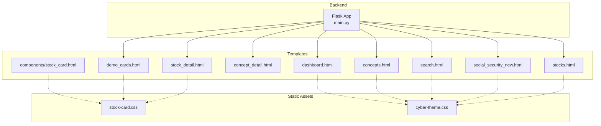
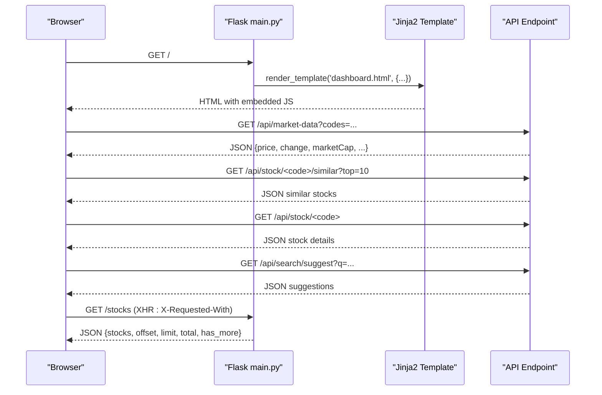
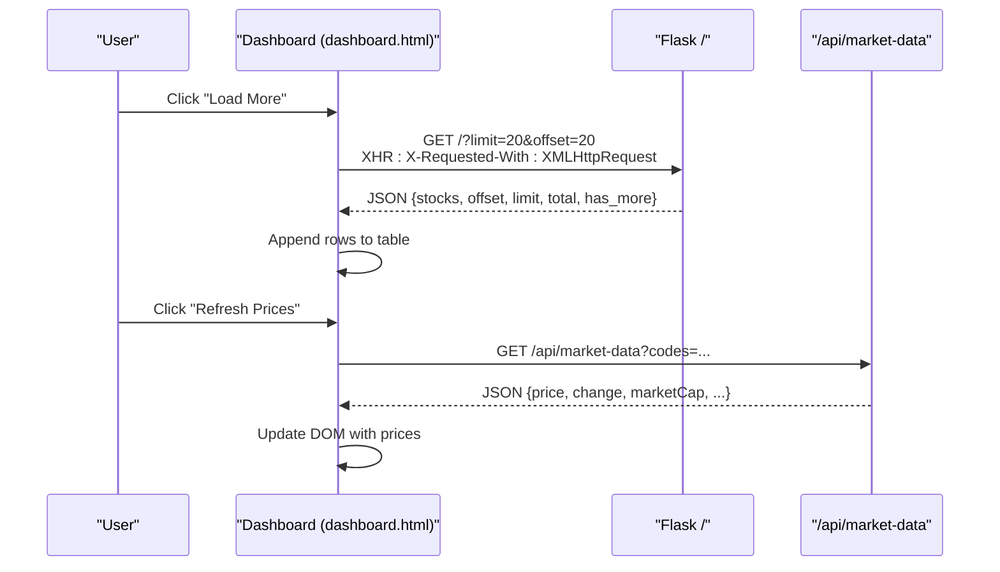
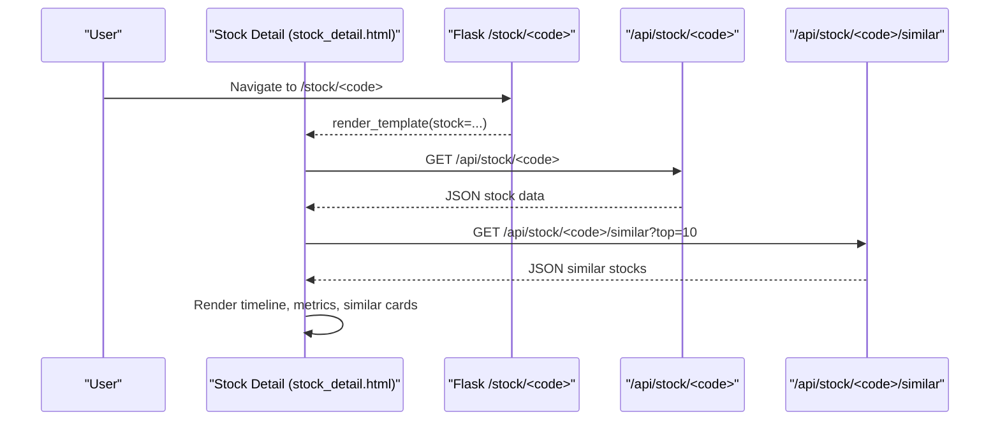
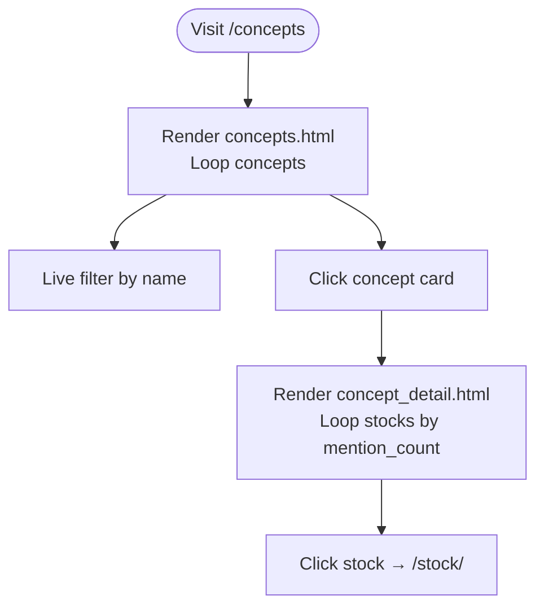
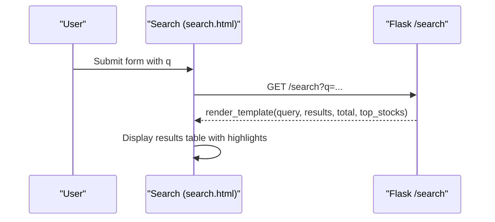
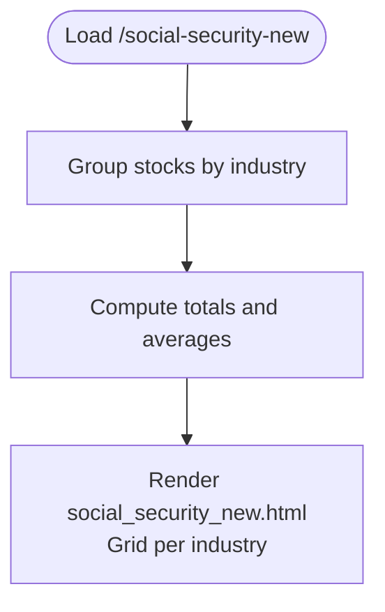
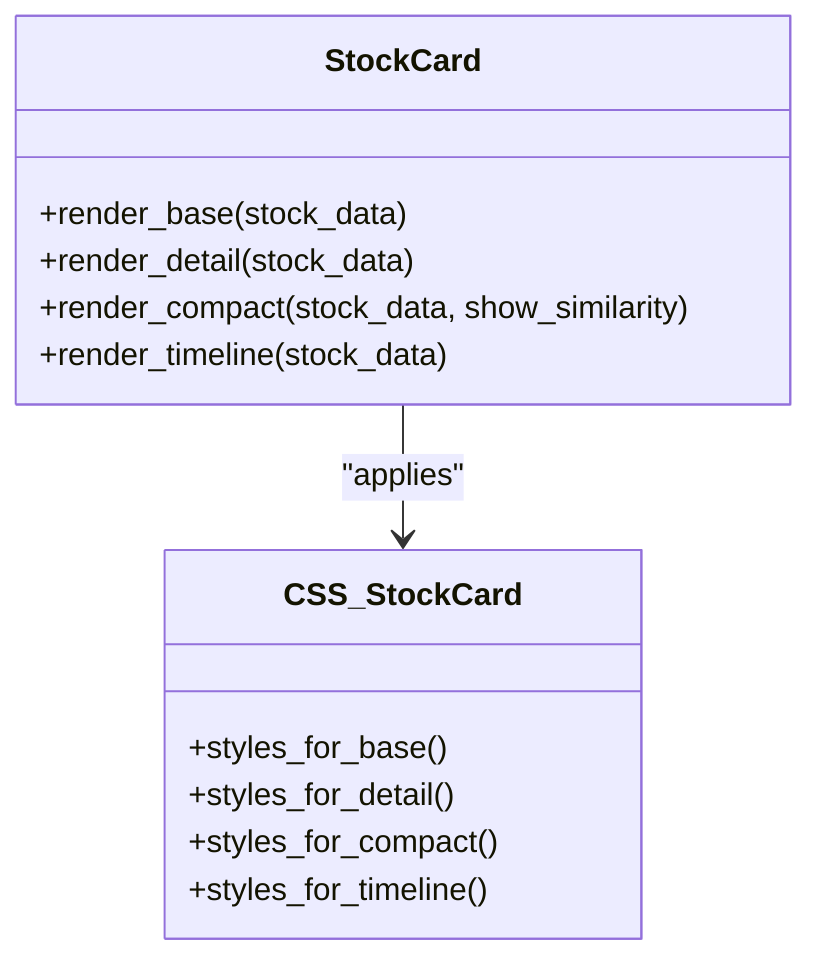
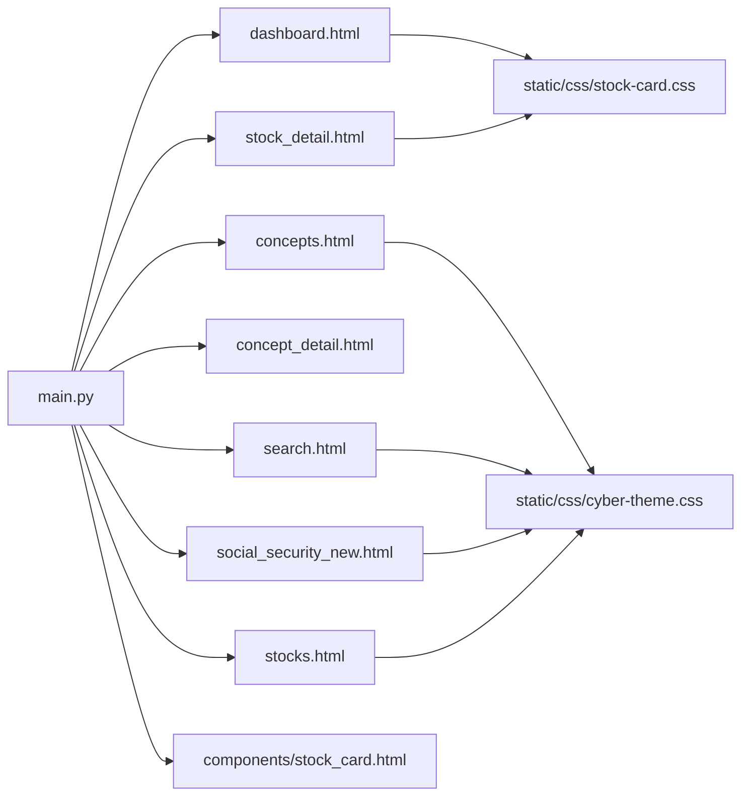

# Template Rendering System

<cite>
**Referenced Files in This Document**
- [main.py](file://main.py)
- [dashboard.html](file://templates/dashboard.html)
- [stock_detail.html](file://templates/stock_detail.html)
- [concept_detail.html](file://templates/concept_detail.html)
- [concepts.html](file://templates/concepts.html)
- [search.html](file://templates/search.html)
- [social_security_new.html](file://templates/social_security_new.html)
- [stocks.html](file://templates/stocks.html)
- [demo_cards.html](file://templates/demo_cards.html)
- [stock_card.html](file://templates/components/stock_card.html)
- [stock-card.css](file://static/css/stock-card.css)
- [cyber-theme.css](file://static/css/cyber-theme.css)
</cite>

## Table of Contents
1. [Introduction](#introduction)
2. [Project Structure](#project-structure)
3. [Core Components](#core-components)
4. [Architecture Overview](#architecture-overview)
5. [Detailed Component Analysis](#detailed-component-analysis)
6. [Dependency Analysis](#dependency-analysis)
7. [Performance Considerations](#performance-considerations)
8. [Troubleshooting Guide](#troubleshooting-guide)
9. [Conclusion](#conclusion)

## Introduction
This document explains the Jinja2 template rendering system powering the stock research platform. It covers template structure, variable passing mechanisms, dynamic content generation, and the integration of AJAX-driven updates. It documents dashboard rendering with stock listings and pagination, stock detail pages with article displays and concept relationships, concept exploration pages, search result templates, and social security fund tracking displays. It also describes template inheritance patterns, component reuse strategies, and static asset management, with examples of template variables, conditional rendering, and loops used throughout the application.

## Project Structure
The application follows a clear separation of concerns:
- Backend: Flask routes in main.py orchestrate data loading, filtering, sorting, and AJAX responses.
- Templates: Jinja2 HTML templates under templates/ define page layouts, data presentation, and interactive behaviors.
- Static Assets: CSS files under static/css/ provide reusable styling for components and themes.

**Diagram sources**
- [main.py](file://main.py)
- [dashboard.html](file://templates/dashboard.html)
- [stock_detail.html](file://templates/stock_detail.html)
- [concepts.html](file://templates/concepts.html)
- [concept_detail.html](file://templates/concept_detail.html)
- [search.html](file://templates/search.html)
- [social_security_new.html](file://templates/social_security_new.html)
- [stocks.html](file://templates/stocks.html)
- [demo_cards.html](file://templates/demo_cards.html)
- [stock_card.html](file://templates/components/stock_card.html)
- [stock-card.css](file://static/css/stock-card.css)
- [cyber-theme.css](file://static/css/cyber-theme.css)

**Section sources**
- [main.py](file://main.py)
- [dashboard.html](file://templates/dashboard.html)
- [stock_detail.html](file://templates/stock_detail.html)
- [concepts.html](file://templates/concepts.html)
- [concept_detail.html](file://templates/concept_detail.html)
- [search.html](file://templates/search.html)
- [social_security_new.html](file://templates/social_security_new.html)
- [stocks.html](file://templates/stocks.html)
- [demo_cards.html](file://templates/demo_cards.html)
- [stock_card.html](file://templates/components/stock_card.html)
- [stock-card.css](file://static/css/stock-card.css)
- [cyber-theme.css](file://static/css/cyber-theme.css)

## Core Components
- Dashboard page renders paginated stock listings with AJAX support for load-more functionality and real-time market data via an API endpoint.
- Stock detail page aggregates article timelines, concept relationships, and related metrics with interactive elements.
- Concept exploration pages list concepts and per-concept stock tables with mention counts and cross-concept links.
- Search results page supports keyword-based filtering across multiple data fields with highlighting and relevance ordering.
- Social security fund tracking page groups stocks by industry and displays holdings with database linkage indicators.
- Reusable stock card component supports multiple variants (base, detail, compact, timeline) for consistent UI across pages.

Key template variables passed from backend:
- Dashboard: stocks, total_stocks, total_mentions, total_articles, has_more, next_offset, limit
- Stock Detail: stock (with nested articles, concepts, mentions, board, industry, etc.)
- Concepts: concepts (list of {name, count})
- Concept Detail: concept, stocks (sorted by mention_count)
- Search: query, results, total, top_stocks
- Social Security: industry_groups, total_count, industry_count, avg_ratio, max_ratio_stock
- Stocks List: total, stocks

Conditional rendering and loops:
- Loop over stocks and articles with pagination and fallbacks for empty states.
- Conditional badges for mention counts and concept hotness.
- Conditional rendering for presence of fields (e.g., articles, concepts, industry).

AJAX integration:
- X-Requested-With header detection to serve JSON for incremental loads.
- Market data API endpoint returns pricing metrics for requested codes.

**Section sources**
- [main.py](file://main.py)
- [dashboard.html](file://templates/dashboard.html)
- [stock_detail.html](file://templates/stock_detail.html)
- [concepts.html](file://templates/concepts.html)
- [concept_detail.html](file://templates/concept_detail.html)
- [search.html](file://templates/search.html)
- [social_security_new.html](file://templates/social_security_new.html)
- [stocks.html](file://templates/stocks.html)
- [stock_card.html](file://templates/components/stock_card.html)

## Architecture Overview
The Flask application serves templates with preloaded data and exposes APIs for dynamic updates. The templates embed JavaScript for client-side interactions (search filters, load-more buttons, modal actions) and AJAX calls to backend endpoints.

**Diagram sources**
- [main.py](file://main.py)
- [dashboard.html](file://templates/dashboard.html)

**Section sources**
- [main.py](file://main.py)
- [dashboard.html](file://templates/dashboard.html)

## Detailed Component Analysis

### Dashboard Page
The dashboard page renders a responsive table of stocks with:
- Pagination controls and "Load More" button
- Real-time market data placeholders filled via AJAX
- Concept tags with click-to-navigate
- Mention and article badges
- Sorting and filtering controls

Template variables:
- stocks: list of stock dicts with code, name, industry, concepts, mention_count, articles, latest_article_date
- total_stocks, total_mentions, total_articles: summary stats
- has_more, next_offset, limit: pagination state

AJAX flow:
- First load: render HTML with initial stocks
- Load More: XHR request with X-Requested-With header returns JSON with stocks slice and pagination flags
- Market refresh: XHR to /api/market-data with comma-separated codes

**Diagram sources**
- [dashboard.html](file://templates/dashboard.html)
- [main.py](file://main.py)

**Section sources**
- [dashboard.html](file://templates/dashboard.html)
- [main.py](file://main.py)

### Stock Detail Page
The stock detail page presents:
- Hero section with name, code, current price, change, market cap, P/E
- Concept tags and board/industry badges
- Social security fund indicator when applicable
- Articles timeline with collapsible cards, insights, and tags
- Related metrics and similar stocks recommendation
- Inline editing form for curated fields

Template variables:
- stock: dict containing code, name, board, industry, mention_count, concepts, core_business, industry_position, accident, insights, chain, key_metrics, partners, products, detail_texts, articles, is_social_security, social_security_* fields

Interactive elements:
- Expand/collapse article cards
- Similar stocks via AJAX call to /api/stock/<code>/similar
- Inline edit forms posting to /api/stock/<code>/edit

**Diagram sources**
- [stock_detail.html](file://templates/stock_detail.html)
- [main.py](file://main.py)

**Section sources**
- [stock_detail.html](file://templates/stock_detail.html)
- [main.py](file://main.py)

### Concept Exploration Pages
Concepts list page:
- Grid of concept cards with counts and hotness badges
- Live search filtering by concept name
- Links to individual concept detail pages

Concept detail page:
- Table of stocks in the selected concept
- Per-stock mention counts and cross-concepts
- Links to stock detail and concept detail

Template variables:
- Concepts list: [{name, count}] sorted by count
- Concept detail: concept name and stocks sorted by mention_count

**Diagram sources**
- [concepts.html](file://templates/concepts.html)
- [concept_detail.html](file://templates/concept_detail.html)

**Section sources**
- [concepts.html](file://templates/concepts.html)
- [concept_detail.html](file://templates/concept_detail.html)
- [main.py](file://main.py)

### Search Results Template
The search page:
- Accepts query parameter q
- Renders results table with highlight badges for matched fields
- Shows top popular stocks when no query is provided
- Uses live filtering on the client side

Template variables:
- query, results, total, top_stocks

**Diagram sources**
- [search.html](file://templates/search.html)
- [main.py](file://main.py)

**Section sources**
- [search.html](file://templates/search.html)
- [main.py](file://main.py)

### Social Security Fund Tracking
The social security page:
- Groups stocks by industry category
- Shows holding ratios and related metadata
- Indicates whether stock exists in database
- Provides statistics cards

Template variables:
- industry_groups: dict mapping industry to list of stock dicts
- total_count, industry_count, avg_ratio, max_ratio_stock

**Diagram sources**
- [social_security_new.html](file://templates/social_security_new.html)
- [main.py](file://main.py)

**Section sources**
- [social_security_new.html](file://templates/social_security_new.html)
- [main.py](file://main.py)

### Stock Cards Component Library
Reusable stock card component supports multiple variants:
- Base: used in dashboards/lists; shows name/code, mention badge, market row, board/industry, concepts, latest article preview
- Detail: used in sidebar; shows metrics and concept tags
- Compact: used for similarity recommendations; shows code, name, industry, common concepts, similarity percentage
- Timeline: renders article timeline entries

Template variables:
- card_type: base | detail | compact | timeline
- stock_data: dict with code, name, mention_count, board, industry, concepts, articles, etc.
- show_similarity: flag for compact card similarity display

**Diagram sources**
- [stock_card.html](file://templates/components/stock_card.html)
- [stock-card.css](file://static/css/stock-card.css)

**Section sources**
- [stock_card.html](file://templates/components/stock_card.html)
- [stock-detail.html](file://templates/stock_detail.html)
- [stocks.html](file://templates/stocks.html)
- [demo_cards.html](file://templates/demo_cards.html)
- [stock-card.css](file://static/css/stock-card.css)

### Template Variables, Conditionals, and Loops
Common patterns across templates:
- Looping over collections: 
- Conditional rendering:  ... 
- Safe attribute access and defaults: {{ obj.attr | default('') }}
- Filters: length, join, default, truncate, sum(attribute), selectattr(...)
- Namespaces for accumulators: 

Examples of usage:
- Dashboard: loop over stocks, conditional concept tags, mention badges, pagination flags
- Stock Detail: loop over articles, conditional social security badge, conditional article content
- Concepts: loop over concepts with hotness badges, conditional empty state
- Search: loop over results, conditional highlight badges, conditional empty state
- Social Security: loop over industry_groups and stocks, conditional database presence
- Stock Cards: conditional presence of concepts/articles/board/industry

**Section sources**
- [dashboard.html](file://templates/dashboard.html)
- [stock_detail.html](file://templates/stock_detail.html)
- [concepts.html](file://templates/concepts.html)
- [search.html](file://templates/search.html)
- [social_security_new.html](file://templates/social_security_new.html)
- [stock_card.html](file://templates/components/stock_card.html)

## Dependency Analysis
Template-to-backend dependencies:
- Routes in main.py supply data to templates via render_template
- AJAX endpoints (/api/...) are consumed by templates for dynamic updates
- Static assets are referenced directly in templates for styling

**Diagram sources**
- [main.py](file://main.py)
- [dashboard.html](file://templates/dashboard.html)
- [stock_detail.html](file://templates/stock_detail.html)
- [concepts.html](file://templates/concepts.html)
- [concept_detail.html](file://templates/concept_detail.html)
- [search.html](file://templates/search.html)
- [social_security_new.html](file://templates/social_security_new.html)
- [stocks.html](file://templates/stocks.html)
- [stock_card.html](file://templates/components/stock_card.html)
- [stock-card.css](file://static/css/stock-card.css)
- [cyber-theme.css](file://static/css/cyber-theme.css)

**Section sources**
- [main.py](file://main.py)
- [dashboard.html](file://templates/dashboard.html)
- [stock_detail.html](file://templates/stock_detail.html)
- [concepts.html](file://templates/concepts.html)
- [concept_detail.html](file://templates/concept_detail.html)
- [search.html](file://templates/search.html)
- [social_security_new.html](file://templates/social_security_new.html)
- [stocks.html](file://templates/stocks.html)
- [stock_card.html](file://templates/components/stock_card.html)
- [stock-card.css](file://static/css/stock-card.css)
- [cyber-theme.css](file://static/css/cyber-theme.css)

## Performance Considerations
- Pagination reduces initial payload sizes; AJAX incremental loading prevents full page reloads.
- Market data is fetched in batches via a single API call to minimize network overhead.
- Client-side filtering avoids server round trips for local searches.
- CSS is shared across templates to reduce duplication and improve caching.

## Troubleshooting Guide
Common issues and resolutions:
- Empty stock lists: Verify data loading and filtering logic in routes; confirm gzipped JSON files are readable.
- Missing market data: Ensure /api/market-data returns expected fields; check external API availability and encoding.
- AJAX not working: Confirm X-Requested-With header is present for pagination; verify CORS and route handlers.
- Concept/detail mismatch: Validate concept name encoding and URL encoding in links.
- Search results empty: Check query normalization and scoring logic; ensure index files are built.

**Section sources**
- [main.py](file://main.py)
- [dashboard.html](file://templates/dashboard.html)
- [stock_detail.html](file://templates/stock_detail.html)
- [concepts.html](file://templates/concepts.html)
- [concept_detail.html](file://templates/concept_detail.html)
- [search.html](file://templates/search.html)
- [social_security_new.html](file://templates/social_security_new.html)
- [stocks.html](file://templates/stocks.html)

## Conclusion
The template rendering system combines Flask-driven data preparation with Jinja2 templates and client-side AJAX to deliver a responsive, data-rich interface. Consistent use of reusable components, standardized template variables, and clear AJAX integration enables maintainable and scalable presentation of stock research data across dashboards, detail pages, concept exploration, search, and specialized displays like social security holdings.