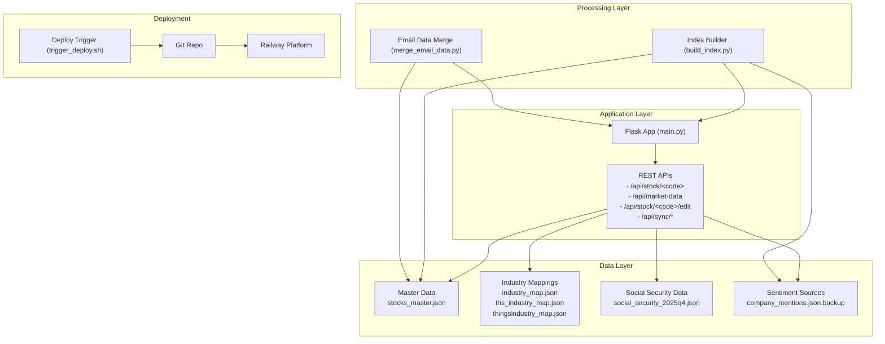
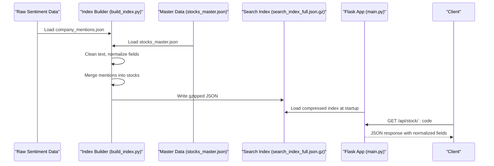
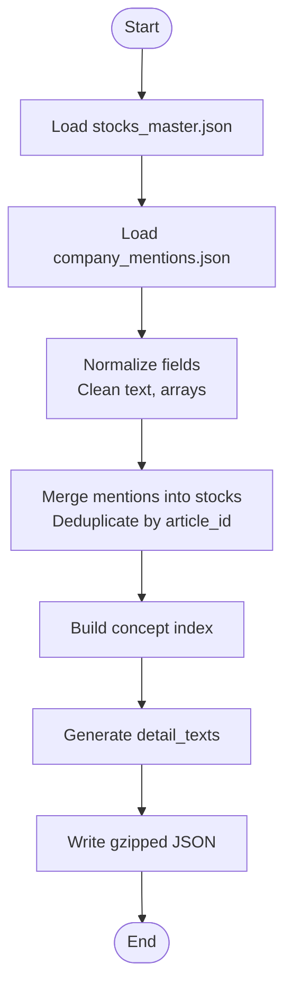
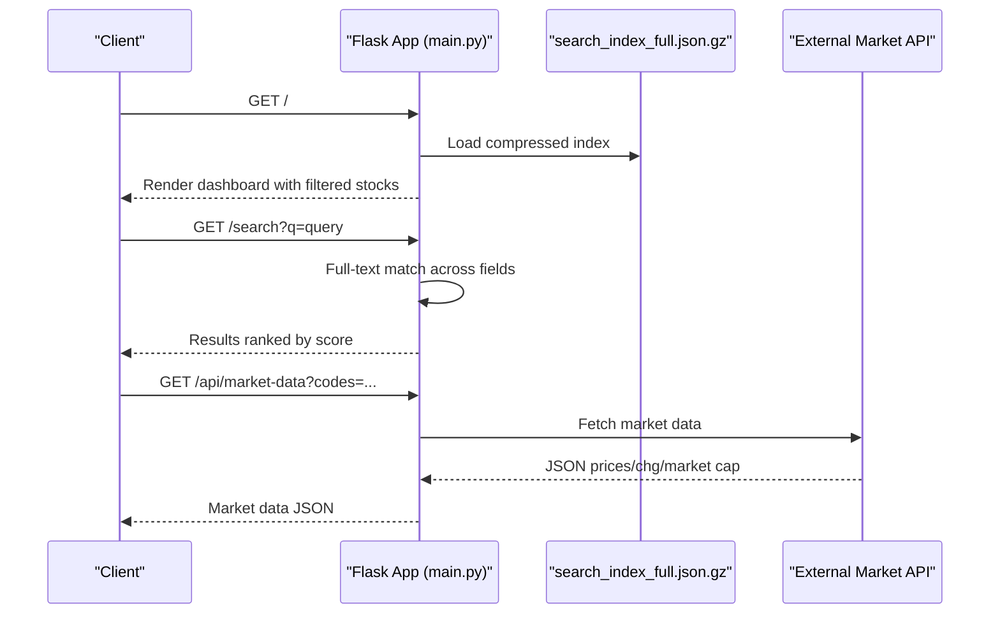
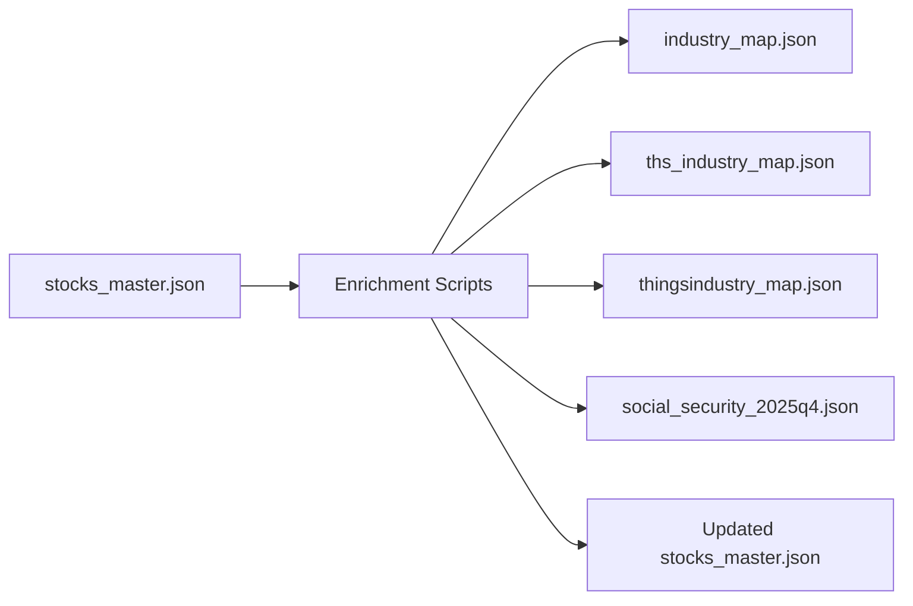
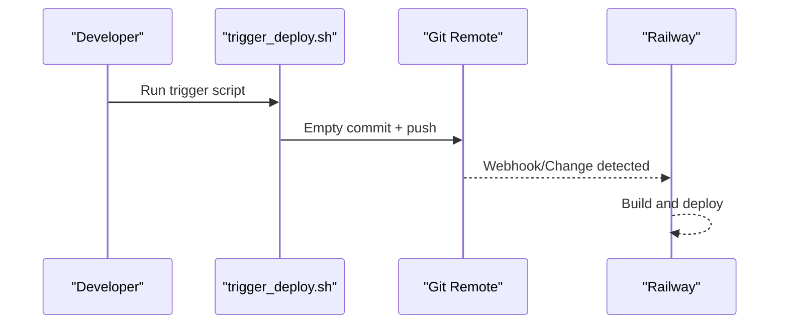
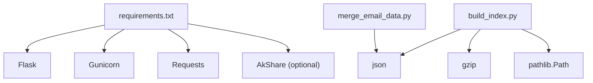

# Data Management

<cite>
**Referenced Files in This Document**
- [main.py](file://main.py)
- [build_index.py](file://build_index.py)
- [merge_email_data.py](file://merge_email_data.py)
- [trigger_deploy.sh](file://trigger_deploy.sh)
- [requirements.txt](file://requirements.txt)
- [README.md](file://README.md)
- [DEPLOYMENT_CHECKLIST.md](file://DEPLOYMENT_CHECKLIST.md)
- [DEPLOYMENT_REPORT_v8.md](file://DEPLOYMENT_REPORT_v8.md)
- [FINAL_DEPLOY_STEPS.md](file://FINAL_DEPLOY_STEPS.md)
- [stocks_master.json](file://data/master/stocks_master.json)
- [social_security_2025q4.json](file://data/master/social_security_2025q4.json)
- [ths_industry_map.json](file://data/master/ths_industry_map.json)
- [thingsindustry_map.json](file://data/master/thingsindustry_map.json)
- [industry_map.json](file://data/master/industry_map.json)
- [company_mentions.json.backup](file://data/sentiment/company_mentions.json.backup)
</cite>

## Table of Contents
1. [Introduction](#introduction)
2. [Project Structure](#project-structure)
3. [Core Components](#core-components)
4. [Architecture Overview](#architecture-overview)
5. [Detailed Component Analysis](#detailed-component-analysis)
6. [Dependency Analysis](#dependency-analysis)
7. [Performance Considerations](#performance-considerations)
8. [Troubleshooting Guide](#troubleshooting-guide)
9. [Conclusion](#conclusion)
10. [Appendices](#appendices)

## Introduction
This document provides comprehensive data model documentation for the Stock Research Platform. It details the stock data structure, article and sentiment models, concept relationships, industry classifications, and the end-to-end data processing pipeline from raw sentiment data to searchable indexes. It also covers multi-source data merging, index generation and compression, deployment automation triggers, validation rules, business constraints, lifecycle management, security considerations, backup strategies, and performance optimizations for large datasets.

## Project Structure
The platform consists of:
- Flask web application serving stock and article data
- Index generation pipeline transforming raw sentiment into compressed search indexes
- Deployment automation scripts and Railway configuration
- Master data files containing curated stock profiles and industry mappings
- Sentiment data sources and backup files

**Diagram sources**
- [main.py](file://main.py)
- [build_index.py](file://build_index.py)
- [merge_email_data.py](file://merge_email_data.py)
- [trigger_deploy.sh](file://trigger_deploy.sh)
- [stocks_master.json](file://data/master/stocks_master.json)
- [social_security_2025q4.json](file://data/master/social_security_2025q4.json)
- [industry_map.json](file://data/master/industry_map.json)
- [ths_industry_map.json](file://data/master/ths_industry_map.json)
- [thingsindustry_map.json](file://data/master/thingsindustry_map.json)
- [company_mentions.json.backup](file://data/sentiment/company_mentions.json.backup)

**Section sources**
- [README.md](file://README.md)
- [FINAL_DEPLOY_STEPS.md](file://FINAL_DEPLOY_STEPS.md)

## Core Components
This section defines the primary data models and their relationships.

### Stock Data Model
Each stock record aggregates curated fields from master data and enriched sentiment content. The normalized structure supports fast search, filtering, and display.

Key attributes:
- Identification: code, name, board
- Classification: concepts (tags), industries (list of hierarchical categories)
- Business profile: core_business (descriptive), products (list), industry_position (list)
- Relationships: partners (list), chain (supply chain segments)
- Activity: mention_count (integer), last_updated (ISO date), articles (list)
- Additional: accident (text), insights (text), key_metrics (text), detail_texts (derived)

Article model (embedded within stock):
- Identifiers: article_id (unique), article_title, date, source
- Content: context (text), accidents (list), insights (list), key_metrics (list), target_valuation (list)
- Optional: url (string)

Concept model:
- Concepts are tag-like identifiers mapped to lists of stock codes. The index builder generates a concept-to-stocks map for quick filtering.

Industry classification:
- Industry fields are stored as arrays of hierarchical strings (e.g., SW/Citic-style taxonomy).
- Industry mappings are maintained in separate JSON files for cross-reference and enrichment.

**Section sources**
- [main.py](file://main.py)
- [build_index.py](file://build_index.py)
- [stocks_master.json](file://data/master/stocks_master.json)

### Article and Sentiment Data Models
Raw sentiment data is ingested from multiple sources and normalized during index generation:
- company_mentions.json.backup: contains mentions with fields article_title, article_url, date, source, context, accident, industry_position, products, partners.
- Index builder merges these mentions into existing stock records while deduplicating by article_id.

Normalization rules:
- article_id is constructed from code + unique article identifier to prevent duplicates.
- Text fields are cleaned to remove Markdown/HTML artifacts and preserve multi-source separators.
- Arrays are normalized; single values are converted to lists for consistent handling.

**Section sources**
- [build_index.py](file://build_index.py)
- [company_mentions.json.backup](file://data/sentiment/company_mentions.json.backup)

### Multi-Source Data Merging
The platform supports merging external data via email attachments:
- merge_email_data.py reads a JSON payload (single stock or list of stocks), updates existing records by code, and appends new entries.
- Only non-null values are applied to avoid overwriting existing data unintentionally.

Validation and constraints:
- Each stock must have a code; otherwise it is skipped with a warning.
- Existing fields are overwritten only when new values are present.

**Section sources**
- [merge_email_data.py](file://merge_email_data.py)
- [stocks_master.json](file://data/master/stocks_master.json)

## Architecture Overview
The data architecture integrates ingestion, processing, storage, and delivery:

**Diagram sources**
- [build_index.py](file://build_index.py)
- [main.py](file://main.py)
- [stocks_master.json](file://data/master/stocks_master.json)

## Detailed Component Analysis

### Index Generation Pipeline
The pipeline transforms raw sentiment into a compressed, searchable index:
- Loads master stock data and sentiment mentions
- Cleans text content, normalizes arrays, constructs article_id
- Merges mentions into existing stock records with deduplication
- Builds concept index (concept name -> list of stock codes)
- Generates detail_texts for front-end preview
- Writes gzipped JSON for fast loading and reduced bandwidth

**Diagram sources**
- [build_index.py](file://build_index.py)

**Section sources**
- [build_index.py](file://build_index.py)

### Data Loading and Search
The Flask application loads the compressed index at startup and exposes:
- Stock listing and pagination
- Concept browsing
- Full-text search across name, code, concepts, and descriptive fields
- Market data retrieval via external API
- Edit endpoints for curated fields

**Diagram sources**
- [main.py](file://main.py)

**Section sources**
- [main.py](file://main.py)

### Multi-Source Data Enrichment
Industry and concept enrichment leverages curated mapping files:
- industry_map.json, ths_industry_map.json, thingsindustry_map.json provide standardized industry hierarchies
- social_security_2025q4.json enriches stocks with social security holdings and notes

**Diagram sources**
- [main.py](file://main.py)
- [stocks_master.json](file://data/master/stocks_master.json)
- [social_security_2025q4.json](file://data/master/social_security_2025q4.json)
- [industry_map.json](file://data/master/industry_map.json)
- [ths_industry_map.json](file://data/master/ths_industry_map.json)
- [thingsindustry_map.json](file://data/master/thingsindustry_map.json)

**Section sources**
- [main.py](file://main.py)

### Deployment Automation Triggers
Deployment is automated via Git commits:
- trigger_deploy.sh performs an empty commit and pushes to origin/main to trigger Railway builds
- Railway automatically deploys the application after detecting changes

**Diagram sources**
- [trigger_deploy.sh](file://trigger_deploy.sh)
- [DEPLOYMENT_CHECKLIST.md](file://DEPLOYMENT_CHECKLIST.md)

**Section sources**
- [trigger_deploy.sh](file://trigger_deploy.sh)
- [DEPLOYMENT_CHECKLIST.md](file://DEPLOYMENT_CHECKLIST.md)

## Dependency Analysis
Runtime and processing dependencies:
- Flask application depends on Python packages defined in requirements.txt
- Index builder relies on standard library modules for JSON, gzip, and path handling
- Email data merger operates on JSON payloads and writes to master data

**Diagram sources**
- [requirements.txt](file://requirements.txt)
- [build_index.py](file://build_index.py)
- [merge_email_data.py](file://merge_email_data.py)

**Section sources**
- [requirements.txt](file://requirements.txt)

## Performance Considerations
- Compressed index: search_index_full.json.gz reduces load time and bandwidth usage
- Field normalization: arrays and cleaned text improve consistency and reduce parsing overhead
- Pagination and sorting: server-side limits for dashboard and stock listings
- External API caching: market data endpoint returns aggregated results to minimize repeated calls
- File I/O optimization: prefer gzipped files for large datasets; load once at startup

[No sources needed since this section provides general guidance]

## Troubleshooting Guide
Common issues and resolutions:
- Missing or corrupted index: rebuild using the index builder; verify gzipped file exists and is readable
- Data not updating: confirm merge_email_data.py ran and stocks_master.json was saved; trigger redeploy
- Deployment failures: check Railway logs for dependency installation and startup errors; validate Procfile and .railway.json
- Search anomalies: ensure article_id uniqueness and text cleaning rules are applied consistently
- Market data errors: verify external API availability and network connectivity; inspect error responses

**Section sources**
- [DEPLOYMENT_CHECKLIST.md](file://DEPLOYMENT_CHECKLIST.md)
- [DEPLOYMENT_REPORT_v8.md](file://DEPLOYMENT_REPORT_v8.md)
- [main.py](file://main.py)

## Conclusion
The Stock Research Platform employs a robust data model centered on normalized stock records enriched with sentiment-driven articles. The index generation pipeline ensures high-quality, deduplicated, and searchable content, while deployment automation enables rapid iteration. Validation rules, business constraints, and lifecycle management practices maintain data integrity and performance at scale.

[No sources needed since this section summarizes without analyzing specific files]

## Appendices

### Data Validation Rules and Business Constraints
- Required fields per stock: code, name; optional but recommended: board, industry, concepts, core_business, products, industry_position, chain, partners
- Article uniqueness: article_id must be unique per stock; duplicates are ignored during merge
- Text normalization: Markdown/HTML stripped; multi-source separators preserved; whitespace normalized
- Null safety: merge_email_data.py avoids overwriting existing fields with null values
- Industry coverage: industry fields are arrays; missing values are represented as empty lists

**Section sources**
- [build_index.py](file://build_index.py)
- [merge_email_data.py](file://merge_email_data.py)
- [stocks_master.json](file://data/master/stocks_master.json)

### Data Lifecycle Management
- Creation: initial population from curated master data
- Enrichment: periodic ingestion of sentiment mentions and external mappings
- Maintenance: manual edits via API with audit logging; exportable edit logs
- Archival: compressed indexes and backups; historical snapshots in Git history
- Retirement: no explicit deletion logic; focus on deprecation via field updates

**Section sources**
- [main.py](file://main.py)
- [merge_email_data.py](file://merge_email_data.py)

### Security Considerations
- Data exposure: stock and article data are served via API; ensure appropriate CORS and rate limiting
- Edit permissions: only selected fields are editable via API to prevent unauthorized modifications
- Audit trail: edit logs capture timestamp, user, and changes for traceability
- Transport: use HTTPS for all endpoints; compressed payloads reduce exposure windows

**Section sources**
- [main.py](file://main.py)

### Backup Strategies
- Master data: keep multiple copies of stocks_master.json and gzipped variants
- Index artifacts: retain previous versions of search_index_full.json.gz for rollback
- Git history: leverage commit history for point-in-time recovery
- External backups: consider offsite storage for critical datasets

**Section sources**
- [build_index.py](file://build_index.py)
- [DEPLOYMENT_CHECKLIST.md](file://DEPLOYMENT_CHECKLIST.md)