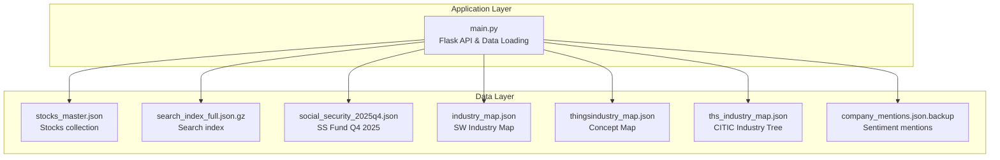
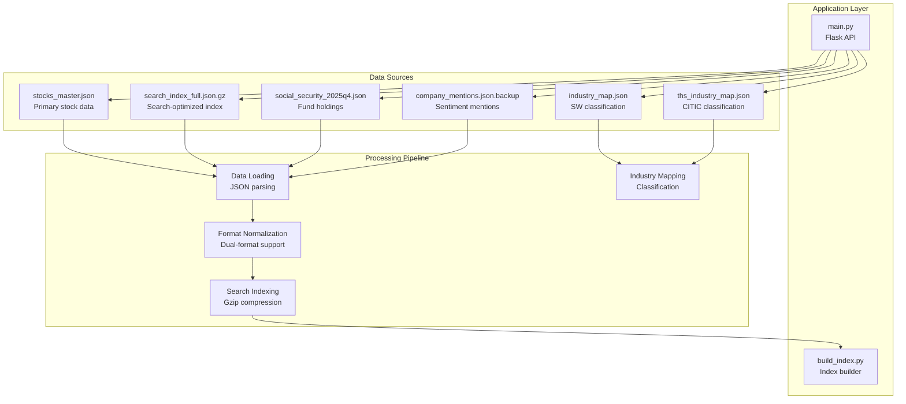
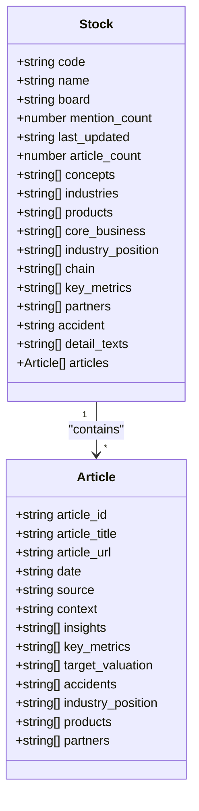
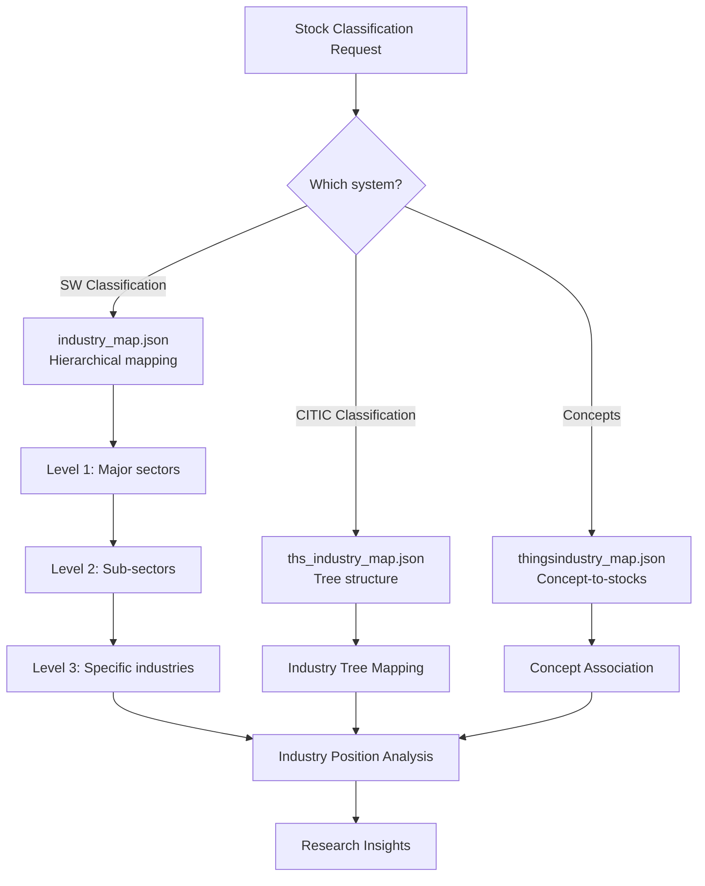
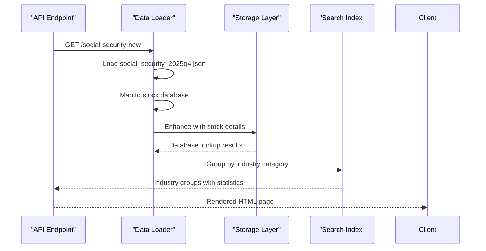
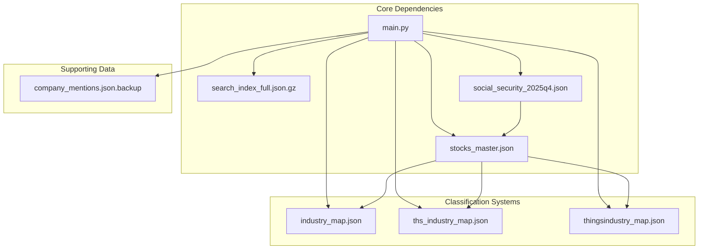

# Data Models

<cite>
**Referenced Files in This Document**
- [main.py](file://main.py)
- [JSON格式标准.md](file://JSON格式标准.md)
- [stocks_master.json](file://data/master/stocks_master.json)
- [social_security_2025q4.json](file://data/master/social_security_2025q4.json)
- [industry_map.json](file://data/master/industry_map.json)
- [thingsindustry_map.json](file://data/master/thingsindustry_map.json)
- [ths_industry_map.json](file://data/master/ths_industry_map.json)
- [company_mentions.json.backup](file://data/sentiment/company_mentions.json.backup)
</cite>

## Table of Contents
1. [Introduction](#introduction)
2. [Project Structure](#project-structure)
3. [Core Components](#core-components)
4. [Architecture Overview](#architecture-overview)
5. [Detailed Component Analysis](#detailed-component-analysis)
6. [Dependency Analysis](#dependency-analysis)
7. [Performance Considerations](#performance-considerations)
8. [Troubleshooting Guide](#troubleshooting-guide)
9. [Conclusion](#conclusion)

## Introduction
This document provides comprehensive data model documentation for the Stock Research Platform. It covers the stock object model, article data model, concept relationships, industry classification systems, and social security fund holdings for Q4 2025. It also documents field validation rules, data types, optional vs required fields, business constraints, dual-format support for LLM summaries and direct fields, and includes sample data references.

## Project Structure
The platform organizes data primarily under the data directory:
- Master data: stocks_master.json and related industry/concept classification files
- Sentiment data: search index and mentions
- Social security holdings: Q4 2025 report

**Diagram sources**
- [main.py:93-136](file://main.py#L93-L136)
- [JSON格式标准.md:22-48](file://JSON格式标准.md#L22-L48)

**Section sources**
- [main.py:93-136](file://main.py#L93-L136)
- [JSON格式标准.md:22-48](file://JSON格式标准.md#L22-L48)

## Core Components

### Stock Object Model
The stock object model defines the core entity representing individual companies in the research database. It includes identity fields, metadata, categorical data, content fields, and article references.

Key fields and characteristics:
- Identity fields
  - code: string, 6-digit identifier (required)
  - name: string (required)
  - board: string ("SH", "SZ", "BJ") (required)
- Metadata
  - mention_count: number (optional)
  - last_updated: string (YYYY-MM-DD) (optional)
  - article_count: number (computed/derived)
- Categorical data
  - concepts: array of strings (optional)
  - industries: array of strings (optional)
- Content fields
  - core_business: array of strings (optional)
  - insights: string (optional)
  - products: array of strings (optional)
  - industry_position: array of strings (optional)
  - chain: array of strings (optional)
  - key_metrics: array of strings (optional)
  - partners: array of strings (optional)
  - accident: string (optional)
  - detail_texts: array of 7 strings (fixed order) (optional)
- Article references
  - articles: array of article objects (optional)

Field validation rules and constraints:
- Required fields: code, name, board
- Optional fields: all others
- Data types: string for identifiers, arrays for lists, numbers for counts
- Business constraints:
  - Board must be one of "SH", "SZ", "BJ"
  - Articles array may contain multiple entries with unique article_id
  - detail_texts must contain exactly 7 items in fixed order

**Section sources**
- [JSON格式标准.md:52-70](file://JSON格式标准.md#L52-L70)
- [JSON格式标准.md:135-174](file://JSON格式标准.md#L135-L174)
- [stocks_master.json:4-246](file://data/master/stocks_master.json#L4-L246)

### Article Data Model
Articles represent external content sources associated with stocks. They support dual ingestion formats (direct fields vs llm_summary) and include enrichment fields.

Article object structure:
- Identification
  - article_id: string (unique per stock-source combination)
  - article_title: string
  - article_url: string (supports email:// and http://)
  - date: string (YYYY-MM-DD)
  - source: string ("llm_summary", "wechat_article", "manual")
- Enrichment fields
  - context: string (core business summary)
  - insights: array of strings (investment logic)
  - key_metrics: array of strings (financial/operational metrics)
  - target_valuation: array of strings (valuation targets)
  - accidents: array of strings (catalysts/events)
  - industry_position: array of strings (market position)
  - products: array of strings (product offerings)
  - partners: array of strings (customers/partners)

Validation rules:
- article_id format: "{code}_{source}"
- date format: YYYY-MM-DD
- source must be one of predefined values
- Arrays may be empty but must be arrays
- Fields are optional except for identification fields

**Section sources**
- [JSON格式标准.md:73-106](file://JSON格式标准.md#L73-L106)
- [JSON格式标准.md:135-174](file://JSON格式标准.md#L135-L174)
- [stocks_master.json:70-244](file://data/master/stocks_master.json#L70-L244)

### Concept Relationship Model
Concepts define discoverable categories that map stocks to multiple thematic areas. The relationship enables filtering and discovery.

Model characteristics:
- Concept-to-stocks mapping stored in concepts dictionary
- Each concept contains an array of stock codes
- Concepts enable multi-dimensional categorization (e.g., "算力基础设施", "光通信/CPO")
- Used for discovery, filtering, and cross-referencing

Integration points:
- Frontend concept listing and detail pages
- Search functionality leveraging concept matches
- Similarity calculations based on shared concepts

**Section sources**
- [main.py:338-356](file://main.py#L338-L356)
- [main.py:377-410](file://main.py#L377-L410)
- [JSON格式标准.md:58](file://JSON格式标准.md#L58)

### Industry Classification System
The platform supports two industry classification systems:

#### SW Industry Classification (Level 1-3)
- Hierarchical structure with three levels
- Level 1: Major sectors (e.g., "银行", "计算机", "电子")
- Level 2: Sub-sectors (e.g., "软件开发", "IT服务", "计算机设备")
- Level 3: Specific industries (e.g., "横向通用软件", "IT服务Ⅲ", "其他计算机设备")

#### CITIC Industry Classification (Level 1-3)
- Tree-based hierarchical structure
- Level 1 industries: 31 total
- Level 2 industries: 89 total
- Level 3 industries: 241 total
- Industry tree mapping with parent-child relationships

Both systems enable granular industry analysis and cross-classification comparisons.

**Section sources**
- [ths_industry_map.json:9-509](file://data/master/ths_industry_map.json#L9-L509)
- [industry_map.json:6-800](file://data/master/industry_map.json#L6-L800)

### Social Security Fund Holdings (Q4 2025)
The platform tracks Q4 2025 new entrant holdings with comprehensive metadata.

Holdings record structure:
- Basic information
  - name: string (company name)
  - code: string (6-digit stock code)
  - industry_category: string (group classification)
  - social_security_fund: string (fund combination)
  - change_type: string ("新进")
  - ratio: string (percentage holding)
  - core_business: string (primary business description)
- Metadata
  - version: string (report version)
  - update_time: string (YYYY-MM-DD)
  - source: string (report source)
  - description: string (report summary)
  - total_count: number (total new holdings)

Validation rules:
- Ratio field formatted as percentage string
- Industry category must match established groupings
- Change type constrained to "新进"
- Core business field provides brief description

**Section sources**
- [social_security_2025q4.json:1-216](file://data/master/social_security_2025q4.json#L1-L216)

## Architecture Overview

**Diagram sources**
- [main.py:93-136](file://main.py#L93-L136)
- [JSON格式标准.md:177-200](file://JSON格式标准.md#L177-L200)

## Detailed Component Analysis

### Stock Object Model Implementation

**Diagram sources**
- [JSON格式标准.md:52-70](file://JSON格式标准.md#L52-L70)
- [JSON格式标准.md:73-106](file://JSON格式标准.md#L73-L106)

### Dual-Format Support for LLM Summaries

The platform supports two data ingestion formats to accommodate different workflows:

#### Format A: llm_summary Nested Format
- Purpose: Batch LLM processing output
- Structure: Top-level fields plus llm_summary object containing enriched content
- Use case: Automated AI-generated summaries

#### Format B: Direct Fields Format
- Purpose: Direct email/manual input
- Structure: Flat fields without nesting
- Use case: Human-curated content

Automatic detection and compatibility are handled by the indexing pipeline.

**Section sources**
- [JSON格式标准.md:135-174](file://JSON格式标准.md#L135-L174)
- [main.py:780-787](file://main.py#L780-L787)

### Industry Classification Mapping

**Diagram sources**
- [industry_map.json:6-800](file://data/master/industry_map.json#L6-L800)
- [ths_industry_map.json:9-509](file://data/master/ths_industry_map.json#L9-L509)
- [thingsindustry_map.json:9-800](file://data/master/thingsindustry_map.json#L9-L800)

### Social Security Fund Holdings Processing

**Diagram sources**
- [main.py:220-273](file://main.py#L220-L273)
- [social_security_2025q4.json:1-216](file://data/master/social_security_2025q4.json#L1-L216)

**Section sources**
- [main.py:220-273](file://main.py#L220-L273)
- [social_security_2025q4.json:1-216](file://data/master/social_security_2025q4.json#L1-L216)

## Dependency Analysis

**Diagram sources**
- [main.py:93-136](file://main.py#L93-L136)
- [JSON格式标准.md:297-306](file://JSON格式标准.md#L297-L306)

Key dependency relationships:
- main.py depends on all data files for runtime operations
- stocks_master.json serves as the primary data source
- Classification files depend on stock codes for mapping
- Social security data integrates with stock database
- Search index depends on normalized stock data

**Section sources**
- [main.py:93-136](file://main.py#L93-L136)
- [JSON格式标准.md:297-306](file://JSON格式标准.md#L297-L306)

## Performance Considerations
- Data loading optimization: gzip-compressed search index reduces transfer size
- Field normalization: dual-format support prevents redundant processing
- Industry mapping: hierarchical structures enable efficient filtering
- Memory usage: streaming JSON parsing for large datasets
- Search performance: pre-built index with optimized field extraction

## Troubleshooting Guide

Common data validation issues and resolutions:

### Stock Data Validation
- Missing required fields: Ensure code, name, and board are present
- Invalid board values: Must be "SH", "SZ", or "BJ"
- Incorrect data types: Verify arrays are arrays and numbers are numbers
- Duplicate article_ids: Ensure uniqueness per stock-source combination

### Industry Classification Issues
- Unmapped stock codes: Check against industry_map.json and ths_industry_map.json
- Inconsistent naming: Standardize industry names across classification systems
- Missing hierarchy levels: Verify parent-child relationships in tree structures

### Social Security Fund Data
- Invalid ratio formats: Ensure percentage strings (e.g., "0.92%")
- Unrecognized industry categories: Match against established groupings
- Duplicate holdings: Check for existing stock entries

**Section sources**
- [JSON格式标准.md:52-70](file://JSON格式标准.md#L52-L70)
- [social_security_2025q4.json:1-216](file://data/master/social_security_2025q4.json#L1-L216)

## Conclusion
The Stock Research Platform employs a robust, multi-layered data model supporting comprehensive stock analysis, industry classification, concept-based discovery, and institutional holdings tracking. The dual-format support for LLM summaries and direct fields ensures flexibility in data ingestion while maintaining data integrity through strict validation rules. The hierarchical industry classification systems (SW and CITIC) enable granular analysis, while the concept mapping system facilitates discovery and filtering. The social security fund holdings data provides timely insights into institutional positioning, complementing the broader research ecosystem.