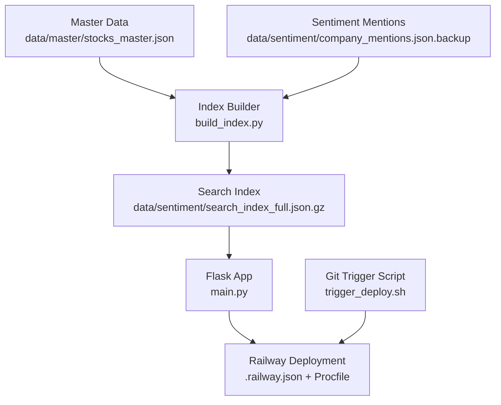
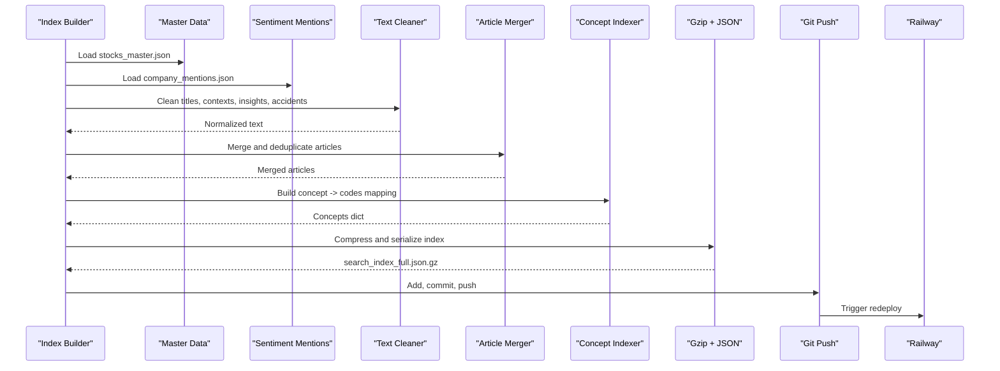
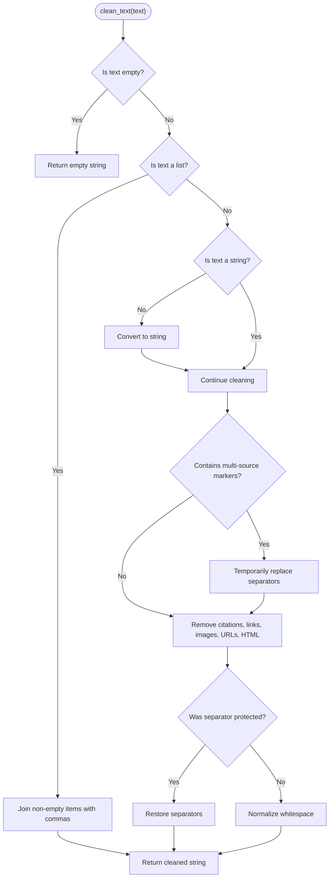
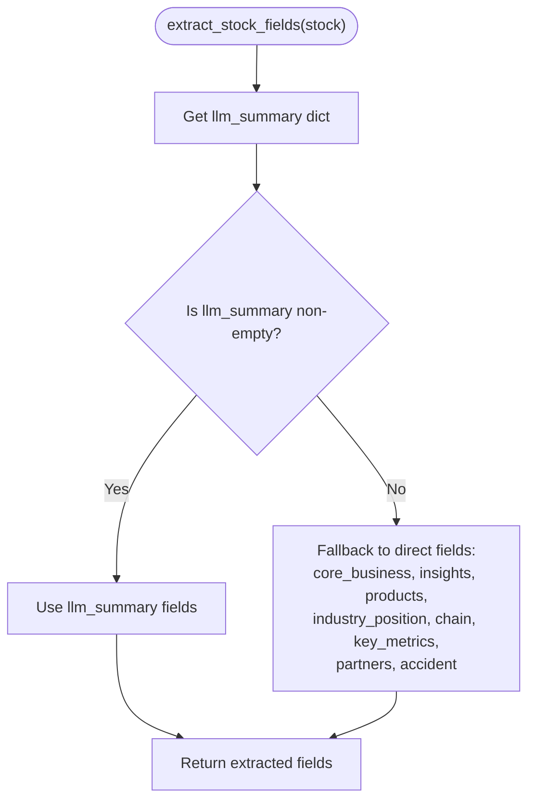
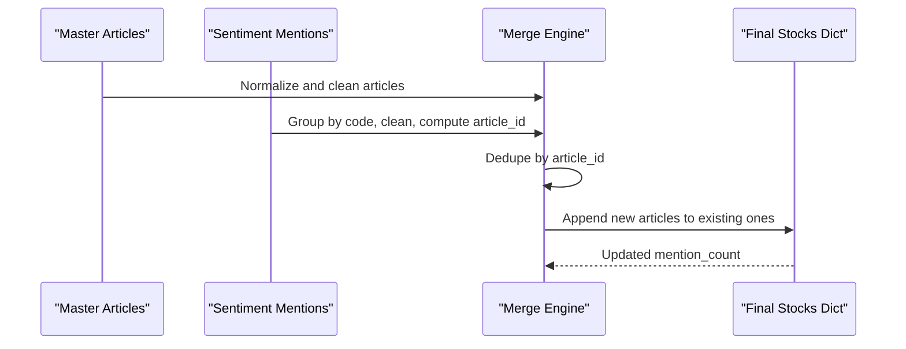
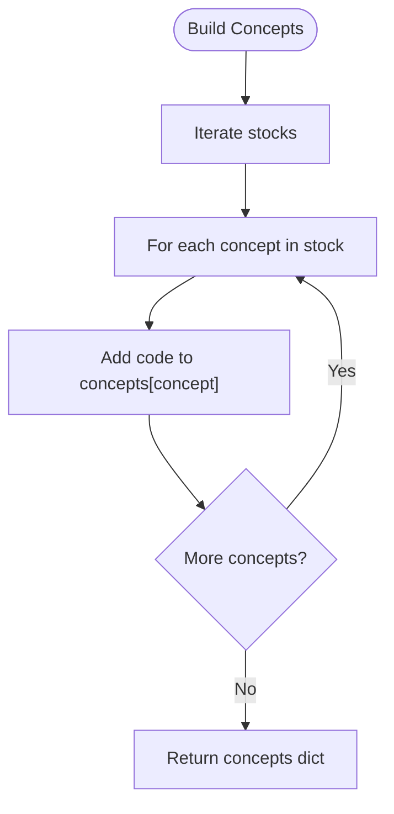
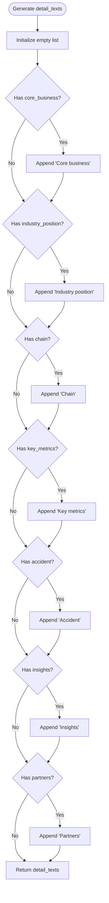
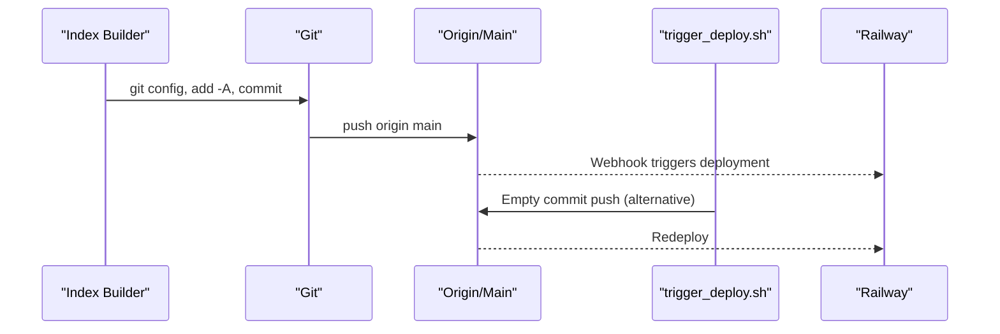
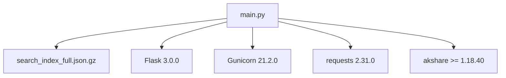

# Data Processing Pipeline

<cite>
**Referenced Files in This Document**
- [build_index.py](file://build_index.py)
- [main.py](file://main.py)
- [data/master/stocks_master.json](file://data/master/stocks_master.json)
- [data/sentiment/company_mentions.json.backup](file://data/sentiment/company_mentions.json.backup)
- [trigger_deploy.sh](file://trigger_deploy.sh)
- [requirements.txt](file://requirements.txt)
- [Procfile](file://Procfile)
- [.railway.json](file://.railway.json)
- [merge_email_data.py](file://merge_email_data.py)
- [README.md](file://README.md)
</cite>

## Table of Contents
1. [Introduction](#introduction)
2. [Project Structure](#project-structure)
3. [Core Components](#core-components)
4. [Architecture Overview](#architecture-overview)
5. [Detailed Component Analysis](#detailed-component-analysis)
6. [Dependency Analysis](#dependency-analysis)
7. [Performance Considerations](#performance-considerations)
8. [Troubleshooting Guide](#troubleshooting-guide)
9. [Conclusion](#conclusion)
10. [Appendices](#appendices)

## Introduction
This document describes the end-to-end data processing pipeline that transforms raw sentiment data into a compressed, searchable index for the Railway-hosted stock research application. It covers:
- Loading and merging master stock metadata with sentiment mentions
- Text cleaning and normalization while preserving multi-source content separators
- Field extraction supporting both nested llm_summary and direct field formats
- Article merging and deduplication
- Concept index generation for fast filtering
- Detail text generation for front-end display optimization
- Gzip compression and JSON serialization
- Automated Git workflow to commit and push changes to trigger Railway deployment
- Performance, memory optimization, error handling, validation, transformation rules, and quality assurance

## Project Structure
The pipeline centers around a dedicated script that builds a gzipped JSON index from two primary data sources:
- Master stock metadata: [data/master/stocks_master.json](file://data/master/stocks_master.json)
- Sentiment mentions: [data/sentiment/company_mentions.json.backup](file://data/sentiment/company_mentions.json.backup)

The Flask app consumes this index for search and display, and a separate script triggers deployments to Railway.

**Diagram sources**
- [build_index.py:77-271](file://build_index.py#L77-L271)
- [main.py:94-105](file://main.py#L94-L105)
- [.railway.json:1-15](file://.railway.json#L1-L15)
- [Procfile:1-2](file://Procfile#L1-L2)
- [trigger_deploy.sh:1-25](file://trigger_deploy.sh#L1-L25)

**Section sources**
- [build_index.py:11-14](file://build_index.py#L11-L14)
- [main.py:23-26](file://main.py#L23-L26)

## Core Components
- Index builder: Loads master and sentiment data, cleans and normalizes text, extracts fields, merges articles, generates concept index, creates detail texts, serializes to gzipped JSON, and triggers Git push to deploy.
- Flask app: Loads the gzipped index, exposes search and API endpoints, and serves the UI.
- Deployment automation: Git commit/push and Railway configuration.

Key responsibilities:
- Data ingestion and validation
- Text normalization and preservation of multi-source separators
- Field extraction with fallback logic
- Deduplication and merging
- Concept index creation
- Front-end detail text assembly
- Compression and serialization
- Git-triggered deployment

**Section sources**
- [build_index.py:77-271](file://build_index.py#L77-L271)
- [main.py:94-105](file://main.py#L94-L105)

## Architecture Overview
The pipeline follows a batch processing model:
1. Load master stock metadata and sentiment mentions
2. Normalize and clean text content
3. Extract fields from either nested llm_summary or direct fields
4. Merge sentiment articles into master records with deduplication
5. Build concept index mapping concept names to stock codes
6. Generate detail_texts for front-end presentation
7. Serialize to gzipped JSON for efficient serving
8. Commit and push changes to trigger Railway deployment

**Diagram sources**
- [build_index.py:77-271](file://build_index.py#L77-L271)

## Detailed Component Analysis

### Text Cleaning and Normalization
The cleaning function removes Markdown/HTML formatting while preserving multi-source content separators. It:
- Handles arrays by joining with commas
- Detects multi-source markers and temporarily protects them
- Removes citations, Markdown links, images, bare URLs, and HTML tags
- Restores multi-source separators after cleaning
- Normalizes whitespace otherwise

**Diagram sources**
- [build_index.py:16-55](file://build_index.py#L16-L55)

**Section sources**
- [build_index.py:16-55](file://build_index.py#L16-L55)

### Field Extraction: Nested llm_summary vs Direct Fields
The extraction logic prioritizes llm_summary fields and falls back to direct fields when llm_summary is absent or empty. This supports both LLM-generated summaries and direct-field uploads.

**Diagram sources**
- [build_index.py:57-75](file://build_index.py#L57-L75)

**Section sources**
- [build_index.py:57-75](file://build_index.py#L57-L75)

### Article Merging and Deduplication
Articles are merged from master and sentiment data:
- Master articles are normalized and cleaned
- Sentiment mentions are grouped by stock code and deduplicated by article_id
- Existing articles are preserved; new articles are appended only if not already present
- Mention counts are updated accordingly

**Diagram sources**
- [build_index.py:87-176](file://build_index.py#L87-L176)

**Section sources**
- [build_index.py:87-176](file://build_index.py#L87-L176)

### Concept Index Generation
A concept index maps each concept to the list of stock codes that include it. This enables fast filtering and concept-based navigation.

**Diagram sources**
- [build_index.py:178-185](file://build_index.py#L178-L185)

**Section sources**
- [build_index.py:178-185](file://build_index.py#L178-L185)

### Detail Text Generation for Front-End
Detail texts are constructed from available fields to optimize front-end display. The generator includes:
- Core business
- Industry position
- Chain
- Key metrics
- Accidents
- Insights
- Partners

These are assembled into a concise list for rendering.

**Diagram sources**
- [build_index.py:187-219](file://build_index.py#L187-L219)

**Section sources**
- [build_index.py:187-219](file://build_index.py#L187-L219)

### Gzip Compression and JSON Serialization
The final index is serialized to a gzipped JSON file for compactness and fast transfer. The output includes:
- Version
- Update time
- Stocks dictionary
- Concepts mapping

Compression is handled via gzip with UTF-8 encoding.

**Section sources**
- [build_index.py:222-234](file://build_index.py#L222-L234)

### Automated Git Workflow and Deployment Trigger
After building the index, the pipeline commits and pushes changes to trigger Railway deployment:
- Configures Git user identity
- Checks for staged changes
- Adds all changes, commits with timestamped message, and pushes to origin/main
- A separate script can force redeploy by pushing an empty commit

**Diagram sources**
- [build_index.py:236-267](file://build_index.py#L236-L267)
- [trigger_deploy.sh:1-25](file://trigger_deploy.sh#L1-L25)

**Section sources**
- [build_index.py:236-267](file://build_index.py#L236-L267)
- [trigger_deploy.sh:1-25](file://trigger_deploy.sh#L1-L25)

## Dependency Analysis
External dependencies and runtime components:
- Flask app loads the gzipped index and serves endpoints
- Gunicorn runs the Flask app on Railway
- Railway configuration defines build and deploy behavior
- Requirements define Python packages

**Diagram sources**
- [requirements.txt:1-5](file://requirements.txt#L1-L5)
- [Procfile:1-2](file://Procfile#L1-L2)
- [main.py:6-18](file://main.py#L6-L18)

**Section sources**
- [requirements.txt:1-5](file://requirements.txt#L1-L5)
- [Procfile:1-2](file://Procfile#L1-L2)
- [main.py:6-18](file://main.py#L6-L18)

## Performance Considerations
- Memory optimization
  - Stream-like processing: load and process data incrementally; avoid loading entire datasets into memory at once
  - Deduplication uses sets for O(1) lookups
  - Iterative merging avoids deep copies where possible
- I/O efficiency
  - Use gzip for index serialization to reduce file size and network transfer
  - Prefer incremental writes and minimal intermediate structures
- CPU efficiency
  - Regex-based cleaning is straightforward; keep patterns minimal and reuse compiled patterns if reused frequently
  - Normalize whitespace after cleaning to reduce storage and improve downstream processing
- Search performance
  - Precompute concept index for O(1) concept-to-stocks lookup
  - Normalize text once during build; avoid repeated normalization at query time

[No sources needed since this section provides general guidance]

## Troubleshooting Guide
Common issues and remedies:
- Missing or invalid data files
  - Verify paths to master and sentiment files exist and are readable
  - Ensure the index builder can locate and parse both files
- Text cleaning anomalies
  - Confirm multi-source separators are preserved during cleaning
  - Validate that arrays are joined correctly and whitespace is normalized
- Field extraction failures
  - Ensure llm_summary fallback logic is triggered when nested fields are missing
  - Validate that direct fields are populated when llm_summary is empty
- Deduplication mismatches
  - Confirm article_id computation is consistent across master and mentions
  - Check that article_id uniqueness prevents duplicates
- Concept index errors
  - Validate concept names are non-empty and normalized
  - Ensure concept-to-code mapping is built after merging
- Detail text generation
  - Confirm optional fields are checked before inclusion
  - Validate that detail_texts remain concise and readable
- Serialization and deployment
  - Verify gzip and JSON serialization succeed
  - Check Git credentials and permissions for push operations
  - Confirm Railway configuration and Procfile are correct

**Section sources**
- [build_index.py:77-271](file://build_index.py#L77-L271)
- [main.py:94-105](file://main.py#L94-L105)

## Conclusion
The pipeline provides a robust, automated mechanism to transform raw sentiment data into a compressed, searchable index. It emphasizes correctness through deduplication and normalization, flexibility through dual field extraction modes, and performance via precomputed indices and compression. The Git-triggered deployment ensures timely updates to the Railway-hosted application.

[No sources needed since this section summarizes without analyzing specific files]

## Appendices

### Data Validation and Transformation Rules
- Input validation
  - Check for presence of required keys (e.g., code, name)
  - Validate types (strings, lists, dicts)
- Transformation rules
  - Normalize text using the cleaning function
  - Convert arrays to comma-separated strings when needed
  - Preserve multi-source separators during cleaning
  - Compute article_id consistently across sources
- Quality assurance
  - Compare mention counts before and after deduplication
  - Verify concept index completeness
  - Confirm detail_texts readability and relevance

**Section sources**
- [build_index.py:16-55](file://build_index.py#L16-L55)
- [build_index.py:87-176](file://build_index.py#L87-L176)
- [build_index.py:178-219](file://build_index.py#L178-L219)

### Related Scripts and Utilities
- Email data merger: [merge_email_data.py](file://merge_email_data.py) merges external email attachments into master stock data
- README deployment guide: [README.md](file://README.md) documents Railway deployment steps and configuration

**Section sources**
- [merge_email_data.py:1-88](file://merge_email_data.py#L1-L88)
- [README.md:1-126](file://README.md#L1-L126)