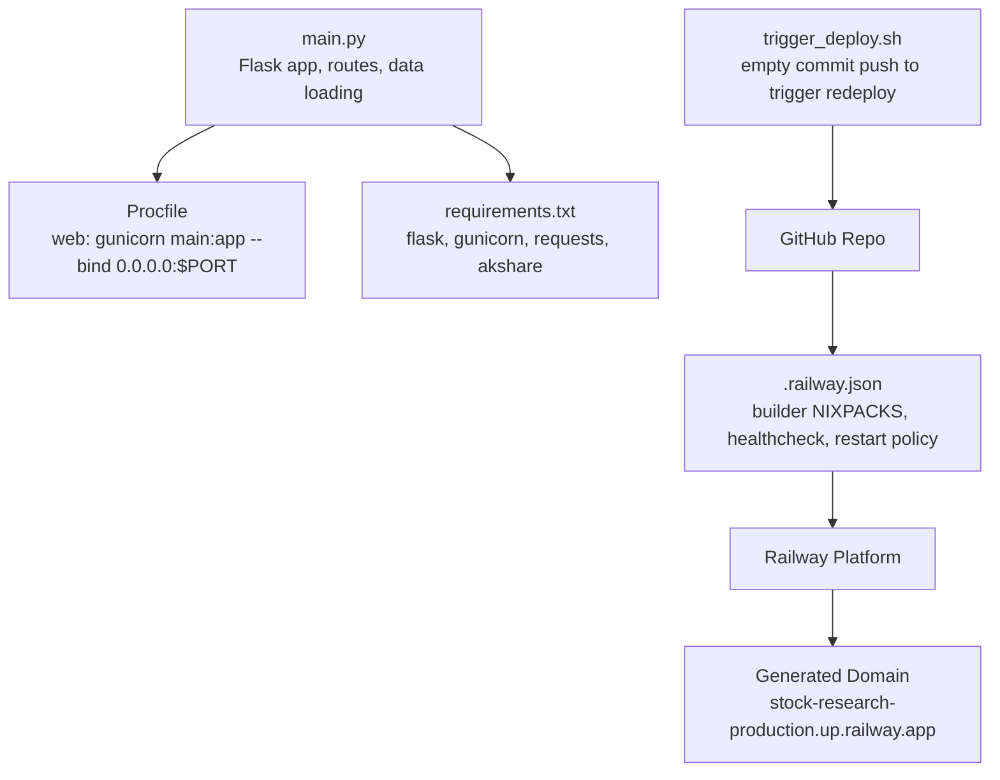
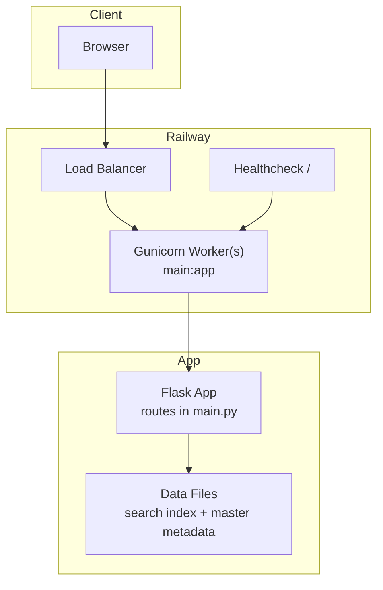
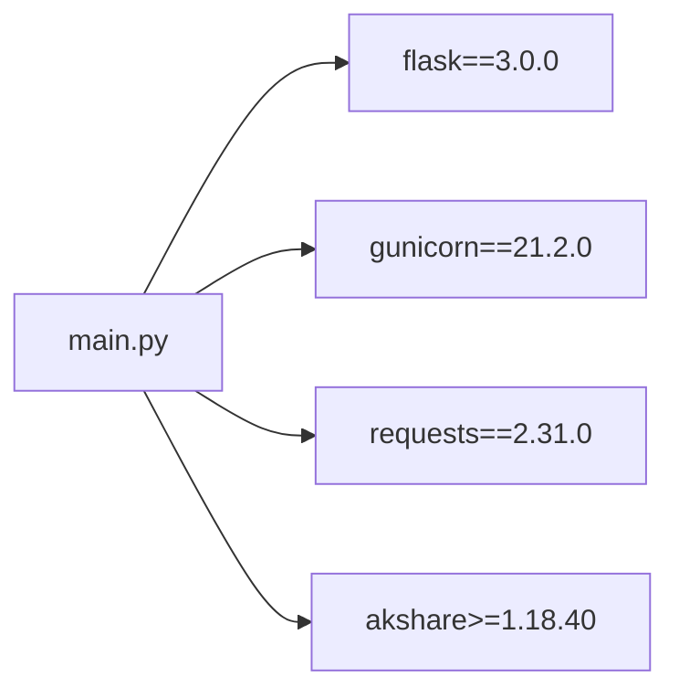

# Deployment and Operations

<cite>
**Referenced Files in This Document**
- [main.py](file://main.py)
- [.railway.json](file://.railway.json)
- [Procfile](file://Procfile)
- [requirements.txt](file://requirements.txt)
- [trigger_deploy.sh](file://trigger_deploy.sh)
- [DEPLOYMENT_CHECKLIST.md](file://DEPLOYMENT_CHECKLIST.md)
- [DEPLOYMENT_STATUS.md](file://DEPLOYMENT_STATUS.md)
- [DEPLOYMENT_ISSUE.md](file://DEPLOYMENT_ISSUE.md)
- [FINAL_DEPLOY_STEPS.md](file://FINAL_DEPLOY_STEPS.md)
- [QUICK_DEPLOY.md](file://QUICK_DEPLOY.md)
- [RAILWAY_CACHE_DEBUG.md](file://RAILWAY_CACHE_DEBUG.md)
- [RAILWAY_NUCLEAR_OPTION.md](file://RAILWAY_NUCLEAR_OPTION.md)
- [RAILWAY_URGENT_FIX.md](file://RAILWAY_URGENT_FIX.md)
- [DEPLOY_TIMESTAMP.txt](file://DEPLOY_TIMESTAMP.txt)
- [DEPLOY_TRIGGER.txt](file://DEPLOY_TRIGGER.txt)
- [DEPLOY_FORCE.txt](file://DEPLOY_FORCE.txt)
</cite>

## Table of Contents
1. [Introduction](#introduction)
2. [Project Structure](#project-structure)
3. [Core Components](#core-components)
4. [Architecture Overview](#architecture-overview)
5. [Detailed Component Analysis](#detailed-component-analysis)
6. [Dependency Analysis](#dependency-analysis)
7. [Performance Considerations](#performance-considerations)
8. [Troubleshooting Guide](#troubleshooting-guide)
9. [Conclusion](#conclusion)
10. [Appendices](#appendices)

## Introduction
This document provides comprehensive deployment and operations guidance for the Stock Research Platform hosted on Railway. It covers the end-to-end deployment workflow, configuration setup, environment variables, health checks, scaling considerations, local development and testing, version control strategy, automated deployment triggers, rollback procedures, maintenance workflows, performance optimization, resource allocation, and cost management.

## Project Structure
The repository contains the minimal set of files required to deploy a Flask web application on Railway:
- Application entrypoint and routes: [main.py](file://main.py)
- Process startup command: [Procfile](file://Procfile)
- Python runtime dependencies: [requirements.txt](file://requirements.txt)
- Railway-specific configuration: [.railway.json](file://.railway.json)
- Deployment automation script: [trigger_deploy.sh](file://trigger_deploy.sh)
- Operational runbooks and diagnostics: multiple Markdown and text files

**Diagram sources**
- [main.py](file://main.py)
- [Procfile](file://Procfile)
- [requirements.txt](file://requirements.txt)
- [.railway.json](file://.railway.json)
- [trigger_deploy.sh](file://trigger_deploy.sh)

**Section sources**
- [main.py](file://main.py)
- [Procfile](file://Procfile)
- [requirements.txt](file://requirements.txt)
- [.railway.json](file://.railway.json)
- [trigger_deploy.sh](file://trigger_deploy.sh)

## Core Components
- Application server: Flask app with multiple routes for dashboards, stock details, concepts, search, and editing APIs.
- Data loading: Loads compressed search index and master metadata, with fallback logic for compressed/uncompressed files.
- Static assets: HTML templates and CSS under templates/ and static/css/.
- Process manager: Gunicorn WSGI server configured via Procfile.
- Runtime dependencies: Flask, Gunicorn, Requests, Akshare.
- Railway configuration: Nixpacks builder, healthcheck endpoint, restart policy, and start command.

Key operational artifacts:
- Health check path configured in Railway for readiness.
- Restart policy configured to retry on failure.
- Environment variable PORT used by Gunicorn binding.
- Optional Railway variables for cache busting or build number recorded in diagnostics.

**Section sources**
- [main.py](file://main.py)
- [Procfile](file://Procfile)
- [requirements.txt](file://requirements.txt)
- [.railway.json](file://.railway.json)

## Architecture Overview
The platform follows a straightforward pattern:
- Client browser requests Flask routes.
- Flask loads prebuilt data files and renders templates or returns JSON.
- Railway runs the app via Gunicorn bound to $PORT.
- Railway’s healthcheck pings the root path to determine readiness.

**Diagram sources**
- [main.py](file://main.py)
- [.railway.json](file://.railway.json)
- [Procfile](file://Procfile)

## Detailed Component Analysis

### Application Startup and Routing
- Entry: Gunicorn starts the Flask app with the WSGI callable main:app.
- Routes include dashboards, stock detail pages, concepts, search, editing APIs, and market data retrieval.
- Data loading prioritizes uncompressed JSON for Railway deployments and falls back to gzipped variants.

Operational implications:
- Ensure data files exist at runtime; Railway mounts the repository and serves the app from the repository root.
- The app writes edited records back to disk; persistence depends on Railway’s mounted filesystem semantics.

**Section sources**
- [main.py](file://main.py)
- [Procfile](file://Procfile)

### Railway Configuration (.railway.json)
- Builder: NIXPACKS.
- Build cache disabled to mitigate stale artifact issues.
- Start command: Gunicorn with $PORT binding.
- Healthcheck: GET "/" with a 100s timeout.
- Restart policy: ON_FAILURE with retries.

Operational implications:
- Disabling cache helps avoid persistent build artifacts.
- Healthcheck ensures Railway marks the service as Running after initial load.
- Restart policy improves resilience against transient failures.

**Section sources**
- [.railway.json](file://.railway.json)

### Process and Port Binding (Procfile)
- Binds Gunicorn to 0.0.0.0:$PORT.
- Railway injects PORT automatically; the app must honor it.

**Section sources**
- [Procfile](file://Procfile)

### Dependencies (requirements.txt)
- Flask, Gunicorn, Requests, Akshare.
- These define the runtime environment for Railway’s Nixpacks builder.

**Section sources**
- [requirements.txt](file://requirements.txt)

### Automated Deployment Triggers
- Push to GitHub main branch triggers Railway builds.
- Empty commit script pushes a “chore: trigger redeploy” commit to force a rebuild.
- Manual redeploy via Railway console is supported.

Operational implications:
- Prefer pushing to main for automatic deployments.
- Use the trigger script when GitHub webhooks fail or Railway does not detect changes.

**Section sources**
- [trigger_deploy.sh](file://trigger_deploy.sh)
- [DEPLOYMENT_CHECKLIST.md](file://DEPLOYMENT_CHECKLIST.md)

### Health Checks and Readiness
- Railway healthcheck pings "/".
- Successful response indicates the app is ready.

Monitoring checklist:
- Confirm status transitions: Building → Deploying → Running.
- Review logs for errors during startup or data load.

**Section sources**
- [.railway.json](file://.railway.json)
- [DEPLOYMENT_CHECKLIST.md](file://DEPLOYMENT_CHECKLIST.md)

### Scaling Considerations
- Current deployment uses a single process managed by Gunicorn.
- Railway free tier provides limited memory; monitor memory usage and adjust as needed.
- Consider upgrading to a paid plan if performance or memory pressure increases.

**Section sources**
- [DEPLOYMENT_STATUS.md](file://DEPLOYMENT_STATUS.md)

### Local Development Setup
- Clone the repository and install dependencies per requirements.txt.
- Run locally with a development server or mimic Railway’s process model using Gunicorn with $PORT.
- Verify routes and data loading locally before deploying.

Recommended steps:
- Install dependencies.
- Start the app locally and browse routes.
- Validate search and stock detail endpoints.

**Section sources**
- [requirements.txt](file://requirements.txt)
- [Procfile](file://Procfile)

### Testing Procedures
- Smoke test the homepage and key routes.
- Test the stock detail API endpoint for a known code.
- Validate search suggestions and full-text search.
- Verify editing APIs and sync endpoints.

Validation examples:
- GET /api/stock/{code}
- GET /api/search/suggest?q=...
- GET /api/sync and export/clear endpoints

**Section sources**
- [main.py](file://main.py)

### Version Control Strategy
- Use feature branches and pull requests.
- Merge to main to trigger automated Railway deployments.
- Tag releases as needed for rollback checkpoints.
- Keep deployment runbooks in Markdown files for auditability.

**Section sources**
- [DEPLOYMENT_CHECKLIST.md](file://DEPLOYMENT_CHECKLIST.md)
- [FINAL_DEPLOY_STEPS.md](file://FINAL_DEPLOY_STEPS.md)
- [QUICK_DEPLOY.md](file://QUICK_DEPLOY.md)

### Rollback Procedures
- Immediate: Manually redeploy the previous known-good commit from the Railway console.
- Alternative: Force a redeploy of a prior commit hash.
- Long-term: Maintain release tags and branch protection to prevent accidental rollbacks.

**Section sources**
- [DEPLOYMENT_ISSUE.md](file://DEPLOYMENT_ISSUE.md)
- [RAILWAY_URGENT_FIX.md](file://RAILWAY_URGENT_FIX.md)
- [DEPLOY_FORCE.txt](file://DEPLOY_FORCE.txt)

### Maintenance Workflows
- Periodic data refresh: Update data files and push to main.
- Monitor healthcheck and logs post-deploy.
- Validate UI and API endpoints after updates.
- Archive deployment timestamps and triggers for traceability.

**Section sources**
- [DEPLOY_TIMESTAMP.txt](file://DEPLOY_TIMESTAMP.txt)
- [DEPLOY_TRIGGER.txt](file://DEPLOY_TRIGGER.txt)
- [DEPLOYMENT_STATUS.md](file://DEPLOYMENT_STATUS.md)

## Dependency Analysis
The application depends on:
- Flask for routing and templating.
- Gunicorn as the WSGI server.
- Requests for external API calls.
- Akshare for optional financial data fetching.

Railway’s Nixpacks builder resolves these dependencies automatically.

**Diagram sources**
- [main.py](file://main.py)
- [requirements.txt](file://requirements.txt)

**Section sources**
- [requirements.txt](file://requirements.txt)
- [main.py](file://main.py)

## Performance Considerations
- Data loading: The app loads a compressed search index and master metadata at startup. Ensure files are present and sized appropriately.
- Memory footprint: Railway free tier has limited memory; monitor usage and optimize data structures if needed.
- External API calls: Market data retrieval uses an external API; handle timeouts gracefully and cache results where appropriate.
- Caching: Railway’s build cache is disabled to avoid stale artifacts; rely on application-level caching strategies.

**Section sources**
- [main.py](file://main.py)
- [DEPLOYMENT_STATUS.md](file://DEPLOYMENT_STATUS.md)

## Troubleshooting Guide

### Common Deployment Issues and Fixes
- Railway did not auto-deploy:
  - Use the manual redeploy button in the Railway console.
  - Trigger a redeploy via an empty commit push using the provided script.
- Deployment fails:
  - Review Railway logs for dependency installation or startup errors.
  - Verify Procfile and .railway.json configurations.
- Data not updating:
  - Confirm the correct files are committed and pushed.
  - Railway may cache files; use the Nuclear Option to delete and recreate the project.
- Application returns 404/502:
  - Allow time for deployment; check logs.
  - Ensure the app starts successfully and binds to $PORT.

### Cache and Build Artifacts
- Symptoms: Old code or data persists despite GitHub updates.
- Mitigations:
  - Try a rebuild with cache disabled.
  - Add a cache-busting variable or modify Procfile to force rebuild.
  - As a last resort, delete and recreate the Railway project.

### Emergency Fix Playbook
- Immediate actions:
  - Manually deploy from the Railway console.
  - Verify the latest commit is connected and correct.
  - Check webhook connectivity if using GitHub.
- Validation:
  - Test stock API endpoints and search functionality.
  - Confirm UI pages render correctly.

**Section sources**
- [DEPLOYMENT_CHECKLIST.md](file://DEPLOYMENT_CHECKLIST.md)
- [DEPLOYMENT_ISSUE.md](file://DEPLOYMENT_ISSUE.md)
- [RAILWAY_CACHE_DEBUG.md](file://RAILWAY_CACHE_DEBUG.md)
- [RAILWAY_NUCLEAR_OPTION.md](file://RAILWAY_NUCLEAR_OPTION.md)
- [RAILWAY_URGENT_FIX.md](file://RAILWAY_URGENT_FIX.md)

## Conclusion
The Stock Research Platform is designed for straightforward deployment on Railway with minimal configuration. By following the documented deployment workflow, validating health checks, and leveraging the provided troubleshooting playbooks, teams can maintain reliable operations. For long-term stability, keep Railway’s build cache disabled, monitor memory usage, and adopt disciplined version control practices with tagged releases to enable quick rollbacks.

## Appendices

### Deployment Checklist
- Prepare data files and templates.
- Commit and push to main branch.
- Confirm Railway detects the deployment.
- Monitor logs and verify healthcheck.
- Validate homepage, stock detail, and search endpoints.
- Record deployment timestamp and commit.

**Section sources**
- [DEPLOYMENT_CHECKLIST.md](file://DEPLOYMENT_CHECKLIST.md)

### Quick Deployment (GitHub Method)
- Create a public GitHub repository named stock-research.
- Push main.py, requirements.txt, Procfile, and .railway.json.
- Connect Railway to the repository and deploy from GitHub.
- Wait for Railway to generate a domain and verify.

**Section sources**
- [FINAL_DEPLOY_STEPS.md](file://FINAL_DEPLOY_STEPS.md)
- [QUICK_DEPLOY.md](file://QUICK_DEPLOY.md)

### Automated Trigger Script
- Run the provided script to push an empty commit and trigger a redeploy.
- Monitor Railway dashboard for status transitions.

**Section sources**
- [trigger_deploy.sh](file://trigger_deploy.sh)

### Status and Timestamps
- Track deployment timestamps and triggers for auditability.
- Use these artifacts to correlate deployments with changes.

**Section sources**
- [DEPLOY_TIMESTAMP.txt](file://DEPLOY_TIMESTAMP.txt)
- [DEPLOY_TRIGGER.txt](file://DEPLOY_TRIGGER.txt)