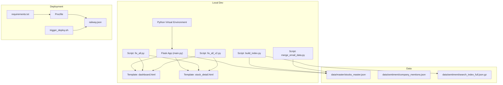
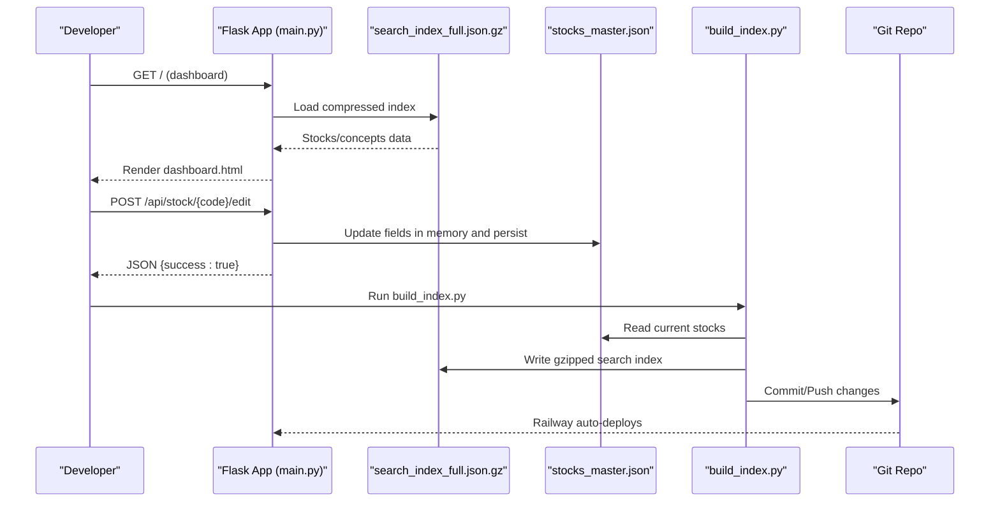
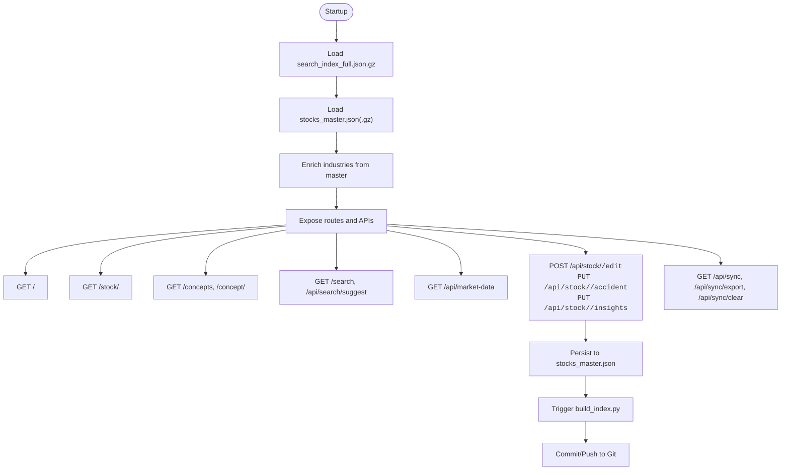
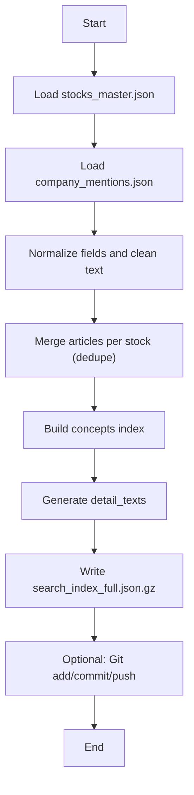
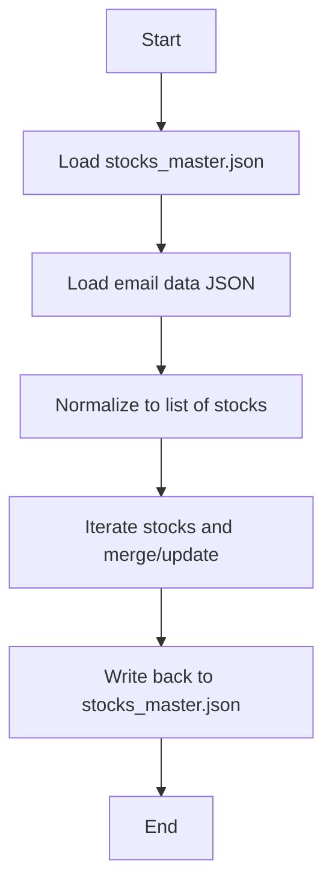
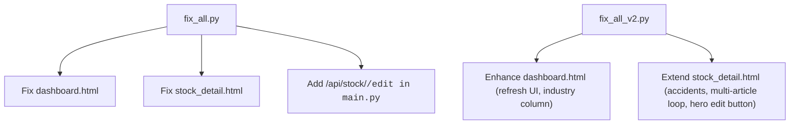
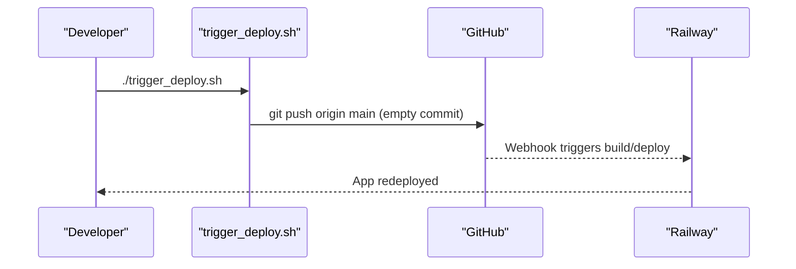
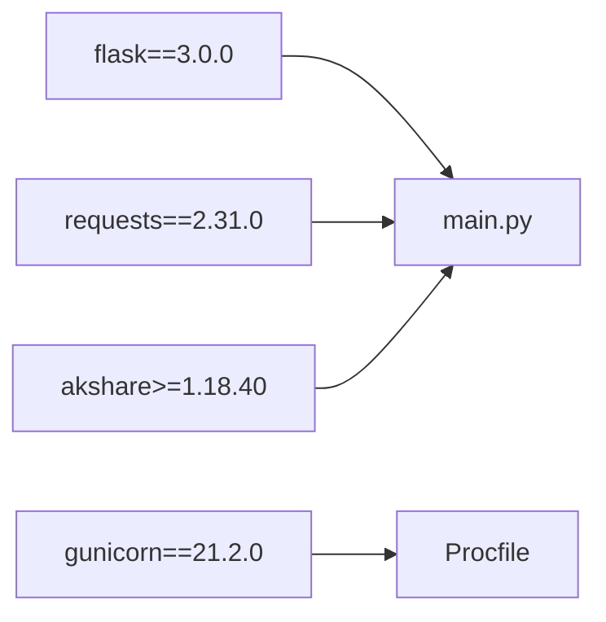

# Development Workflow

<cite>
**Referenced Files in This Document**
- [README.md](file://README.md)
- [requirements.txt](file://requirements.txt)
- [main.py](file://main.py)
- [build_index.py](file://build_index.py)
- [fix_all.py](file://fix_all.py)
- [fix_all_v2.py](file://fix_all_v2.py)
- [merge_email_data.py](file://merge_email_data.py)
- [Procfile](file://Procfile)
- [.railway.json](file://.railway.json)
- [trigger_deploy.sh](file://trigger_deploy.sh)
- [DEPLOYMENT_CHECKLIST.md](file://DEPLOYMENT_CHECKLIST.md)
- [EDIT_FEATURE_GUIDE.md](file://EDIT_FEATURE_GUIDE.md)
- [JSON格式标准.md](file://JSON格式标准.md)
- [templates/dashboard.html](file://templates/dashboard.html)
- [templates/stock_detail.html](file://templates/stock_detail.html)
</cite>

## Table of Contents
1. [Introduction](#introduction)
2. [Project Structure](#project-structure)
3. [Core Components](#core-components)
4. [Architecture Overview](#architecture-overview)
5. [Detailed Component Analysis](#detailed-component-analysis)
6. [Dependency Analysis](#dependency-analysis)
7. [Performance Considerations](#performance-considerations)
8. [Troubleshooting Guide](#troubleshooting-guide)
9. [Conclusion](#conclusion)
10. [Appendices](#appendices)

## Introduction
This document describes the end-to-end development workflow for the Stock Research Platform. It covers local environment setup, Flask application development patterns, data processing pipelines, editing and QA workflows, deployment automation, and operational best practices. The platform is a Flask web app that serves curated stock research data, supports inline editing, and integrates with Railway for hosting and CI-like deployments.

## Project Structure
The repository is organized around a Flask application, static assets, Jinja2 templates, and supporting scripts for data processing and deployment.

- Application entrypoint and routes: [main.py](file://main.py)
- Data processing and indexing: [build_index.py](file://build_index.py), [merge_email_data.py](file://merge_email_data.py)
- Fix scripts for UI and API updates: [fix_all.py](file://fix_all.py), [fix_all_v2.py](file://fix_all_v2.py)
- Frontend templates: [templates/dashboard.html](file://templates/dashboard.html), [templates/stock_detail.html](file://templates/stock_detail.html)
- Dependencies and runtime config: [requirements.txt](file://requirements.txt), [Procfile](file://Procfile), [.railway.json](file://.railway.json)
- Deployment automation: [trigger_deploy.sh](file://trigger_deploy.sh)
- Operational docs: [DEPLOYMENT_CHECKLIST.md](file://DEPLOYMENT_CHECKLIST.md), [EDIT_FEATURE_GUIDE.md](file://EDIT_FEATURE_GUIDE.md), [JSON格式标准.md](file://JSON格式标准.md)

**Diagram sources**
- [main.py:1-1240](file://main.py#L1-L1240)
- [build_index.py:1-271](file://build_index.py#L1-L271)
- [merge_email_data.py:1-88](file://merge_email_data.py#L1-L88)
- [fix_all.py:1-218](file://fix_all.py#L1-L218)
- [fix_all_v2.py:1-421](file://fix_all_v2.py#L1-L421)
- [requirements.txt:1-5](file://requirements.txt#L1-L5)
- [Procfile:1-2](file://Procfile#L1-L2)
- [.railway.json:1-15](file://.railway.json#L1-L15)
- [trigger_deploy.sh:1-25](file://trigger_deploy.sh#L1-L25)

**Section sources**
- [README.md:1-126](file://README.md#L1-L126)
- [main.py:1-1240](file://main.py#L1-L1240)
- [build_index.py:1-271](file://build_index.py#L1-L271)
- [merge_email_data.py:1-88](file://merge_email_data.py#L1-L88)
- [fix_all.py:1-218](file://fix_all.py#L1-L218)
- [fix_all_v2.py:1-421](file://fix_all_v2.py#L1-L421)
- [requirements.txt:1-5](file://requirements.txt#L1-L5)
- [Procfile:1-2](file://Procfile#L1-L2)
- [.railway.json:1-15](file://.railway.json#L1-L15)
- [trigger_deploy.sh:1-25](file://trigger_deploy.sh#L1-L25)

## Core Components
- Flask application (main.py): Routes for dashboard, stock detail, concepts, search, market data, and inline editing APIs. Loads data from compressed search index and master JSON, supports edits and sync/export/clear endpoints.
- Data processing pipeline:
  - build_index.py: Generates a gzipped search index from master and sentiment data, pushes changes to Git for Railway.
  - merge_email_data.py: Merges email-supplied stock data into master JSON.
  - fix_all.py and fix_all_v2.py: Batch fixes to templates and API for UI improvements and editing capabilities.
- Templates: dashboard.html and stock_detail.html define the UI and client-side interactions for stock lists, detail pages, and inline editing modals.
- Deployment configuration: requirements.txt, Procfile, railway.json, and trigger_deploy.sh automate building, serving, and redeploying.

**Section sources**
- [main.py:138-210](file://main.py#L138-L210)
- [main.py:280-336](file://main.py#L280-L336)
- [main.py:431-495](file://main.py#L431-L495)
- [main.py:612-686](file://main.py#L612-L686)
- [build_index.py:77-271](file://build_index.py#L77-L271)
- [merge_email_data.py:9-88](file://merge_email_data.py#L9-L88)
- [fix_all.py:8-218](file://fix_all.py#L8-L218)
- [fix_all_v2.py:8-421](file://fix_all_v2.py#L8-L421)
- [templates/dashboard.html:1-200](file://templates/dashboard.html#L1-L200)
- [templates/stock_detail.html:1-200](file://templates/stock_detail.html#L1-L200)

## Architecture Overview
The system follows a classic web application pattern:
- Client browser renders Jinja2 templates and interacts with Flask routes via AJAX.
- Flask loads prebuilt data (compressed search index and master JSON) and exposes REST-style endpoints.
- Data processing scripts run locally to maintain master and index files, then push to Git for Railway to rebuild and deploy.

**Diagram sources**
- [main.py:138-210](file://main.py#L138-L210)
- [main.py:431-495](file://main.py#L431-L495)
- [main.py:581-611](file://main.py#L581-L611)
- [build_index.py:77-271](file://build_index.py#L77-L271)

## Detailed Component Analysis

### Flask Application (main.py)
Key responsibilities:
- Data loading: Loads compressed search index and master JSON, enriches with industry data.
- Routing: Dashboard, stock detail, concepts, search, market data retrieval.
- Editing APIs: Inline editing endpoints for stock fields and article-level fields.
- Sync/export/clear: Manages edit logs and exports for collaboration.

**Diagram sources**
- [main.py:94-136](file://main.py#L94-L136)
- [main.py:138-210](file://main.py#L138-L210)
- [main.py:280-336](file://main.py#L280-L336)
- [main.py:431-495](file://main.py#L431-L495)
- [main.py:612-686](file://main.py#L612-L686)
- [main.py:770-800](file://main.py#L770-L800)

**Section sources**
- [main.py:94-136](file://main.py#L94-L136)
- [main.py:138-210](file://main.py#L138-L210)
- [main.py:280-336](file://main.py#L280-L336)
- [main.py:431-495](file://main.py#L431-L495)
- [main.py:612-686](file://main.py#L612-L686)
- [main.py:770-800](file://main.py#L770-L800)

### Data Indexing Pipeline (build_index.py)
Responsibilities:
- Reads master JSON and sentiment mentions.
- Extracts and normalizes fields, merges articles, builds concepts index.
- Writes a gzipped search index and optionally commits/pushes to Git for Railway.

**Diagram sources**
- [build_index.py:77-271](file://build_index.py#L77-L271)

**Section sources**
- [build_index.py:77-271](file://build_index.py#L77-L271)

### Email Data Merge (merge_email_data.py)
Responsibilities:
- Accepts email-supplied JSON (single stock or list).
- Merges into master stocks array, updating existing records and adding new ones.
- Saves back to master JSON.

**Diagram sources**
- [merge_email_data.py:9-88](file://merge_email_data.py#L9-L88)

**Section sources**
- [merge_email_data.py:9-88](file://merge_email_data.py#L9-L88)

### UI Fix Scripts (fix_all.py, fix_all_v2.py)
Responsibilities:
- Apply targeted UI and API fixes across templates and backend:
  - Add industry display and refresh button layout.
  - Introduce inline editing UI and API endpoints.
  - Improve list layouts and styling.
  - Enable editing of specific fields with modal UI and save handlers.

**Diagram sources**
- [fix_all.py:8-218](file://fix_all.py#L8-L218)
- [fix_all_v2.py:8-421](file://fix_all_v2.py#L8-L421)

**Section sources**
- [fix_all.py:8-218](file://fix_all.py#L8-L218)
- [fix_all_v2.py:8-421](file://fix_all_v2.py#L8-L421)
- [templates/dashboard.html:1-200](file://templates/dashboard.html#L1-L200)
- [templates/stock_detail.html:1-200](file://templates/stock_detail.html#L1-L200)

### Deployment Automation (.railway.json, Procfile, trigger_deploy.sh)
- Procfile defines the production command to serve the app with Gunicorn.
- railway.json configures builder, health checks, restart policy, and start command.
- trigger_deploy.sh pushes an empty commit to trigger a redeploy.

**Diagram sources**
- [.railway.json:1-15](file://.railway.json#L1-L15)
- [Procfile:1-2](file://Procfile#L1-L2)
- [trigger_deploy.sh:1-25](file://trigger_deploy.sh#L1-L25)

**Section sources**
- [.railway.json:1-15](file://.railway.json#L1-L15)
- [Procfile:1-2](file://Procfile#L1-L2)
- [trigger_deploy.sh:1-25](file://trigger_deploy.sh#L1-L25)

## Dependency Analysis
External libraries and runtime:
- Flask, Gunicorn, requests, akshare are declared in requirements.txt.
- Railway uses Nixpacks builder and runs the app via Procfile.

**Diagram sources**
- [requirements.txt:1-5](file://requirements.txt#L1-L5)
- [Procfile:1-2](file://Procfile#L1-L2)

**Section sources**
- [requirements.txt:1-5](file://requirements.txt#L1-L5)
- [Procfile:1-2](file://Procfile#L1-L2)
- [.railway.json:1-15](file://.railway.json#L1-L15)

## Performance Considerations
- Data loading: The app loads a gzipped search index and master JSON at startup. Keep index size reasonable and avoid unnecessary decompression work.
- API latency: Market data endpoint queries external APIs; consider caching and rate limiting.
- Template rendering: Minimize heavy loops and repeated computations in templates; leverage precomputed fields.
- Build pipeline: build_index.py writes a compressed index; ensure minimal churn to reduce Git diffs and redeploy time.

[No sources needed since this section provides general guidance]

## Troubleshooting Guide
Common issues and resolutions:
- Deployment not triggered: Use trigger_deploy.sh to push an empty commit and force redeploy.
- 404/502 errors after deploy: Wait a few minutes; check Railway logs and health check path.
- Data not updating: Verify Git includes the updated master/index files; confirm load paths and permissions.
- Edit save failures: Check browser console, network tab, and server logs; ensure API endpoints are reachable.

**Section sources**
- [DEPLOYMENT_CHECKLIST.md:100-141](file://DEPLOYMENT_CHECKLIST.md#L100-L141)
- [trigger_deploy.sh:1-25](file://trigger_deploy.sh#L1-L25)

## Conclusion
The Stock Research Platform follows a clear separation of concerns: Flask handles routing and data serving, scripts manage data ingestion and indexing, and Railway automates deployment. By adhering to the documented workflows—local environment setup, data processing, editing, and deployment—you can efficiently develop, test, and operate the platform.

[No sources needed since this section summarizes without analyzing specific files]

## Appendices

### Local Development Setup
- Create a Python virtual environment and install dependencies from requirements.txt.
- Prepare data files under data/master and data/sentiment.
- Run the Flask dev server locally; for production, use Gunicorn via Procfile.
- Use build_index.py to regenerate the search index after data changes.
- Use merge_email_data.py to incorporate email-supplied stock data into master JSON.
- Apply UI/API fixes via fix_all.py or fix_all_v2.py as needed.

**Section sources**
- [requirements.txt:1-5](file://requirements.txt#L1-L5)
- [main.py:1-1240](file://main.py#L1-L1240)
- [build_index.py:1-271](file://build_index.py#L1-L271)
- [merge_email_data.py:1-88](file://merge_email_data.py#L1-L88)
- [fix_all.py:1-218](file://fix_all.py#L1-L218)
- [fix_all_v2.py:1-421](file://fix_all_v2.py#L1-L421)

### Data Model and Formats
- stocks_master.json: Root object with a stocks array containing per-stock fields and articles.
- search_index_full.json.gz: Compressed index keyed by stock code with cleaned fields for fast search.
- Articles and detail_texts arrays follow standardized formats for display and search.

**Section sources**
- [JSON格式标准.md:22-106](file://JSON格式标准.md#L22-L106)
- [JSON格式标准.md:177-206](file://JSON格式标准.md#L177-L206)

### Testing Procedures
- Functional tests: Smoke-test routes (/, /stock/<code>, /concepts, /search) and verify rendered content.
- API tests: Validate JSON responses for /api/stock/<code>, /api/search/suggest, and editing endpoints.
- Data tests: Confirm that edited fields persist to master JSON and that search index reflects changes after running build_index.py.
- Integration tests: End-to-end flows from email data ingestion to index rebuild and UI verification.

[No sources needed since this section provides general guidance]

### Version Control and Branching
- Use feature branches for UI/API fixes (e.g., fix_all.py/fix_all_v2.py changes).
- Keep main branch stable; trigger deployments via trigger_deploy.sh or GitHub Actions.
- Review commits that touch data files (master/index) carefully; ensure deterministic builds.

[No sources needed since this section provides general guidance]

### Debugging and Profiling
- Use Flask’s built-in debug mode during development.
- Inspect server logs in Railway dashboard for runtime errors.
- Profile API latency using timing and logging around external API calls (market data).
- Validate data integrity by comparing pre/post states of master JSON and index.

[No sources needed since this section provides general guidance]