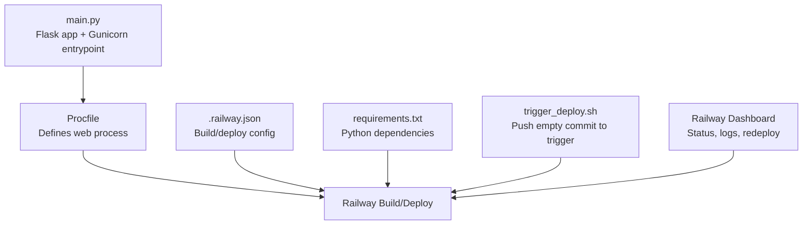
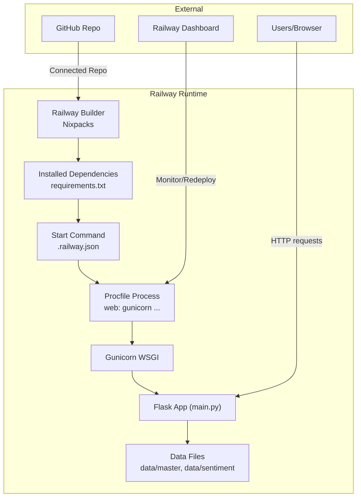
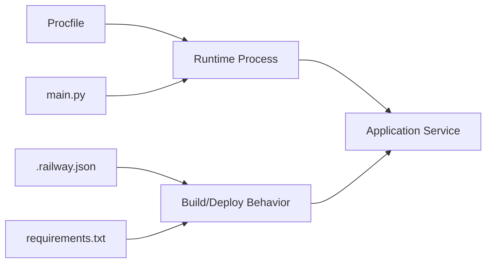

# Railway Cloud Deployment

<cite>
**Referenced Files in This Document**
- [Procfile](file://Procfile)
- [.railway.json](file://.railway.json)
- [trigger_deploy.sh](file://trigger_deploy.sh)
- [requirements.txt](file://requirements.txt)
- [main.py](file://main.py)
- [DEPLOYMENT_CHECKLIST.md](file://DEPLOYMENT_CHECKLIST.md)
- [DEPLOYMENT_STATUS.md](file://DEPLOYMENT_STATUS.md)
- [FINAL_DEPLOY_STEPS.md](file://FINAL_DEPLOY_STEPS.md)
- [DEPLOYMENT_ISSUE.md](file://DEPLOYMENT_ISSUE.md)
- [DEPLOY_DIAGNOSIS.md](file://DEPLOY_DIAGNOSIS.md)
- [RAILWAY_CACHE_DEBUG.md](file://RAILWAY_CACHE_DEBUG.md)
- [QUICK_DEPLOY.md](file://QUICK_DEPLOY.md)
- [README.md](file://README.md)
</cite>

## Table of Contents
1. [Introduction](#introduction)
2. [Project Structure](#project-structure)
3. [Core Components](#core-components)
4. [Architecture Overview](#architecture-overview)
5. [Detailed Component Analysis](#detailed-component-analysis)
6. [Dependency Analysis](#dependency-analysis)
7. [Performance Considerations](#performance-considerations)
8. [Troubleshooting Guide](#troubleshooting-guide)
9. [Conclusion](#conclusion)
10. [Appendices](#appendices)

## Introduction
This document provides end-to-end Railway cloud deployment guidance for the Stock Research Platform. It covers Railway configuration, environment variables, health checks, scaling considerations, Gunicorn WSGI startup via Procfile, automatic deployment triggers, and deployment status monitoring. It also includes step-by-step deployment procedures, environment setup requirements, troubleshooting common Railway deployment issues, deployment checklists, status tracking mechanisms, rollback procedures, performance optimization, resource allocation, cost management, monitoring, log access, and secrets management.

## Project Structure
The deployment relies on a small set of configuration and automation files plus the Flask application and dependencies:
- Application: main.py
- Dependencies: requirements.txt
- Startup: Procfile
- Railway configuration: .railway.json
- Automation: trigger_deploy.sh
- Deployment documentation and checklists: multiple Markdown files

**Diagram sources**
- [Procfile](file://Procfile)
- [.railway.json](file://.railway.json)
- [requirements.txt](file://requirements.txt)
- [main.py](file://main.py)
- [trigger_deploy.sh](file://trigger_deploy.sh)

**Section sources**
- [Procfile](file://Procfile)
- [.railway.json](file://.railway.json)
- [requirements.txt](file://requirements.txt)
- [main.py](file://main.py)
- [trigger_deploy.sh](file://trigger_deploy.sh)

## Core Components
- Gunicorn WSGI server configured in Procfile to bind to Railway’s PORT environment variable.
- Railway configuration in .railway.json specifying builder, start command, restart policy, and health check path.
- Application entrypoint in main.py that reads Railway’s PORT and runs the Flask app.
- Dependencies pinned in requirements.txt for reproducible builds.
- Automation script trigger_deploy.sh to push an empty commit and trigger a redeploy.

Key deployment artifacts:
- Procfile defines the web process that Railway executes.
- .railway.json configures build and deploy behavior, including health checks and restart policies.
- main.py loads data and exposes routes; it binds to 0.0.0.0:$PORT for Railway.
- requirements.txt ensures predictable dependency installation.
- trigger_deploy.sh automates redeploy by pushing an empty commit to the connected GitHub repository.

**Section sources**
- [Procfile](file://Procfile)
- [.railway.json](file://.railway.json)
- [main.py](file://main.py)
- [requirements.txt](file://requirements.txt)
- [trigger_deploy.sh](file://trigger_deploy.sh)

## Architecture Overview
The runtime architecture on Railway:
- Railway detects the Python project and installs dependencies from requirements.txt.
- Railway starts the web process defined in Procfile, which launches Gunicorn pointing to the Flask app.
- The Flask app serves routes and loads data from local data files.
- Railway monitors the health endpoint and applies restart policies on failure.

**Diagram sources**
- [.railway.json](file://.railway.json)
- [Procfile](file://Procfile)
- [requirements.txt](file://requirements.txt)
- [main.py](file://main.py)

## Detailed Component Analysis

### Railway Configuration (.railway.json)
- Builder: NIXPACKS
- Build cache disabled to avoid stale data issues
- Deploy start command: gunicorn main:app bound to 0.0.0.0:$PORT
- Restart policy: ON_FAILURE with max retries
- Health check: path "/" with a 100-second timeout

Operational impact:
- Disabling cache helps mitigate persistent file caching problems observed in testing.
- Health check path "/" ensures Railway can probe the root endpoint for liveness.
- Restart policy improves resilience against transient failures.

**Section sources**
- [.railway.json](file://.railway.json)

### Procfile Configuration
- Defines the web process to start Gunicorn with the Flask app factory reference.
- Binds to 0.0.0.0:$PORT so Railway can route traffic to the container.

Best practices:
- Always bind to 0.0.0.0 and use $PORT provided by Railway.
- Keep the Procfile minimal and aligned with the start command in .railway.json.

**Section sources**
- [Procfile](file://Procfile)

### Application Entry Point (main.py)
- Flask app initialization and route definitions.
- Loads compressed search index and supplements with industry data from stocks_master.json.
- Binds to host 0.0.0.0 and port from environment (Railway’s PORT).
- Exposes API endpoints and HTML pages.

Important runtime behavior:
- Uses Railway-provided PORT environment variable.
- Loads data from data/master and data/sentiment directories.
- Includes health-check friendly root route.

**Section sources**
- [main.py](file://main.py)

### Dependencies (requirements.txt)
- Flask, Gunicorn, requests, and akshare pinned for reproducibility.
- Ensures Railway’s build installs compatible versions.

**Section sources**
- [requirements.txt](file://requirements.txt)

### Deployment Trigger Script (trigger_deploy.sh)
- Pushes an empty commit to the main branch to trigger a redeploy.
- Provides status and links to monitor deployment and access the app.

Usage:
- Run locally or integrate into CI to automate redeploy after data updates.

**Section sources**
- [trigger_deploy.sh](file://trigger_deploy.sh)

### Deployment Workflows and Status Tracking

#### Step-by-step Deployment (GitHub-connected)
- Create a public GitHub repository named stock-research.
- Add main.py, requirements.txt, Procfile, and .railway.json to the repo.
- Connect Railway to the GitHub repository and select “Deploy from GitHub repo.”
- Railway auto-detects Python, installs dependencies, and starts the app via Gunicorn.

Monitoring:
- Track deployments in the Railway Dashboard under the project’s Deployments tab.
- Verify status transitions from Building to Deploying to Running.

**Section sources**
- [FINAL_DEPLOY_STEPS.md](file://FINAL_DEPLOY_STEPS.md)
- [README.md](file://README.md)

#### Automatic Redeployment After Data Updates
- After updating data files, push to the connected GitHub repository.
- Railway automatically rebuilds and restarts the service.
- Alternatively, use trigger_deploy.sh to push an empty commit to force a redeploy.

**Section sources**
- [DEPLOYMENT_CHECKLIST.md](file://DEPLOYMENT_CHECKLIST.md)
- [trigger_deploy.sh](file://trigger_deploy.sh)

#### Monitoring Deployment Health
- Use the Railway Dashboard to view logs for the latest deployment.
- Confirm successful loading of data files and absence of errors.
- Validate application endpoints (root, API) are reachable.

**Section sources**
- [DEPLOYMENT_CHECKLIST.md](file://DEPLOYMENT_CHECKLIST.md)
- [DEPLOYMENT_STATUS.md](file://DEPLOYMENT_STATUS.md)

### Rollback Procedures
- Manual redeploy: In the Railway Dashboard, go to Deployments and click Redeploy on a previous successful build.
- Rebuild: From the latest deployment, choose Rebuild to force a fresh build.
- Cache bust: Add a project variable (e.g., CACHE_BUST) and redeploy to mitigate persistent cache issues.

Note: If file cache issues persist, delete and recreate the project as a last resort.

**Section sources**
- [DEPLOY_DIAGNOSIS.md](file://DEPLOY_DIAGNOSIS.md)
- [RAILWAY_CACHE_DEBUG.md](file://RAILWAY_CACHE_DEBUG.md)

## Dependency Analysis
Railway’s build and runtime depend on:
- .railway.json for build/deploy configuration
- requirements.txt for dependency resolution
- Procfile for process definition
- main.py for application entrypoint and runtime behavior

**Diagram sources**
- [.railway.json](file://.railway.json)
- [requirements.txt](file://requirements.txt)
- [Procfile](file://Procfile)
- [main.py](file://main.py)

**Section sources**
- [.railway.json](file://.railway.json)
- [requirements.txt](file://requirements.txt)
- [Procfile](file://Procfile)
- [main.py](file://main.py)

## Performance Considerations
- Memory footprint: The platform targets ~100–150 MB memory usage, comfortably within Railway’s free tier limits.
- Data loading: The application loads a compressed search index and supplements with industry data from stocks_master.json. Keeping data sizes reasonable helps reduce cold-start latency.
- Restart policy: ON_FAILURE with retries prevents prolonged downtime from transient errors.
- Health check: A short health check path "/" ensures quick detection of unresponsive instances.

Cost management:
- Free tier allows 512 MB RAM; current usage is well below this threshold.
- Consider upgrading to a paid plan ($20/month) if scaling is required.

**Section sources**
- [DEPLOYMENT_STATUS.md](file://DEPLOYMENT_STATUS.md)
- [.railway.json](file://.railway.json)

## Troubleshooting Guide
Common issues and resolutions:
- Railway not auto-deploying:
  - Manually click Redeploy in the Railway Dashboard Deployments tab.
- Deployment fails:
  - Review logs in the latest deployment; check dependency installation and startup command.
- Data not updating:
  - Railway may cache old files. Force a redeploy or disable cache in .railway.json temporarily.
  - As a last resort, delete and recreate the project to clear persistent caches.
- Application returns 404/502:
  - Allow 2–3 minutes for deployment; check logs; confirm main.py starts successfully.

Validation checklist:
- Confirm GitHub push succeeded and Railway started a new deployment.
- Verify Railway shows Running status.
- Test the root endpoint and key API endpoints.
- Search for known stock codes to confirm data is loaded.

**Section sources**
- [DEPLOYMENT_CHECKLIST.md](file://DEPLOYMENT_CHECKLIST.md)
- [DEPLOYMENT_ISSUE.md](file://DEPLOYMENT_ISSUE.md)
- [DEPLOY_DIAGNOSIS.md](file://DEPLOY_DIAGNOSIS.md)
- [RAILWAY_CACHE_DEBUG.md](file://RAILWAY_CACHE_DEBUG.md)

## Conclusion
The Stock Research Platform is designed for straightforward Railway deployment. By aligning Procfile and .railway.json with Railway’s environment, ensuring dependencies are pinned, and using the provided trigger script, teams can achieve reliable, automated deployments. Monitor deployments via the Railway Dashboard, leverage health checks and restart policies for resilience, and apply the troubleshooting steps outlined here to maintain smooth operations.

## Appendices

### Environment Variables
- PORT: Provided by Railway; the application binds to 0.0.0.0:$PORT.
- Optional: Add a CACHE_BUST variable to force cache invalidation during testing.

**Section sources**
- [Procfile](file://Procfile)
- [main.py](file://main.py)
- [.railway.json](file://.railway.json)

### Health Checks
- Path: "/"
- Timeout: 100 seconds
- Purpose: Confirm the root endpoint responds to indicate service health.

**Section sources**
- [.railway.json](file://.railway.json)

### Scaling Considerations
- Current usage: ~100–150 MB RAM; suitable for free tier.
- If scaling is needed, consider upgrading to a paid plan or optimizing data loading.

**Section sources**
- [DEPLOYMENT_STATUS.md](file://DEPLOYMENT_STATUS.md)

### Secrets and Configuration Management
- No secrets are referenced in the repository files.
- For future enhancements, store sensitive configuration in Railway Variables and load via environment variables in main.py.

**Section sources**
- [main.py](file://main.py)

### Deployment Checklists
- Pre-deploy:
  - Ensure data files are committed and pushed.
  - Confirm requirements.txt and Procfile are present.
- Post-deploy:
  - Verify Railway shows Running.
  - Test root and API endpoints.
  - Search for representative stock codes to confirm data integrity.

**Section sources**
- [DEPLOYMENT_CHECKLIST.md](file://DEPLOYMENT_CHECKLIST.md)

### Status Tracking Mechanisms
- Railway Dashboard: Deployments tab for status and logs.
- trigger_deploy.sh: Provides links to Railway dashboard and application URL.

**Section sources**
- [DEPLOYMENT_CHECKLIST.md](file://DEPLOYMENT_CHECKLIST.md)
- [trigger_deploy.sh](file://trigger_deploy.sh)

### Rollback Procedures
- Redeploy a previous successful build.
- Rebuild the latest deployment to refresh the image.
- Add a cache-busting variable and redeploy.
- As a last resort, delete and recreate the project.

**Section sources**
- [DEPLOY_DIAGNOSIS.md](file://DEPLOY_DIAGNOSIS.md)
- [RAILWAY_CACHE_DEBUG.md](file://RAILWAY_CACHE_DEBUG.md)

### Monitoring Deployment Health
- Access Railway Dashboard and review logs for the latest deployment.
- Validate that data files are loaded and no exceptions occur during startup.

**Section sources**
- [DEPLOYMENT_CHECKLIST.md](file://DEPLOYMENT_CHECKLIST.md)

### Accessing Logs
- In the Railway Dashboard, navigate to the project’s Deployments tab, select the latest deployment, and view the logs.

**Section sources**
- [DEPLOYMENT_CHECKLIST.md](file://DEPLOYMENT_CHECKLIST.md)

### Step-by-Step Deployment Procedures
- Option A: GitHub-connected deployment
  - Create a public GitHub repository named stock-research.
  - Commit main.py, requirements.txt, Procfile, and .railway.json.
  - Connect Railway to the repository and deploy.
- Option B: Quick browser-based deployment
  - Use the Railway login flow and connect via GitHub.
  - Railway auto-detects Python and deploys.

**Section sources**
- [FINAL_DEPLOY_STEPS.md](file://FINAL_DEPLOY_STEPS.md)
- [QUICK_DEPLOY.md](file://QUICK_DEPLOY.md)
- [README.md](file://README.md)