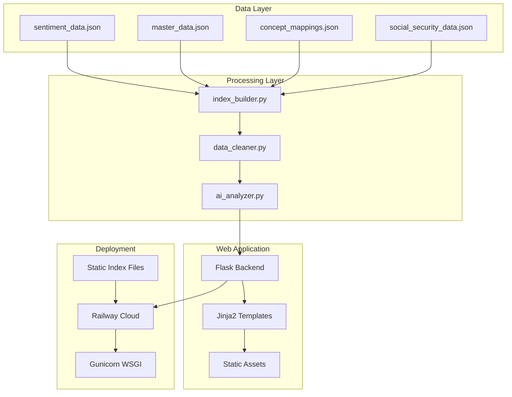
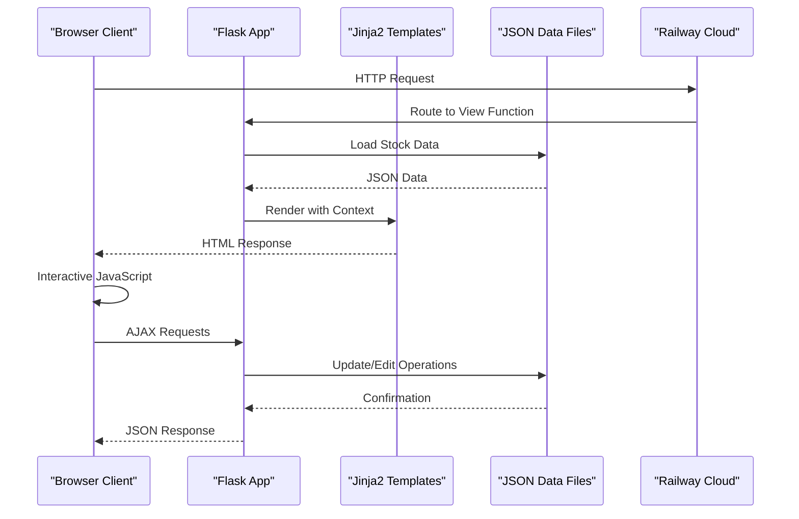
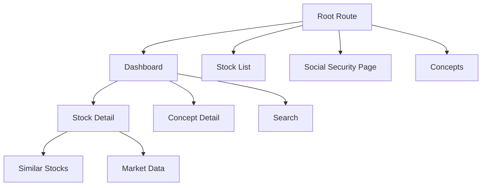
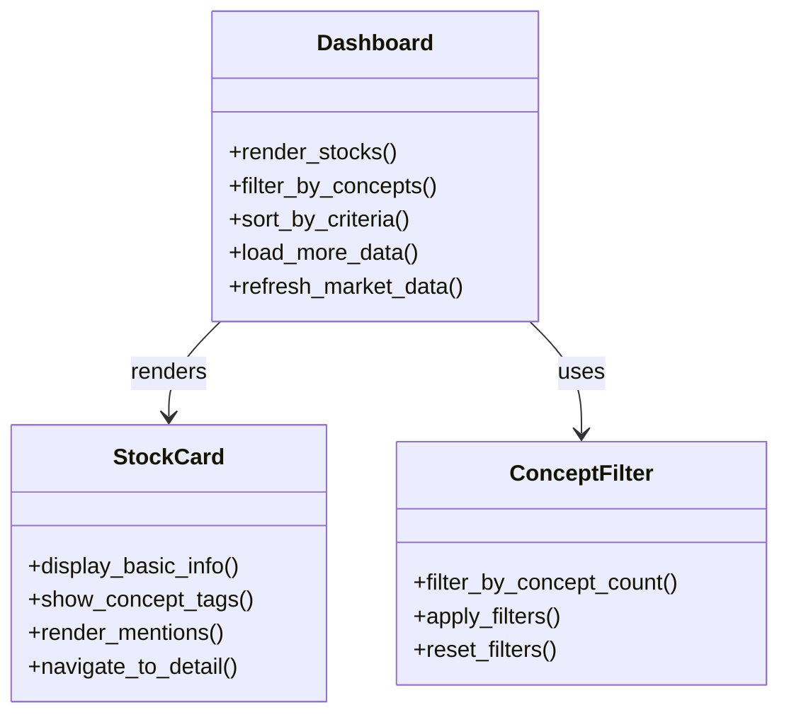
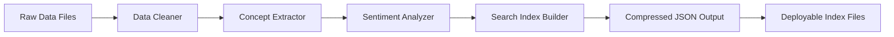
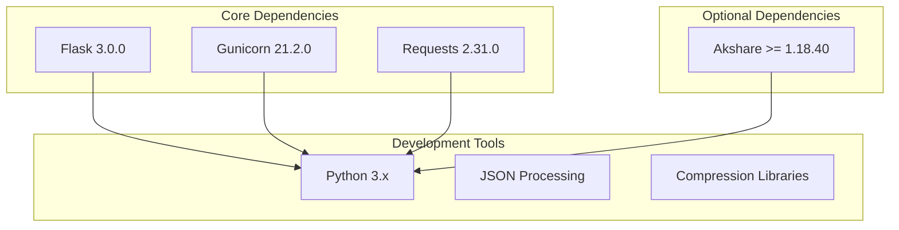

# Project Overview

<cite>
**Referenced Files in This Document**
- [README.md](file://README.md)
- [main.py](file://main.py)
- [requirements.txt](file://requirements.txt)
- [Procfile](file://Procfile)
- [.railway.json](file://.railway.json)
- [templates/dashboard.html](file://templates/dashboard.html)
- [templates/stock_detail.html](file://templates/stock_detail.html)
- [data/master/social_security_2025q4.json](file://data/master/social_security_2025q4.json)
- [data/sentiment/company_mentions.json.backup](file://data/sentiment/company_mentions.json.backup)
- [build_index.py](file://build_index.py)
- [merge_email_data.py](file://merge_email_data.py)
- [fix_all.py](file://fix_all.py)
</cite>

## Table of Contents
1. [Introduction](#introduction)
2. [Project Structure](#project-structure)
3. [Core Components](#core-components)
4. [Architecture Overview](#architecture-overview)
5. [Detailed Component Analysis](#detailed-component-analysis)
6. [Dependency Analysis](#dependency-analysis)
7. [Performance Considerations](#performance-considerations)
8. [Troubleshooting Guide](#troubleshooting-guide)
9. [Conclusion](#conclusion)

## Introduction

The Stock Research Platform is an AI-driven individual stock research database specifically designed for the Chinese A-share market. This platform serves as a comprehensive research hub that aggregates deep analysis, investment insights, and real-time market intelligence for individual equities, enabling investors, analysts, and researchers to make informed decisions in China's dynamic stock market environment.

The platform's core mission is to transform fragmented market information into actionable intelligence through systematic organization, AI-powered analysis, and community-driven enhancements. By focusing on Chinese A-share stocks, the platform addresses the unique characteristics, regulations, and market dynamics that distinguish this market from international equivalents.

## Project Structure

The Stock Research Platform follows a modular architecture that separates concerns between data processing, web presentation, and community collaboration:

**Diagram sources**
- [main.py:1-1206](file://main.py#L1-L1206)
- [build_index.py:1-271](file://build_index.py#L1-L271)

The platform organizes its codebase into distinct functional areas:

- **Data Management**: Handles sentiment analysis, master data storage, and concept mapping
- **Web Interface**: Provides interactive dashboards and research tools
- **Community Features**: Enables collaborative editing and knowledge sharing
- **Deployment Infrastructure**: Built for cloud-native deployment and scaling

**Section sources**
- [main.py:93-136](file://main.py#L93-L136)
- [build_index.py:77-127](file://build_index.py#L77-L127)

## Core Components

### AI-Powered Research Engine

The platform's AI research engine processes and synthesizes information from multiple sources to generate comprehensive stock profiles. It employs advanced natural language processing techniques to extract meaningful insights from research reports, news articles, and analyst communications.

Key AI capabilities include:
- **Concept Extraction**: Identifies and categorizes industry concepts and themes
- **Sentiment Analysis**: Processes market sentiment from various sources
- **Insight Generation**: Creates structured investment insights from unstructured data
- **Similarity Matching**: Finds stocks with similar characteristics and market positioning

### Community-Driven Enhancement System

The platform implements a sophisticated community collaboration system that allows researchers to contribute, validate, and enhance stock research data. This crowdsourced approach ensures continuous improvement and diverse perspectives on market analysis.

**Section sources**
- [main.py:37-71](file://main.py#L37-L71)
- [main.py:431-479](file://main.py#L431-L479)

## Architecture Overview

The Stock Research Platform employs a modern cloud-native architecture that combines traditional web technologies with contemporary deployment practices:

**Diagram sources**
- [main.py:138-210](file://main.py#L138-L210)
- [Procfile:1-2](file://Procfile#L1-L2)

The architecture emphasizes scalability, maintainability, and rapid deployment through cloud infrastructure. The Flask backend serves as the primary application server, while Jinja2 templates handle server-side rendering for optimal SEO and performance.

**Section sources**
- [main.py:20-20](file://main.py#L20-L20)
- [.railway.json:1-15](file://.railway.json#L1-L15)

## Detailed Component Analysis

### Flask Web Application

The core Flask application provides comprehensive functionality for stock research and analysis:

#### Routing and Controllers
The application implements a RESTful routing structure that handles various user interactions:

**Diagram sources**
- [main.py:138-430](file://main.py#L138-L430)

#### Data Loading and Processing
The application efficiently manages large datasets through intelligent caching and lazy loading mechanisms:

- **Search Index**: Pre-built compressed JSON index for fast query performance
- **Concept Mapping**: Hierarchical organization of stock concepts and categories
- **Industry Classification**: Integration with multiple industry classification systems

#### API Endpoints
The platform exposes comprehensive APIs for programmatic access:

- **Stock Information**: Complete stock profiles with research data
- **Market Data**: Real-time pricing and market metrics
- **Similarity Analysis**: Concept-based stock recommendation system
- **Community Features**: Editing, synchronization, and collaboration tools

**Section sources**
- [main.py:280-336](file://main.py#L280-L336)
- [main.py:687-769](file://main.py#L687-L769)

### Frontend Architecture

The frontend implementation utilizes modern web standards with a focus on performance and user experience:

#### Dashboard Interface
The main dashboard provides an overview of the entire stock universe with advanced filtering and sorting capabilities:

**Diagram sources**
- [templates/dashboard.html:549-663](file://templates/dashboard.html#L549-L663)

#### Stock Detail Pages
Individual stock pages present comprehensive research data with interactive elements:

- **Company Profile**: Core business, industry position, and strategic information
- **Research Timeline**: Chronological display of research articles and insights
- **Interactive Analysis**: Concept-based similarity matching and market comparisons
- **Community Contributions**: Collaborative editing and enhancement features

**Section sources**
- [templates/stock_detail.html:124-782](file://templates/stock_detail.html#L124-L782)

### Data Management System

The platform implements a sophisticated data management system that handles multiple data sources and formats:

#### Data Sources Integration
The system processes information from various sources including:

- **Sentiment Analysis**: Social media mentions, news articles, and research reports
- **Financial Data**: Market prices, trading volumes, and fundamental metrics
- **Concept Mapping**: Industry classifications and thematic categorization
- **Community Contributions**: User-generated research and insights

#### Index Building Pipeline
The automated indexing system transforms raw data into optimized search-ready formats:

**Diagram sources**
- [build_index.py:77-234](file://build_index.py#L77-L234)

**Section sources**
- [build_index.py:16-56](file://build_index.py#L16-L56)
- [build_index.py:57-76](file://build_index.py#L57-L76)

## Dependency Analysis

The platform maintains minimal external dependencies to ensure reliability and portability:

**Diagram sources**
- [requirements.txt:1-5](file://requirements.txt#L1-L5)

The dependency structure prioritizes stability and performance, with Flask providing the web framework foundation and Gunicorn handling production WSGI server requirements.

**Section sources**
- [requirements.txt:1-5](file://requirements.txt#L1-L5)

## Performance Considerations

The platform implements several optimization strategies for efficient operation:

### Data Loading Optimization
- **Lazy Loading**: Stock data loaded only when needed
- **Pagination**: Large datasets divided into manageable chunks
- **Caching**: Compressed search indices for rapid access
- **Memory Management**: Efficient data structures for large datasets

### Network Performance
- **Static Asset Delivery**: Optimized CSS and JavaScript delivery
- **CDN Integration**: Leverage cloud provider CDN for global distribution
- **Connection Pooling**: Efficient database and API connections
- **Compression**: Automatic compression of JSON responses

### Scalability Features
- **Horizontal Scaling**: Stateless design enables easy scaling
- **Load Balancing**: Cloud-native load balancing support
- **Database Optimization**: Efficient query patterns and indexing
- **Resource Monitoring**: Built-in performance monitoring capabilities

## Troubleshooting Guide

### Common Deployment Issues

**Railway Deployment Problems**
- Verify environment variables are properly configured
- Check application logs for startup errors
- Ensure proper file permissions for data directories
- Monitor health check endpoint availability

**Data Loading Failures**
- Validate JSON file integrity and encoding
- Check file paths and directory structure
- Verify gzip compression compatibility
- Confirm concept mapping completeness

### Runtime Issues

**Application Crashes**
- Review Flask error logs for unhandled exceptions
- Check memory usage during data processing
- Validate API endpoint responses
- Monitor external service dependencies

**Performance Degradation**
- Analyze query performance and optimize slow operations
- Check database connection limits
- Monitor memory consumption patterns
- Validate cache effectiveness

**Section sources**
- [README.md:15-126](file://README.md#L15-L126)

## Conclusion

The Stock Research Platform represents a comprehensive solution for Chinese A-share market analysis, combining cutting-edge AI technologies with community-driven research methodologies. The platform's architecture balances performance, scalability, and maintainability while providing powerful tools for investors, analysts, and researchers.

Key strengths include:
- **AI-Enhanced Analysis**: Advanced natural language processing for insight extraction
- **Community Collaboration**: Crowdsourced research enhancement and validation
- **Cloud-Native Design**: Scalable deployment architecture with automatic scaling
- **Comprehensive Coverage**: Multi-dimensional stock analysis from basic to advanced metrics
- **Real-Time Integration**: Live market data and sentiment analysis

The platform's modular design ensures future extensibility while maintaining operational simplicity. As the Chinese A-share market continues to evolve, the platform provides a robust foundation for adapting to new data sources, analytical techniques, and market conditions.