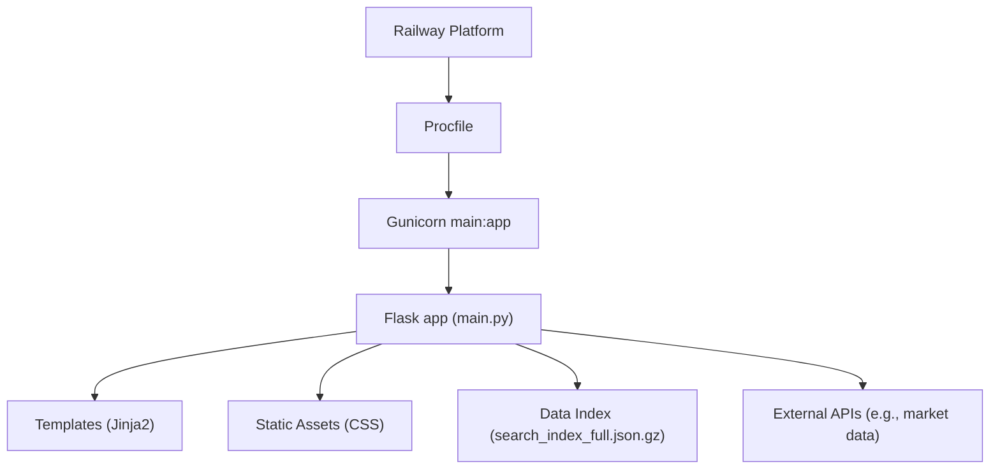
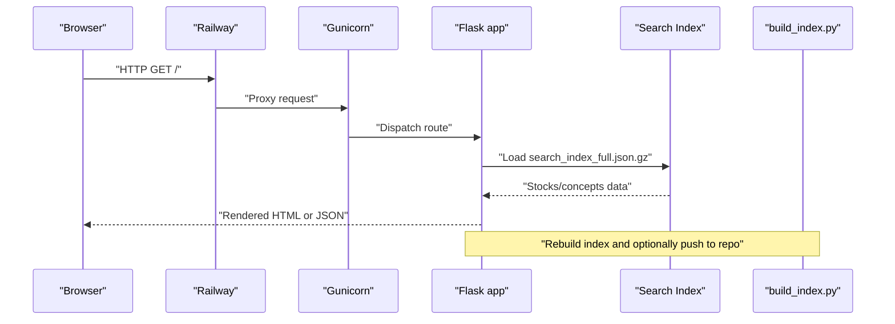
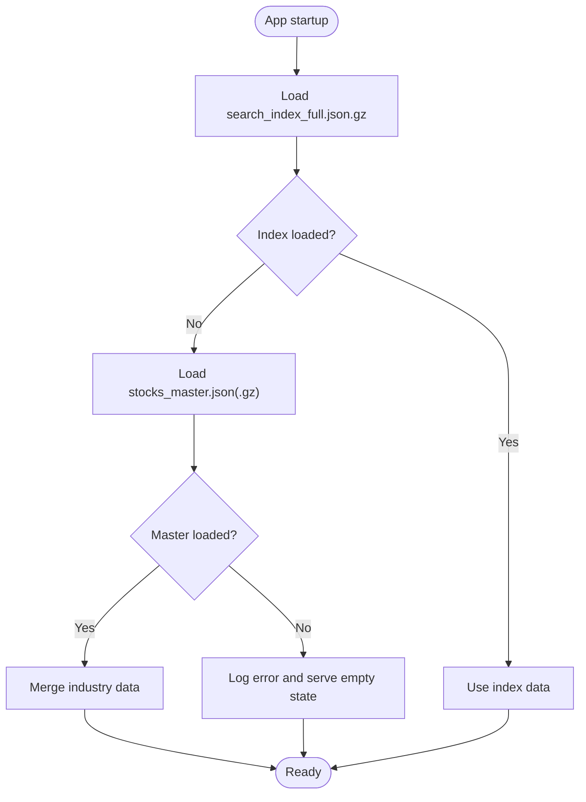
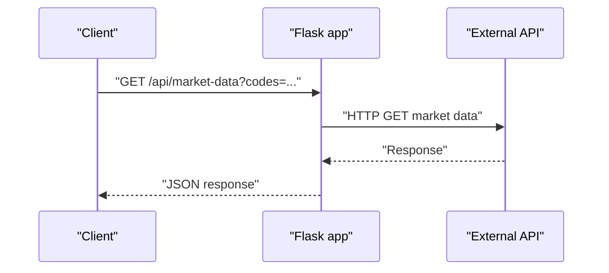
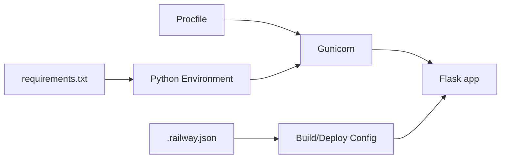

# Troubleshooting

<cite>
**Referenced Files in This Document**
- [README.md](file://README.md)
- [DEPLOYMENT_ISSUE.md](file://DEPLOYMENT_ISSUE.md)
- [DEPLOY_DIAGNOSIS.md](file://DEPLOY_DIAGNOSIS.md)
- [RAILWAY_CACHE_DEBUG.md](file://RAILWAY_CACHE_DEBUG.md)
- [.railway.json](file://.railway.json)
- [Procfile](file://Procfile)
- [requirements.txt](file://requirements.txt)
- [main.py](file://main.py)
- [build_index.py](file://build_index.py)
- [templates/concepts.html](file://templates/concepts.html)
- [templates/search.html](file://templates/search.html)
- [templates/dashboard.html](file://templates/dashboard.html)
- [static/css/cyber-theme.css](file://static/css/cyber-theme.css)
- [static/css/stock-card.css](file://static/css/stock-card.css)
</cite>

## Table of Contents
1. [Introduction](#introduction)
2. [Project Structure](#project-structure)
3. [Core Components](#core-components)
4. [Architecture Overview](#architecture-overview)
5. [Detailed Component Analysis](#detailed-component-analysis)
6. [Dependency Analysis](#dependency-analysis)
7. [Performance Considerations](#performance-considerations)
8. [Troubleshooting Guide](#troubleshooting-guide)
9. [Conclusion](#conclusion)
10. [Appendices](#appendices)

## Introduction
This document provides comprehensive troubleshooting guidance for the Stock Research Platform deployed on Railway. It covers deployment issues (Railway configuration, dependency conflicts, environment setup), systematic diagnostics for data loading, API endpoint failures, and performance bottlenecks, plus solutions for template rendering and static asset problems, database connectivity challenges, error diagnosis, log analysis, debugging strategies, emergency procedures, and performance optimization.

## Project Structure
The platform is a Flask web application packaged for Railway with:
- Application entrypoint and routes in main.py
- Search index generation script in build_index.py
- Templates for pages (dashboard, concepts, search)
- Static CSS assets for themes and components
- Deployment configuration via .railway.json and Procfile
- Python dependencies in requirements.txt

**Diagram sources**
- [Procfile:1-2](file://Procfile#L1-L2)
- [main.py:1222-1226](file://main.py#L1222-L1226)
- [build_index.py:1-271](file://build_index.py#L1-L271)

**Section sources**
- [README.md:1-126](file://README.md#L1-L126)
- [Procfile:1-2](file://Procfile#L1-L2)
- [requirements.txt:1-5](file://requirements.txt#L1-L5)

## Core Components
- Flask application with routes for dashboard, stock detail, concepts, search, and API endpoints
- Data loading pipeline from compressed JSON and sentiment index
- Search index builder that merges sentiment mentions and builds a gzipped index
- Template-driven UI with Jinja2 and shared CSS themes
- External market data integration via HTTP requests

Key implementation references:
- Routes and endpoints: [main.py:138-495](file://main.py#L138-L495)
- Data loading and fallback logic: [main.py:94-136](file://main.py#L94-L136)
- Search index generation: [build_index.py:77-234](file://build_index.py#L77-L234)
- Template pages: [templates/concepts.html:515-523](file://templates/concepts.html#L515-L523), [templates/search.html:1-139](file://templates/search.html#L1-L139), [templates/dashboard.html:536-547](file://templates/dashboard.html#L536-L547)
- Static assets: [static/css/cyber-theme.css:1-258](file://static/css/cyber-theme.css#L1-L258), [static/css/stock-card.css:1-536](file://static/css/stock-card.css#L1-L536)

**Section sources**
- [main.py:94-136](file://main.py#L94-L136)
- [build_index.py:77-234](file://build_index.py#L77-L234)
- [templates/concepts.html:515-523](file://templates/concepts.html#L515-L523)
- [templates/search.html:1-139](file://templates/search.html#L1-L139)
- [templates/dashboard.html:536-547](file://templates/dashboard.html#L536-L547)
- [static/css/cyber-theme.css:1-258](file://static/css/cyber-theme.css#L1-L258)
- [static/css/stock-card.css:1-536](file://static/css/stock-card.css#L1-L536)

## Architecture Overview
Railway runs the Flask app via Gunicorn using the Procfile. The app loads a prebuilt search index and serves rendered templates and JSON APIs. The index is rebuilt by build_index.py and optionally pushed back to the repository for deployment.

**Diagram sources**
- [Procfile:1-2](file://Procfile#L1-L2)
- [main.py:138-495](file://main.py#L138-L495)
- [build_index.py:236-267](file://build_index.py#L236-L267)

## Detailed Component Analysis

### Data Loading Pipeline
Common issues:
- Missing or outdated search index
- Incorrect fallback to compressed/uncompressed master file
- Index rebuild failures or missing pushes

Diagnostic steps:
- Verify presence and size of search index file
- Confirm index rebuild completes without errors
- Check fallback logic for master file selection

**Diagram sources**
- [main.py:94-136](file://main.py#L94-L136)

**Section sources**
- [main.py:94-136](file://main.py#L94-L136)
- [build_index.py:77-130](file://build_index.py#L77-L130)

### API Endpoints
Endpoints commonly impacted by deployment issues:
- GET /api/stock/<code>: Returns stock details
- GET /api/search/suggest: Returns suggestions
- GET /api/market-data: Returns market data
- POST /api/stock/<code>/edit: Edits stock fields
- GET /api/sync, /api/sync/export, /api/sync/clear: Edit sync operations

Diagnostics:
- Validate endpoint reachability and response shape
- Inspect error logs for JSON serialization and external API failures
- Confirm index availability for search suggestions

**Diagram sources**
- [main.py:696-768](file://main.py#L696-L768)

**Section sources**
- [main.py:480-504](file://main.py#L480-L504)
- [main.py:696-768](file://main.py#L696-L768)

### Template Rendering and Static Assets
Issues:
- Missing or outdated static CSS
- Template not rendering navigation links
- Frontend not reflecting recent updates

Diagnostics:
- Verify static CSS paths resolve
- Confirm template blocks for navigation/buttons are present
- Clear browser cache and hard reload

**Section sources**
- [templates/concepts.html:515-523](file://templates/concepts.html#L515-L523)
- [templates/search.html:1-139](file://templates/search.html#L1-L139)
- [templates/dashboard.html:536-547](file://templates/dashboard.html#L536-L547)
- [static/css/cyber-theme.css:1-258](file://static/css/cyber-theme.css#L1-L258)
- [static/css/stock-card.css:1-536](file://static/css/stock-card.css#L1-L536)

### Search Index Rebuild
Issues:
- Index not rebuilt after data changes
- Push to repository fails silently
- Outdated index served after rebuild

Diagnostics:
- Run build_index.py locally and inspect output
- Check git push completion and Railway auto-deploy timing
- Validate index file size and presence

**Section sources**
- [build_index.py:236-267](file://build_index.py#L236-L267)
- [build_index.py:77-130](file://build_index.py#L77-L130)

## Dependency Analysis
Railway deployment relies on:
- Python runtime and packages defined in requirements.txt
- Gunicorn as WSGI server per Procfile
- Railway configuration in .railway.json controlling build and deploy behavior

**Diagram sources**
- [requirements.txt:1-5](file://requirements.txt#L1-L5)
- [Procfile:1-2](file://Procfile#L1-L2)
- [.railway.json:1-15](file://.railway.json#L1-L15)

**Section sources**
- [requirements.txt:1-5](file://requirements.txt#L1-L5)
- [Procfile:1-2](file://Procfile#L1-L2)
- [.railway.json:1-15](file://.railway.json#L1-L15)

## Performance Considerations
- Reduce payload sizes by serving gzipped JSON and limiting returned fields
- Minimize external API calls and cache responses where appropriate
- Optimize template rendering by avoiding heavy loops and excessive DOM
- Monitor Railway resource usage and consider scaling tiers if needed

[No sources needed since this section provides general guidance]

## Troubleshooting Guide

### Deployment Issues (Railway Configuration)
Symptoms:
- Delayed deployment or stale content
- Frontend not reflecting updates
- Old data served despite new commits

Root causes and fixes:
- Railway cache issues causing stale files
  - Disable build cache temporarily in .railway.json
  - Trigger rebuild or recreate project if cache corruption persists
- Auto-deploy delays
  - Wait for Railway queue or manually restart deployment
  - Force redeploy with an empty commit

Validation checklist:
- Confirm Railway shows Running status
- Test API endpoints for updated data counts
- Verify frontend navigation and search button presence

**Section sources**
- [DEPLOY_DIAGNOSIS.md:31-61](file://DEPLOY_DIAGNOSIS.md#L31-L61)
- [DEPLOYMENT_ISSUE.md:58-90](file://DEPLOYMENT_ISSUE.md#L58-L90)
- [RAILWAY_CACHE_DEBUG.md:17-54](file://RAILWAY_CACHE_DEBUG.md#L17-L54)
- [.railway.json:3-13](file://.railway.json#L3-L13)

### Dependency Conflicts
Symptoms:
- ImportError at runtime
- Version mismatch errors during build

Remediation:
- Pin compatible versions in requirements.txt
- Ensure dependencies are installed in Railway’s Nixpacks build environment
- Rebuild after updating requirements.txt

**Section sources**
- [requirements.txt:1-5](file://requirements.txt#L1-L5)
- [.railway.json:3-6](file://.railway.json#L3-L6)

### Environment Setup Errors
Symptoms:
- App fails to start or bind to PORT
- Health checks fail

Remediation:
- Confirm Procfile command matches application entrypoint
- Ensure PORT environment variable is used for binding
- Validate healthcheck path in .railway.json

**Section sources**
- [Procfile:1-2](file://Procfile#L1-L2)
- [main.py:1222-1226](file://main.py#L1222-L1226)
- [.railway.json:11-13](file://.railway.json#L11-L13)

### Data Loading Problems
Symptoms:
- Empty or partial stock lists
- API returns errors for missing data

Diagnostics:
- Check presence of search_index_full.json.gz
- Verify fallback to stocks_master.json(.gz)
- Confirm index rebuild succeeded and files are present

Actions:
- Re-run build_index.py
- Validate file sizes and timestamps
- Rebuild and push index if needed

**Section sources**
- [main.py:94-136](file://main.py#L94-L136)
- [build_index.py:236-267](file://build_index.py#L236-L267)

### API Endpoint Failures
Symptoms:
- 500 errors on stock or market data endpoints
- Empty suggestion lists

Diagnostics:
- Inspect server logs for exceptions
- Validate external API responses and timeouts
- Check JSON serialization and field access

Actions:
- Add structured logging around external calls
- Implement retry/backoff for transient failures
- Validate request parameters and defaults

**Section sources**
- [main.py:480-504](file://main.py#L480-L504)
- [main.py:696-768](file://main.py#L696-L768)

### Performance Bottlenecks
Symptoms:
- Slow page loads
- High latency on market data calls

Diagnostics:
- Profile request durations
- Measure index load and template rendering times
- Monitor external API latencies

Actions:
- Enable compression and caching
- Paginate large datasets
- Cache frequently accessed data

**Section sources**
- [main.py:138-210](file://main.py#L138-L210)
- [main.py:696-768](file://main.py#L696-L768)

### Template Rendering and Static Asset Problems
Symptoms:
- Missing navigation buttons
- Broken layout or styles
- Stale CSS after updates

Diagnostics:
- Verify static CSS paths in templates
- Check for missing template blocks
- Hard reload browser and clear cache

Actions:
- Ensure static files are served correctly
- Confirm template inheritance and blocks
- Update CSS and rebuild assets if needed

**Section sources**
- [templates/concepts.html:515-523](file://templates/concepts.html#L515-L523)
- [templates/search.html:1-139](file://templates/search.html#L1-L139)
- [templates/dashboard.html:536-547](file://templates/dashboard.html#L536-L547)
- [static/css/cyber-theme.css:1-258](file://static/css/cyber-theme.css#L1-L258)
- [static/css/stock-card.css:1-536](file://static/css/stock-card.css#L1-L536)

### Database Connectivity Challenges
Notes:
- The platform uses local JSON files and does not require a relational database
- If integrating a database later, ensure connection strings and credentials are configured in Railway variables

[No sources needed since this section provides general guidance]

### Error Diagnosis Techniques and Log Analysis
Techniques:
- Use Railway Dashboard logs to correlate request IDs with stack traces
- Add structured logging around data loads and external API calls
- Capture request parameters and response codes for failed endpoints

Debugging strategies:
- Reproduce issues locally with identical data files
- Temporarily disable external integrations to isolate issues
- Validate JSON schemas and required fields

**Section sources**
- [main.py:94-136](file://main.py#L94-L136)
- [main.py:696-768](file://main.py#L696-L768)

### Emergency Procedures and Recovery Protocols
Procedures:
- Immediate redeploy using Railway console
- Force redeploy with empty commit
- Recreate project if Railway cache corruption persists

Recovery steps:
- Delete and recreate the Railway project
- Reconnect repository and redeploy
- Validate logs show correct data counts and no cache errors

**Section sources**
- [DEPLOYMENT_ISSUE.md:77-88](file://DEPLOYMENT_ISSUE.md#L77-L88)
- [RAILWAY_CACHE_DEBUG.md:32-54](file://RAILWAY_CACHE_DEBUG.md#L32-L54)

### Performance Optimization Tips, Memory Management, and Scalability
Tips:
- Prefer streaming responses for large datasets
- Cache index reads and avoid repeated decompression
- Use pagination and lazy loading for large lists
- Scale Railway resources if CPU/memory limits are hit

[No sources needed since this section provides general guidance]

## Conclusion
This guide consolidates deployment, data, API, and performance troubleshooting for the Stock Research Platform on Railway. By following the diagnostic procedures, applying the recommended fixes, and adopting the performance and emergency strategies outlined here, you can maintain a reliable and responsive platform.

## Appendices

### Quick Checklist for Common Issues
- Data not updated
  - Rebuild and push index
  - Verify Railway shows Running
- Frontend not reflecting changes
  - Hard reload and clear cache
  - Confirm template blocks exist
- API failing
  - Check logs for exceptions
  - Validate external API responses
- Deployment stuck
  - Restart deployment or force redeploy
  - Recreate project if cache issues persist

[No sources needed since this section provides general guidance]