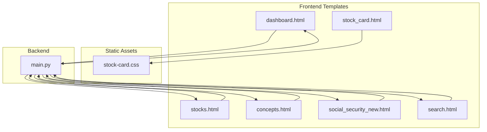
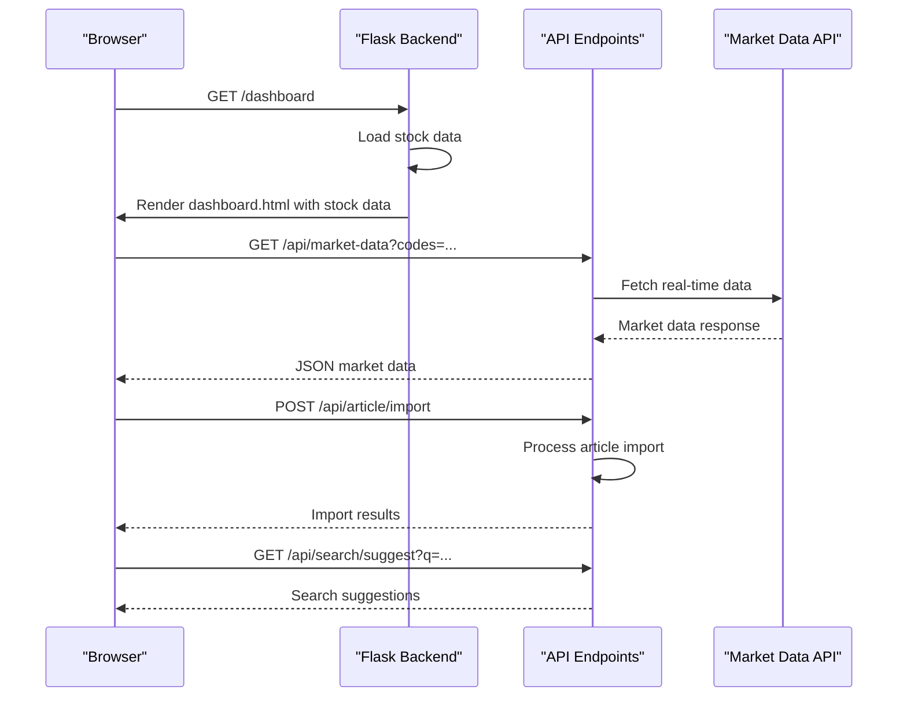
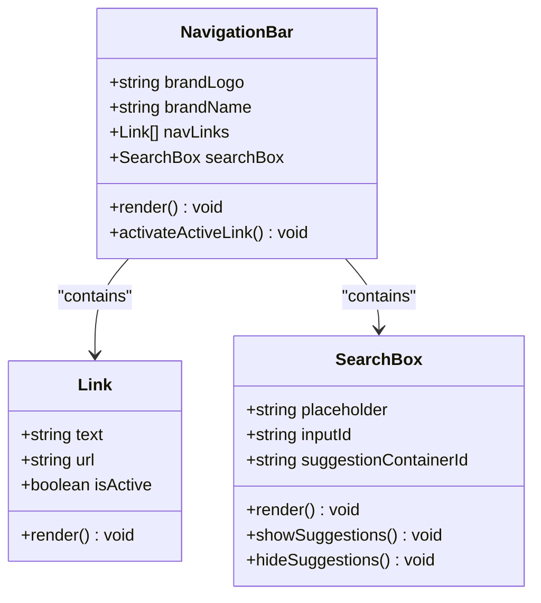
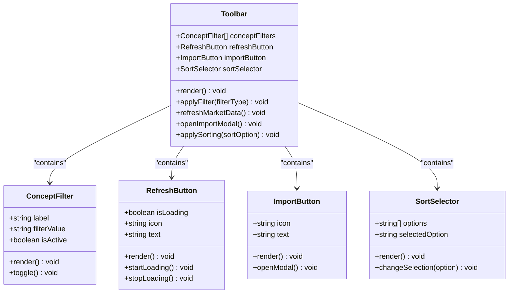
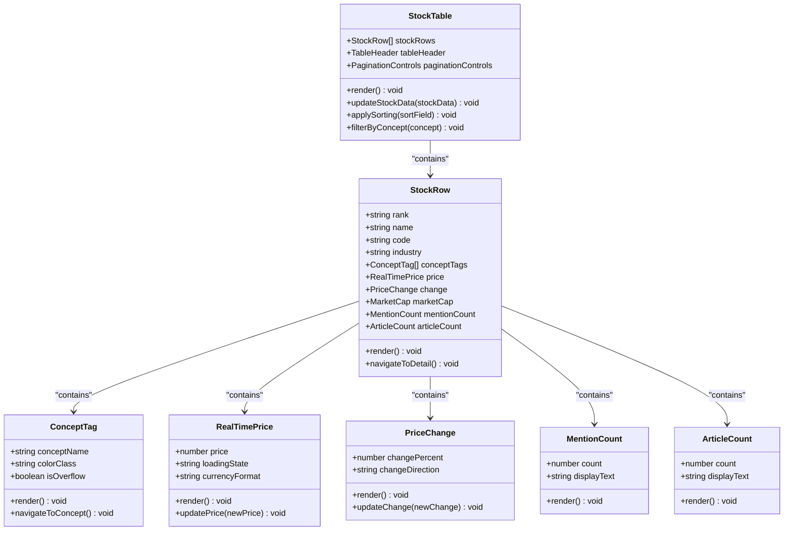
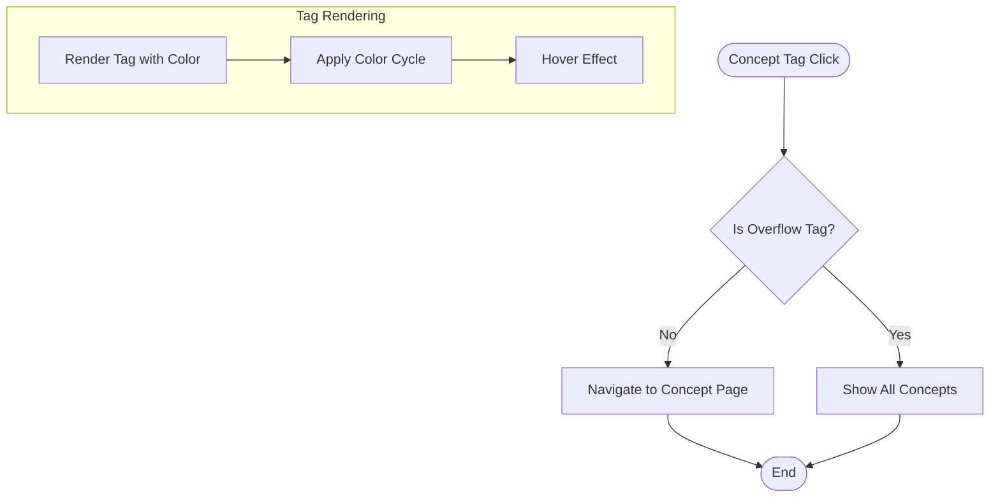
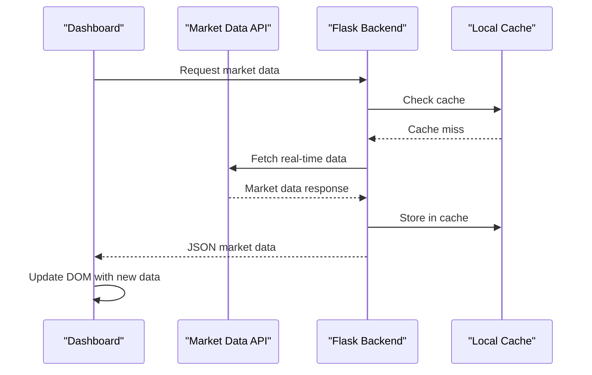
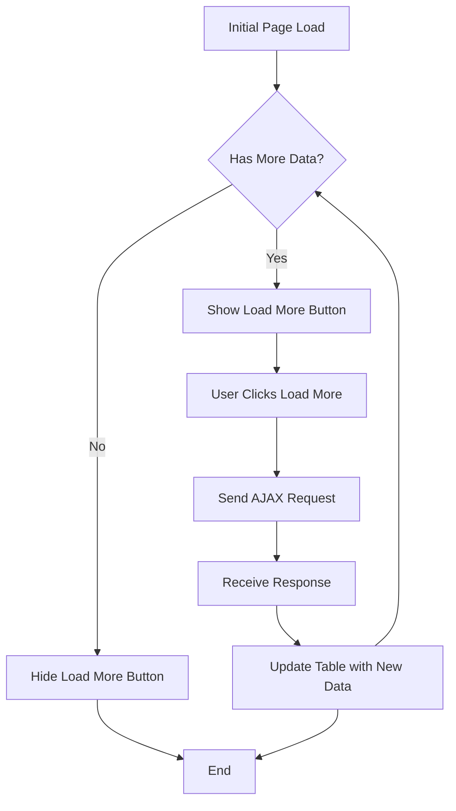
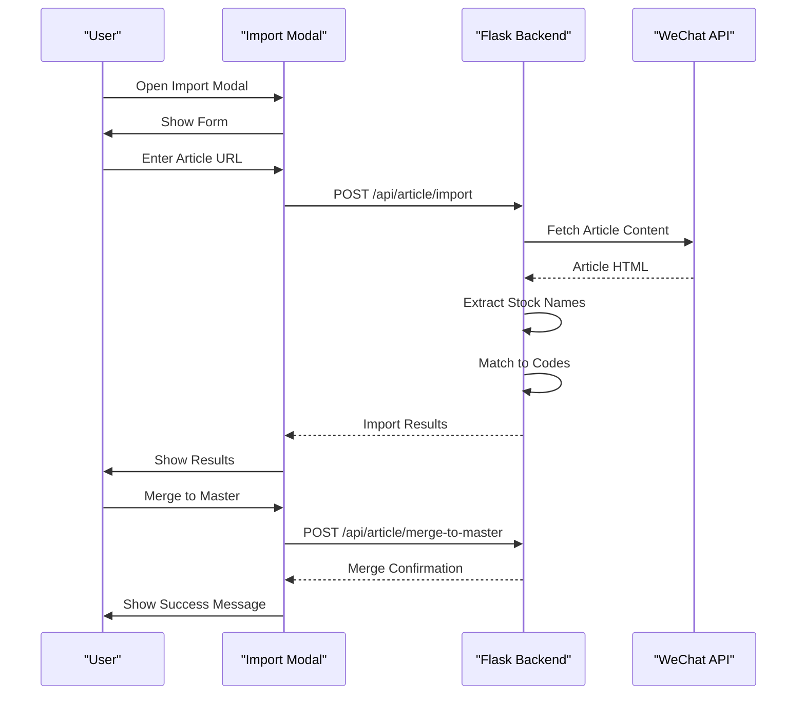
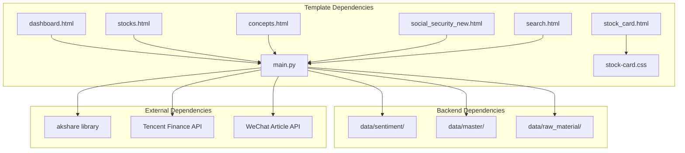

# Dashboard Components

<cite>
**Referenced Files in This Document**
- [dashboard.html](file://templates/dashboard.html)
- [stock_card.html](file://templates/components/stock_card.html)
- [stock-card.css](file://static/css/stock-card.css)
- [main.py](file://main.py)
- [stocks.html](file://templates/stocks.html)
- [concepts.html](file://templates/concepts.html)
- [social_security_new.html](file://templates/social_security_new.html)
- [search.html](file://templates/search.html)
</cite>

## Table of Contents
1. [Introduction](#introduction)
2. [Project Structure](#project-structure)
3. [Core Components](#core-components)
4. [Architecture Overview](#architecture-overview)
5. [Detailed Component Analysis](#detailed-component-analysis)
6. [Dependency Analysis](#dependency-analysis)
7. [Performance Considerations](#performance-considerations)
8. [Troubleshooting Guide](#troubleshooting-guide)
9. [Conclusion](#conclusion)

## Introduction
This document provides comprehensive documentation for the Stock Research Platform dashboard components. It covers the main dashboard interface including the navigation bar with logo, menu links, and search functionality. It documents the toolbar system with concept filters, refresh buttons for market data, import modal for article uploads, and sorting controls. It explains the stock listing table with columns for rankings, stock names and codes, industry information, concept tags, real-time prices, price changes, market capitalization, mention counts, and article counts. It also covers the pagination system with load more functionality and responsive design considerations, the concept tag system with color-coded badges and click-to-filter functionality, and the real-time market data integration, loading states, and user interaction patterns.

## Project Structure
The dashboard is built using a Flask backend with Jinja2 templates for the frontend. The main dashboard page is rendered from a Jinja2 template and integrates with the backend API endpoints for market data, article import, and search suggestions.

**Diagram sources**
- [dashboard.html](file://templates/dashboard.html)
- [main.py](file://main.py)
- [stock-card.css](file://static/css/stock-card.css)

**Section sources**
- [dashboard.html](file://templates/dashboard.html)
- [main.py](file://main.py)

## Core Components
The dashboard consists of several key components that work together to provide a comprehensive stock research interface:

### Navigation Bar
The navigation bar provides quick access to different sections of the platform with brand identity and search functionality.

### Toolbar System
The toolbar contains concept filtering controls, market data refresh functionality, article import capabilities, and sorting options.

### Stock Listing Table
The main data display area showing stock information with real-time market data integration.

### Pagination System
Support for loading additional stock data with a "Load More" button.

### Concept Tag System
Color-coded concept tags with click-to-filter functionality.

### Real-time Market Data Integration
Integration with external market data APIs for live stock information.

**Section sources**
- [dashboard.html](file://templates/dashboard.html)
- [main.py](file://main.py)

## Architecture Overview
The dashboard follows a client-server architecture pattern with Flask serving as the backend and Jinja2 templates rendering the frontend.

**Diagram sources**
- [main.py](file://main.py)
- [dashboard.html](file://templates/dashboard.html)

## Detailed Component Analysis

### Navigation Bar Component
The navigation bar provides consistent branding and navigation across all pages.

**Diagram sources**
- [dashboard.html](file://templates/dashboard.html)

Key features:
- Brand identity with custom SVG logo
- Active link highlighting
- Responsive design with mobile-friendly layout
- Integrated search functionality with suggestions

**Section sources**
- [dashboard.html](file://templates/dashboard.html)

### Toolbar System Component
The toolbar provides filtering, refresh, import, and sorting capabilities.

**Diagram sources**
- [dashboard.html](file://templates/dashboard.html)

**Section sources**
- [dashboard.html](file://templates/dashboard.html)

### Stock Listing Table Component
The table displays comprehensive stock information with real-time market data integration.

**Diagram sources**
- [dashboard.html](file://templates/dashboard.html)

**Section sources**
- [dashboard.html](file://templates/dashboard.html)

### Concept Tag System
The concept tag system provides visual categorization and filtering capabilities.

**Diagram sources**
- [dashboard.html](file://templates/dashboard.html)

**Section sources**
- [dashboard.html](file://templates/dashboard.html)

### Real-time Market Data Integration
The system integrates with external market data APIs for live stock information.

**Diagram sources**
- [main.py](file://main.py)

**Section sources**
- [main.py](file://main.py)

### Pagination System
The pagination system supports loading additional stock data with a "Load More" button.

**Diagram sources**
- [dashboard.html](file://templates/dashboard.html)
- [main.py](file://main.py)

**Section sources**
- [dashboard.html](file://templates/dashboard.html)
- [main.py](file://main.py)

### Import Article Modal
The import modal allows users to import WeChat articles and extract stock mentions.

**Diagram sources**
- [dashboard.html](file://templates/dashboard.html)
- [main.py](file://main.py)

**Section sources**
- [dashboard.html](file://templates/dashboard.html)
- [main.py](file://main.py)

## Dependency Analysis
The dashboard components have the following dependencies and relationships:

**Diagram sources**
- [main.py](file://main.py)
- [dashboard.html](file://templates/dashboard.html)

**Section sources**
- [main.py](file://main.py)

## Performance Considerations
The dashboard implements several performance optimizations:

### Data Loading Strategies
- Lazy loading of market data through AJAX requests
- Pagination to limit initial data transfer
- Local caching of market data to reduce API calls
- Efficient search indexing for fast lookups

### Frontend Optimizations
- CSS animations for smooth transitions
- Minimal JavaScript for interactive elements
- Responsive design to optimize for different screen sizes
- Efficient DOM updates for real-time data

### Backend Efficiency
- Data filtering and sorting on the server side
- Gzip compression for large JSON files
- Caching of frequently accessed data
- Asynchronous processing for heavy operations

## Troubleshooting Guide
Common issues and their solutions:

### Market Data Not Loading
- Verify internet connectivity
- Check API endpoint availability
- Review browser console for CORS errors
- Confirm API key and rate limiting

### Search Functionality Issues
- Ensure search index is properly loaded
- Check database connectivity
- Verify search query formatting
- Review server logs for errors

### Pagination Problems
- Check offset and limit parameters
- Verify database query performance
- Monitor memory usage for large datasets
- Review pagination logic

### Import Modal Failures
- Verify WeChat article URL format
- Check network connectivity
- Review error messages in modal
- Confirm file permissions for raw material storage

**Section sources**
- [main.py](file://main.py)
- [dashboard.html](file://templates/dashboard.html)

## Conclusion
The Stock Research Platform dashboard provides a comprehensive interface for stock research with real-time market data integration, advanced filtering capabilities, and efficient data management. The modular architecture allows for easy maintenance and extension while the responsive design ensures accessibility across different devices. The combination of server-side data processing and client-side interactivity creates a smooth user experience for financial research and analysis.