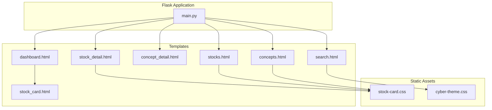
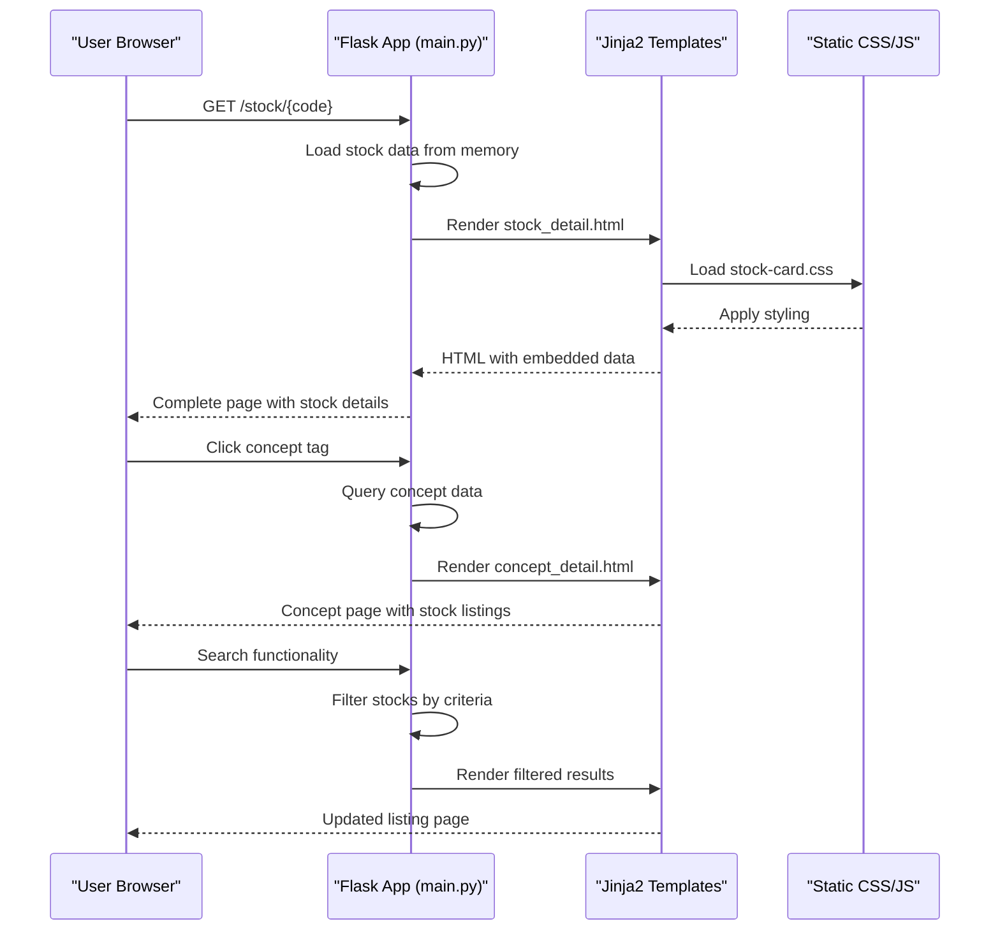
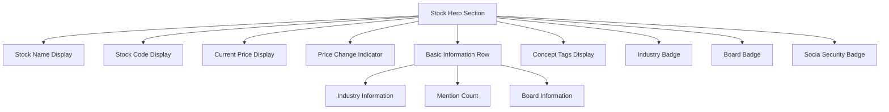
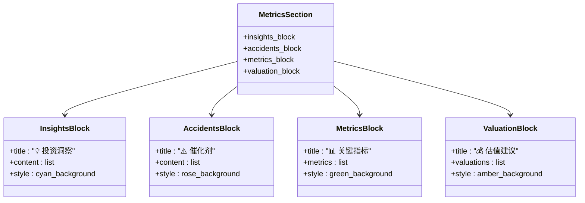
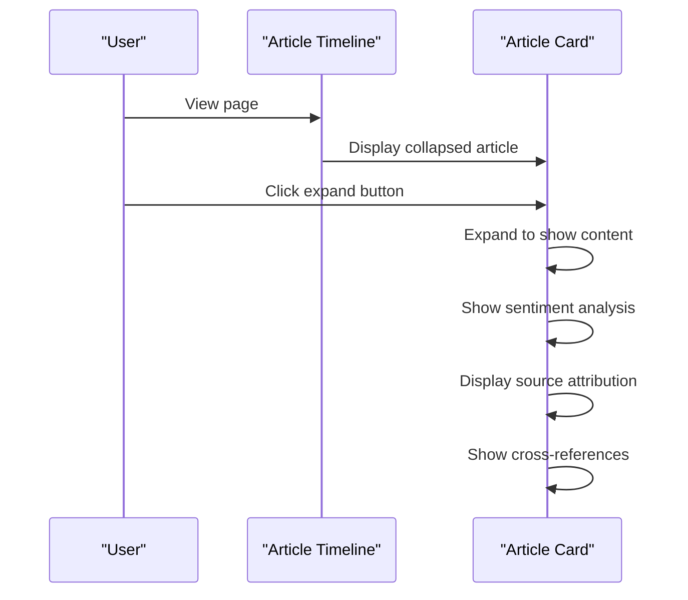
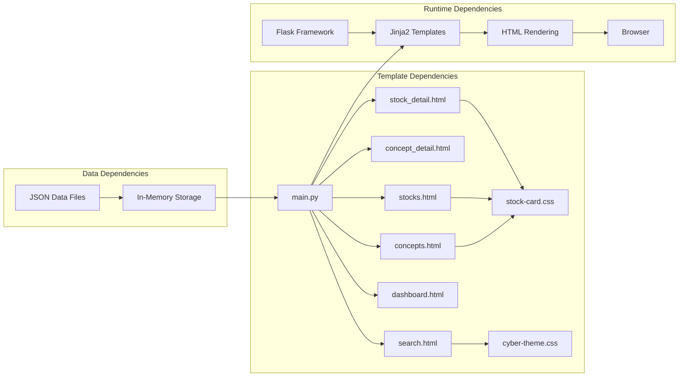

# Detailed Views

<cite>
**Referenced Files in This Document**
- [stock_detail.html](file://templates/stock_detail.html)
- [concept_detail.html](file://templates/concept_detail.html)
- [stocks.html](file://templates/stocks.html)
- [concepts.html](file://templates/concepts.html)
- [dashboard.html](file://templates/dashboard.html)
- [search.html](file://templates/search.html)
- [stock_card.html](file://templates/components/stock_card.html)
- [stock-card.css](file://static/css/stock-card.css)
- [cyber-theme.css](file://static/css/cyber-theme.css)
- [main.py](file://main.py)
</cite>

## Table of Contents
1. [Introduction](#introduction)
2. [Project Structure](#project-structure)
3. [Core Components](#core-components)
4. [Architecture Overview](#architecture-overview)
5. [Detailed Component Analysis](#detailed-component-analysis)
6. [Dependency Analysis](#dependency-analysis)
7. [Performance Considerations](#performance-considerations)
8. [Troubleshooting Guide](#troubleshooting-guide)
9. [Conclusion](#conclusion)

## Introduction
This document provides comprehensive technical documentation for the Stock Research Platform's detailed view pages. It covers the stock detail page layout, concept detail page structure, listing pages with search and filtering, article display system, and responsive design adaptations. The documentation explains how these components integrate with the main dashboard interface and how users navigate between different views.

## Project Structure
The platform follows a Flask-based architecture with Jinja2 templates for server-side rendering. The detailed view system consists of several key template files and supporting CSS assets:

**Diagram sources**
- [main.py:138-356](file://main.py#L138-L356)
- [stock_detail.html:1-800](file://templates/stock_detail.html#L1-L800)
- [dashboard.html:1-800](file://templates/dashboard.html#L1-L800)

**Section sources**
- [main.py:138-356](file://main.py#L138-L356)

## Core Components
The detailed view system comprises five primary template components:

### Stock Detail Page (`stock_detail.html`)
The stock detail page presents comprehensive information about individual stocks with a modern dark theme interface featuring gradient accents and glass-morphism effects.

### Concept Detail Page (`concept_detail.html`)
Displays concept-based stock listings with filtering capabilities and cross-referencing to related concepts.

### Stocks Listing Page (`stocks.html`)
Provides searchable stock listings with concept filtering and responsive grid layouts.

### Concepts Listing Page (`concepts.html`)
Shows concept categories with search functionality and popularity indicators.

### Dashboard Integration (`dashboard.html`)
Serves as the main navigation hub connecting all detailed views.

**Section sources**
- [stock_detail.html:1-800](file://templates/stock_detail.html#L1-L800)
- [concept_detail.html:1-51](file://templates/concept_detail.html#L1-L51)
- [stocks.html:1-460](file://templates/stocks.html#L1-L460)
- [concepts.html:1-612](file://templates/concepts.html#L1-L612)
- [dashboard.html:1-800](file://templates/dashboard.html#L1-L800)

## Architecture Overview
The detailed view architecture follows a client-server model with Flask serving dynamic content and Jinja2 templates rendering HTML:

**Diagram sources**
- [main.py:280-356](file://main.py#L280-L356)
- [stock_detail.html:1-800](file://templates/stock_detail.html#L1-L800)
- [concept_detail.html:1-51](file://templates/concept_detail.html#L1-L51)

## Detailed Component Analysis

### Stock Detail Page Layout
The stock detail page implements a comprehensive layout with multiple information sections:

#### Stock Header Section
The hero section displays fundamental stock information with visual enhancements:

**Diagram sources**
- [stock_detail.html:124-288](file://templates/stock_detail.html#L124-L288)

#### Concept Tag Display System
Concept tags are rendered as interactive badges with filtering capabilities:

- **Clickable Tags**: Each concept tag links to `/concept/{concept_name}` for filtering
- **Visual Hierarchy**: Tags use gradient backgrounds with distinct colors
- **Hover Effects**: Tags animate with scaling and brightness transitions
- **Overflow Handling**: Excess concepts show "+N" indicator

#### Industry Classification Display
Industry information is presented through specialized badges:
- **Industry Badges**: Cyan-colored badges with industry names
- **Board Badges**: Purple badges indicating market board (Shanghai/Shenzhen)
- **Social Security Indicators**: Special amber badges with animated glow effects

#### Comprehensive Metrics Section
The metrics section organizes diverse financial and analytical data:

**Diagram sources**
- [stock_detail.html:589-681](file://templates/stock_detail.html#L589-L681)

#### Articles Display System
Articles are presented in a timeline format with expandable sections:

**Diagram sources**
- [stock_detail.html:436-587](file://templates/stock_detail.html#L436-L587)

**Section sources**
- [stock_detail.html:124-784](file://templates/stock_detail.html#L124-L784)

### Concept Detail Page Structure
The concept detail page provides concept-centric navigation and filtering:

#### Concept Name Display
- **Large Heading**: Concept name prominently displayed with emoji prefix
- **Stock Count**: Total number of stocks in concept shown as subtitle
- **Visual Hierarchy**: Clear typography hierarchy with concept importance indicators

#### Related Stock Listings
Stock listings include comprehensive information:
- **Code and Name**: Direct links to individual stock pages
- **Mention Counts**: Heat indicators showing concept popularity
- **Other Concepts**: Cross-reference to related concepts
- **Filtering Links**: Clickable concept tags for quick filtering

#### Concept-Based Filtering
Users can filter stocks by concept through:
- **Direct Links**: Concept names in stock listings
- **Tag Clicking**: Interactive concept badges
- **Cross-References**: Related concept displays

**Section sources**
- [concept_detail.html:17-47](file://templates/concept_detail.html#L17-L47)

### Stocks and Concepts Listing Pages
Both listing pages implement search functionality and category navigation:

#### Stocks Listing Features
- **Search Box**: Real-time filtering by code, name, or concepts
- **Statistics Cards**: Overview metrics including total stocks, popular stocks, and article counts
- **Interactive Table**: Clickable rows leading to detailed views
- **Concept Tags**: Hoverable concept badges with filtering capability
- **Responsive Design**: Grid layout adapts to different screen sizes

#### Concepts Listing Features
- **Search Functionality**: Concept name filtering
- **Popularity Indicators**: Hot/warm labels based on stock counts
- **Grid Layout**: Responsive card-based display
- **Category Navigation**: Direct links to concept detail pages

**Section sources**
- [stocks.html:363-438](file://templates/stocks.html#L363-L438)
- [concepts.html:535-592](file://templates/concepts.html#L535-L592)

### Article Viewing System
The platform implements a sophisticated article viewing system:

#### Content Display
- **Timeline Format**: Chronological article presentation
- **Expandable Sections**: Collapsible article content with expand/collapse controls
- **Rich Formatting**: Support for various content types and formatting styles

#### Source Attribution
- **Source Badges**: Distinct badges for different news sources
- **Date Display**: Publication dates with relative time indicators
- **Link Integration**: Direct links to original article sources

#### Cross-Reference Linking
- **Concept References**: Links between related concepts
- **Stock Mentions**: References to mentioned stocks
- **Article Connections**: Related article suggestions

**Section sources**
- [stock_detail.html:436-587](file://templates/stock_detail.html#L436-L587)

### Responsive Design Adaptations
The platform implements comprehensive responsive design patterns:

#### Breakpoint Strategy
- **Mobile First**: Optimized for small screens with stacked layouts
- **Tablet Adaptations**: Two-column layouts for medium screens
- **Desktop Optimization**: Full-width layouts with advanced features

#### Component Responsiveness
- **Stock Cards**: Grid-based layouts with automatic wrapping
- **Navigation**: Collapsible elements and simplified layouts
- **Typography**: Fluid scaling for headings and body text
- **Spacing**: Adaptive margins and padding

#### Touch Interaction
- **Large Tap Targets**: Sufficiently sized interactive elements
- **Gesture Support**: Swipe-friendly navigation patterns
- **Accessibility**: Screen reader compatibility and keyboard navigation

**Section sources**
- [stock_detail.html:785-797](file://templates/stock_detail.html#L785-L797)
- [stocks.html:321-334](file://templates/stocks.html#L321-L334)
- [concepts.html:493-499](file://templates/concepts.html#L493-L499)

### Integration with Main Dashboard
The detailed view system integrates seamlessly with the main dashboard:

#### Navigation Flow
- **Dashboard Entry**: Primary access point for all detailed views
- **Breadcrumb Navigation**: Clear path indication within detailed views
- **Contextual Links**: Related item suggestions and cross-references

#### Data Consistency
- **Shared Data Model**: Unified stock and concept data structures
- **Real-time Updates**: Dynamic content updates without page reloads
- **State Management**: Persistent user preferences and filters

#### Feature Coordination
- **Search Integration**: Consistent search behavior across all views
- **Filter Persistence**: Applied filters maintained during navigation
- **Performance Optimization**: Efficient data loading and caching strategies

**Section sources**
- [dashboard.html:528-663](file://templates/dashboard.html#L528-L663)
- [main.py:138-210](file://main.py#L138-L210)

## Dependency Analysis
The detailed view system exhibits well-structured dependencies:

**Diagram sources**
- [main.py:138-356](file://main.py#L138-L356)
- [stock_detail.html:1-11](file://templates/stock_detail.html#L1-L11)

The system demonstrates low coupling between components while maintaining high cohesion within each template. Template inheritance patterns are minimal, favoring direct inclusion of shared components.

**Section sources**
- [main.py:94-137](file://main.py#L94-L137)

## Performance Considerations
The detailed view system implements several performance optimization strategies:

### Data Loading
- **Memory Storage**: All stock and concept data loaded into memory for fast access
- **Efficient Queries**: Direct dictionary lookups instead of database queries
- **Pagination**: Large datasets paginated to prevent excessive memory usage

### Rendering Optimization
- **Template Caching**: Jinja2 template compilation and caching
- **Minimal JavaScript**: Client-side scripts kept lightweight for rapid execution
- **CSS Optimization**: Combined stylesheets to reduce HTTP requests

### Network Efficiency
- **Asset Compression**: CSS files served with compression support
- **Lazy Loading**: Images and heavy content loaded on demand
- **CDN Integration**: Static assets served via CDN for global distribution

## Troubleshooting Guide
Common issues and their solutions:

### Template Rendering Issues
- **Missing Variables**: Ensure all required data variables are passed from Flask routes
- **Template Syntax Errors**: Validate Jinja2 syntax and variable references
- **CSS Loading Problems**: Verify asset paths and MIME type configurations

### Data Access Problems
- **Stock Not Found**: Check stock code formatting and data availability
- **Concept Data Missing**: Verify concept name encoding and data structure
- **Empty Results**: Implement fallback content and error messaging

### Performance Issues
- **Slow Page Loads**: Monitor template rendering times and optimize complex loops
- **Memory Usage**: Track memory consumption during data processing
- **Search Performance**: Consider indexing strategies for large datasets

**Section sources**
- [main.py:280-356](file://main.py#L280-L356)

## Conclusion
The Stock Research Platform's detailed view system provides a comprehensive, responsive, and highly functional interface for stock research and analysis. The modular template architecture, combined with efficient data management and thoughtful user experience design, creates a robust foundation for advanced financial research workflows. The system successfully balances detailed information presentation with intuitive navigation, making complex stock and concept relationships accessible to users across different device types and skill levels.