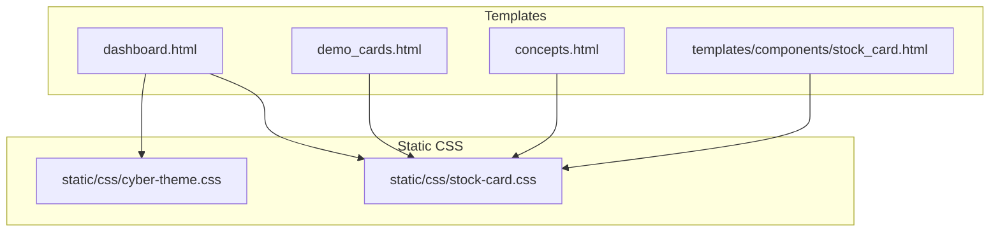
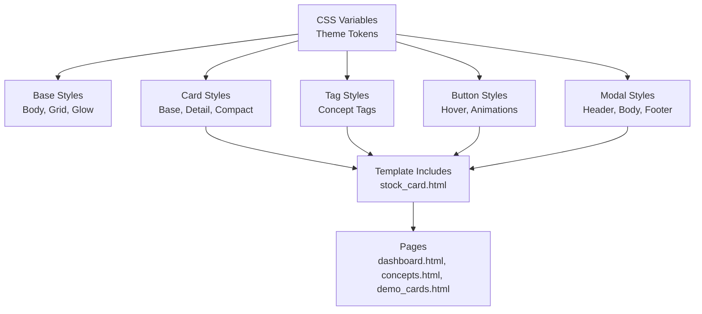
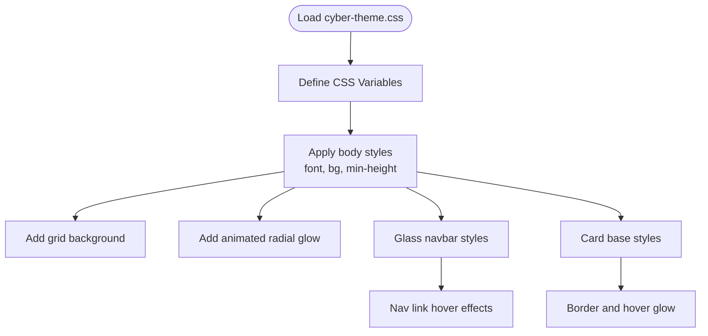
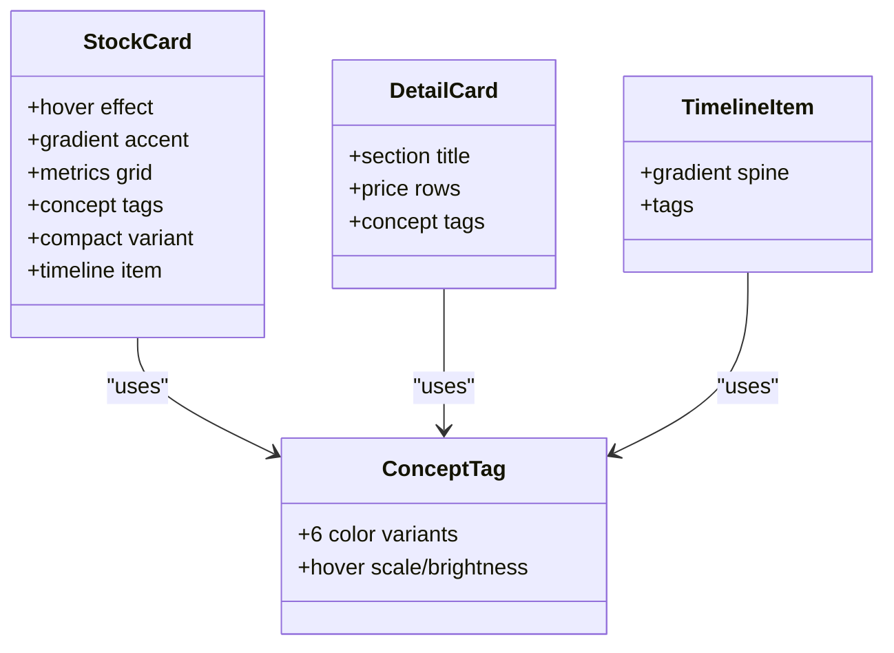
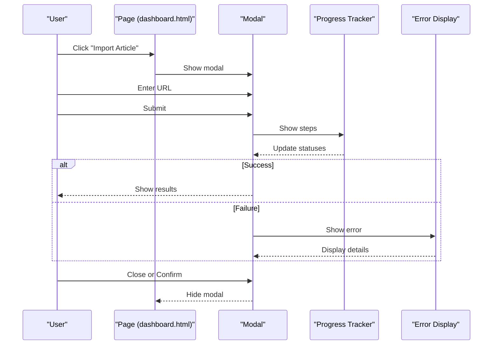
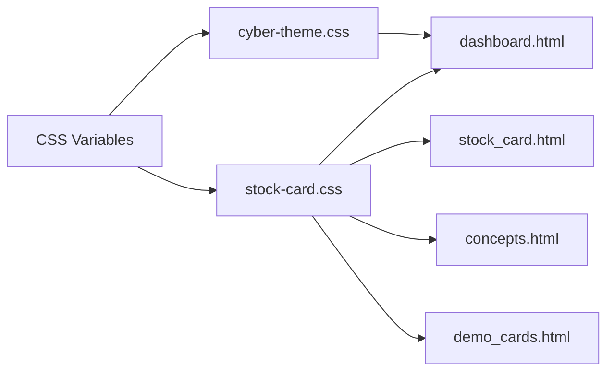

# Styling and Themes

<cite>
**Referenced Files in This Document**
- [cyber-theme.css](file://static/css/cyber-theme.css)
- [stock-card.css](file://static/css/stock-card.css)
- [stock_card.html](file://templates/components/stock_card.html)
- [dashboard.html](file://templates/dashboard.html)
- [demo_cards.html](file://templates/demo_cards.html)
- [concepts.html](file://templates/concepts.html)
- [README.md](file://README.md)
</cite>

## Table of Contents
1. [Introduction](#introduction)
2. [Project Structure](#project-structure)
3. [Core Components](#core-components)
4. [Architecture Overview](#architecture-overview)
5. [Detailed Component Analysis](#detailed-component-analysis)
6. [Dependency Analysis](#dependency-analysis)
7. [Performance Considerations](#performance-considerations)
8. [Troubleshooting Guide](#troubleshooting-guide)
9. [Conclusion](#conclusion)
10. [Appendices](#appendices)

## Introduction
This document describes the styling system and themes of the Stock Research Platform, focusing on the cyber-themed dark mode, typography, gradients, and component-specific styles. It covers:
- Dark-mode color schemes and custom CSS variables
- Typography using Inter and JetBrains Mono
- Gradient backgrounds and animated glows
- Stock card designs, concept tag variants, buttons, and modal dialogs
- Responsive design with media queries and a mobile-first approach
- Modular CSS architecture and theme customization
- Accessibility, browser compatibility, and performance optimization guidance

## Project Structure
The styling system is organized around two primary CSS assets and several Jinja2 templates that render stock cards and pages. The templates embed CSS for page-level components and load shared component CSS.

**Diagram sources**
- [dashboard.html](file://templates/dashboard.html)
- [concepts.html](file://templates/concepts.html)
- [demo_cards.html](file://templates/demo_cards.html)
- [stock_card.html](file://templates/components/stock_card.html)
- [cyber-theme.css](file://static/css/cyber-theme.css)
- [stock-card.css](file://static/css/stock-card.css)

**Section sources**
- [README.md](file://README.md)

## Core Components
- Cyber theme base: defines global variables and shared dark-mode styles, grid background, and animated glow.
- Stock card module: defines typography, metrics, concept tags, cards, and timeline components.
- Page-level styles: embedded in templates for navigation, modals, progress trackers, and responsive adjustments.

Key capabilities:
- Dark-mode with glass-like navigation and subtle grid overlay
- Animated radial glow background
- Six-color concept tag palette with hover effects
- Monospace typography for metrics and numeric data
- Modal dialog with progress tracker and error display
- Responsive breakpoints for mobile and tablet

**Section sources**
- [cyber-theme.css](file://static/css/cyber-theme.css)
- [stock-card.css](file://static/css/stock-card.css)
- [stock_card.html](file://templates/components/stock_card.html)
- [dashboard.html](file://templates/dashboard.html)
- [demo_cards.html](file://templates/demo_cards.html)
- [concepts.html](file://templates/concepts.html)

## Architecture Overview
The styling architecture follows a modular approach:
- Global variables in CSS define theme tokens
- Component CSS encapsulates reusable patterns
- Templates include component CSS and add page-specific styles
- Stock card components are rendered via a Jinja2 include, enabling reuse across pages

**Diagram sources**
- [cyber-theme.css](file://static/css/cyber-theme.css)
- [stock-card.css](file://static/css/stock-card.css)
- [stock_card.html](file://templates/components/stock_card.html)
- [dashboard.html](file://templates/dashboard.html)
- [concepts.html](file://templates/concepts.html)
- [demo_cards.html](file://templates/demo_cards.html)

## Detailed Component Analysis

### Cyber Theme Base
Defines the dark-mode foundation:
- CSS variables for primary, secondary, accent, backgrounds, borders, and text
- Body with Noto Sans SC and dark background
- Background grid overlay and animated radial glow
- Glass-like navigation bar with backdrop blur
- Hover effects for nav links and cards

**Diagram sources**
- [cyber-theme.css](file://static/css/cyber-theme.css)

**Section sources**
- [cyber-theme.css](file://static/css/cyber-theme.css)

### Stock Card Module
Provides reusable card components and related UI elements:
- Base card with hover elevation and gradient accents
- Metric grid with hover highlights
- Six-color concept tag palette with cyclic assignment
- Detail card with section dividers and gradient accents
- Compact card for similarity lists
- Timeline item with gradient spine and tags
- Responsive adjustments for smaller screens
- Staggered animations for list entries

**Diagram sources**
- [stock-card.css](file://static/css/stock-card.css)

**Section sources**
- [stock-card.css](file://static/css/stock-card.css)
- [stock_card.html](file://templates/components/stock_card.html)

### Concept Tag Styling (Six Variants)
- Six concept tag classes cycle through a palette: blue, cyan, green, amber, rose, purple
- Hover increases brightness and scale for visual feedback
- Used in base cards, detail cards, and timelines

Implementation highlights:
- Color classes: concept-tag-0 through concept-tag-5
- Hover behavior: filter brightness and transform scale
- Template-driven assignment via modulo index

**Section sources**
- [stock-card.css](file://static/css/stock-card.css)
- [stock_card.html](file://templates/components/stock_card.html)

### Button Styling and Animations
- Buttons use gradient backgrounds and hover lift/shadow effects
- Refresh and import buttons animate with spin keyframes
- Staggered animations for list items using delay classes

Examples:
- Gradient primary buttons with hover elevation
- Loading spinner animation during async operations
- Staggered reveal animations for card lists

**Section sources**
- [dashboard.html](file://templates/dashboard.html)
- [stock-card.css](file://static/css/stock-card.css)

### Modal Dialog Implementation
- Fullscreen backdrop with blur effect
- Content area with header, body, and footer sections
- Form inputs with focus states and hints
- Action buttons with distinct roles (secondary, primary, success)
- Progress tracker with animated steps and status
- Error display with structured layout and scrollable details

**Diagram sources**
- [dashboard.html](file://templates/dashboard.html)

**Section sources**
- [dashboard.html](file://templates/dashboard.html)

### Typography System
- Inter for body text and UI labels
- JetBrains Mono for metrics, prices, and monospaced content
- Heading gradients for tech-inspired titles
- Consistent font weights and sizing across components

**Section sources**
- [cyber-theme.css](file://static/css/cyber-theme.css)
- [stock-card.css](file://static/css/stock-card.css)
- [dashboard.html](file://templates/dashboard.html)
- [concepts.html](file://templates/concepts.html)
- [demo_cards.html](file://templates/demo_cards.html)

### Gradient Backgrounds and Effects
- Radial gradients for ambient background glow
- Linear gradients for accents and borders
- Animated pulse effects for subtle motion
- Glass-like navigation with backdrop blur

**Section sources**
- [cyber-theme.css](file://static/css/cyber-theme.css)
- [dashboard.html](file://templates/dashboard.html)
- [concepts.html](file://templates/concepts.html)

### Responsive Design and Media Queries
- Mobile-first approach with progressively enhanced layouts
- Breakpoints for tablets and phones
- Collapsing columns, hiding less critical data, and adjusting spacing
- Example: hide certain columns on smaller screens

**Section sources**
- [stock-card.css](file://static/css/stock-card.css)
- [concepts.html](file://templates/concepts.html)
- [dashboard.html](file://templates/dashboard.html)

## Dependency Analysis
The styling system exhibits clear separation of concerns:
- Global variables drive consistent theming across components
- Component CSS is self-contained and reusable
- Templates include component CSS and add page-specific styles
- Stock card rendering is centralized via a Jinja2 include

**Diagram sources**
- [cyber-theme.css](file://static/css/cyber-theme.css)
- [stock-card.css](file://static/css/stock-card.css)
- [stock_card.html](file://templates/components/stock_card.html)
- [dashboard.html](file://templates/dashboard.html)
- [concepts.html](file://templates/concepts.html)
- [demo_cards.html](file://templates/demo_cards.html)

**Section sources**
- [cyber-theme.css](file://static/css/cyber-theme.css)
- [stock-card.css](file://static/css/stock-card.css)
- [stock_card.html](file://templates/components/stock_card.html)
- [dashboard.html](file://templates/dashboard.html)
- [concepts.html](file://templates/concepts.html)
- [demo_cards.html](file://templates/demo_cards.html)

## Performance Considerations
- Prefer CSS variables for theme tokens to minimize repaints and enable runtime switching
- Use hardware-accelerated properties (transform, opacity) for smooth animations
- Limit heavy gradients and blur effects to essential areas to reduce GPU load
- Minimize DOM depth for cards and tags to improve paint performance
- Defer non-critical animations until after initial render

[No sources needed since this section provides general guidance]

## Troubleshooting Guide
Common styling issues and resolutions:
- Fonts not loading: ensure external font links are reachable and preconnected
- Modal not appearing: verify backdrop z-index and visibility toggles
- Animation stutter: reduce number of animated elements or simplify keyframes
- Responsive layout shifts: confirm media query breakpoints and container widths
- Tag hover not working: check hover selectors and stacking contexts

**Section sources**
- [dashboard.html](file://templates/dashboard.html)
- [stock-card.css](file://static/css/stock-card.css)

## Conclusion
The Stock Research Platform employs a cohesive, modular styling system centered on a cyber-themed dark mode. CSS variables unify the theme, while component CSS ensures consistency across cards, tags, buttons, and modals. The system balances aesthetics with performance, using gradients, animations, and responsive design to deliver a modern, accessible experience.

[No sources needed since this section summarizes without analyzing specific files]

## Appendices

### Extending the Styling System
Guidelines for adding new color schemes and maintaining consistency:
- Define new CSS variables in a dedicated theme file
- Update component classes to consume variables instead of hardcoded values
- Add new tag variants by extending the palette and updating template logic
- Introduce new component styles in the component CSS and include them in relevant templates
- Test responsiveness and accessibility across devices and assistive technologies

**Section sources**
- [cyber-theme.css](file://static/css/cyber-theme.css)
- [stock-card.css](file://static/css/stock-card.css)
- [stock_card.html](file://templates/components/stock_card.html)

### Accessibility Considerations
- Ensure sufficient color contrast against dark backgrounds
- Provide focus indicators for interactive elements
- Use semantic HTML and ARIA attributes where necessary
- Test keyboard navigation and screen reader compatibility
- Avoid relying solely on color to convey meaning; pair with icons or text

[No sources needed since this section provides general guidance]

### Browser Compatibility
- CSS variables are widely supported; verify fallbacks for older browsers if needed
- Flexbox and grid are broadly supported; test with vendor prefixes if targeting legacy environments
- Backdrop-filter requires vendor prefixes on some Safari versions
- Keyframe animations are well supported; prefer transform/opacity for GPU acceleration

[No sources needed since this section provides general guidance]