# User Interface

<cite>
**Referenced Files in This Document**
- [dashboard.html](file://templates/dashboard.html)
- [concepts.html](file://templates/concepts.html)
- [concept_detail.html](file://templates/concept_detail.html)
- [stock_detail.html](file://templates/stock_detail.html)
- [search.html](file://templates/search.html)
- [social_security_new.html](file://templates/social_security_new.html)
- [demo_cards.html](file://templates/demo_cards.html)
- [stock_card.html](file://templates/components/stock_card.html)
- [stock-card.css](file://static/css/stock-card.css)
- [cyber-theme.css](file://static/css/cyber-theme.css)
- [main.py](file://main.py)
</cite>

## Table of Contents
1. [Introduction](#introduction)
2. [Project Structure](#project-structure)
3. [Core Components](#core-components)
4. [Architecture Overview](#architecture-overview)
5. [Detailed Component Analysis](#detailed-component-analysis)
6. [Dependency Analysis](#dependency-analysis)
7. [Performance Considerations](#performance-considerations)
8. [Troubleshooting Guide](#troubleshooting-guide)
9. [Conclusion](#conclusion)
10. [Appendices](#appendices)

## Introduction
This document describes the user interface components of the Stock Research Platform, focusing on the dashboard stock listing interface, concept tag system, sorting and filtering capabilities, pagination mechanisms, detailed stock views, concept exploration interfaces, and article display systems. It also covers the stock card component with interactive elements, hover effects, and data presentation patterns, along with the cyber-themed dark mode styling, responsive design considerations, and accessibility compliance. Guidelines for UI customization, theme modifications, and component composition patterns are included, along with user interaction patterns and navigation flows.

## Project Structure
The UI is implemented using Jinja2 templates and CSS, served by a Flask backend. The frontend assets include:
- Templates under templates/ for page layouts and components
- CSS under static/css/ for theming and component styling
- Backend routes in main.py that render templates and serve data

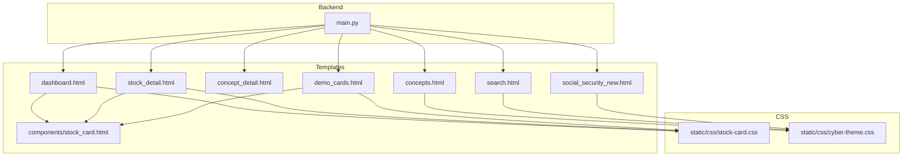

**Diagram sources**
- [dashboard.html](file://templates/dashboard.html)
- [concepts.html](file://templates/concepts.html)
- [concept_detail.html](file://templates/concept_detail.html)
- [stock_detail.html](file://templates/stock_detail.html)
- [search.html](file://templates/search.html)
- [social_security_new.html](file://templates/social_security_new.html)
- [demo_cards.html](file://templates/demo_cards.html)
- [stock_card.html](file://templates/components/stock_card.html)
- [stock-card.css](file://static/css/stock-card.css)
- [cyber-theme.css](file://static/css/cyber-theme.css)
- [main.py](file://main.py)

**Section sources**
- [main.py:138-218](file://main.py#L138-L218)
- [dashboard.html:1-800](file://templates/dashboard.html#L1-L800)
- [concepts.html:1-612](file://templates/concepts.html#L1-L612)
- [stock_detail.html:1-800](file://templates/stock_detail.html#L1-L800)
- [search.html:1-139](file://templates/search.html#L1-L139)
- [social_security_new.html:1-388](file://templates/social_security_new.html#L1-L388)
- [demo_cards.html:1-473](file://templates/demo_cards.html#L1-L473)
- [stock_card.html:1-218](file://templates/components/stock_card.html#L1-L218)
- [stock-card.css:1-536](file://static/css/stock-card.css#L1-L536)
- [cyber-theme.css:1-258](file://static/css/cyber-theme.css#L1-L258)

## Core Components
- Dashboard stock listing with table, filters, sorting, and pagination
- Concept exploration with grid and search
- Detailed stock view with article timeline and metrics
- Stock card component library with base/detail/compact/timeline variants
- Cyber-themed dark mode with glass navbar and tag system
- Responsive design with media queries and mobile-first layout

**Section sources**
- [dashboard.html:584-663](file://templates/dashboard.html#L584-L663)
- [concepts.html:568-593](file://templates/concepts.html#L568-L593)
- [stock_detail.html:123-798](file://templates/stock_detail.html#L123-L798)
- [stock_card.html:6-217](file://templates/components/stock_card.html#L6-L217)
- [stock-card.css:40-536](file://static/css/stock-card.css#L40-L536)
- [cyber-theme.css:1-258](file://static/css/cyber-theme.css#L1-L258)

## Architecture Overview
The UI architecture follows a server-rendered model:
- Flask routes render Jinja2 templates with data from loaded datasets
- Templates embed CSS and JavaScript for interactivity
- Stock card component is reused across pages via includes
- Market data is fetched via API endpoints for real-time updates

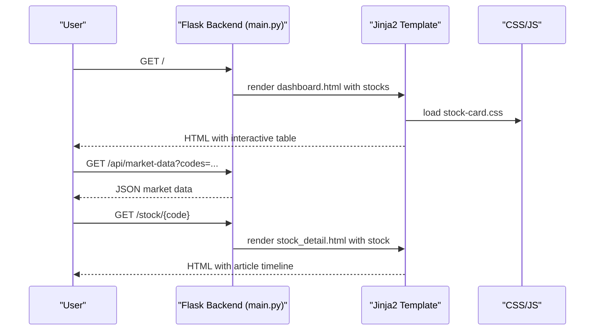

**Diagram sources**
- [main.py:138-218](file://main.py#L138-L218)
- [main.py:696-768](file://main.py#L696-L768)
- [dashboard.html:584-663](file://templates/dashboard.html#L584-L663)
- [stock_detail.html:123-798](file://templates/stock_detail.html#L123-L798)
- [stock-card.css:40-536](file://static/css/stock-card.css#L40-L536)

## Detailed Component Analysis

### Dashboard Stock Listing Interface
- Navigation bar with brand, links, and search input
- Toolbar with concept filters, sort selector, and refresh/import actions
- Stock table with columns: rank, name/code, industry, concepts/tags, price/change, market cap, mentions, articles
- Pagination controls with “Load More” button
- Concept tags with color-coded categories
- Hover effects and interactive rows

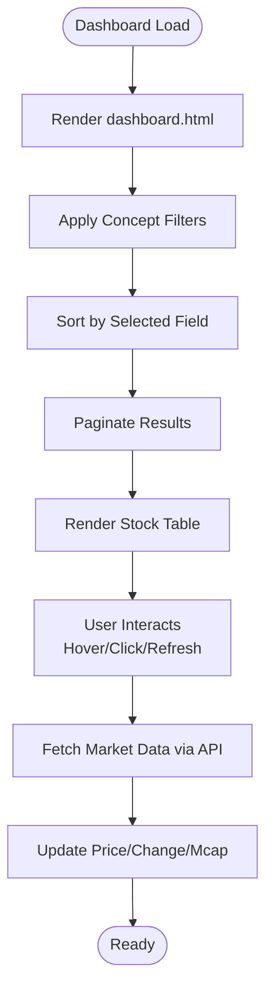

**Diagram sources**
- [dashboard.html:528-663](file://templates/dashboard.html#L528-L663)
- [main.py:696-768](file://main.py#L696-L768)

**Section sources**
- [dashboard.html:528-663](file://templates/dashboard.html#L528-L663)
- [main.py:138-218](file://main.py#L138-L218)
- [main.py:696-768](file://main.py#L696-L768)

### Concept Tag System
- Concept grid with hot/warm badges
- Color-coded tags with hover animations
- Concept detail page with sortable stock list
- Filtering and search within concept pages

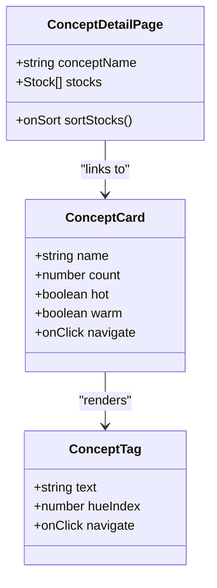

**Diagram sources**
- [concepts.html:568-593](file://templates/concepts.html#L568-L593)
- [concept_detail.html:17-47](file://templates/concept_detail.html#L17-L47)
- [stock-card.css:174-201](file://static/css/stock-card.css#L174-L201)

**Section sources**
- [concepts.html:568-593](file://templates/concepts.html#L568-L593)
- [concept_detail.html:17-47](file://templates/concept_detail.html#L17-L47)
- [stock-card.css:174-201](file://static/css/stock-card.css#L174-L201)

### Sorting and Filtering Capabilities
- Concept filters: “All”, “10+”, “20+”, “30+”
- Sort selector: date, mention, change up/down, articles, name
- Concept search within concept grid
- Mention badges with thresholds

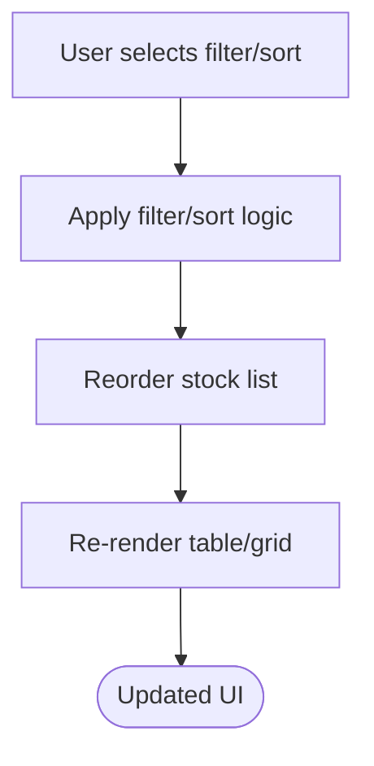

**Diagram sources**
- [dashboard.html:558-582](file://templates/dashboard.html#L558-L582)
- [concepts.html:535-541](file://templates/concepts.html#L535-L541)

**Section sources**
- [dashboard.html:558-582](file://templates/dashboard.html#L558-L582)
- [concepts.html:535-541](file://templates/concepts.html#L535-L541)

### Pagination Mechanisms
- Initial dashboard loads with limit/offset parameters
- “Load More” button triggers AJAX to fetch next batch
- Backend returns JSON with stocks and pagination metadata

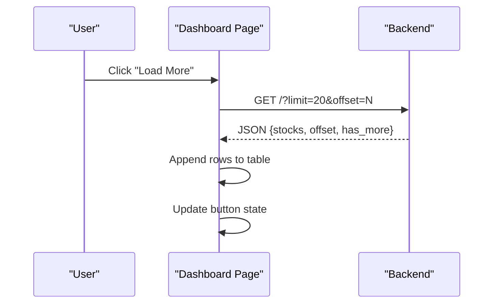

**Diagram sources**
- [dashboard.html:655-662](file://templates/dashboard.html#L655-L662)
- [main.py:138-210](file://main.py#L138-L210)

**Section sources**
- [dashboard.html:655-662](file://templates/dashboard.html#L655-L662)
- [main.py:138-210](file://main.py#L138-L210)

### Detailed Stock View Pages
- Hero section with name, code, price, change, badges
- Industry/board badges and concept strip
- Two-column layout for metrics and lists
- Article timeline with collapsible cards and tags
- Similar stocks recommendation grid
- Inline editing support for insights/accidents

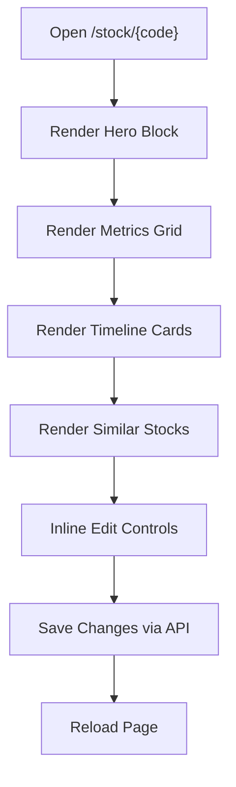

**Diagram sources**
- [stock_detail.html:123-798](file://templates/stock_detail.html#L123-L798)
- [main.py:280-336](file://main.py#L280-L336)

**Section sources**
- [stock_detail.html:123-798](file://templates/stock_detail.html#L123-L798)
- [main.py:280-336](file://main.py#L280-L336)

### Concept Exploration Interfaces
- Concept grid with hot/warm indicators
- Concept detail page with sortable stock list
- Links to stock detail and other concepts

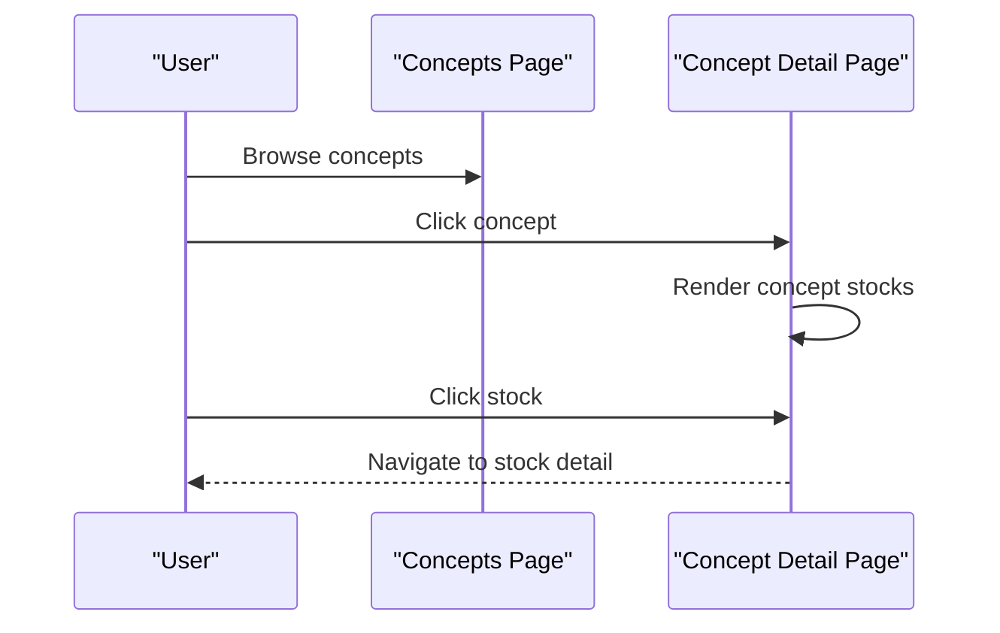

**Diagram sources**
- [concepts.html:568-593](file://templates/concepts.html#L568-L593)
- [concept_detail.html:17-47](file://templates/concept_detail.html#L17-L47)

**Section sources**
- [concepts.html:568-593](file://templates/concepts.html#L568-L593)
- [concept_detail.html:17-47](file://templates/concept_detail.html#L17-L47)

### Article Display Systems
- Timeline with date markers and tags
- Collapsible article cards with meta and toggle
- Insight/accident/target valuation blocks
- Social security badge with glow animation

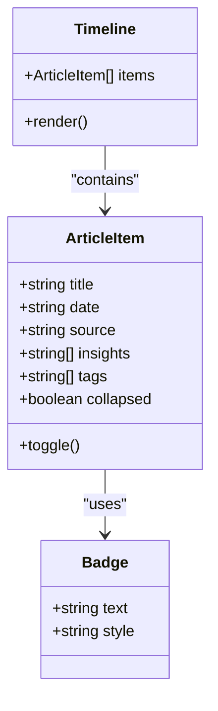

**Diagram sources**
- [stock_detail.html:461-574](file://templates/stock_detail.html#L461-L574)
- [stock_detail.html:261-287](file://templates/stock_detail.html#L261-L287)

**Section sources**
- [stock_detail.html:461-574](file://templates/stock_detail.html#L461-L574)
- [stock_detail.html:261-287](file://templates/stock_detail.html#L261-L287)

### Stock Card Component
- Base card: name/code, mention badge, market row, board/industry tags, concept tags, latest article preview
- Detail card: metrics and concept tags for sidebar
- Compact card: code/name/meta with similarity percentage
- Timeline card: date/content/tags for topic timelines
- CSS provides hover effects, color-coded tags, and responsive layout

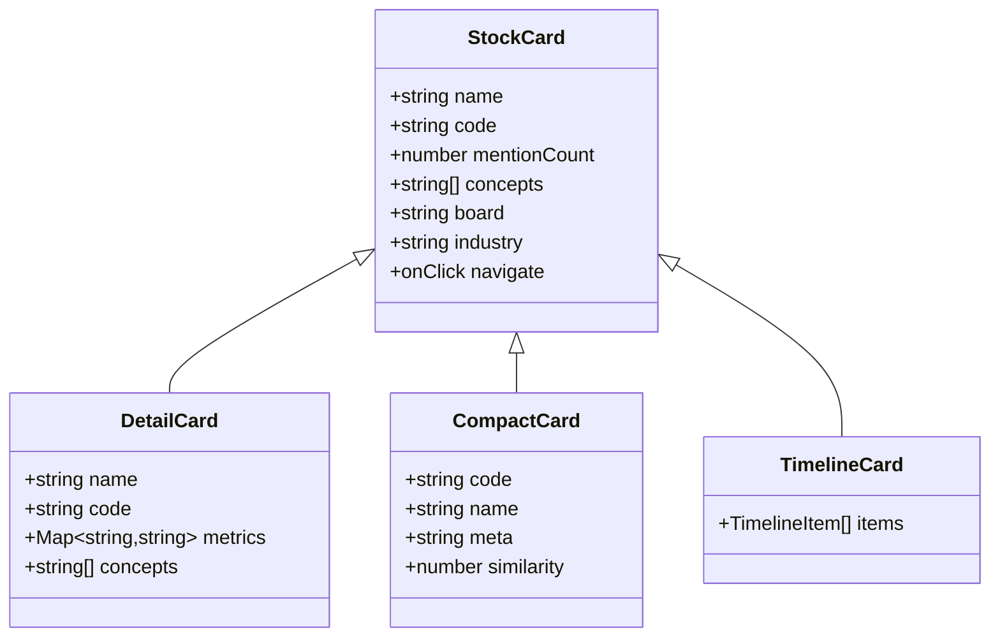

**Diagram sources**
- [stock_card.html:6-217](file://templates/components/stock_card.html#L6-L217)
- [stock-card.css:40-536](file://static/css/stock-card.css#L40-L536)

**Section sources**
- [stock_card.html:6-217](file://templates/components/stock_card.html#L6-L217)
- [stock-card.css:40-536](file://static/css/stock-card.css#L40-L536)

### Cyber-Themed Dark Mode Styling
- Glass navbar with backdrop blur
- Grid background and radial glow effects
- Tag system with gradient borders and hover glow
- Stat boxes with mono fonts and gradients
- Responsive adjustments for smaller screens

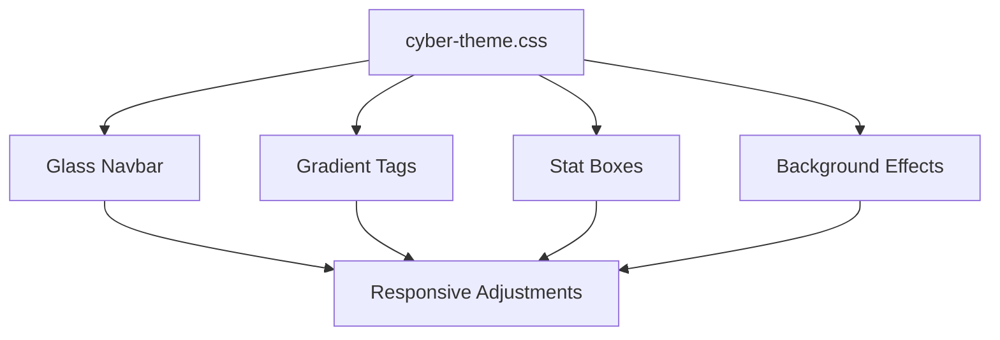

**Diagram sources**
- [cyber-theme.css:1-258](file://static/css/cyber-theme.css#L1-L258)

**Section sources**
- [cyber-theme.css:1-258](file://static/css/cyber-theme.css#L1-L258)

### Responsive Design Considerations
- Media queries hide less important columns on small screens
- Flexible grids adapt to viewport width
- Touch-friendly spacing and typography scaling
- Mobile-first layout with stacked elements on narrow screens

**Section sources**
- [dashboard.html:515-525](file://templates/dashboard.html#L515-L525)
- [concepts.html:492-499](file://templates/concepts.html#L492-L499)
- [stock_detail.html:784-798](file://templates/stock_detail.html#L784-L798)
- [social_security_new.html:273-278](file://templates/social_security_new.html#L273-L278)

### Accessibility Compliance
- Semantic HTML structure with tables and lists
- Focusable elements with keyboard navigation support
- Sufficient color contrast for dark theme
- Descriptive alt text for icons and badges
- Screen reader friendly labels and headings

**Section sources**
- [dashboard.html:584-653](file://templates/dashboard.html#L584-L653)
- [stock_detail.html:123-798](file://templates/stock_detail.html#L123-L798)

### UI Customization and Theme Modifications
- CSS variables define primary colors and backgrounds
- Modular CSS files for stock cards and cyber theme
- Component composition via template includes
- Easy to swap themes by replacing CSS files

**Section sources**
- [stock-card.css:4-25](file://static/css/stock-card.css#L4-L25)
- [cyber-theme.css:2-12](file://static/css/cyber-theme.css#L2-L12)
- [stock_card.html:11-81](file://templates/components/stock_card.html#L11-L81)

### Component Composition Patterns
- Include stock card component with card_type and stock_data context
- Use concept tags consistently across pages
- Reuse timeline component for article display
- Maintain consistent color palette and typography scales

**Section sources**
- [stock_card.html:6-217](file://templates/components/stock_card.html#L6-L217)
- [stock-detail.html:1-800](file://templates/stock_detail.html#L1-L800)

### User Interaction Patterns and Navigation Flows
- From dashboard: click stock row to go to detail
- From concepts: click concept card to explore stocks
- From search: enter query and click results
- From stock detail: click concept tags to explore topics
- From social security page: click stock cards to view details

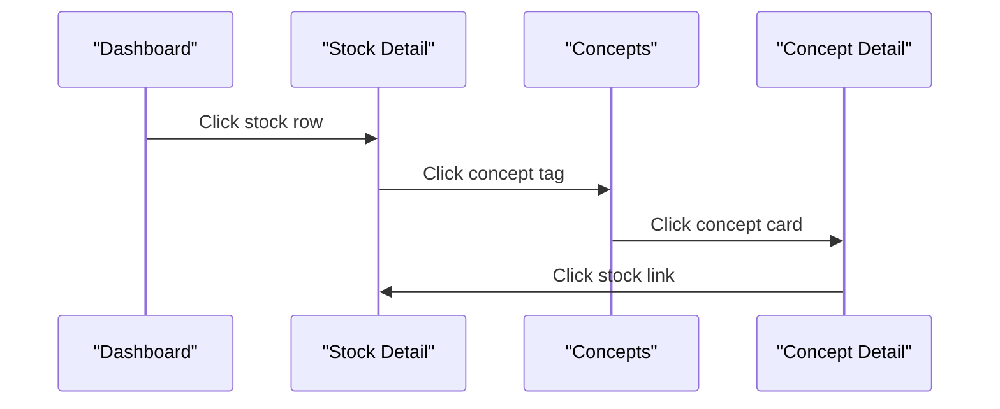

**Diagram sources**
- [dashboard.html:600-647](file://templates/dashboard.html#L600-L647)
- [stock_detail.html:289-295](file://templates/stock_detail.html#L289-L295)
- [concepts.html:569-582](file://templates/concepts.html#L569-L582)
- [concept_detail.html:31-44](file://templates/concept_detail.html#L31-L44)

**Section sources**
- [dashboard.html:600-647](file://templates/dashboard.html#L600-L647)
- [stock_detail.html:289-295](file://templates/stock_detail.html#L289-L295)
- [concepts.html:569-582](file://templates/concepts.html#L569-L582)
- [concept_detail.html:31-44](file://templates/concept_detail.html#L31-L44)

## Dependency Analysis
- Templates depend on CSS files for styling
- Stock card component is included in multiple pages
- Backend routes provide data for dynamic content
- Market data API integrates with external financial service

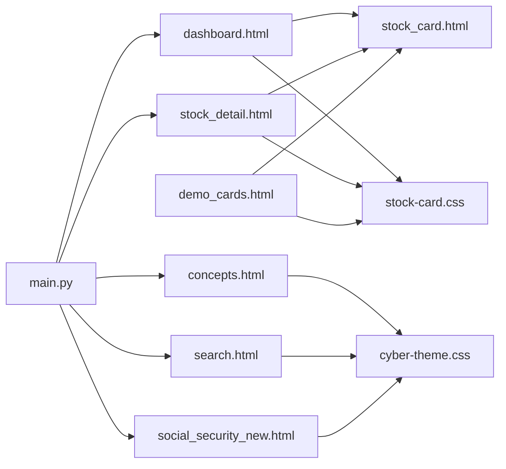

**Diagram sources**
- [main.py:138-336](file://main.py#L138-L336)
- [dashboard.html:584-663](file://templates/dashboard.html#L584-L663)
- [stock_detail.html:123-798](file://templates/stock_detail.html#L123-L798)
- [concepts.html:568-593](file://templates/concepts.html#L568-L593)
- [search.html:1-139](file://templates/search.html#L1-L139)
- [social_security_new.html:1-388](file://templates/social_security_new.html#L1-L388)
- [demo_cards.html:1-473](file://templates/demo_cards.html#L1-L473)
- [stock_card.html:6-217](file://templates/components/stock_card.html#L6-L217)
- [stock-card.css:40-536](file://static/css/stock-card.css#L40-L536)
- [cyber-theme.css:1-258](file://static/css/cyber-theme.css#L1-L258)

**Section sources**
- [main.py:138-336](file://main.py#L138-L336)
- [stock_card.html:6-217](file://templates/components/stock_card.html#L6-L217)
- [stock-detail.css:40-536](file://static/css/stock-card.css#L40-L536)
- [cyber-theme.css:1-258](file://static/css/cyber-theme.css#L1-L258)

## Performance Considerations
- Pagination reduces initial payload size
- Market data fetched via API to keep UI responsive
- CSS animations are lightweight and hardware-accelerated
- Minimal JavaScript for interactivity to reduce bundle size

[No sources needed since this section provides general guidance]

## Troubleshooting Guide
- Market data not loading: verify API endpoint and network connectivity
- Pagination issues: check limit/offset parameters and backend response
- Concept filters not applying: confirm filter logic and DOM event handlers
- Responsive layout problems: inspect media queries and container widths

**Section sources**
- [main.py:696-768](file://main.py#L696-L768)
- [dashboard.html:584-663](file://templates/dashboard.html#L584-L663)

## Conclusion
The Stock Research Platform’s UI combines a cyber-inspired dark theme with practical financial data presentation. The dashboard offers efficient stock discovery through filtering and sorting, while the detailed stock view provides comprehensive analytics and article timelines. The reusable stock card component ensures consistency across pages, and the responsive design delivers a seamless experience across devices. The modular CSS architecture and component composition patterns facilitate easy customization and maintenance.

## Appendices
- Component reference: stock_card.html variants and usage patterns
- Theme variables: CSS custom properties for easy customization
- API endpoints: market data and article import functionality

**Section sources**
- [stock_card.html:6-217](file://templates/components/stock_card.html#L6-L217)
- [stock-card.css:4-25](file://static/css/stock-card.css#L4-L25)
- [main.py:696-768](file://main.py#L696-L768)
- [main.py:940-1057](file://main.py#L940-L1057)